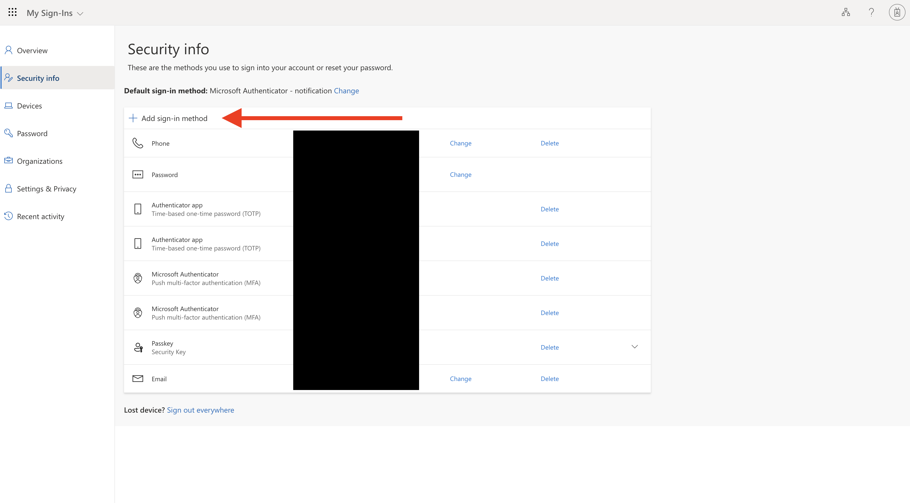
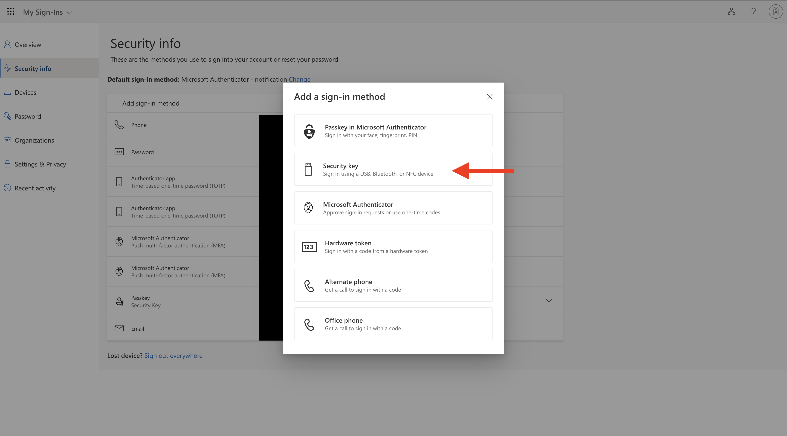
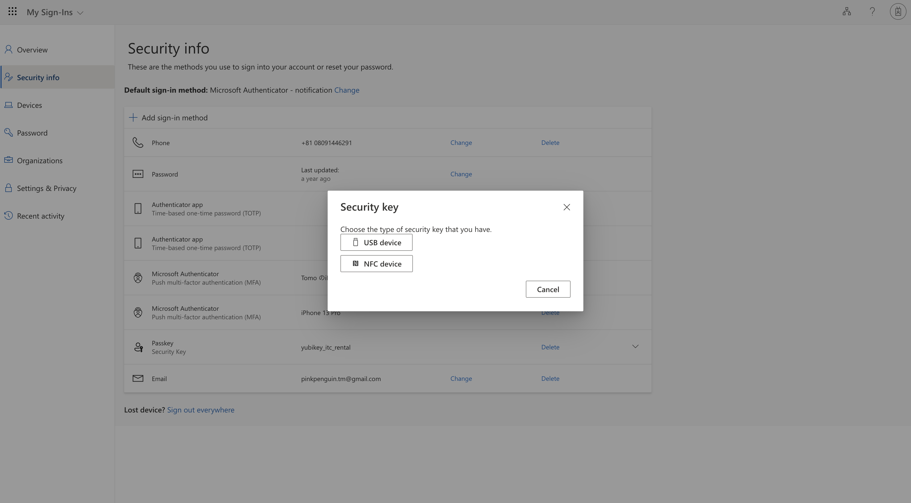
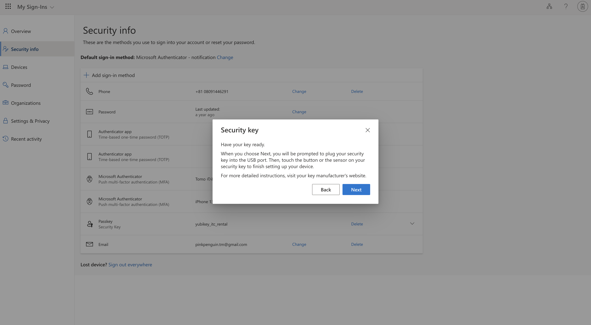
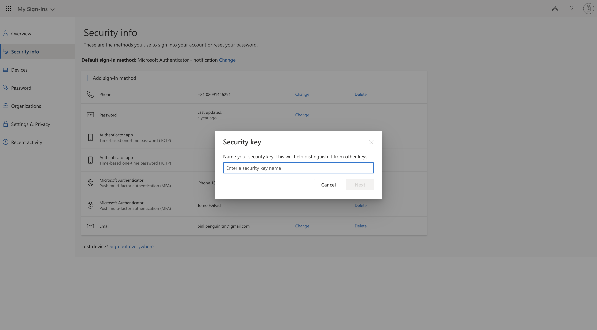
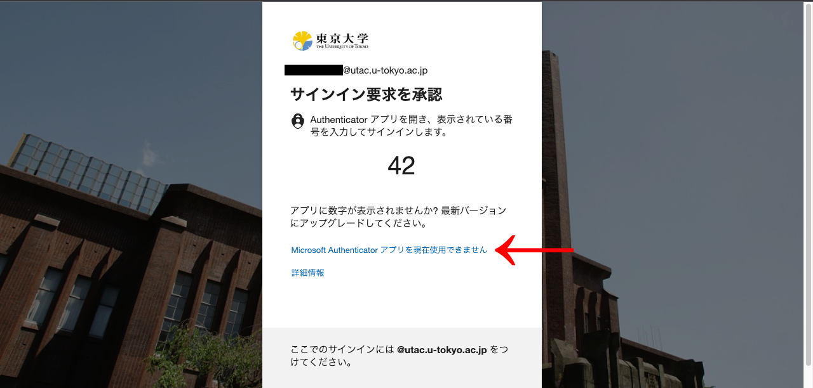

Starting from March 12, 2024, <a href="/en/notice/2024/02-utac-auth-improvement">using the FIDO security key with multi-factor authentication for UTokyo Account will be made more convenient.</a>．

## Introduction

This page explains how to use FIDO security keys for multi-factor authentication for UTokyo Accounts, including precautions, registration, and usage. FIDO (Fast IDentity Online) is a new technology that is being promoted to improve the security when signing-in for online services. It is a sign-in method that does not share confidential information such as passwords and PINs with servers, thus reducing the risk of information leakage, while allowing a smooth operation without requiring the use of applications other than a browser. 

FIDO can be classified into two main types: one that uses a dedicated device called a security key, and another that uses a passkey using information stored on a PC or smartphone. However, the UTokyo Account's multi-factor authentication does not currently support FIDO passkeys, but only security keys such as YubiKey. Therefore, please purchase and use your own security key. Please note that the security keys that can be used are those compatible with the 'FIDO 2' standard

## Unavailability for some OS or browsers combinations
{:#unsupported-os-browser}

FIDO is not available for some combinations of operating systems and browsers, such as Google Chrome on Android or Firefox on Linux. As of May 2024, FIDO is available for the following OS and browser combinations:

- Windows - Google Chrome
- Windows - Microsoft Edge
- Windows - Firefox
- macOS - Google Chrome
- macOS - Microsoft Edge
- macOS - Firefox
- macOS - Safari
- ChromeOS - Google Chrome
- Linux - Google Chrome
- iOS - Google Chrome
- iOS - Microsoft Edge
- iOS - Firefox
- iOS - Safari

For more information on available OS and browser combinations, please refer to Microsoft's "[Supported browsers](https://learn.microsoft.com/ja-jp/azure/active-directory/authentication/fido2-compatibility#supported-browsers)" page．

## FIDO Security Key Registration Procedure

It is assumed that the FIDO security key will be registered as the second or subsequent verification method. If you are using the multi-factor authentication for the first time, please follow the procedure described in "[Step 1: Set Up the First Verification Method" in the "Initial Setup Procedures for Multi-Factor Authentication for UTokyo Accounts](/en/utokyo_account/mfa/initial/#first)"section, and then register a FIDO security key as the additional verification method.

1. Access the [Security info page](https://mysignins.microsoft.com/security-info) and sign in.
2. Click on "Add sign-in method".

3. Click on "Choose a method", and from the choices that appear, click on "Security Key", followed by "Add".

4. When adding a security key, you will be prompted to choose either a 'USB device' or an 'NFC device'. Therefore, please click on the appropriate option.

5. When the dialogue box displaying "Have your security key ready" appears, please click “Next”.

6. Follow the on-screen instructions to complete the security key setup. Specifically, you will be asked to add the security key, set a PIN or biometric authentication, or tap the security key.
7. After setting up the security key, give a name to the security key.

*FIDO security keys cannot be set as the "default sign-in method". Therefore, for signing in, you must first set another verification method as the "default sign-in method" and then select the FIDO security key as the additional verification method.

## How to sign in with a FIDO security key

1. When signing into your UTokyo Account (and after entering your password), you will be prompted to verify your identification using the multi-factor authentication with the default verification method. Click on the "Sign in with a different method" or "I can’t use my Microsoft Authenticator app right now" link.

2. When the screen to select a different authentication method appears, please click on the "Use a security key" option.

3. Follow the instructions on the screen to complete actions such as entering a PIN, biometric authentication, or tapping the security key. After these steps, the sign-in process will be completed.

*If you have trouble signing in, please refer to "[If you cannot sign in using a FIDO security key](#unsupported-os-browser)".

