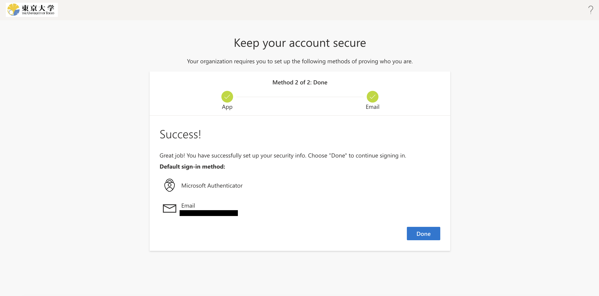

[Return to the top page of the description of Multi-Factor Authentication](.)

## Introduction
{:#introduction}

Multi-factor authentication (MFA) is a security process in which users are asked to enter passwords and also verify their identity via SMS or authentication apps when signing in to their accounts. MFA can make your account more secure by reducing the risk of unauthorized sign-ins even if your password has been compromised.

This page provides information about the initial procedures to enable MFA. The outline is as follows.

- In Step 1 and Step 2, you will register the “verification method” you will use for your UTokyo Account. There are several verification methods as shown below, so please register two or more methods so that you have an alternative in case one of the verification methods becomes unavailable (the type of the alternative verification method can be the same as the primary method).
    - **“Microsoft Authenticator” App**: “Microsoft Authenticator” is an MFA authentication application provided by Microsoft. Using this app is convenient since UTokyo Account’s MFA adopts Microsoft’s system. If you have more than one phone, you can register the same authenticator apps on these phones, making them two or more verification methods.
    - **Other Authenticator Apps**: If you already use other authenticator apps, such as “Google Authenticator”, you may also use them for your UTokyo Account authentication. If you have more than one phone, you can register the same authenticator apps on these phones, making them two or more verification methods.
    - **Phone Number**: You can add your phone number and receive an SMS message or a call (voice guidance) to verify your identity.
    - **Hardware Token** (for faculty members): If you are a faculty member and none of the verification methods above are available, we offer a device called “Hardware Token” for verification. The initialization process is different from other methods, so please follow [the guidance in UTokyo Portal (faculty members only)](https://univtokyo.sharepoint.com/sites/utokyoportal/wiki/d/UTokyo_Account_Token.aspx) to get started.
-  In Step 3, you test the verification method you have registered and see if you can actually sign in to your UTokyo Account.
-  In Step 4, the last Step, you submit an application to enable the MFA.

**Complete all the tasks from Step1 to Step 4.** After you complete the whole procedure, **you will be asked to verify your identity with the registered SMS, apps, etc., whenever you sign in to your UTokyo Account. **Be well aware that your UTokyo Account will be inaccessible if you lose access to every verification method (smartphone apps, phone number, etc.).

## Step 1: Set Up the First Verification Method
{:#first.mfa-initial-step-heading}

First, set up the verification method for MFA. Here, you will add the first verification method only (the second and subsequent methods will be added in Step 2). The first verification method will become the default (automatically selected) method, so it is best to register the method you will use most often.

<ol class="mfa-initial-procedure">
<!--
<li><a href="https://gidp.adm.u-tokyo.ac.jp/idp/profile/Logout">UTokyo Accountのサインアウトページ</a>にアクセスしてください．</li>
<li>「サインアウト 正常にサインアウトしました」という画面が表示されるまでしばらく待ってください．</li>
-->
<li>Access the <a href="https://account.activedirectory.windowsazure.com/proofup.aspx?proofup=1&whr=utac.u-tokyo.ac.jp">Security info page</a>.</li>
<li>The sign in page will appear (if you are not already signed in). Enter your UTokyo Account username (10-digit Common ID) and password and click “Sign in”.</li>
<li>Click “Next” in the “More information required” page.</li>
<li>
Add the first verification method in the setup page. The setup procedure varies depending on the verification method you add.
<ul>
<li>
<strong>“Microsoft Authenticator” App</strong>: “Microsoft Authenticator” is an MFA authentication application provided by Microsoft. Using this app is convenient since UTokyo Account’s MFA adopts Microsoft’s system.

Setup Procedure:

<ol>
<li>Install the “Microsoft Authenticator” app on your smartphone. The Android version can be downloaded from <a href="https://play.google.com/store/apps/details?id=com.azure.authenticator">Google Play</a> and the iPhone version from <a href="https://apps.apple.com/app/microsoft-authenticator/id983156458">App Store</a>.</li>
<li>After installing the app, go back to the setup page. Click "Next" to continue setup for the Microsoft Authenticator app.</li>
<li>The next procedure differs depending on the device that you are using. 
<ul>
<li>
<strong>Smartphone (the same device where you installed the Microsoft Authenticator app)</strong>: Click "Pair your account to the app by clicking this link".Check that your UTokyo Account appears in the Microsoft Authenticator app.</li>
<li><strong>Other Devices (PC etc.):</strong>
<ol>
<li>Read the instructions and click "Next" to go to the QR code page.</li>
<li>Open the Microsoft Authenticator app on your smartphone, select "+" from the icon in the upper-right, then "Work or school account", and "Scan QR code".</li>
<li>Scan the QR code with your device's camera.</li>
<li>Check that your UTokyo Account appears on the app.</li>
</ol>
</li>
</ul>
</li>
</ol>

</li>
<li>
<strong>Other Authenticator Apps</strong>: If you already use other authenticator apps, such as “Google Authenticator”, you may also use it for your UTokyo Account authentication.

Setup Procedure:

<ol>
<li>Click "I want to use a different authenticator app" in the middle of the setup page.</li>
<li>
    Follow the instructions until you reach the QR code page.Scan the QR code with your authenticator app and complete the setup procedure. 
    
</li>
</ol>

</li>
<li>
<strong>Phone Number</strong>: You can add your phone number and receive an SMS or a call (voice guidance) to verify your identity.

Setup Procedure:

<ol>
<li>Click "I want to use a different authenticator app" at the bottom of the setup page.</li>
<li>For "Which method would you like to add?", select "Phone", and then click "Add".</li>
<li>For "What phone number would you like to use?", select the appropriate country code (+81 for Japan) and input your phone number. Also choose to either receive a text message with a verification code ("Text me a code") or a phone call ("Call me").</li>
<li>Click "Next".</li>
<li>You will receive a text or call on your phone to verify your identity. If you selected "Text me a code", you will receive an SMS message with a 6-digit verification code. Input the code in the setup page. If you selected "Call me", you will receive a phone call asking you press the pound key (#) on your phone to verify your identity. Press the key and end the call. (To display the pound key on your smartphone during the call, press the "keypad" button.)</li>
</ol>

</li>
</ul>
</li>
<li>You will be prompted to enter your email address (if you haven’t already done so). Please enter an email address OTHER THAN your ECCS Cloud Email if possible, and click “Next”. Enter the 6-digit code sent to your email address, and click “Next”.</li>
<!--
<li>「アプリ パスワード」という画面が出て，「アプリ パスワード名」を入力するよう求められることがあります（この画面が出ないこともあります）．適当な英数字を入力して「次へ」を押してください．（「アプリ パスワード」とは多要素認証に非対応のシステムを利用するためのものですが，UTokyo Accountでは利用しないので，特に気にせずに適当に入力して問題ありません）</li>
<li>「アプリ パスワード」の画面が出た場合は，引き続き「アプリ パスワードが正常に作成されました。パスワードをクリップボードにコピーし、アプリに貼り付けます。」と表示されますが，無視して「完了」を押してください．</li>
-->
<li>If you see “Success” on your screen, everything is OK.
<!-- </li> -->
</ol>

The setup process is not over. Continue to Step 2.

## Step 2: Add Alternative Verification Methods
{:#alternative.mfa-initial-step-heading}

Next, add alternative verification methods (second and subsequent methods) from the **[Security info page](https://mysignins.microsoft.com/security-info?domain_hint=utac.u-tokyo.ac.jp)**．

**Be sure to add more than one verification method**. MFA does work with just one verification method, but having only one verification method puts you at risk of getting completely locked out of your UTokyo Account when your verification method does not work (due to malfunction, phone number change, etc.). Adding multiple verification methods reduces this risk.

<ul class="mfa-initial-procedure">
<li>
<strong>“Microsoft Authenticator” App</strong>: Microsoft Authenticator” is an MFA authentication application provided by Microsoft. Using this app is convenient since UTokyo Account’s MFA adopts Microsoft’s system. If you possess more than one smartphone, you may add those phones as alternative verification methods. 

Setup Procedure:

<ol>
<li>Install the “Microsoft Authenticator” app on your smartphone (if you haven't already done so). The Android version can be downloaded from <a href="https://play.google.com/store/apps/details?id=com.azure.authenticator">Google Play</a> (and the iPhone version from <a href="https://apps.apple.com/app/microsoft-authenticator/id983156458">App Store</a>).</li>
<li>Click "Add method" in the <a href="https://mysignins.microsoft.com/security-info?domain_hint=utac.u-tokyo.ac.jp">Security info page</a>. </li>
<li>For "Which method would you like to add?", select "Authenticator app", and click "Add".</li>
<li>Click "Next" on the "Start by getting the app" screen.</li>
<li>The next procedure differs by the device that you working on. 
<ul>
<li><strong>Smartphone (the same device where you installed the Microsoft Authenticator app)</strong>: Click "Pair your account to the app by clicking this link". Check that your UTokyo Account appears in the Microsoft Authenticator app. </li>
<li><strong>Other Devices (PC etc.)</strong>
<ol>
<li>Read the instructions and click "Next" to go to the QR code page.</li>
<li>Open the Microsoft Authenticator app on your smartphone, select "+" from the icon in the upper-right, then "Work or school account", and "Scan QR code".</li>
<li>Scan the QR code with your device's camera.</li>
<li>Check that your UTokyo Account appears on the app.</li>
</ol>
</li>
</ul>
</li>
</ol>

</li>
<li>
<strong>Other Authenticator Apps</strong>: If you already use other authenticator apps, such as “Google Authenticator”, you may also use it for your UTokyo Account authentication. If you possess more than one smartphone, you may add those phones as alternative verification methods.

Setup Procedure:

<ol>
<li>Click "Add method" in the <a href="https://mysignins.microsoft.com/security-info?domain_hint=utac.u-tokyo.ac.jp">Security info page</a>. </li>
<li>For "Which method would you like to add?", select "Authenticator app", and click "Add".</li>
<li>Click "I want to use a different authenticator app".</li>
<li>
    Follow the instructions until you reach the QR code page. Scan the QR code with your authenticator app and complete the setup procedure. 
    
</li>
</ol>

</li>
<li>
<strong>Phone Number</strong>: You can add your phone number and receive an SMS or a call (voice guidance) to verify your identity. There are three types of phones that can be added- “Phone”, “Alternate phone”, and “Office phone”. You may add one phone number for each type (i.e. a total of three phone numbers can be added as your verification method). The description of each phone type is as follows:
<ul>
<li><strong>Phone</strong>: This is your main phone, such as your mobile phone. You can verify your identity either by receiving an SMS message or phone call. If you added your phone number as your first verification method, it should automatically become “Phone”.</li>
<li><strong>“Alternate phone”</strong>: This is a backup phone you can add, such as your landline. You can only receive phone calls (SMS unavailable) to verify your identity using this phone.</li>
<li><strong>Office phone</strong>: This is another backup phone you can add, such as your company (university) phone. You can only receive phone calls (SMS unavailable) to verify your identity using this phone. You can add your extension number (a short number that you input after calling main office number to reach a specific person, team, etc. within the office).</li>
</ul>

Setup Procedure:

<ol>
<li>Click "Add method" in the <a href="https://mysignins.microsoft.com/security-info?domain_hint=utac.u-tokyo.ac.jp">Security info page</a>．</li>
<li>For "Which method would you like to add?", select the type of phone you want to add and click "Add".</li>
<li>"What phone number would you like to use?", select the appropriate country code (+81 for Japan) and input your phone number. Also choose to either receive a text message with a verification code ("Text me a code") or a phone call ("Call me"). Click “Next”.</li>
<li>You will receive a text or call on your phone to verify your identity. If you selected "Text me a code", you will receive an SMS message with a 6-digit verification code. Input the code in the setup page. If you selected "Call me", you will receive a phone call asking you press the pound key (#) on your phone to verify your identity. Press the key and end the call. (To display the pound key on your smartphone during the call, press the "keypad" button.)</li>
</ol>

</li>
</ul>

<!--

ヘルプ: 「多要素認証の設定ページ」にアクセスする際にサインインを求められ，多要素認証の本人確認が求められる場合 <mark>TODO</mark>

-->

In the screen that appears after clicking “Add method”, “App password” and “Email” will also show up as choices for “Which method would you like to add?”. However, please be aware that these cannot be used for identity verification upon sign-in (they are for other purposes).

The setup process is not over. Continue to Step 3.

## Step 3: Try Signing In
{:#try.mfa-initial-step-heading}

The next step is to check that you can sign in to your UTokyo Account using MFA.

1. Access the [UTokyo Account Sign-out Page](https://univtokyo.sharepoint.com/sites/utokyoaccount/_layouts/15/SignOut.aspx)．
1. Wait for the “You signed out of your account” message to appear.
1. Access the [Security info page](https://mysignins.microsoft.com/security-info?domain_hint=utac.u-tokyo.ac.jp)．
1. Enter your UTokyo Account username (10-digit Common ID) and password in the sign-in page.
1. Verify your identity using MFA. The procedure differs by the verification method you use. Please follow the instructions on your screen.
    - **“Microsoft Authenticator” App**: A notification will be sent to your phone asking you to enter the two-digit numbers displayed on the sign-in screen.
        

            
*About the “I can’t use my Microsoft Authenticator app right now” message

            <!--  -->
            The “I can’t use my Microsoft Authenticator app right now” message does not mean that the MFA system using the app is unavailable. Press the message when you do NOT have access to the app.
        

    - **Other Authenticator Apps**: You will see a 6-digit code for your account in the authenticator app. Enter the code in the sign-in page.
    - **Phone Number (verification via SMS)**: An SMS message with a 6-digit code will be sent to your phone. Enter the code in the sign-in page and click “Verify”.
    - **Phone Number (verification via call)**: You will receive a phone call, asking you to press the pound key (#) on your phone. Press the key and end the call. (To display the pound key on your smartphone during the call, press the “keypad” button.)
    

        
If you want to use a verification method not displayed

        One of the added verification methods (usually the first method added) will automatically become your “default sign-in method”. When you sign in, the system will ask you to verify your identity using the default sign-in method. If you wish to sign in with a different method, click the “Use a different verification option” (or “Having trouble? Sign in another way” “I can’t use my Microsoft Authenticator app right now”) link.
        
        The default sign-in method can also be changed by following the procedure described in the “<a href="/utokyo_account/mfa/change#default">Changing the Default Sign-in Method</a>” page．
    

1. If you are then taken to the “Security info” page, you have successfully signed in.
{:.mfa-initial-procedure}

The setup process is not over. Continue to Step 4.
  
*If you could not complete this Step 3 properly, do not proceed to Step 4. Contact the <a href="/support/">Technical Support Desk</a>.

## Step 4: Apply for MFA Use
{:#apply.mfa-initial-step-heading}

The final step is to submit an application for MFA. Once you submit this application, you will be asked to verify your identity with the process in Step 3 whenever you sign in to your UTokyo Account.

If the remote-access environment (Citrix Workspace) of office work devices for administrative staff is being used, it will be disconnected once you apply for the MFA. Before moving on to the following procedures, please make sure you are signed out.

1. Access the [UTokyo Account User Menu](https://utacm.adm.u-tokyo.ac.jp/webmtn/LoginServlet).
2. Sign in with your UTokyo Account username (10-digit Common ID) and password if prompted.
3. Click “multi-factor authentication setting” in the left menu.
4. Read the MFA instructions carefully, and find “Use MFA” at the bottom of the page. Answer “Yes” and click “SAVE”.
{:.mfa-initial-procedure}

You have completed the initial setup procedures for MFA. <strong>It will take about 40 minutes for the MFA settings to be reflected in the system after these procedures</strong>, so if you want to use UTokyo VPN or UTokyo Slack, in which MFA is required, please be patient and wait for a while.
  
If you want to use the UTokyo VPN, additional procedures in the <a href="/utokyo_vpn/">UTokyo VPN page</a> are also necessary. After waiting for approximately 40 minutes, please follow the description in the page.

## Things to Keep in Mind after Completing Initial Procedure
{:#note}

Once the MFA is enabled, **you will be asked to verify your identity with the SMS or authenticator apps you registered every time you sign in to your UTokyo Account**. Be well aware that if you lose access to the registered verification method (smartphone apps, phone number, etc.), you will be unable to sign in to your UTokyo Account.

In particular, when you get a new phone, register the phone for MFA by following the procedures in “[Changing the Verification Method of Multi-Factor Authentication for UTokyo Accounts](change)” while your old phone is available. Once your old phone is disposed of, you will no longer be able to verify your identity with the authentication app using the old phone. In addition, if you change the phone number, the verification with your former phone number will be impossible. Since you need to sign in to the system with your old verification method even when you change the method, it is important to switch your verification method while your old phone is available to avoid being completely locked out of your UTokyo Account. 
Once you enable the MFA, you cannot disable it by yourself. If you wish to stop using MFA and reverse your UTokyo Account settings to allow signing in with only a password, you need to “terminate MFA use”. Please visit “[Terminate MFA Use](reregister_and_terminate)” for more information.
