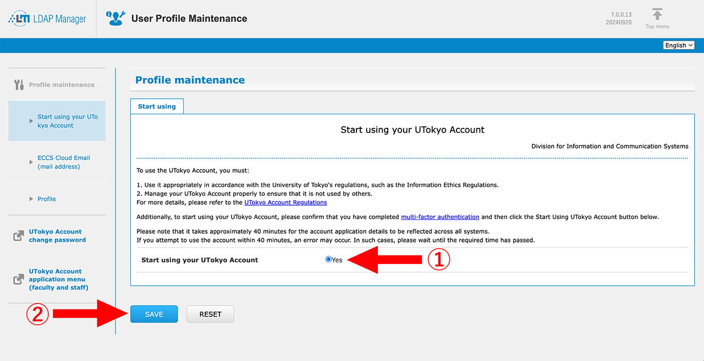

import Tabs from "@components/en/mfa/Tabs.astro";
import TabSelector from "@components/en/mfa/TabSelectorGrid.astro";

## Introduction
{:#introduction}

Multi-factor authentication (MFA) is a security process in which users are asked to enter passwords and also verify their identity via SMS or authentication apps when signing in to their accounts. MFA can make your account more secure by reducing the risk of unauthorized sign-ins even if your password has been compromised.

This page provides information about the initial procedures to enable MFA. The outline is as follows.

- Step 1: [Set Up the First Verification Method](#first)
- Step 2: [Add Alternative Verification Methods](#alternative)
- Step 3: [Try Signing In](#try)
- Step 4: [Apply for MFA Use](#apply)

Procedures on step 1 and 2 differ depending on the verification method you will register. Firstly, select verification methods to register for step 1 and 2, and then tasks to register them are shown below.

Because the primary verification method registered on step 1 is used by default, you should register the method you use frequently for it.
You may also register the same method for step 1 and 2; for example, you may register the same authenticator apps installed on your two or more smartphones, or register both your cell phone and landline.

<TabSelector group="intent" />

**Complete all the tasks from Step 1 to Step 4.** After you complete the whole procedure, **you will be asked to verify your identity with the registered SMS, apps, etc., whenever you sign in to your UTokyo Account. **Be well aware that you cannot log in to your UTokyo Account if you lose access to every verification method (smartphone apps, phone number, etc.).

### Video of the Initial Setup

The following video explains the initial setup procedure in this page.

<iframe width="560" height="315" src="https://www.youtube.com/embed/l84Aa1esNqI" title="YouTube video player" frameborder="0" allow="accelerometer; autoplay; clipboard-write; encrypted-media; gyroscope; picture-in-picture; web-share" allowfullscreen></iframe>

## Step 1: Set Up the First Verification Method
{:#first.mfa-initial-step-heading}

First, set up the verification method for MFA. Here, you will add the first verification method only (the second and subsequent methods will be added in Step 2).

The procedure of step 1 differs depending on the verification method you selected. Click the following panels to show the procedure to set up the verification method.

<Tabs step="first" />

The setup process is not over. Continue to Step 2.

## Step 2: Add Alternative Verification Methods
{:#alternative.mfa-initial-step-heading}

Next, add alternative verification methods (second and subsequent methods) from the **[Security info page](https://mysignins.microsoft.com/security-info?domain_hint=univtokyo.onmicrosoft.com)**．

**Be sure to add more than one verification method**. MFA does work with just one verification method, but having only one verification method puts you at risk of getting completely locked out of your UTokyo Account when your verification method does not work (due to malfunction, model change, etc.). Adding multiple verification methods reduces this risk.

The procedure of step 2 differs depending on the verification method you selected. Click the following panels to show the procedure to set up the verification method.

<Tabs step="alt" />

In the screen that appears after clicking “Add method”, “App password” and “Email” will also show up as choices for “Which method would you like to add?”. However, please be aware that these cannot be used for identity verification upon sign-in (they are for other purposes).

The setup process is not over. Continue to Step 3.

## Step 3: Try Signing In
{:#try.mfa-initial-step-heading}

The next step is to check that you can sign in to your UTokyo Account using MFA.

1. Access the [UTokyo Account Sign-out Page](https://univtokyo.sharepoint.com/sites/utokyoaccount/_layouts/15/SignOut.aspx)．
1. Wait for the “You signed out of your account” message to appear.
1. Access the [Security info page](https://mysignins.microsoft.com/security-info?domain_hint=univtokyo.onmicrosoft.com)．
1. Enter your UTokyo Account username (10-digit Common ID) and password in the sign-in page.
1. Verify your identity using MFA. The procedure differs by the verification method you use. Please follow the instructions on your screen.
    - **Microsoft Authenticator**: A notification will be sent to your phone asking you to enter the two-digit numbers displayed on the sign-in screen.
        

            
*About the “I can’t use my Microsoft Authenticator app right now” message

            
            The “I can’t use my Microsoft Authenticator app right now” message does not mean that the MFA system using the app is unavailable. Press the message when you do NOT have access to the app.
        

    - **Other Authenticator Apps**: You will see a 6-digit code for your account in the authenticator app. Enter the code in the sign-in page.
    - **Phone Number (verification via SMS)**: An SMS message with a 6-digit code will be sent to your phone. Enter the code in the sign-in page and click “Verify”.
    - **Phone Number (verification via call)**: You will receive a phone call, asking you to press the pound key (#) on your phone. Press the key and end the call. (To display the pound key on your smartphone during the call, press the “keypad” button.)
    

        
If you want to use a verification method not displayed

        One of the added verification methods (usually the first method added) will automatically become your “default sign-in method”. When you sign in, the system will ask you to verify your identity using the default sign-in method. If you wish to sign in with a different method, click the “Use a different verification option” or “I can’t use my Microsoft Authenticator app right now” link.
        
        The default sign-in method can also be changed by following the procedure described in the “[Changing the Default Sign-in Method](../change/#default)” page．
    

1. If you are then taken to the “Security info” page, you have successfully signed in.

The setup process is not over. Continue to Step 4.

*If you could not complete this Step 3 properly, do not proceed to Step 4. Contact the <a href="/en/support/">Technical Support Desk</a>.

## Step 4: Apply for MFA Use
{:#apply.mfa-initial-step-heading}

The final step is to submit an application for MFA. Once you submit this application, you will be asked to verify your identity with the process in Step 3 whenever you sign in to your UTokyo Account.

If the remote-access environment (Citrix Workspace) of office work devices for administrative staff is being used, it will be disconnected once you apply for the MFA. Before moving on to the following procedures, please make sure you are signed out.

1. Access the [UTokyo Account User Menu](https://utacm.adm.u-tokyo.ac.jp/webmtn/LoginServlet).
2. Sign in with your UTokyo Account username (10-digit Common ID) and password if prompted.
3. Click “multi-factor authentication setting” in the left menu. 
4. Read the MFA instructions carefully, and find “Use MFA” at the bottom of the page. Answer “Yes” and click “SAVE”. 

You have completed the initial setup procedures for MFA. <strong>It will take about 40 minutes for the MFA settings to be reflected in the system after these procedures</strong>, so if you want to use UTokyo VPN or UTokyo Slack, in which MFA is required, please be patient and wait for a while.

If you want to use the UTokyo VPN, additional procedures in the <a href="/en/utokyo_vpn/">UTokyo VPN page</a> are also necessary. After waiting for approximately 40 minutes, please follow the description in the page.

## Things to Keep in Mind after Completing Initial Procedure
{:#note}

Once the MFA is enabled, **you will be asked to verify your identity with the SMS or authenticator apps you registered every time you sign in to your UTokyo Account**. Be well aware that if you lose access to the registered verification method (smartphone apps, phone number, etc.), you will be unable to sign in to your UTokyo Account.

In particular, when you get a new phone, register the phone for MFA by following the procedures in “[Changing the Verification Method of Multi-Factor Authentication for UTokyo Accounts](../change/)” while your old phone is available. Once your old phone is disposed of, you will no longer be able to verify your identity with the authentication app using the old phone. In addition, if you change the phone number, the verification with your former phone number will be impossible. Since you need to sign in to the system with your old verification method even when you change the method, it is important to switch your verification method while your old phone is available to avoid being completely locked out of your UTokyo Account.

Once you enable the MFA, you cannot disable it by yourself. If you wish to stop using MFA and reverse your UTokyo Account settings to allow signing in with only a password, you need to “terminate MFA use”. Please visit “[Terminate MFA Use](../reregister_and_terminate)” for more information.
