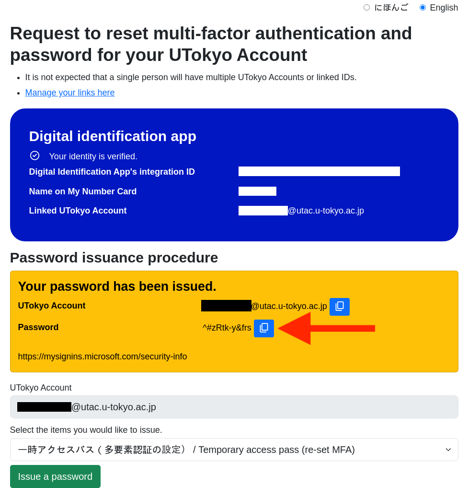
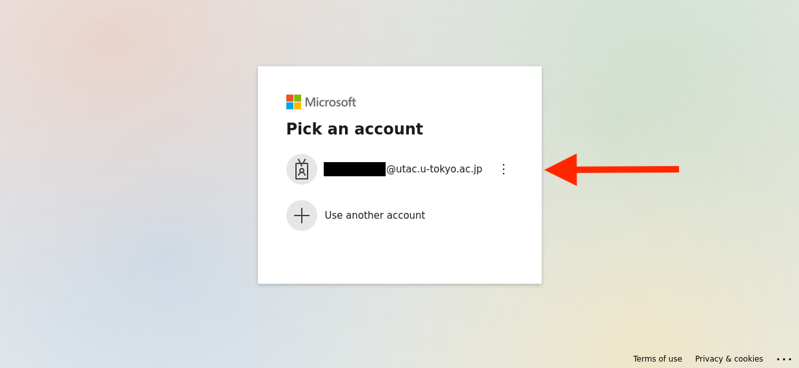
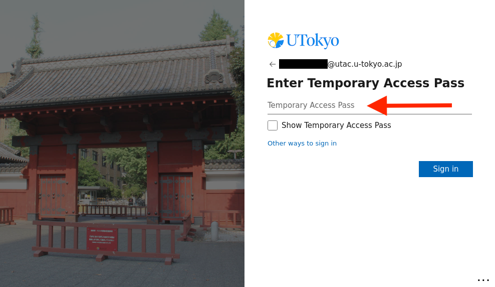

This page describes the following procedures regarding [UTokyo Account Multi-Factor Authentication (MFA)](../): "**Reregistering Verification Method**" for MFA.

In case you lose access to all verification methods and are unable to sign in to the UTokyo Account, we can take measures to allow you to retry the registration process for MFA all over again and keep using MFA. Check if any of your verification methods can be used beforehand as described below. Please follow the procedures only if all verification methods are no longer available.

For security reasons, UTokyo Account mandates the use of multi-factor authentication. If you have a compelling reason to use multi-factor authentication, please contact our [Support Desk](/en/support/email-form/).

The "Reregistering Verification Method" procedure was renamed from the "Resetting" procedure in September 2022.

## Step 1: Check If Any Other Verification Methods Are Available

When one of your verification methods becomes unavailable due to malfunction, phone model change, etc., and alternative methods are still available, you can use one of them for verification.

In the verification screen that appears after entering your password, Click the "Having trouble? Sign in another way" or "Use a different verification option" or "I can't use my Microsoft Authenticator app right now" link.

A list of verification methods that you have set up (including the default sign-in method) will be displayed.

- If any of the verification methods in the list are available for use, you can use that method to sign in to your UTokyo Account.
- If none of the methods in the list are available, you need to reregister your verification method for MFA. Please move on to the procedures below.

## Step 2: Reregister the Verification Method

If none of the verification methods registered are available, reregister your verification method using the following procedures.

There are two ways to reregister: by using the Identity Verification Service or by submitting an application.

The Identity Verification Service allows you to reregister on your own. However, to use this service, you must meet several [requirements](.#ident-myna-conditions), such as having already completed the pre-link for the "[UTokyo Account Identity Verification Service](/en/utokyo_account/ident-myna/)".

- To reregister using the Identity Verification Service, please refer to "[Reregister using the Identity Verification Service](.#ident-myna)" and follow the procedure.

If you cannot use the Identity Verification Service, you will need to submit an application to reregister.

- To reregister by application, please refer to "[Reregister by Application](.#apply-for-reregisteration)" and follow the procedure.

### Reregister using the Identity Verification Service
{:#ident-myna}
The UTokyo Account Identity Verification Service allows you to reregister your verification method by yourself at any time. Please review the "[Requirements for Reregistering Using the Identity Verification Service](.#ident-myna-conditions)" and follow the "[Procedure](.#ident-myna-procedure)" to reregister.

#### Requirements for Reregistering Using the Identity Verification Service
{:#ident-myna-conditions}
To use this service, you must meet all of the following conditions:

- You must have completed the pre-link for the UTokyo Account Identity Verification Service.
  - Please note that the pre-link must be completed **before** you become unable to sign in.
- You must have the following items on hand:
  - Your My Number Card (with a valid electronic certificate of user proof)
  - A smartphone capable of reading your My Number Card (with the digital identification app installed)
  - The following PINs you set when you created your My Number Card:
    - PIN for the electronic certificate of user proof (4 digits)
    - PIN for Card Info Input Support (4 digits)

#### Procedure
{:#ident-myna-procedure}
1. Access the "UTokyo Account Identity Verification Service" below.
**[UTokyo Account Identity Verification Service](https://identification.adm.u-tokyo.ac.jp/verify/)**{:.box.center}
2. Follow the on-screen instructions to verify your identity with your My Number Card.
3. Click "Request to reset multi-factor authentication and password for your UTokyo Account"
{:.medium}
4. From the "Select the items you would like to issue" field, select "Temporary access password (re-set MFA)" and then click "Issue a password" below it.
{:.medium}
{:.medium}
5. A temporary access pass (TAP) will be issued and displayed in the "Password" field. Please copy it.
{:.medium}
6. Open "Security Info" from the link below.
**[Security Info](https://mysignins.microsoft.com/security-info/)**{:.box.center}
7. You will be asked to sign in. Enter your UTokyo Account ID for the ID and the temporary access pass you just issued for the password, then sign in.
{:.small}
{:.small}
8. Follow the instructions in "[Step 2: Add Alternative Verification Methods](../initial/#alternative)" on the "[Initial Setup Procedures for UTokyo Account Multi-Factor Authentication](../initial/)" page to re-register your verification methods.
9. You will now be able to sign in to your UTokyo Account using the newly registered verification method.

At this time, we **strongly recommend registering multiple verification methods** to avoid being locked out again if one method becomes unusable.

### Register by Application
{:#apply-for-reregisteration}
1. There are three ways to apply for the reregistration of your verification method. Please refer to the explanations and apply using the method available to you.
   - [Apply using the dedicated Microsoft Form (if you can sign in to your UTokyo Account)](.#ms-form)
   - [Apply at your college/faculty/graduate school office](.#office)
   - [Apply via the dedicated application website](.#dedicated-site)
2. Shortly after you submit your application, the process to enable the reregistration of your verification method will be initiated, and you will be notified by email.
3. Once you receive the notification email, follow the instructions in "[Step 1: Set Up the First Verification Method](../initial/#first)" and "[Step 2: Add Alternative Verification Methods](../initial/#alternative)" on the "[Initial Setup Procedures for UTokyo Account Multi-Factor Authentication](../initial/)" page to re-register your verification methods.
4. You will now be able to sign in to your UTokyo Account using the newly registered verification method.

At this time, we **strongly recommend registering multiple verification methods** to avoid being locked out again if one method becomes unusable.

#### Apply using the dedicated Microsoft Form (if you can sign in to your UTokyo Account)
{:#ms-form}

If you can sign in to your UTokyo Account, you can apply via the Microsoft Form for reregistration.

Please note that your application will not be processed until the next business day or later if you apply at night or on weekends and holidays because your application will be reviewed by our staff before processing.

<b class="box center">
<a href="https://forms.office.com/r/NS4sh40RjR">Application form for reregisteration of verification method of MFA use</a> (in Japanese)
</b>

You need to sign in with MFA to access this form. If it is impossible for you, you cannot access this form. Use the other procedures described below.

    
Situations where it is acceptable to submit the application form

    We assume that you can apply for the procedure via this form in the following cases.
    <ul>
        <li>
            If the trouble occurred during the initial setup of MFA and you need to reregister your verification method
            <ul>
                <li>It may be possible to sign in and access Microsoft Forms during the initial setup process, as MFA is not required for sign-in until Step 4 (Apply for MFA Use) of the initial setup.</li>
            </ul>
        </li>
    </ul>

#### Apply at your college/faculty/graduate school office
{:#office}

You can apply for reregistration at the relevant office of your faculty/graduate school (the academic office for students, and the personnel department for faculty and staff members)

- Please indicate which procedure you wish to take (reregisteration of verification method of MFA use).
- Please bring your student/staff ID to verify your identity.
- [Please refer to this page if you are in charge of the relevant office of faculty/graduate school (only for faculty members)](https://univtokyo.sharepoint.com/sites/utokyoportal/wiki/d/MFA_Reset_Request.aspx)．

#### Apply via the dedicated application website
{:#dedicated-site}

You can apply for reregistration via the application website. You are required to upload the photo of your student / staff ID card to verify your identity on this website.

Please note that your application will not be processed until the next business day or later if you apply at night or on weekends and holidays because your application will be reviewed by our staff before processing.

<b class="box center">
<a href="https://identification.adm.u-tokyo.ac.jp/ident/">Application website for reregisteration of verification method of MFA use</a>
</b>

Access the link above and sign in with your UTokyo Account. MFA is not necessary when signing in, and only the username and password are required.
