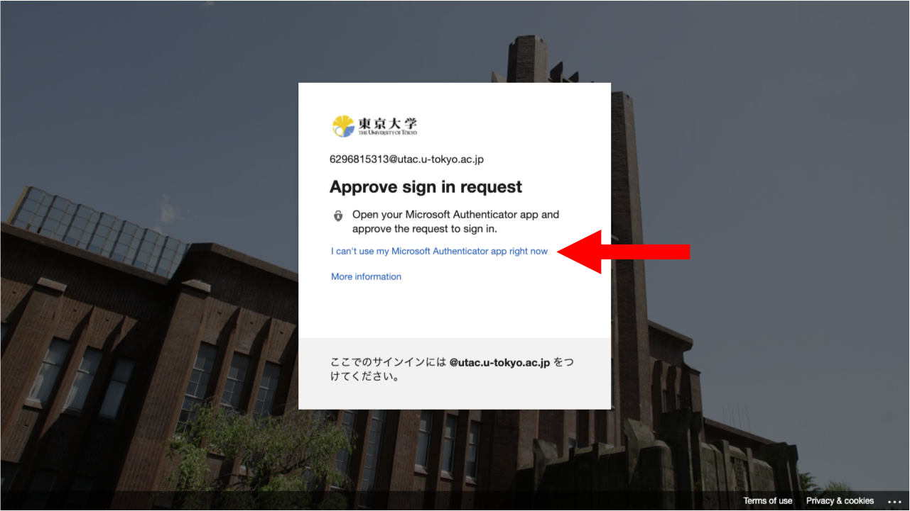

This page describes the following procedures regarding [UTokyo Account Multi-Factor Authentication (MFA)](.): “Reregistering Verification Method” for MFA, and “Terminating MFA use”. Since the purpose of the two procedures are different, please confirm which of the following is appropriate for you and follow the relevant instructions.

- **Reregister Verification Method**: In case you lose access to all verification methods and are unable to sign in to the UTokyo Account, we can take measures to allow you to retry the registration process for MFA all over again and keep using MFA.
    - Check if any of your verification methods can be used beforehand as described below. Please follow the procedures only if all verification methods are no longer available.
- **Terminate** MFA Use: If you wish to disable MFA and reverse your UTokyo Account settings to allow signing in with only a password, please follow this procedure. We strongly recommend that you continue using MFA for security reasons, but we can take measures to terminate MFA use for unavoidable circumstances. Be aware that after terminating MFA, you cannot use [UTokyo VPN](/en/utokyo_vpn/) and [UTokyo Slack](/en/slack/), which requires the use of MFA.

The “Reregistering Verification Method” procedure was renamed from the “Resetting” procedure in September 2022.

## Outline of Each Procedure

### Reregister the Verification Method
{:#reregister}

#### Check If Any Other Verification Methods Are Available

When one of your verification methods becomes unavailable due to malfunction, phone model change, etc., and alternative methods are still available, you can use one of them for verification.

Click the “Having trouble? Sign in another way” or “Use a different verification option” link in the verification screen that appears (after entering your password).

A list of verification methods that you have set up (including the default sign-in method) will be displayed.

- If any of the verification methods in the list are available for use, you can use that method to sign in to your UTokyo Account.
- If none of the methods in the list are available, you need to reregister your verification method for MFA. Please move on to the procedures below.

#### Reregister the Verification Method

If none of the verification methods registered are available, reregister your verification method using the following procedures.

1. Please apply for reregistration following the procedures in “[Application](#application-method)”.
1. The MFA verification method will be initialized for reregistration procedures. A notification email will be sent after a while.
1. After you received the Email, follow the instructions in “[Step 1: Set Up the First Verification Method](initial/#first)” and “[Step 2: Add Alternative Verification Method](initial/#alternative)” in the “[Initial Setup Procedures for Multi-Factor Authentication (MFA) for UTokyo Accounts](initial/)" page to set up new verification methods.
1. You can now sign in to your UTokyo Account with the newly registered verification method.

During this procedure, **you are strongly recommended to register multiple verification methods** to avoid being locked out from your UTokyo Account because the registered verification method becomes unavailable again.

### Terminate MFA Use
{:#terminate}

We recommend that you continue using MFA for security reasons, but, for unavoidable circumstances, we can take measures to terminate MFA use and reverse your UTokyo Account settings to allow signing in with only a password. Please follow the instructions below.

1. Please apply for termination by following the procedures in “[Application](#application-method)”.
1. The MFA for your account will be terminated. A notification email will be sent after a while.
1. You can now sign in to your UTokyo Account with only a password. It will take approximately a maximum of 40 minutes for the termination to be reflected in the system, so please wait for a while.

After terminating MFA use, [UTokyo VPN](/en/utokyo_vpn/) and [UTokyo Slack](/en/slack/), which require MFA, will become unavailable.

## Application
{:#application-method}

There are three ways to apply for reregistration and termination. Read the following descriptions and select the procedures available to you.

### Apply via the Microsoft Form (If You Can Sign in to Your UTokyo Account)
{:#ms-form}

If you can sign in to your UTokyo Account, you can apply via the Microsoft Form for reregistration and termination.

*Please note that your application will not be processed until the next business day or later if you apply at night or on weekends and holidays because your application will be reviewed by our staff before processing.

<b class="box center">
<a href="https://forms.office.com/r/NS4sh40RjR">Application form for reregisteration of verification method and termination of MFA use </a> (in Japanese)
</b>

You need to sign in with MFA to access this form. If it is impossible for you, you cannot access this form. Use the other procedures described below. 

    
Situations where it is acceptable to submit the application form

    We assume that you can apply for the procedure via this form in the following cases.
    <ul>
        <li>
            If the trouble occurred during the initial setup of MFA and you need to reregister your verification method
            <ul>
                <li> It may be possible to sign in and access Microsoft Forms during the initial setup process, as MFA is not required for sign-in until Step 4 (Apply for MFA Use) of the initial setup.</li>
            </ul>
        </li>
        <li>If you wish to terminate MFA even though you can sign in using MFA</li>
    </ul>

### Apply at the Office of Your Faculty or Graduate School
{:#office}

You can apply for reregistration and termination at the relevant office of your faculty/graduate school (the academic office for students, and the personnel department for faculty and staff members)

- Please indicate which procedure you wish to take (reregisteration of verification method, or termination of MFA use).
- Please bring your student/staff ID to verify your identity.
- [Please refer to this page if you are in charge of the relevant office of faculty/graduate school (only for faculty members)](https://univtokyo.sharepoint.com/sites/utokyoportal/wiki/d/MFA_Reset_Request.aspx)．

### Apply via the Application Website
{:#dedicated-site}

You can apply for reregistration and termination via the application website. You are required to upload the photo of your student / staff ID card to verify your identity on this website.

*Please note that your application will not be processed until the next business day or later if you apply at night or on weekends and holidays because your application will be reviewed by our staff before processing.

<b class="box center">
<a href="https://identification.adm.u-tokyo.ac.jp/ident/">Application website for reregisteration of verification method and termination of MFA use</a>
</b>

Access the link above and sign in with your UTokyo Account. MFA is not necessary when signing in, and only the username and password are required.
