## Introduction

In addition to smartphone apps such as the “Google Authenticator” that are used as verification methods for the multi-factor authentication of UTokyo Accounts, there are PC applications used in conjunction with specific devices called security keys. An example of such products is the combination of the “YubiKey” security key and “Yubico Authenticator” application.

This page provides information on how to register and sign in by using the YubiKey security key and Yubico Authenticator application as the verification method for the multi-factor authentication of UTokyo Accounts.

YubiKey also has the ability to work in conjunction with another advanced security system “FIDO” for the multi-factor authentication. Please refer to the "[Using the FIDO Security Key for Multi-Factor Authentication of UTokyo Accounts](/utokyo_account/mfa/fido-security_key)" (in Janpanese) for more details. Additionally, even if the YubiKey has been registered as a FIDO security key, it still can be also registered through an authentication app (which is useful as it allows you to sign in to [some systems where FIDO is not available](/utokyo_account/mfa/fido-security_key#unsupported-system) (in Japanese)).

## Procedures to register Yubico Authenticator

To register the combination of a YubiKey security key and Yubico Authenticator application as a verification method for the multi-factor authentication of your UTokyo Account, please follow the four-step procedure below.

## Installing the “Yubico Authenticator” application

First, you need to download the Yubico Authenticator application to your PC or smartphone and register the YubiKey.

1. Please install the Yubico Authenticator app from the [download page](https://www.yubico.com/products/yubico-authenticator/).
2. Connect your YubiKey by following the instructions of the Yubico Authenticator application.

### Displaying the QR code

You need to display the QR code to register the Yubico Authenticator application as a verification method for the multi-factor authentication of UTokyo Accounts. Since the method for displaying the QR code differs depending on the situations, details are explained separately.

#### If you register Yubico Authenticator application as the first verification method

If you have not registered any verification method and wish to register the Yubico Authenticator application as your first verification method, please follow the procedures below.

1. Access the [Security info page](https://account.activedirectory.windowsazure.com/proofup.aspx?proofup=1&whr=utac.u-tokyo.ac.jp).
2. The sign in page will appear (if you are not already signed in). Enter your UTokyo Account username (10-digit Common ID) and password and click “Sign in”.

3. Click “Next” in the “More information required” page.
4. Click “I want to use a different authentication app” in the middle of the setup page.
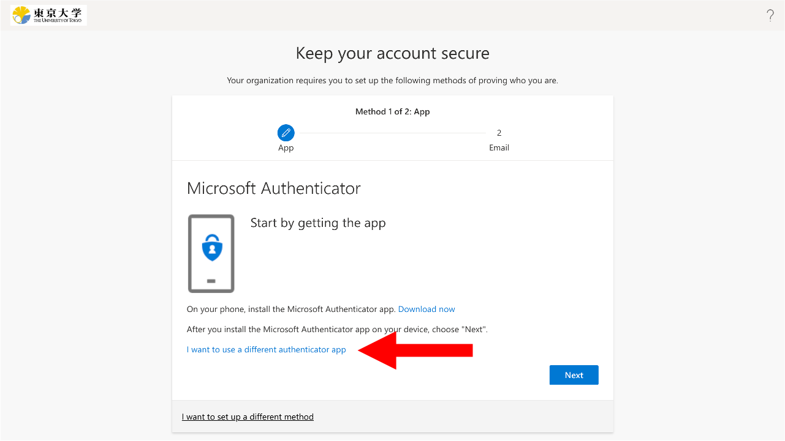
5. Follow the instructions until you reach the QR code page.
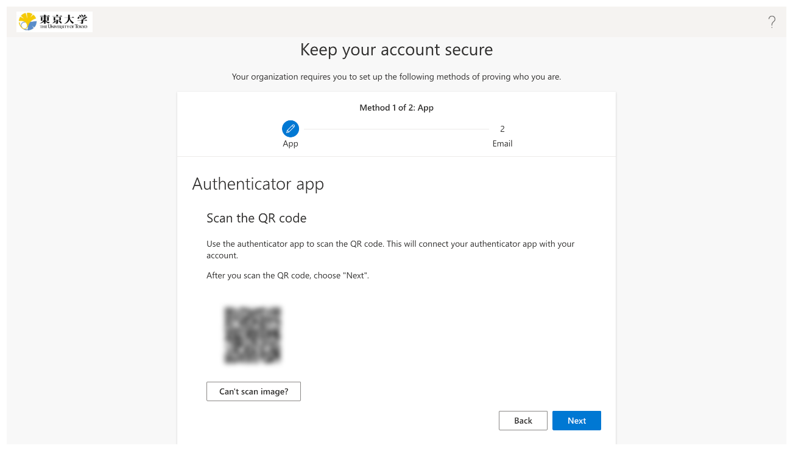

#### If you have already registered the first verification method

If you have already registered another verification method as your first one and wish to register the Yubico Authenticator application as an alternative verification method, please follow the procedures below.

1. Click "Add method" in the [Security info page](https://account.activedirectory.windowsazure.com/proofup.aspx?proofup=1&whr=utac.u-tokyo.ac.jp).
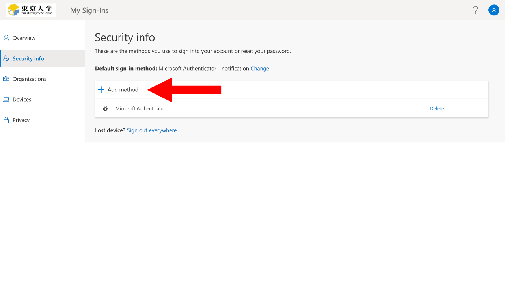
2. For “Which method would you like to add?”, select “Authenticator app” and click “Add”.
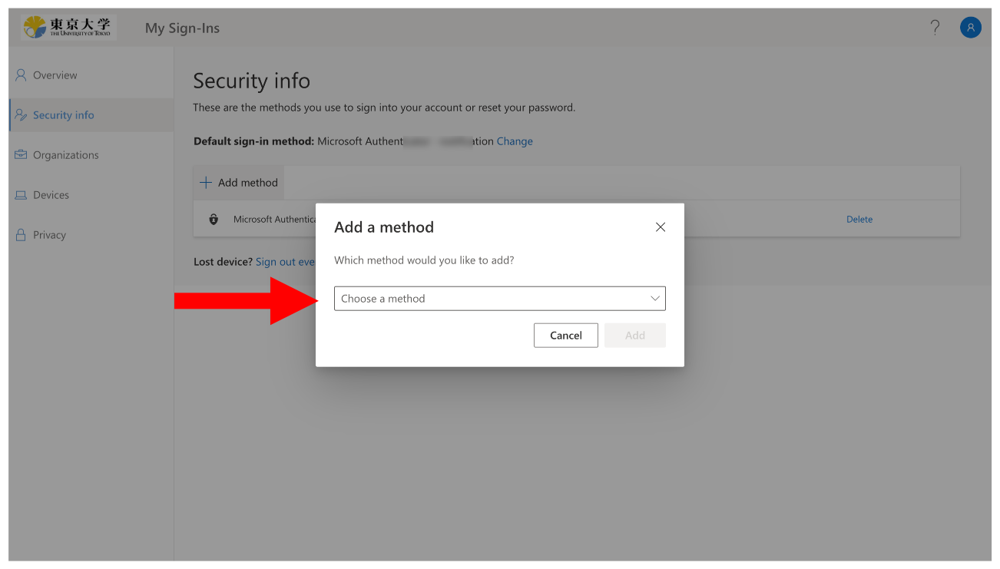
3. Click “I want to use a different authentication app”.
 
4. Follow the instructions until you reach the QR code page.
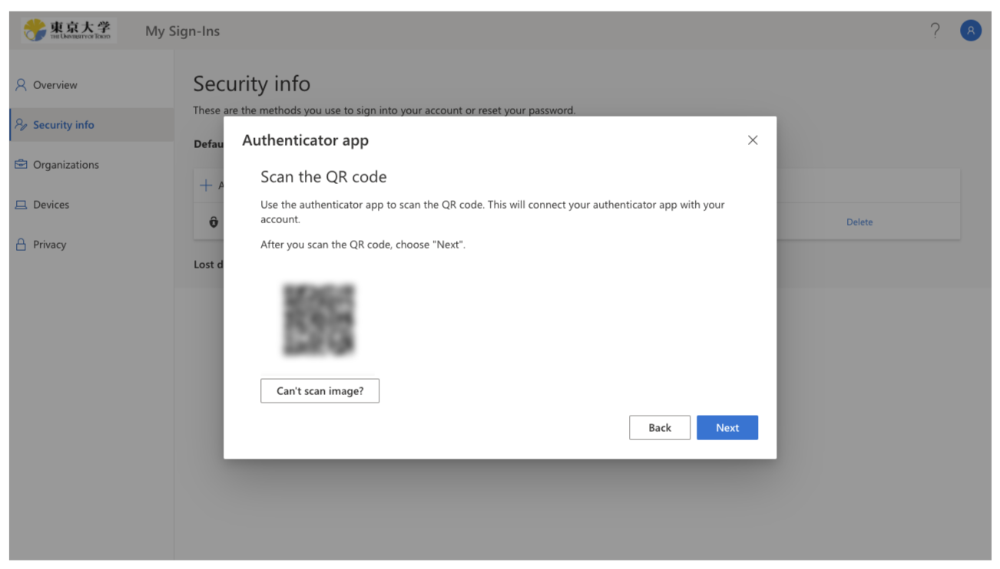

### Adding an account to Yubico Authenticator

1. To add an account to the Yubico Authenticator application, please click on the “Configure Yubikey” in the upper right corner of the screen, and press the “Add account” displayed on the screen.
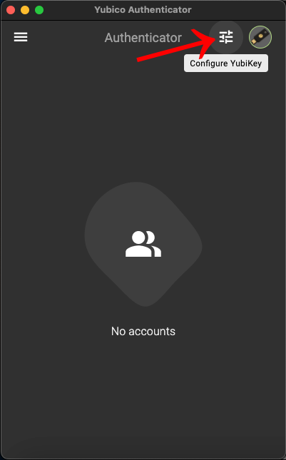
1. Press the “Scan QR code” and scan the QR code according to the instructions on your screen, and press “Save”.  
\* If you are using a PC, the QR code displayed on the screen will be read in automatically and you do not need to scan the QR code with the camera of your PC. Therefore, when you do this process for the first time, it may ask you for the permission to record the screen.
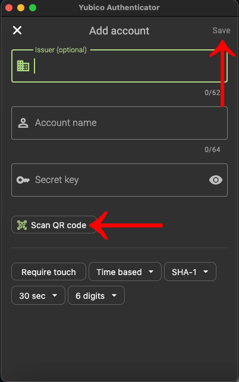
1. The process is complete if you see that your account has been added in the Yubico Authenticator application.
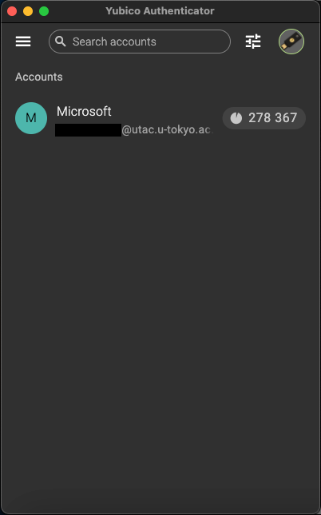

### Code input test

1. When you add an account to the Yubico Authenticator application，click ”Next” in the browser screen displaying the QR code.
2. When the “Enter code” field is displayed, please open the Yubico Authenticator application with YubiKey connected, check the 6-digit number shown in the app and enter the numbers into the input field.
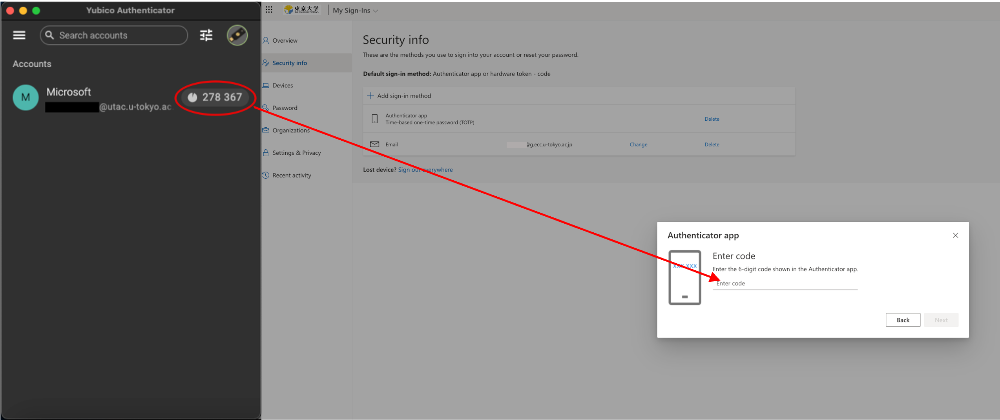

Regarding the registration of your email address
If you register Yubico Authenticator application as the first verification method, you will be prompted to enter your email address after completing the code input test. Please enter an email address OTHER THAN your ECCS Cloud Email if possible, and click “Next”. Enter the 6-digit code sent to your email address, and click “Next”.  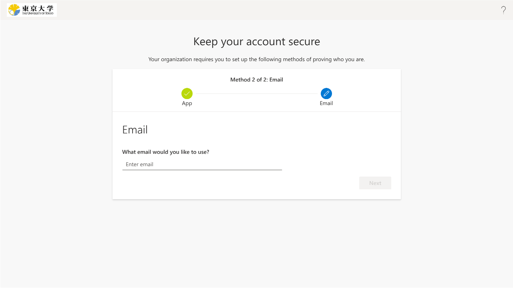

Once you have completed the registration for the verification method, **make sure to follow all the steps up to step 4 in the "[Initial Setup Procedure of Multi-Factor Authentication for UTokyo Accounts](initial)" and enable Multi-Factor Authentication.**

### Procedures of signing in Yubico Authenticator

1. Once you sign in to your UTokyo Account (after you enter your password), the screen for the default multi-factor authentication verification method will be displayed. Please click on the “Having troubles? Sign in another way” or “I can’t use my Microsoft Authenticator app right now”.  
\* If you have the default verification method set to “App-based authentication or hardware token - code”, the screen in step 3 will be displayed from the beginning. Please follow step 3 as steps 1 and 2 will be skipped.
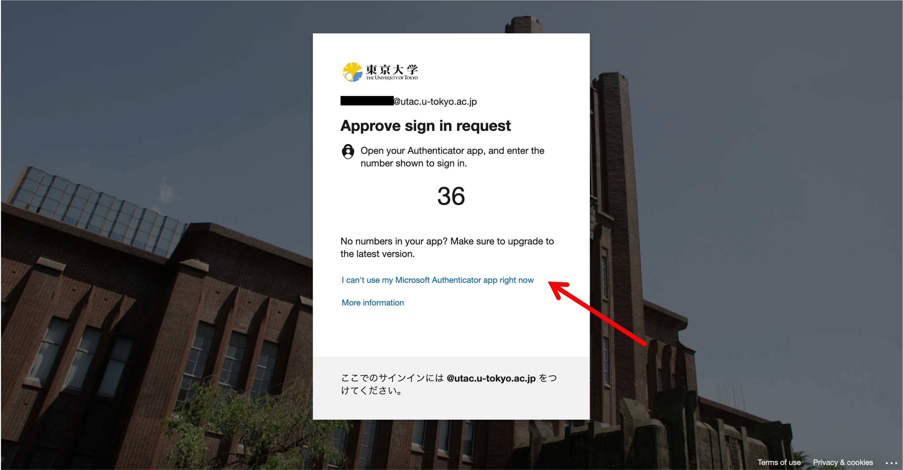
1. Please click on the “Use a verification code”.
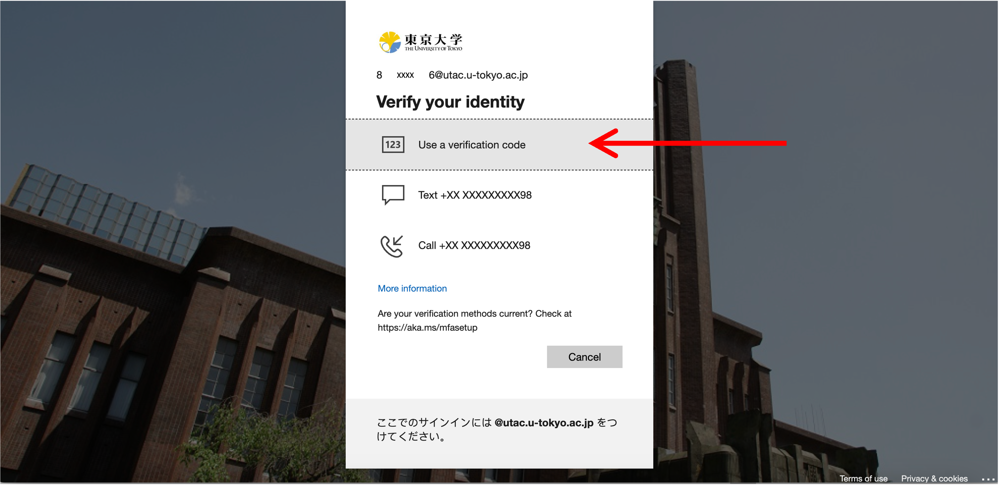
1. When the “Enter code” field is displayed, please open the Yubico Authenticator application with YubiKey connected, check the 6-digit number shown in the app and enter the numbers into the input field.
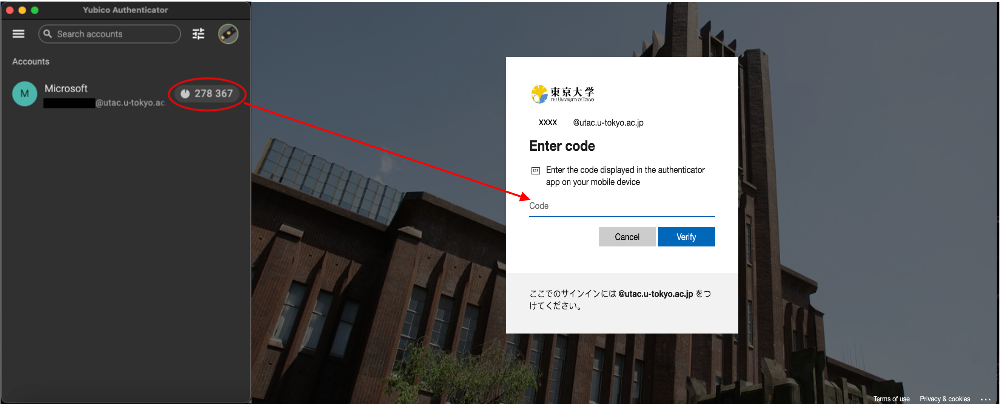
