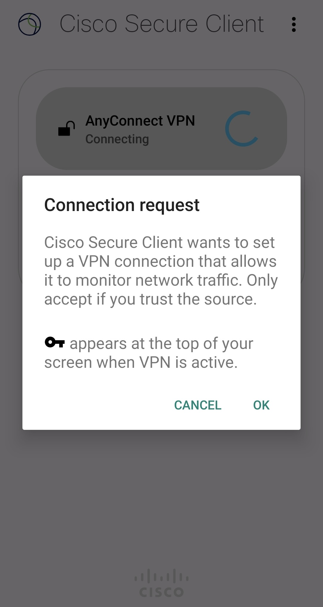

import SubpageBeginning from './_subpage_beginning.md';
import HelpMfa from './_help_mfa.html';
import HelpMultipleUsers from './_help_multiple_users.html';
import HelpSecurityEducation from './_help_security_education.html';

This page explains how to use UTokyo VPN on your Android devices.

<SubpageBeginning />

## Preparation: Initial setup of UTokyo VPN
{:#setup}

First, install the apps necessary to connect to the UTokyo VPN and perform the initial setup. The procedure is similar to installing a regular Android app.

**Step A:** Access [Google Play](https://play.google.com/store/apps/details?id=com.cisco.anyconnect.vpn.android.avf) and install the Secure Client app from Cisco Systems. This app was previously named AnyConnect. Therefore, these two names are shown together in the following image.

{:.medium.center.border}

**Step B:** After installation, open the Secure Client app and check if the screen shown in the first image below is displayed. Confirm the contents and tap "OK". If the screen shown in the second image below is displayed, the installation is complete.

<figure class="gallery">
  {:.border}
    {:.border}
</figure>

**Step C:** Tap “Connections" and tap the plus “+" button in the lower right corner. The “Connection Editor" will appear as shown below. Tap “Server Address" and enter “vpn1.adm.u-tokyo.ac.jp”.

{:.medium.center.border}

**Step D:** Confirm that the screen is shown as below and tap “DONE" at the bottom of the screen if shown as below.

{:.medium.center.border}

## Steps to connect to the UTokyo VPN
{:#connect}

The following procedure is required each time you use the VPN. Please note that the VPN connection is not automatically established immediately after the device is turned on.

**Step E:** Confirm that "vpn1.adm.u-tokyo.ac.jp" is listed under "Connections" as shown in the first image below. Next, turn on the toggle button next to "AnyConnect VPN" and sign in with your UTokyo Account when the UTokyo Account authentication screen appears as shown in the second image below. If you launch the VPN shortly after  your previous access, the VPN connection may start immediately without displaying this screen.

{:.medium.center.border}

At this time, a screen, shown below, may appear asking for permission. In this case, please confirm the information and tap the “OK" button.

{:.medium.center.border}

<HelpMfa />
<HelpSecurityEducation />

**Step F:** If the authentication is successful, the connection to the VPN is complete; all communications, except for certain communications that do not require a VPN connection, such as Zoom and Webex, and e-journal sites, will be carried out while you are connected to the University of Tokyo campus network through this VPN.

**Step G:** Your device is connected to the UTokyo VPN if “Connected" is displayed on the Secure Client app screen as shown below.

{:.medium.center.border}

When you wish to disconnect the VPN, tap the toggle button on this screen and confirm that “Disconnected" is displayed.

---

[Back to the main UTokyo VPN page](.)
