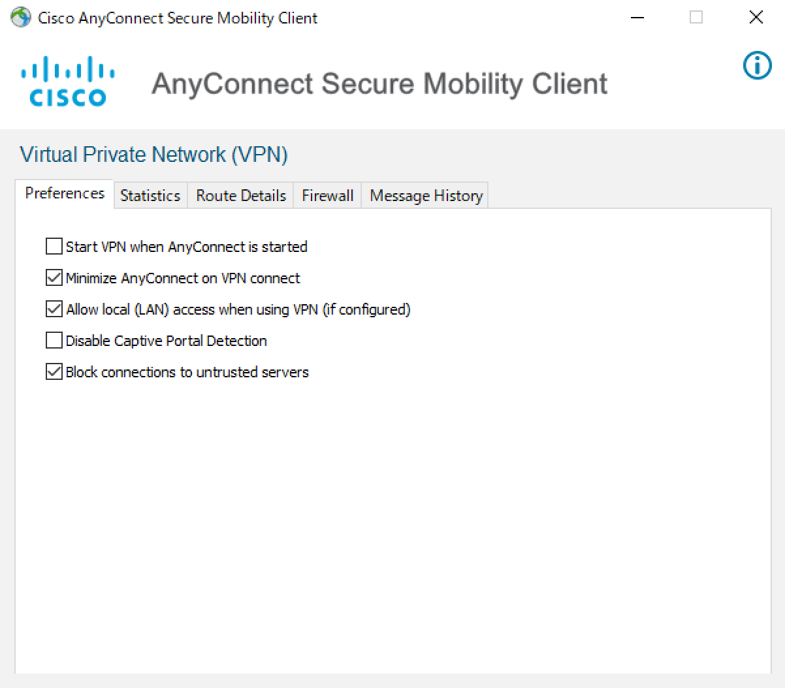

## Introduction
{:#introduction}

UTokyo VPN is a VPN service available to all the faculties and staff of the University of Tokyo (UTokyo). When a device is connected to the UTokyo VPN from outside the campus, the device communicates via the VPN gateway installed at the Information Technology Center. Thereafter, the device virtually connects to the UTNET - UTokyo campus network.

To use UTokyo VPN, first install AnyConnect, a VPN client application, on your device. When the installed application is launched, it connects to the VPN gateway through the UTokyo Account authentication process, allowing communication from the device to the outside world through UTNET via VPN.

### Access to e-journals
{:#journal}

You cannot access e-journals and e-books subscribed by UTokyo Library via UTokyo VPN.  Instead use EZProxy to access these e-journals and e-books.  To quickly download the pdf of a paper from the publisher's landing page, it's convenient to [Read using the bookmarklet](https://www.lib.u-tokyo.ac.jp/en/library/literacy/user-guide/campus/offcampus/ezproxy/others#marklet), also explained in [this page](https://note.com/k_yamamoto/n/n0ee13fe38f24) (in Japanese).  There are of course papers not subscribed by the library, as well as papers subscribed but cannot be obtained by this method.  For more details about the usage and eligible users, be sure to read the page "[Using EZproxy](https://www.lib.u-tokyo.ac.jp/en/library/literacy/user-guide/campus/offcampus/ezproxy)" and "[Supplement : How to read paper found outside the university](https://www.lib.u-tokyo.ac.jp/en/library/literacy/user-guide/campus/offcampus/ezproxy/others)" provided by the library.

## Requirements for use
{:#note}

**Eligible user:** University of Tokyo faculties, staff and students having a UTokyo Account.

**Device Types and OS for VPN:** UTokyo VPN is accessible on the following versions of Windows and macOS. Moreover, iPhone, Android, and other smartphones can be used other than the PC, however, currently we do not provide manuals or support for them.

- Windows: Windows 10, 11
- macOS: macOS 10.15 Catalina, 11 Big Sur, 12 Monterey
- Android: Android 9, 10, 11, 12
- iOS: iOS 14, 15
- iPadOS: iPadOS 14, 15

### Information Security Education
{:#information-security-education}

UTokyo VPN is only available to users who have completed the Information Security Education. The Information Security Education is held annually for all UTokyo Account holders with the aim of improving [Information Security at UTokyo](https://univtokyo.sharepoint.com/sites/Security/SitePages/en/Home.aspx). For details about the timing and the procedure of the course, kindly refer to the [Information Security Education](https://univtokyo.sharepoint.com/sites/Security/SitePages/en/Information_Security_Education.aspx) page.

- If you don't complete the Information Security Education within the implementation period, your privilege to use the UTokyo VPN will be suspended. Specifically, you will no longer be able to install the application required to use the UTokyo VPN. Furthermore, even if you have already installed it, you will no longer be able to connect to the UTokyo VPN.

- If your access gets suspended, please ensure to undergo the Information Security Education. As soon as you pass the confirmation test, the suspension of your  access will be restored immediately. 

- For those who are newly enrolled and appointed, complete the [Information Security Education](https://univtokyo.sharepoint.com/sites/Security/SitePages/en/Information_Security_Education.aspx) and pass the confirmation test in order to start using UTokyo VPN. Please complete the Information Security Education before starting to use the UTokyo VPN.

### Enable Multi-factor Authentication
{:#mfa}

To use UTokyo VPN, you are required to enable multi-factor authentication for your UTokyo Account (please refer to [Using multi-factor authentication](/en/utokyo_account/mfa/) for your UTokyo Account). Thereafter, enable multi-factor authentication for your UTokyo Account (Multi-factor UTokyo VPN will be available 40 minutes after you apply for the authentication).

## How to use UTokyo VPN
{:#how-to-use}

The following pages explain how to install the VPN client application on your device and connect to UTokyo VPN for each operating system. Note that UTokyo VPN can be configured outside of the campus.

* [How to use UTokyo VPN on Windows devices](windows)
* [How to use UTokyo VPN on macOS devices](macos)
* [How to use UTokyo VPN on Android devices (in Japanese)](/utokyo_vpn/android)
* [How to use UTokyo VPN on iPad devices (in Japanese)](/utokyo_vpn/ipad)
* [How to use UTokyo VPN on iPhone devices](iphone)
{:.cards}

## FAQ
{:#faq}

### Q. I want to use a local printer even when connected to UTokyo VPN.
When you are connected to UTokyo VPN, the communication to the local network to which your computer is connected also goes through the VPN. Click the gear button on the bottom left of the AnyConnect Secure Mobility Client window. The following window will appear. In the "Preferences" tab of this window, check the "Allow local (LAN) access when using VPN (if configured)" check box.

  <figure class="center">
    
    <figcaption>In case of Windows</figcaption>
  </figure>
  <figure class="center">
    
    <figcaption>In case of macOS</figcaption>
  </figure>

### Q. Does "UTokyo faculty and staff with a UTokyo Account" mean those who are employed by UTokyo? Or does it include temporary staff, visiting researchers, and others who are working or conducting research at UTokyo?
A. In addition to the former category, it includes temporary staff, visiting researchers, and others who are working or conducting research at UTokyo.

### Q. Can I access the employee ID card issued and employment management system from off-campus?
A. Yes, you can access the employee ID card issued and employment management systems from off-campus by connecting to the UTokyo VPN.

### Q. Will I be able to view internal departmental websites?
A. No. It depends on the access restrictions of your departmental site. You are required to ask your department.

### Q. Is it necessary to get a new account every six months like a UTokyo Wi-Fi account?
UTokyo VPN authentication is done with a UTokyo Account, not a UTokyo Wi-Fi account. Therefore, you can continue to use UTokyo VPN without changing it. However, users are required to complete an information security training session, annually.

## Regulations (only in Japanese)
{:#regulations}
- [UTokyo VPN Usage Regulations](/utokyo_vpn/terms/UTokyoVPN-User-Term.pdf)
- [UTokyo VPN Operation Regulations](/utokyo_vpn/terms/UTokyoVPN-Operation-Term.pdf)

## Inquiry
{:#inquiry}

Please contact via [Techinical Support Desk](/en/support/).
