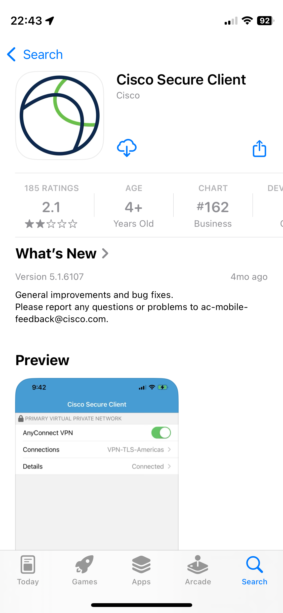
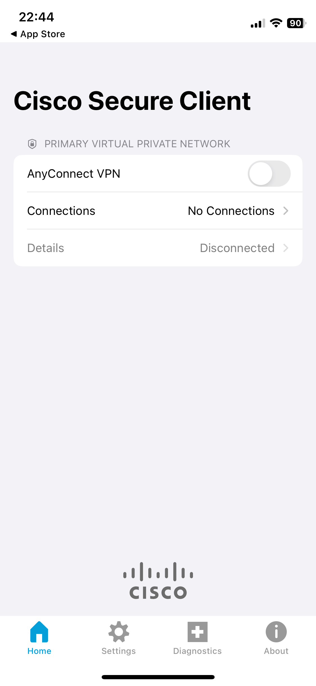
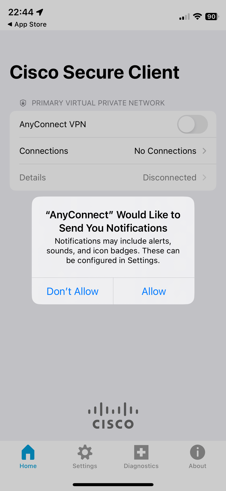
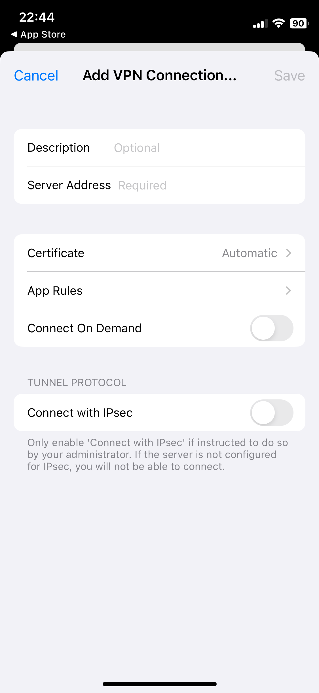
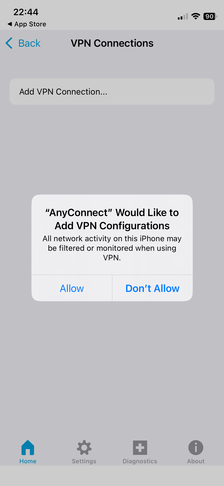
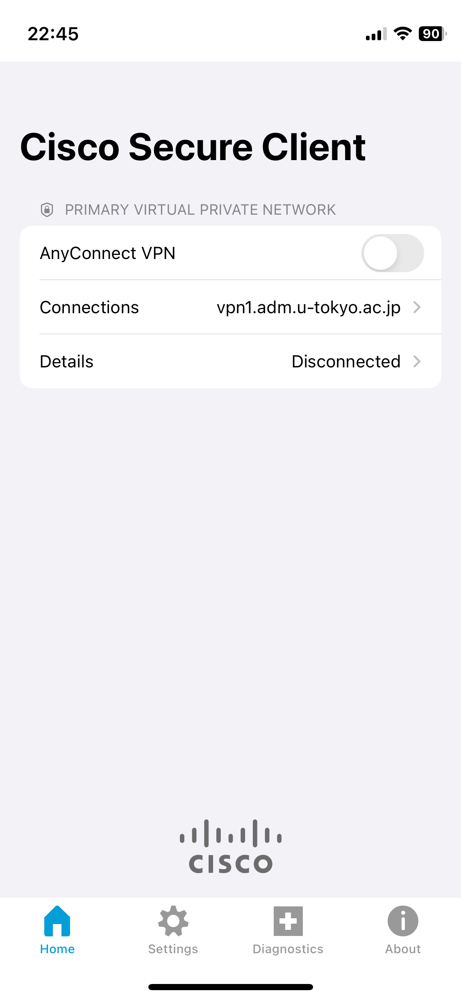
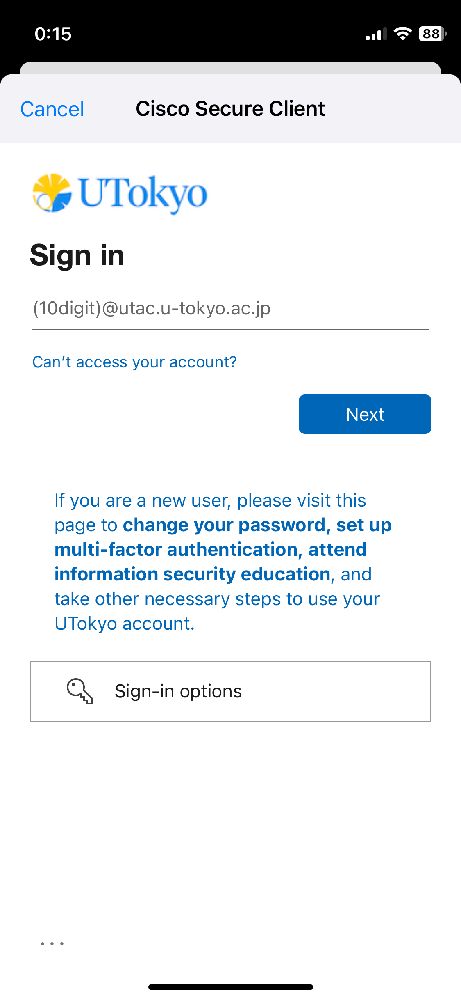
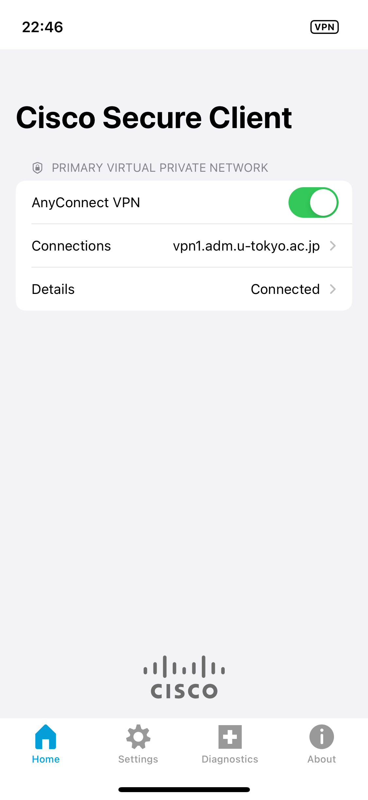

import SubpageBeginning from './_subpage_beginning.md';
import HelpMfa from './_help_mfa.html';
import HelpMultipleUsers from './_help_multiple_users.html';
import HelpSecurityEducation from './_help_security_education.html';

This page explains how to use UTokyo VPN on your iPhone.

<SubpageBeginning />
## Preparation: Initial setup of UTokyo VPN
{:#setup}

First, install the apps necessary to connect to the UTokyo VPN and perform the initial setup. The procedure is similar to installing a regular iOS app.

**Step A:** Access the [App Store](https://apps.apple.com/us/app/cisco-secure-client/id1135064690) and install the Cisco Secure Client app from Cisco.

{:.medium.center.border}

**Step B:** After installation, open the Secure Client app and check if the screen shown in the first image below is displayed. If the screen is displayed, then the installation is complete. When you open the application, you may be prompted to confirm the sending of notifications as shown in the second image below. You can choose either of the options.

<figure class="gallery">
  
  
</figure>

**Step C:** Tap "Connections" on the screen after launching the application, and then tap "Add VPN Connection..." on the subsequent screen. The following screen will then appear. Tap the input field next to "Server Address" and enter **vpn1.adm.u-tokyo.ac.jp**.

{:.medium.center.border}

**Step D:** After you press the "Save" button, you will be asked to add a VPN configuration as shown below. Confirm the details and press "Allow". You may be asked for additional authentication using Touch ID or other methods. In such a case, please authenticate as necessary.

{:.medium.center.border}

## Usage: Connecting to the UTokyo VPN
{:#connect}

The following procedure is required each time you use the VPN. Please note that the VPN connection is not automatically established immediately after the device is turned on.

**Step E:** Confirm that "vpn1.adm.u-tokyo.ac.jp" is listed under "Connections" at the top of the screen as shown in the first image below. Next, turn on the toggle button next to "AnyConnect VPN" and sign in with your UTokyo Account when the UTokyo Account authentication screen appears as shown in the second image below. If you launch the VPN shortly after your previous access, the VPN connection may start immediately without displaying this screen.

<figure class="gallery">
  
  
</figure>

<HelpMfa />
<HelpSecurityEducation />

**Step F:** If the authentication is successful, the connection to the VPN is complete; all communications, except for certain communications that do not require a VPN connection, such as Zoom and Webex, and e-journal sites, will be carried out while you are connected to the University of Tokyo campus network through this VPN.

**Step G:** Your device is connected to the UTokyo VPN if the "Details" screen shows "Connected" as shown below.

{:.medium.center.border}

When you wish to disconnect the VPN, tap the toggle button on this screen and confirm that the "Details" has changed to "Disconnected".

---

[Back to the main UTokyo VPN page](.)
