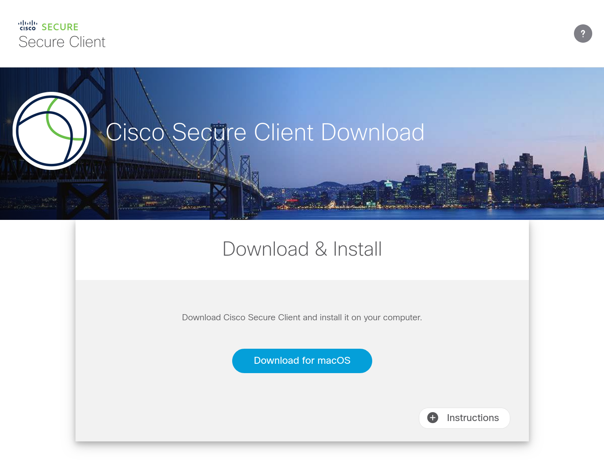
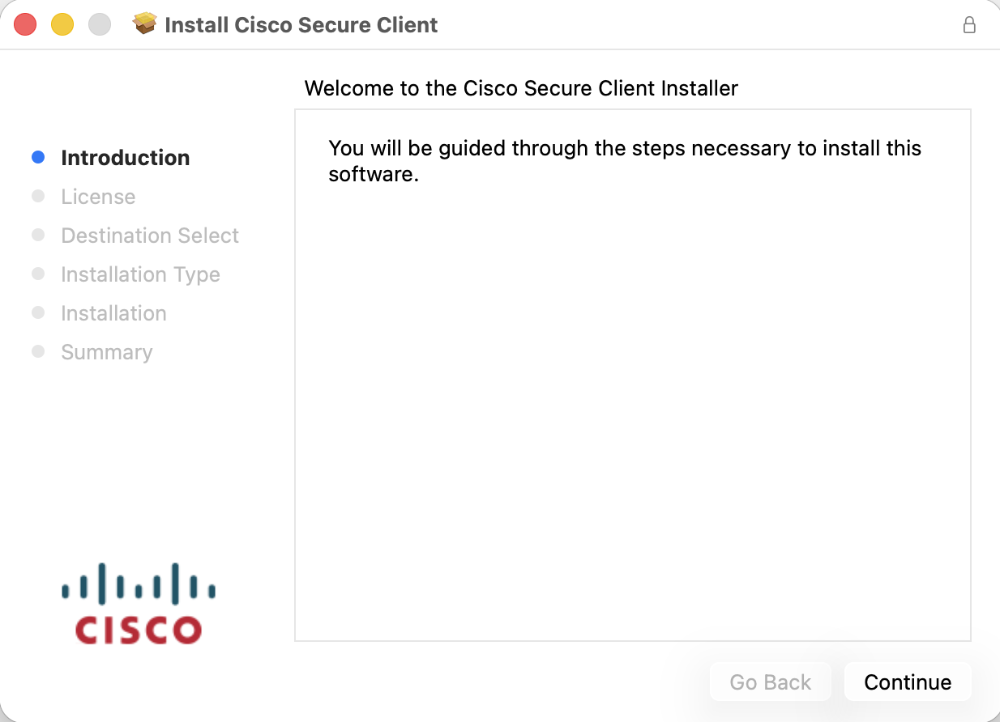
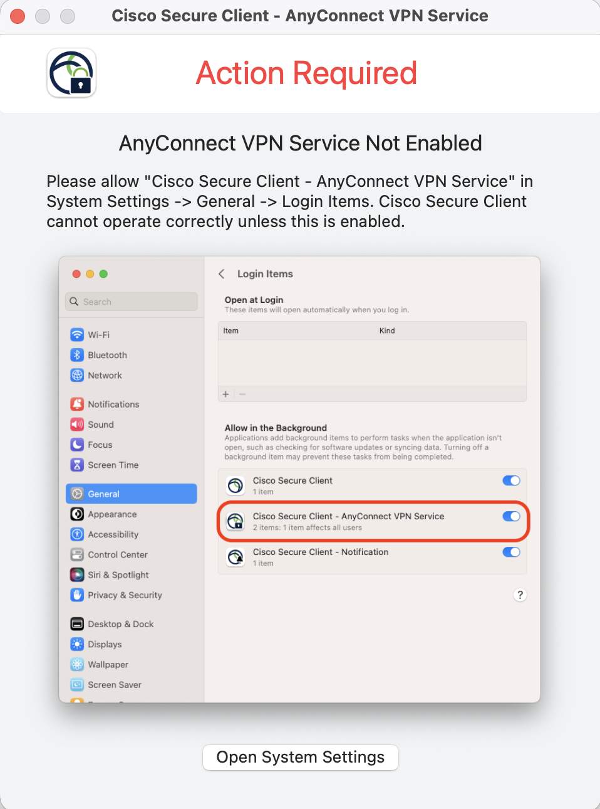
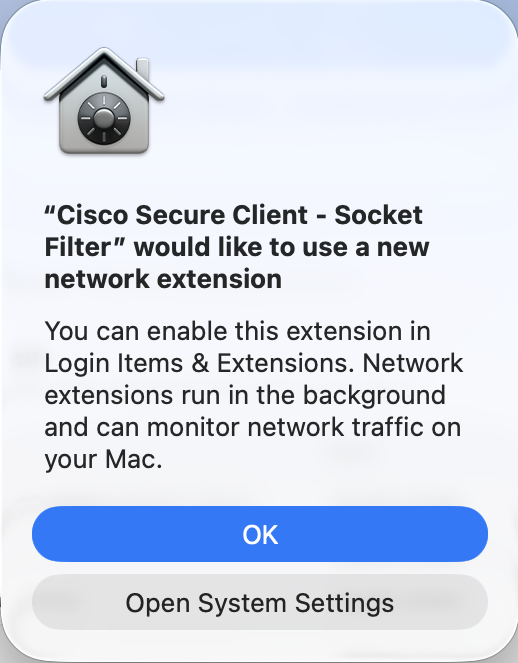
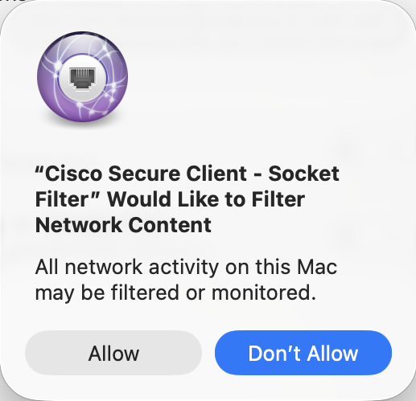
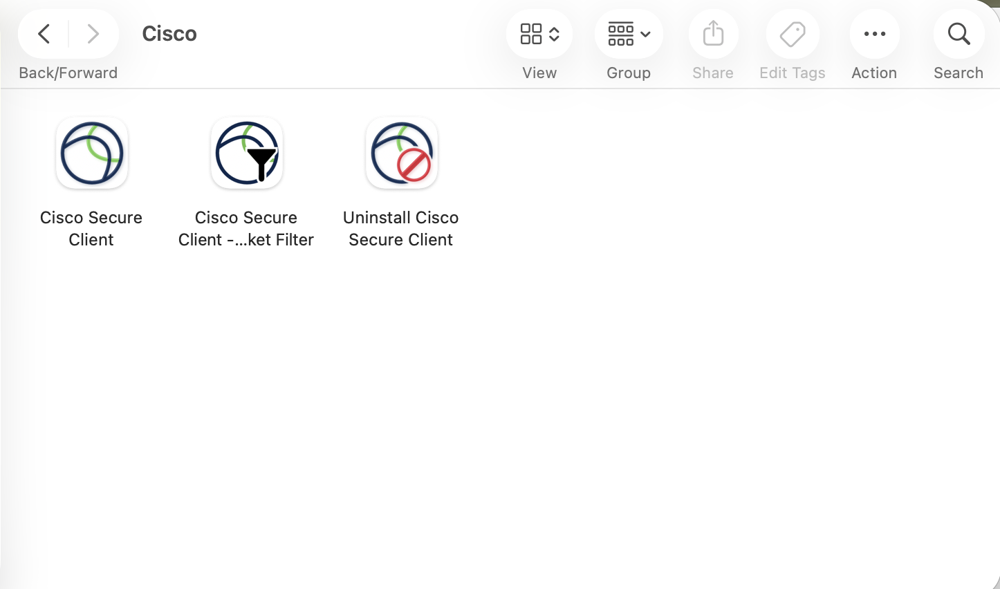
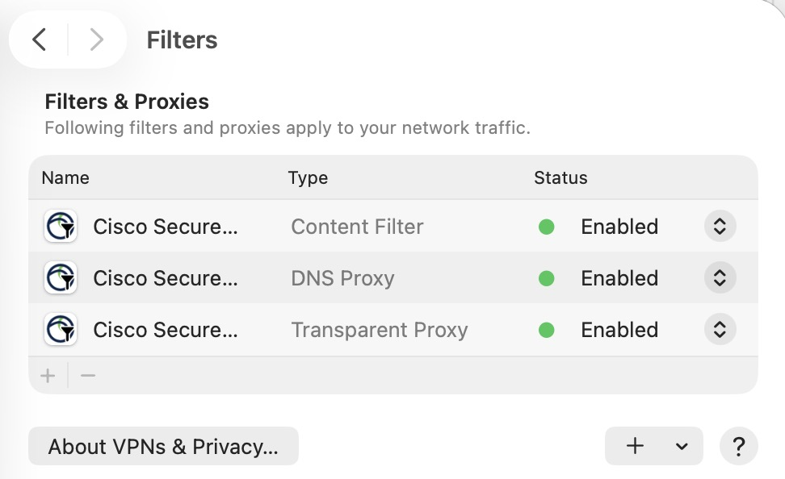
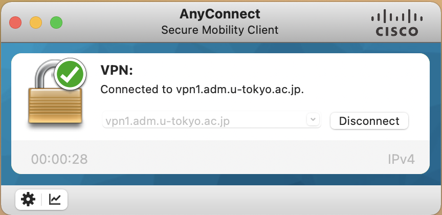

import SubpageBeginning from './_subpage_beginning.md';
import HelpMfa from './_help_mfa.html';
import HelpWhite from './_help_white.html';
import HelpSecurityEducation from './_help_security_education.html';
import HelpMultipleUsers from './_help_multiple_users.html';

This page describes how to use UTokyo VPN on macOS devices.

<SubpageBeginning />

## Preparation: Download and Install the VPN Client Application
{:#setup}

Install the application “AnyConnect” on your device to connect to UTokyo VPN.

**Step A:** Go to [https://vpn1.adm.u-tokyo.ac.jp](https://vpn1.adm.u-tokyo.ac.jp). When the UTokyo Account authentication page appears as illustrated below, log in with your UTokyo Account.

<HelpMfa />
<HelpSecurityEducation />

**Step B:** After the log-in, a download page for the AnyConnect client application, as illustrated below, will appear. Click “Download for macOS” to download the client application.

After these steps, install the application as you would do for any other macOS application.

{:.medium.center.border}
{:.medium.center.border}

<HelpWhite />

**Step C:** During the installation of Cisco Secure Client, a window with the following message “Action Required AnyConnect VPN Service Not Enabled.” may appear. Please follow the instructions to allow the system software from "Cisco Secure Client - AnyConnect VPN Service", which is displayed in the "App Background Activity" in "Login Items & Extensions" in "General" in "System Preferences". A window with the following message will appear '"Cisco Secure Client - Socket Filter" would like to use a new network extension' please click the "OK" button.

{:.medium.center.border}
{:.medium.center.border}

**Step D:** Wait a while minute, a window with the following message "Action Required Cisco Secure Client - System Extension Blocked." may appear. Please follow the instructions to allow the system software from "Cisco Secure Client - Socket Filter" to click the 🛈️ button, which is displayed in the right of "Network Extensions" in "Login Items & Extensions" in "General" in "System Preferences". A window with the following message will appear '"Cisco Secure Client - Socket Filter" Would Like to Filter Network Content' please click the "Allow" button.

{:.medium.center.border}
{:.medium.center.border}

**Step E:** If the installation was completed successfully, a folder named “Cisco” is created in the Applications folder. In the folder, the AnyConnect client application “Cisco AnyConnect Secure Mobility Client.app” is installed. 

{:.medium.center.border}

You are now ready to use VPN.

Note: After installing the AnyConnect client application on a macOS 11 Big Sur or later, three extensions with the name “Cisco AnyConnect Socket Filter” are added to the “Network” in the “System Preferences”. These extensions are necessary for shifting networks between VPN and others such as Wi-Fi or LAN. They do not record the contents of communications or send the information outside the host. These extensions' statuses are always “connected (green dot)” regardless of a real connection to the UTokyo VPN. 

{:.medium.center.border}

## Steps to connect to the UTokyo VPN
{:#connect}

The following steps are required, every time to use the VPN. Please note that your device will not connect automatically to the VPN immediately after booting your PC.

**Step F:** After launching the “Cisco AnyConnect Secure Mobility Client” installed following the Preparation steps, the window illustrated below will appear. Enter **vpn1.adm.u-tokyo.ac.jp** as the VPN connection destination. Click the “Connect” button. 

{:.medium.center.border}

**Step G:** After clicking the “Connect” button, the following UTokyo Account authentication window appears. Log in with your UTokyo Account.

<HelpMultipleUsers />
<HelpMfa />
<HelpSecurityEducation />

**Step H:** If the window displaying “Connected: vpn1.adm.u-tokyo.ac.jp” appears as illustrated below, your device is connected to the VPN. Communication is performed via this VPN while connected to UTokyo campus network. Except for some communication platforms such as Zoom and WebEx that do not require a VPN connection and e-journal sites, all communications occur via this VPN, connecting to UTokyo campus network.

**Step I:** To view the current connection status, click on the “Cisco AnyConnect Secure Mobility Client” icon again. If the window displaying “Connected to vpn1.adm.u-tokyo.ac.jp” illustrated below appears, your device is connected to the UTokyo VPN.

To disconnect from the VPN, click the “Disconnect” button in this window.

{:.medium.center.border}
