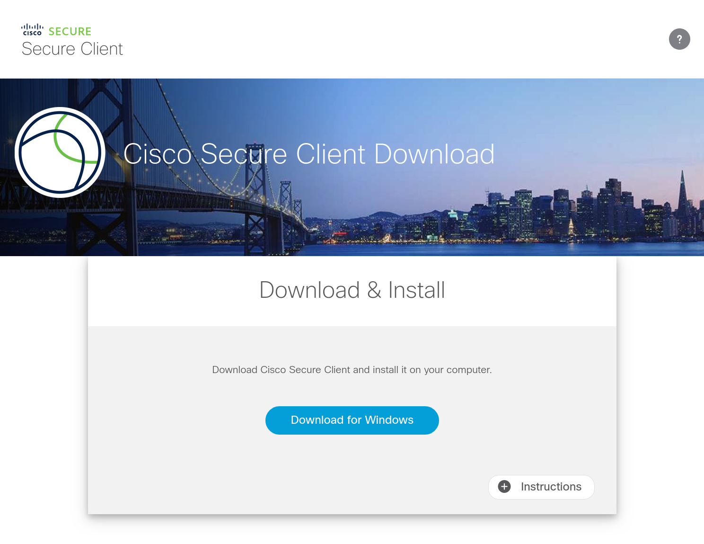
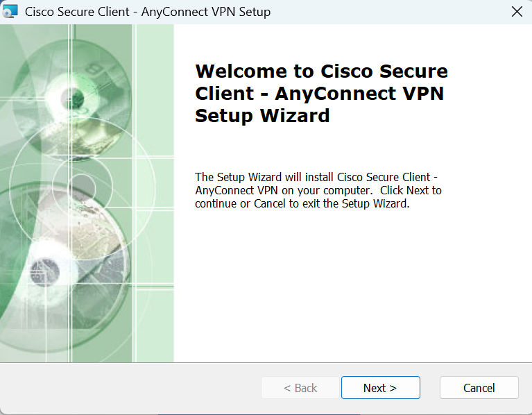
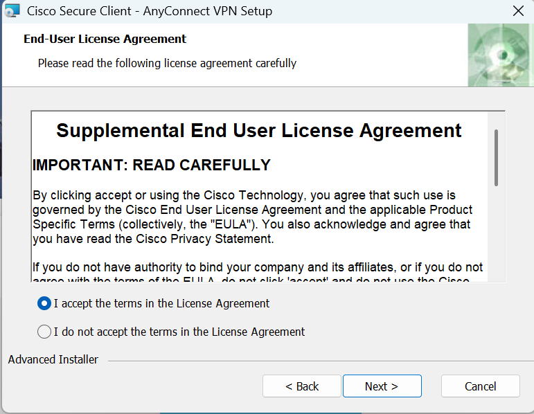
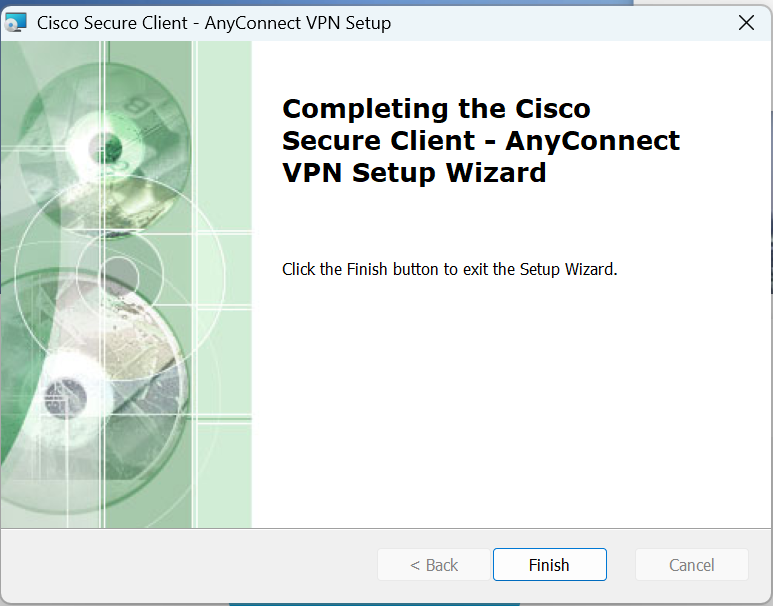
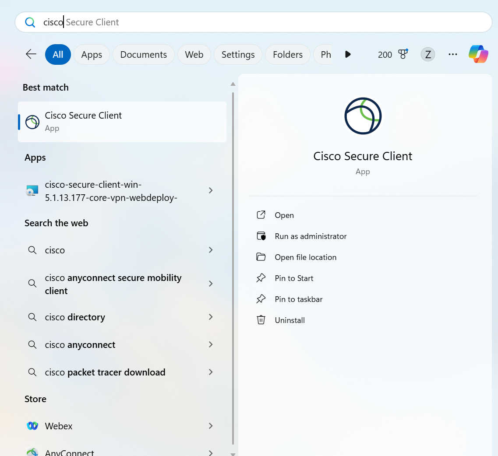
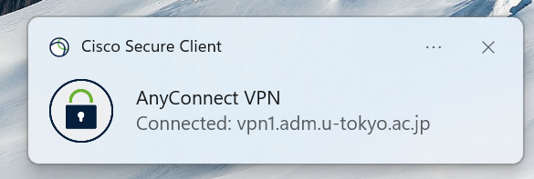
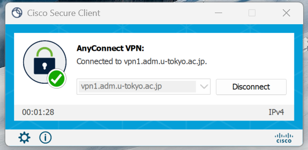

import SubpageBeginning from './_subpage_beginning.md';
import HelpMfa from './_help_mfa.html';
import HelpWhite from './_help_white.html';
import HelpSecurityEducation from './_help_security_education.html';
import HelpMultipleUsers from './_help_multiple_users.html';

This page describes how to use UTokyo VPN on Windows devices.

<SubpageBeginning />

## Preparation: Download and Install the VPN Client Application.
{:#setup}

Install the application “AnyConnect” on your device to connect to UTokyo VPN.

**Step A:** Go to [https://vpn1.adm.u-tokyo.ac.jp/](https://vpn1.adm.u-tokyo.ac.jp/). When the UTokyo Account authentication page appears as illustrated below, log in with your UTokyo Account.

{:.medium.center.border}

<HelpSecurityEducation />
<HelpMfa />

**Step B:** After the log-in, a download page for the AnyConnect client application, as illustrated below, will appear. Click “Download for Windows” to download the client application.

{:.medium.center.border}

<HelpWhite />

After these steps, install the application as you would do for any other Windows application.

**Step C:** End User License Agreement, please select “I accept the terms in the License Agreement” and click “Next” to proceed.

<figure class="gallery">
  
  
  
</figure>

**Step D:** If the installation was completed successfully, the VPN client application “Cisco AnyConnect Secure Mobility Client” is added to the application.

{:.medium.center.border}

You are now ready to use VPN.

## Steps to connect to the UTokyo VPN
{:#connect}

The following steps are required, every time to use the VPN. Please note that your device will not connect automatically to the VPN immediately after booting your PC.

**Step E:** After launching the “Cisco AnyConnect Secure Mobility Client” installed following the Preparation steps, the window illustrated below will appear. Enter **vpn1.adm.u-tokyo.ac.jp** as the VPN server. Click the “Connect” button. 

{:.medium.center.border}

**Step F:** After clicking the “Connect” button, the following UTokyo Account authentication window appears. Log in with your UTokyo Account.

{:.medium.center.border}

<HelpMultipleUsers />
<HelpSecurityEducation />
<HelpMfa />

**Step G:** If the window displaying “Connected: vpn1.adm.u-tokyo.ac.jp” appears as illustrated below, your device is connected to the VPN. Communication is performed via this VPN while connected to the University of Tokyo campus network. Except for some communication platforms such as Zoom and WebEx that do not require a VPN connection and e-journal sites, all communications occur via this VPN, connecting to the University of Tokyo campus network.

{:.medium.center.border}

**Step H:** To view the current connection status, click on the “Cisco AnyConnect Secure Mobility Client” icon again. If the window displaying “Connected to vpn1.adm.u-tokyo.ac.jp” illustrated below appears, your device is connected to the UTokyo VPN.

To disconnect from the VPN, click the “Disconnect” button in this window.

{:.medium.center.border}

---

[Back to the UTokyo VPN home page](.)
