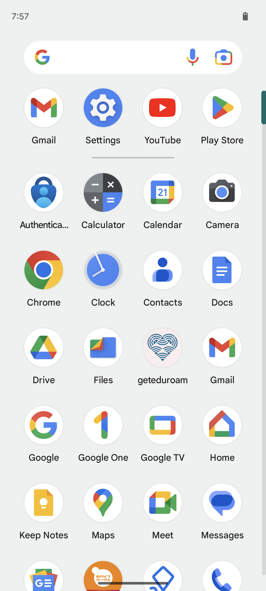
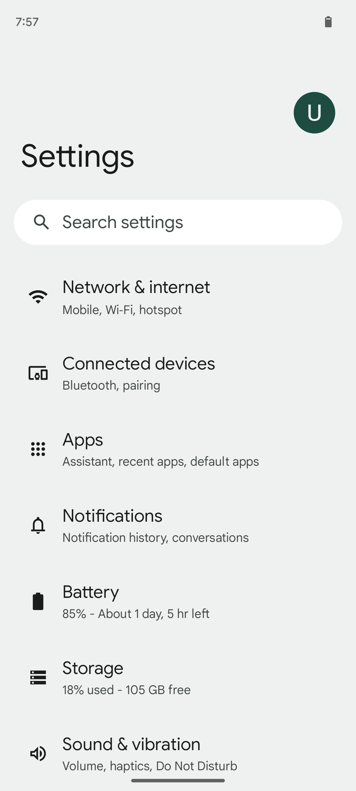
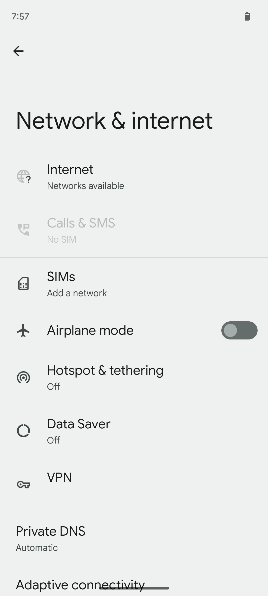
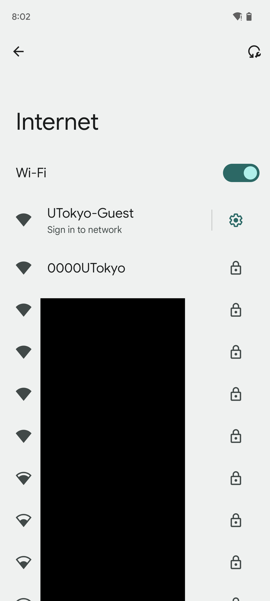
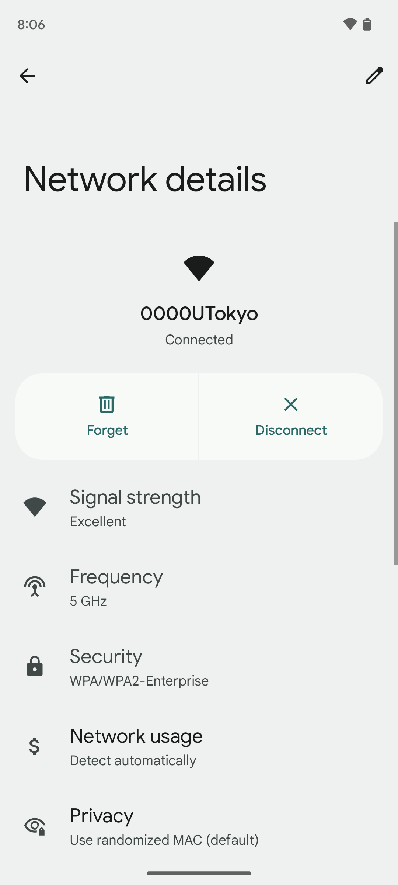
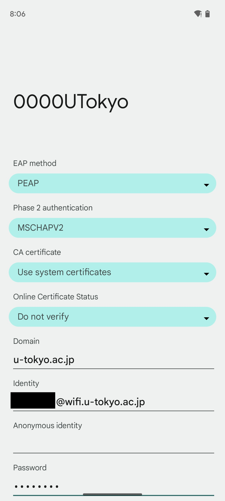

import Intro from "./_Intro.astro"
import IssueAccount from "./_IssueAccount.mdx"
import SelectSsid from "./_SelectSsid.astro"
import DeleteProfile from "./_DeleteProfile.astro"
import TroubleConnect from "./_TroubleConnect.mdx"

import Mfa100 from "./_Mfa100.mdx";

<Mfa100 />

<Intro kindOfTerminal="terminal of Android" confirmedTerminal="（Android 13 with Pixel 6a）"/>

## Preparation: Apply for the UTokyo Wi-Fi account
{:#issue-account}
<IssueAccount />

## Procedures on Android
{:#procedure}
### Step 1：Enable the Wi-Fi function from the “Setting” app of your device
{:#turn-on}
Find the setting item “Internet” from the “Network and Internet” menu in the setting app and turn on the Wi-Fi function.
Note that the names in the actual menu may vary depending on the specific model. Find the corresponding setting items from the proper category as needed. Likewise, in the following procedures, please read with proper replacement when necessary.
<figure class="gallery">{:.medium.center.border}{:.medium.center.border}{:.medium.center.border}{:.medium.center.border}</figure>

### Step 2: Select the SSID of connecting destination from the SSID list
{:#select-ssid}
<SelectSsid  userIdField="ID"/>

### Step 3: Delete the existing Wi-Fi setting information.
{:#delete-profile}
<DeleteProfile  userIdField="ID"/>
Tap the SSID found in Step 2 to open the screen of “network details”. Delete the setting information from the screen of network details.
{:.medium.center.border}

### Step4：Enter the required information and connect
{:#create-profile}
Select the SSID named `0000UTokyo` from the SSID list again.
The necessary Wi-Fi setting information will be displayed after you select the SSID . Follow the instruction below to enter the required setting information into each field. You don’t have to set those items that are not displayed here. Once you’ve entered the setting information, select the connection button.

| Field name      | Content    |
| :-----------: | :------------------- |
| EAP method       | Select “PEAP”      |
| Phase 2 Authentication      | Select “MSCHAPV2”        |
| Certificate authority       | 「Select “Use system certificate”             |
| Online Certificate Verification | Select “Do not verify” or “Request the certificate status”          |
| Domain        | Enter `u-tokyo.ac.jp`     |
| ID          | Enter the User ID of UTokyo Wi-Fi (Begin with “u” and end with “@wifi.u-tokyo.ac.jp`”) |
| Anonymous ID        | Leave it  empty          |
| Password       | Enter the password of UTokyo Wi-Fi      |
| Select “DHCP”        | Select “DHCP”      |

{:.medium.center.border}

#### Supplement
{:#create-profile-notes}
* If you cannot select “Use the system certificate” in the “CA certificate”, or it does not work even you selected it, try selecting “Trust on the first use” 
* Enter the User ID and password of the UTokyo account into the field of “ID” and “Password”. Note that they are not the UTokyo common ID and its password. You can check this User ID and password from the notification email of Step ”Preparation” or the screen of the account menu after your application.
* Please configure if there are necessary setting items other than mentioned above. If you have no particular preference, you can leave the default settings.

## Troubleshooting guide
{:#trouble-connect}
<TroubleConnect />
