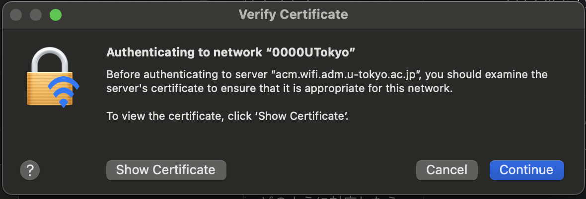

import TroubleConnect from "./_TroubleConnect.mdx"

We periodically renew the certificates for the UTokyo Wi-Fi authentication servers. During the renewal process and when connecting to UTokyo Wi-Fi for the first time after the renewal, there are some notes to be aware of, which we detail on this page.

Please note that the schedule for the renewal work will be announced on the “[System Failures and Maintenance Information](https://univtokyo.sharepoint.com/sites/utokyoaccount/SitePages/en/service-status.aspx)” page and other channels.

## During the Renewal Work
{:#in_progress}

You may be unable to access the “UTokyo Wi-Fi Account Menu” normally. Please try again later.

## After the Renewal
{:#after}

* During the connecting operation, a screen asking if you trust the certificate may appear. To verify whether the certificate is correct, compare the "server fingerprint" of the displayed certificate with the fingerprint listed in 「[Connect Configuration](/en/utokyo_wifi/#connect-configuration)」. If they match, trust the certificate.
    * There are two types of fingerprints (SHA-1 and SHA-256) listed on [Connect Configuration](/en/utokyo_wifi/#connect-configuration);matching one type will suffice
* Note that the displayed screens and behavior may vary depending on the OS or device types.
    {:.medium.center.border}
    <figure class="gallery">{:.medium.center.border}{:.medium.center.border}</figure>

## Troubleshooting guide
{:#trouble-connect}

{/* ### Androidで
eduroamCATも試してみてください．0000UTokyoのWi-Fi設定情報画面で，「CA証明書」の項目を「システム証明書を使用」，「証明書のオンライン検証」の項目を「検証しない」に変更するとうまくいくこともあるようです．*/}

<TroubleConnect />
