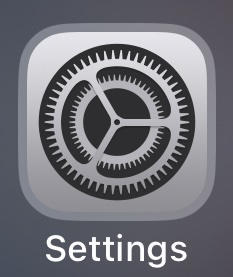
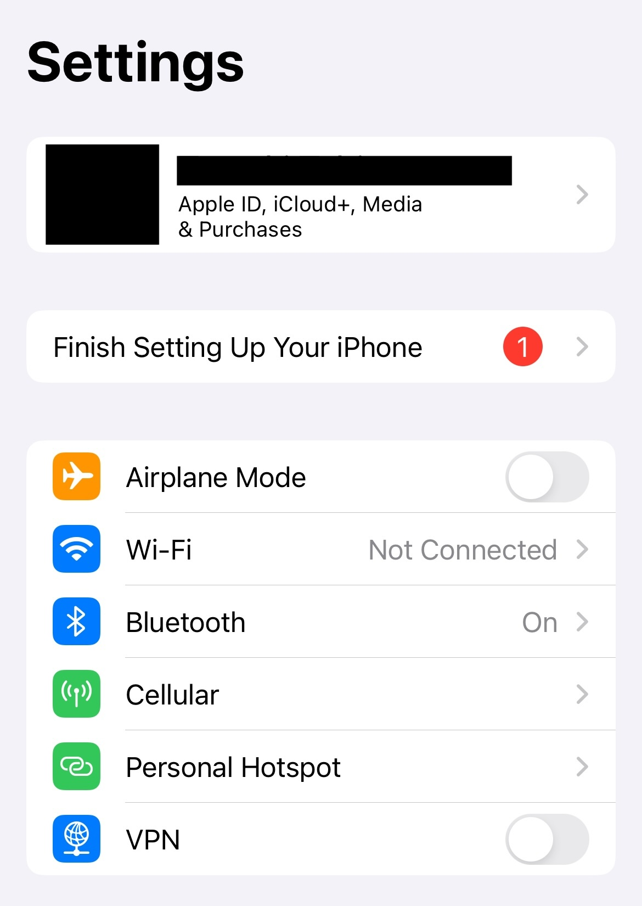
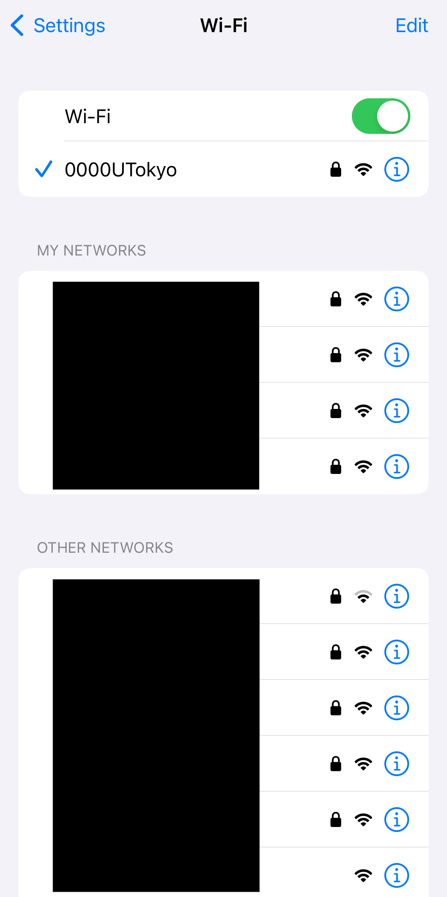
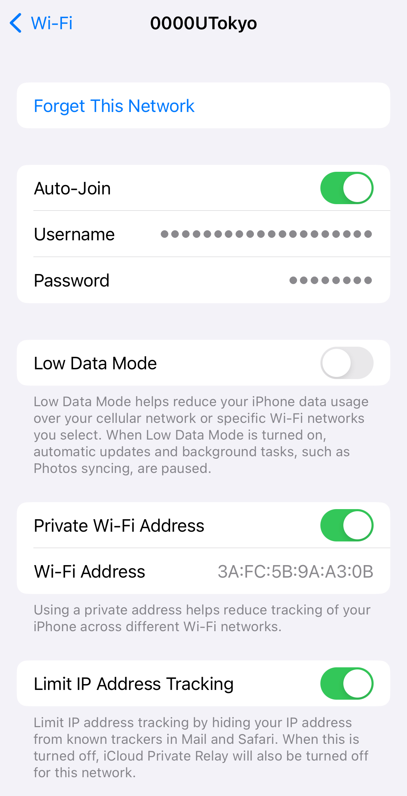
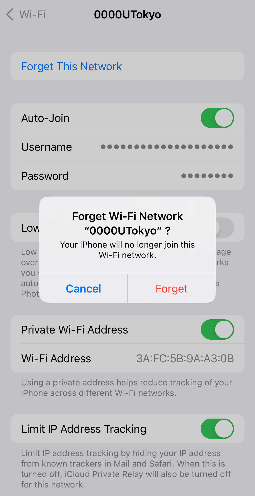
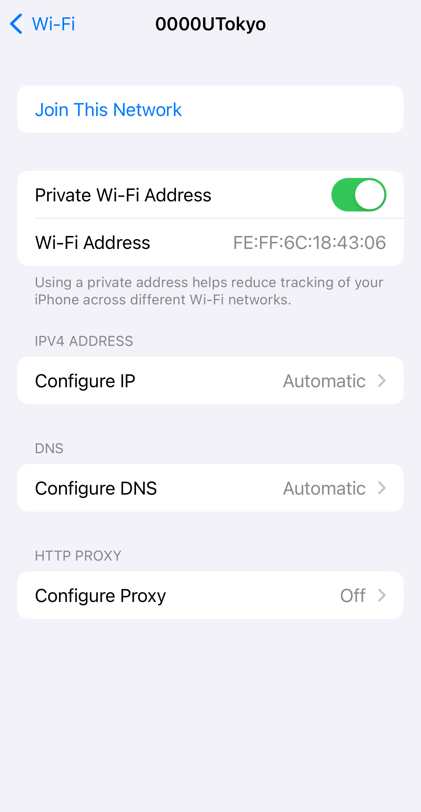
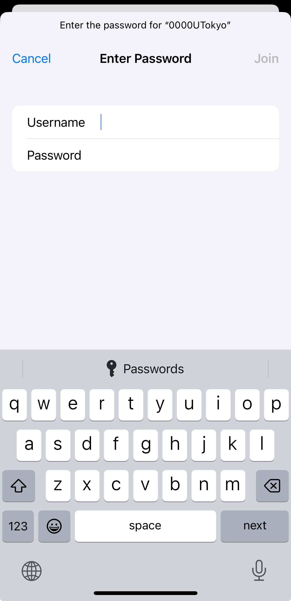

import Intro from "./_Intro.astro"
import IssueAccount from "./_IssueAccount.mdx"
import SelectSsid from "./_SelectSsid.astro"
import DeleteProfile from "./_DeleteProfile.astro"
import TroubleConnect from "./_TroubleConnect.mdx"

import Mfa100 from "./_Mfa100.mdx";

<Mfa100 />

<Intro kindOfTerminal="iPhones and iPads" confirmedTerminal="（iPhoneSE (2nd generation) with iOS 16.5））"/>

##  Preparation: Apply for the UTokyo Wi-Fi account
{:#issue-account}
<IssueAccount />

## Procedures on iPhone and iPad
{:#procedure}
### Step 1: Enable the Wi-Fi function in the “Settings” of your device
{:#turn-on}
Find “Wi-Fi” in Settings and turn on the toggle switch of the Wi-Fi function.
<figure class="gallery">{:.medium.center.border}{:.medium.center.border}{:.medium.center.border}</figure>

### Step 2: Select the SSID of connecting destination from the SSID list
{:#select-ssid}
<SelectSsid  userIdField="user-name"/>

### Step 3: Delete the existing Wi-Fi setting information.
{:#delete-profile}
<DeleteProfile  userIdField="user-name"/>
Tap the SSID found in Step 2, select “Delete this network setting”. When the screen saying “Forget Wi-Fi network “0000UTokyo”?” comes up, select “Forget”.
<figure class="gallery">{:.medium.center.border}{:.medium.center.border}</figure>

### Step 4: Enter the required information and connect
{:#create-profile}
Select the SSID named `0000UTokyo` from the SSID list again.
The necessary Wi-Fi setting information will be displayed after you select the SSID . Follow the instruction below to enter the required setting information into each field. You don’t have to set those items that are not displayed here. Once you’ve entered the setting information, select the connection button.

| Field name     | Content     |
| :-----------: | :------------------- |
| User name       | Enter the User ID of UTokyo Wi-Fi (Begin with “u” and end with “@wifi.u-tokyo.ac.jp`”) |
| Password       | Enter the password of UTokyo Wi-Fi     |

<figure class="gallery">{:.medium.center.border}{:.medium.center.border}</figure>

#### Supplement
{:#create-profile-notes}
* Enter the user ID and password for the UTokyo account into the fields of “User-name” and “Password”. Note that they are not the regular ID and password for the UTokyo Account. You can check the user ID and password in the notification email described in the ”**Preparation**” step or the screen of the completed application.
* If there are any setting items other than mentioned above, please configure them as needed. If you have no particular preferences, you can leave the default settings.
* During the connecting operation, a screen asking if you trust the certificate may appear. To verify whether the certificate is correct, compare the "server fingerprint" of the displayed certificate with the fingerprint listed in 「[Connect Configuration](/utokyo_wifi/#connect-configuration)」. If they match, trust the certificate.
    * In addition, there are two types of fingerprints (SHA-1 and SHA-256) listed on [Connect Configuration](/utokyo_wifi/#connect-configuration);matching one type will suffice

## Troubleshooting guide
{:#trouble-connect}
<TroubleConnect />
