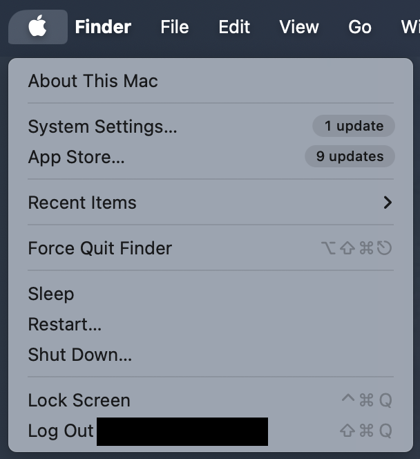
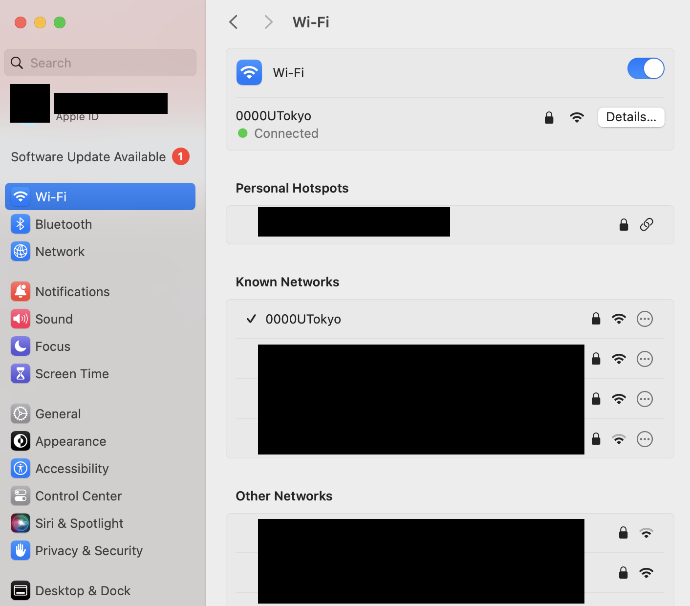
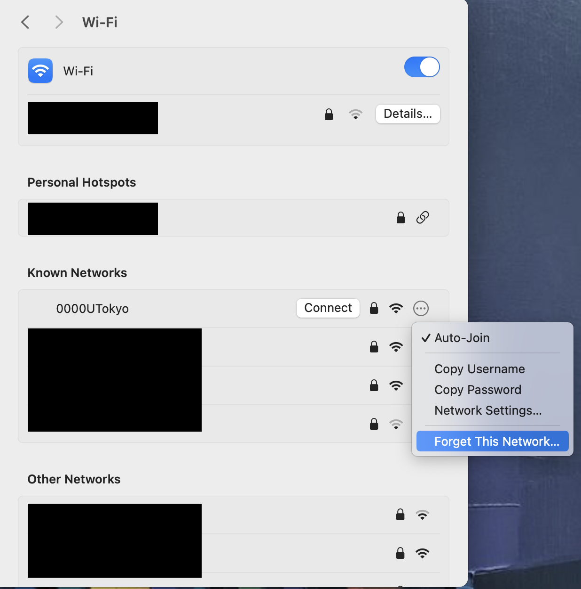
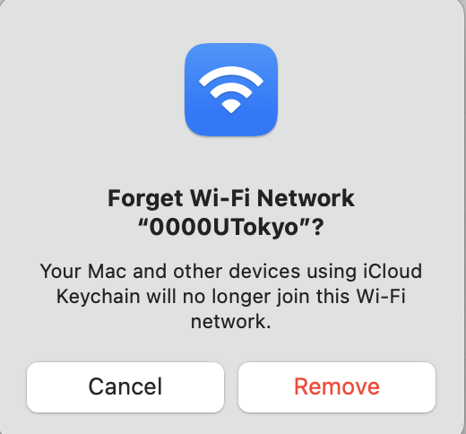
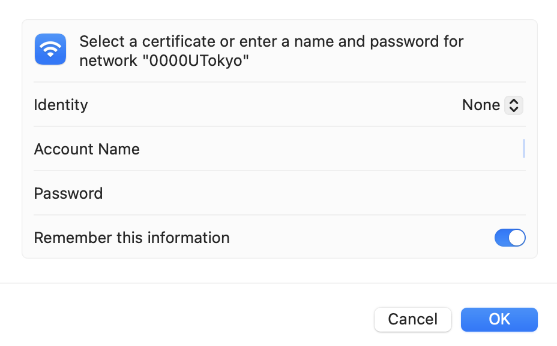
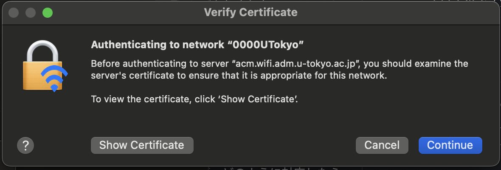

import Intro from "./_Intro.astro"
import IssueAccount from "./_IssueAccount.mdx"
import SelectSsid from "./_SelectSsid.astro"
import DeleteProfile from "./_DeleteProfile.astro"
import TroubleConnect from "./_TroubleConnect.mdx"

import Mfa100 from "./_Mfa100.mdx";

<Mfa100 />

<Intro kindOfTerminal="terminal with macOS 13 Ventura" confirmedTerminal="（MacBook Pro with macOS 13 Ventura）"/>

## Preparation: Apply for the UTokyo Wi-Fi account
{:#issue-account}
<IssueAccount />

## Procedures for macOS
{:#procedure}
### Step 1: Enable the Wi-Fi function from the taskbar
{:#turn-on}
To see the setting screen, select the “System Settings” from the Apple menu on the left side of the toolbar. Select “Wi-Fi” in the side bar and turn on the toggle switch to enable the Wi-Fi function.

Please note that if the OS version is macOS 12 Monterey or earlier, instead of “System Settings”, “System Preference” will be displayed. The following procedures may vary slightly in different situations, please read the content and procedures for the respective OS version.
<figure class="gallery">{:.medium.center.border}{:.medium.center.border}</figure>

### Step 2: Select the SSID of connecting destination from the SSID list
{:#select-ssid}
<SelectSsid  userIdField="account name"/>

### Step 3: Delete the existing Wi-Fi setting information.
{:#delete-profile}
<DeleteProfile  userIdField="Account name"/>
Select the SSID found in Step 2 and then select “Forget This Network” on the displayed screen.  When a screen asking “Remove Wi‑Fi “0000UTokyo”?” appears, select “Remove”.
<figure class="gallery">{:.medium.center.border}{:.medium.center.border}</figure>

### Step 4: Enter the required information and connect
{:#create-profile}
The screen of the Wi-Fi settings will be displayed after you select the SSID. To enter the required setting information into each field, follow the instructions below. You do not have to set those settings that are not displayed here. Once you’ve entered the setting information, select the connection button.

| Field name    | Content     |
| :-----------: | :------------------- |
| ID            | Select “None”      |
| Account name       | Enter the User ID for the UTokyo Wi-Fi (begin with a “u” and end with “@wifi.u-tokyo.ac.jp`”) |
| Password      | Enter the password for the UTokyo Wi-Fi      |
{:.medium.center.border}

#### Supplement
{:#create-profile-notes}
* Enter the user ID and password for the UTokyo account into the fields of “Account name” and “Password”. Note that they are not the regular ID and password for the UTokyo Account. You can check the user ID and password in the notification email described in the ”**Preparation**” step or the screen of the completed application.
* If there are any setting items other than mentioned above, please configure them as needed. If you have no particular preferences, you can leave the default settings.
* During the connecting operation, a screen asking if you trust the certificate may appear. To verify whether the certificate is correct, compare the "server fingerprint" of the displayed certificate with the fingerprint listed in 「[Connect Configuration](/utokyo_wifi/#connect-configuration)」. If they match, trust the certificate.
    * In addition, there are two types of fingerprints (SHA-1 and SHA-256) listed on [Connect Configuration](/utokyo_wifi/#connect-configuration);matching one type will suffice. {:.medium.center.border}

## Troubleshooting guide
{:#trouble-connect}
<TroubleConnect />
