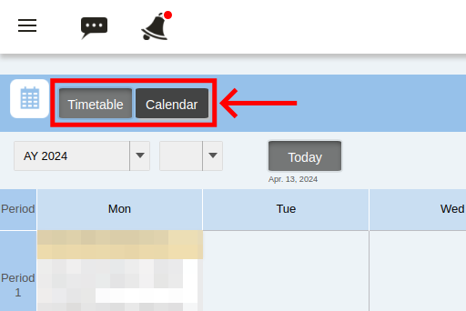

import If from "@components/utils/If.astro"

{/**
  * @typedef {object} Props
  * @property {"lecturer" | "student"} variant
  */}

After logging in, you can check the courses you have registered for as a course instructor, TA, or enrolled student on the top page of UTOL.

You can also access this screen by clicking the UTOL logo in the left menu (the menu on the left-hand side when you press {:.icon} in the top-left corner) or by clicking the "Timetable" button.

Courses can be displayed in a timetable or calendar format. You can switch between the two using the buttons at the top of the screen.

<If cond={props.variant !== "lecturer"}>

Courses for which the contents use is limited to course registration or course instructor registration will not be displayed unless the conditions for the content use are met even if the student has registered for the course. For this reason, courses that were previously displayed may no longer be displayed if the course registration deadline has passed or the conditions have changed due to a change in the settings.

For information on the conditions for using the contents, please refer to "[Notes on course registration](/utol/students/course_registration/#caution){/*TODO: リンク先確認*/}".

</If>

### Timetable
{:#timetable}

<If cond={props.variant === "lecturer"}>

</If>
<If cond={props.variant !== "lecturer"}>

</If>

- Displaying term
  - You can view courses for the previous year or term by switching between "Academic Year" and "Term" at the top of the screen.
  - Clicking the "Today" button will display the timetable for the current term.
- Class sessions: Click on the course name to move to the course top page (course details screen). 
  <ul>
    <li>
      How to participate: Your level of authorization as a course instructor, course designer, TA, or enrolled student and how to register will be displayed.
    </li>
    <If cond={props.variant !== "student"}>
      <li>
        {:.icon} (List of participants): this list will be displayed when you are registered as a faculty member, and the list of participants can be downloaded by clicking on the icon.
      </li>
    </If>
  </ul>
- Class cancellations / make-up classes / classroom changes information
    - Information on canceled classes, etc., linked from UTAS is displayed.
    - As the link to UTAS is made only once a day, any registrations or cancellations made on the same day will not be reflected.

### Calendar
{:#calendar}

- Period being displayed
  - You can change the period displayed by switching between "Year", "Month" and "Week" at the top of the screen.
    - Information for a "Week" will only be displayed if you set the display to show weeks.
  - Courses before W term 2023 are not displayed.
- Weekly view / Monthly view
  - You can switch to the weekly or monthly view by pressing the "Week" or "Month" button.
- Class sessions: Click the course name to go to the top of the course.
  - Class cancellations / make-up classes / classroom changes information
    - Information on canceled classes, etc., linked from UTAS is displayed.
    - Click the text section to move to the corresponding screen on UTAS to view the details.
    - As the link to UTAS is made only once a day, any registrations or cancellations made on the same day will not be reflected.
