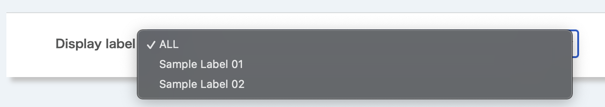
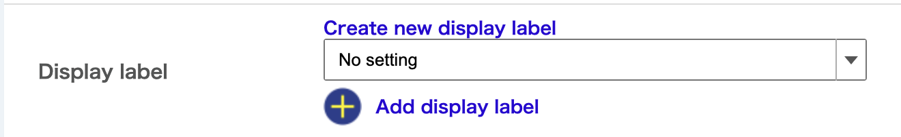

**Display label**: You can assign labels to classify.
- When the label is assigned, the following drop-down list will appear on the "Course Top" screen, allowing both enrolled students and course instructors to display content by a label.
  
- Select the label you wish to assign from the drop-down list to assign the label.
  
  - If you have not yet created labels, click on "Create new display label", and enter the title for the label.
  - If you wish to assign multiple labels, select another drop-down list displayed after clicking "Add display label".
