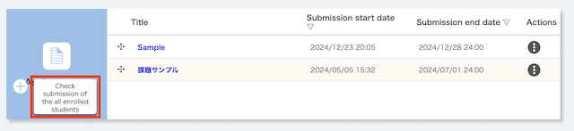
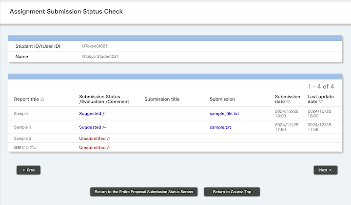
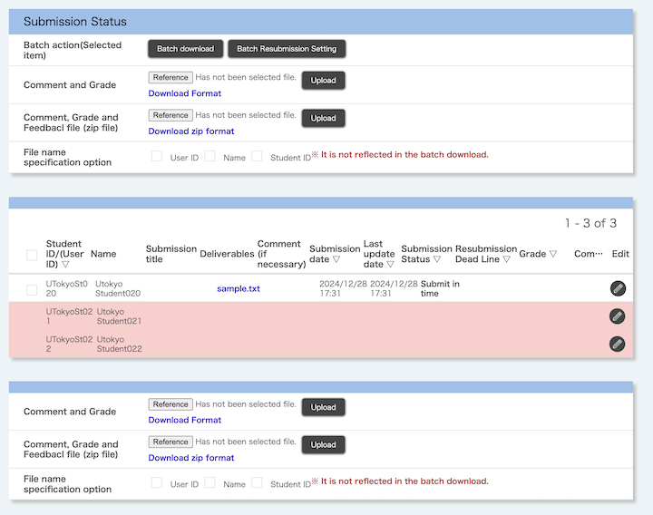

import DisplayLabel from '../_displaylabel/DisplayLabel.mdx';

## Overview

The assignment function allows you to provide assignments to enrolled students on UTOL and grade their submissions. You can set a specific deadline, and the submission date as well as the time can be recorded.  In addition, you can configure whether or not late submissions are allowed and whether or not students can view each other's submissions.

There are two ways to submit assignments: "Text directly input" and "Upload File".

- Text directly input
  - Enrolled students submit assignments by entering text directly on UTOL.
  - It is suitable for assignments with short text, such as comments or reaction papers.
- Upload File
  - Enrolled students submit assignments by uploading deliverables (PDF files, etc.) from their terminals.
  - It is suitable for assignments with a certain amount of content and structure, such as presentation slides and reports, or assignments including content other than text.
  - The file size limit is up to 100MB.

以下では，「課題の管理」「課題の提出状況確認」「課題の評価」の三点に分けて説明します．このうち，「課題の提出状況確認」は二通りの確認方法（「すべての課題の提出状況を確認する」「個別の課題の提出状況を確認する」）に分かれます．

In addition, course instructors, TAs and course designers can manage the assignments. However, only course instructors and TAs can grade the assignments.

## 課題を管理する

ここでは，課題の管理（登録・編集・削除）の手順を説明します．

### Items to set up assignments
{:#setting-entries}

First, the following is a list of items that can be configured for the assignment. (The explanation will be divided into two images.)

{:.center}

- **Title** (Required)
  - e.g.: "Comment on the First Lecture", "Final Report"
- **Contents**
  - Enter the description of the assignment.
- **Attachments**
  - Attach any files that may be useful for the assignment, etc.
  - You can attach up to three files, each with a maximum size of 100MB.

{:.center}

- **Submission Period** (Required)
  - e.g.: From the start of the class to the start of the next class
  - If you are OK with allowing submission to start immediately, leave the start time as it is, and do not change it.
- **Submission method** (Required)
  - Select the submission method("Upload File", "Text directly input").
- **Late submission** (Required)
  - Specify whether or not enrolled students can submit assignments after the end of the submission period.
  - It is safer to leave the setting as "Enable", as the load will be concentrated on UTOL after the end of the submission period, and there is a possibility of arising problems such as submission failure.
  - You can later check whether the assignments were submitted within the submission period. This allows you to accept late submissions while deducting points as necessary.
- **Reference of grade** (Required)
  - Specify whether or not enrolled students can access grades for assignments.
    - 関連：
      - [課題を評価する](#evaluate)
- **Cross-Reference of submissions**
  - If you set this option as "Enable", the enrolled students will be able to access each other's submissions.
  - For example, when an enrolled student gives a presentation in class, it would be helpful if other enrolled students could access the submitted handout or slides, thus ensuring that the class proceeds smoothly.
- <DisplayLabel />
  - Reference:
    - [Configuring Course Settings in UTokyo LMS (UTOL, for Course Instructors/TAs) > Labels](../settings/#label)
- **Published target**
  - Select the published target for assignments. You can select one of the following three options.
    - "All Enrolled Students"
    - "Selected user group"
      - You can publish to specific user groups created in advance.
      - Reference:
        - [Using user group function in UTOL (for Course Instructors / TAs)](../settings/user_groups/)
      - You can check the enrolled students belonging to the user group by clicking on the group name.
    - "Select Students"
      - You can select specific enrolled students for publication.
      - After displaying a list of enrolled students, tick the enrolled students' names you wish to publish to.

### Registering Assignments
{:#register}

1. Open the course top screen, and click the {:.icon} button located beneath the left side of "Assignments".
   {:.center}
2. When the "Assignment Register a new assignment" screen opens, please enter the [Items to set up assignments](#setting-entries) shown above.
3. Click on the "Confirm" button when you have finished.
4. When the "Assignment Confirm of registration" screen opens, please check the contents.
   - Please pay special attention to the settings for "Submission Period", "Submission method", and "Late submission".
   - If you click the "Submission Preview" button, you can see how the assignment will appear when the enrolled students view it.
     {:.center}
5. Click on the "Register" button once you have finished checking.

### 課題を編集する

1. コーストップを開き，「課題」欄のうち，編集したい課題名を押してください．
   {:.center}
2. 編集画面が開くので，[課題の登録手順](#register)と同様に内容を編集してください．

### 課題を削除する

1. コーストップを開き，「課題」欄のうち，削除したい課題名の右，「操作」の列にある {:.icon} ボタンを押してください．
   {:.center}
2. 「削除」ボタンを押してください．
3. 「（課題名）を削除して宜しいですか？」と確認されるので，「削除」を押してください．

## すべての課題の提出状況を確認する
{:#submission-status-all}

ここでは，授業全体を通じた，すべての課題の提出状況を確認する手順を説明します．

1. コーストップを開き，「課題」の左下にある「全履修者の提出物確認」ボタンを押してください．
   {:.center}
2. 「課題 全体提出状況確認」の画面が開くので，以下の二通りの確認方法に応じて操作してください．
   - [すべての履修者について確認する](#submission-status-all-user)
   - [履修者ごとに確認する](#submission-status-per-user)

### すべての履修者について確認する
{:#submission-status-all-user}

「課題 全体提出状況確認」では，すべての課題の提出状況を，すべての履修者について示した一覧表が表示されます（以下，「一覧表」と呼称します）．

{:.center}

#### 並べ替えて表示する

一覧表の列の見出し（「学生証番号/(ユーザID)」，「氏名」など）を押すと，それぞれの項目ごとに昇順・降順が切り替わります．

#### 提出状況をダウンロードする

提出状況をExcelファイル形式でダウンロードすることもできます（なお，ファイルにはパスワードの設定が必須です）．

1. 一覧表のうち，提出状況を知りたい履修者のチェックボックスを選択してください．
   - 全員選択：「学生証番号/(ユーザID)」という見出しの左にあるチェックボックス
   - 個別の履修者を選択：当該履修者の学生証番号の左にあるチェックボックス
2. 「一括ダウンロード」ボタンを押してください．
3. Excelファイルのパスワードを設定するよう求められるので，任意のパスワードを決めて入力し，もう一度「ダウンロード」ボタンを押してください．
4. Excelファイル（`.xlsx` 形式）を含むZIPファイル（`.zip` 形式）がダウンロードされます．

#### 課題の評価画面へ移動する
{:#go-to-evaluate-1}

「提出状況/評価」の列にて，それぞれの提出物（青字）を押すと，[UTOL上で課題を評価する](#evaluate-on-utol)画面へ遷移します．

### 履修者ごとに確認する
{:#submission-status-per-user}

さらに絞り込んで，すべての課題の提出状況を，履修者ごとに確認することもできます．

1. 「課題 全体提出状況確認」の画面で，対象の履修者の「学生証番号/(ユーザID)」（青文字）を押してください．
2. 「課題 提出状況確認」の画面が開き，履修者ごとの全課題の提出状況が表示されます．

{:.center}

#### 履修者間を移動する

画面左下の「前へ」ボタン，または右下の「次へ」ボタンを押すと，前／次の履修者に移動できます．

#### 課題の評価画面へ移動する
{:#go-to-evaluate-2}

「提出状況/評価」の列にて，それぞれの提出物（青字）を押すと，[UTOL上で課題を評価する](#evaluate-on-utol)画面へ遷移します．

## 個別の課題の提出状況を確認する
{:#submission-status-per-assignment}

ここでは，個別の課題について，全履修者の提出状況を確認する手順を説明します．

1. コーストップを開き，「課題」の欄のうち，確認したい課題名の右，「操作」の列にある {:.icon} ボタンを押してください．
   {:.center}
2. 「提出状況確認」を選択してください．
3. 「課題 提出状況確認」の画面が開き，全員の提出状況の一覧が表示されます．

{:.center}

### 提出状況をダウンロードする

提出状況をExcelファイル形式でダウンロードすることもできます（なお，ファイルにはパスワードの設定が必須です）．

1. 一覧表のうち，提出状況を知りたい履修者のチェックボックスを選択してください．
   - 全員選択：「学生証番号/(ユーザID)」という見出しの左にあるチェックボックス
   - 個別の履修者を選択：当該履修者の学生証番号の左にあるチェックボックス
2. 「提出状況」の欄のうち，「一括操作（選択項目）」の「一括ダウンロード」ボタンを押してください．
3. Excelファイルのパスワードを設定するよう求められるので，任意のパスワードを決めて入力し，もう一度「ダウンロード」ボタンを押してください．
4. Excelファイル（`.xlsx` 形式）を含むZIPファイル（`.zip` 形式）がダウンロードされます．

### 課題の評価画面へ移動する
{:#go-to-evaluate-3}

一覧表のうち，評価したい履修者の行の右端，「編集」の列にある {:.icon} ボタンを押すと，[UTOL上で課題を評価する](#evaluate-on-utol)画面へ遷移します．

## 課題を評価する
{:#evaluate}

ここでは，課題を評価する手順を説明します．

評価には以下の二種類があり，いずれの要素も任意です．

- 「評価」
  - 課題に対する簡潔な評価です．
  - テキスト形式で，最大255文字まで記載できます．
- 「フィードバックコメント」
  - 「コメント」および「フィードバックファイル」から構成されます．
  - 「コメント」
    - 課題に対する詳細なフィードバックです．
    - テキスト形式で，最大1300文字まで記載できます．
  - 「フィードバックファイル」
    - テキスト以外の形式でのフィードバックです．
      - 例：指摘点をまとめたPDFファイル

さらに，評価を行う方法として，「UTOL上で評価する」または「フォーマットをダウンロードして評価する」の二通りがあります．両者には以下のような違いがあります．

- [UTOL上で評価する](#evaluate-on-utol)
  - UTOL上の操作によって評価作業を行います．
  - ブラウザ上ですべての作業が完結するため，簡単です．ただし，履修者一人ごとに評価を行う必要があります．
- [フォーマットをダウンロードして評価する](#evaluate-with-format)
  - Excelファイル（`.xlsx` 形式）またはZIPファイル（`.zip` 形式）のフォーマットファイルをダウンロードし，そこに評価を記入します．記入後，ファイルをアップロードするとUTOLがそれを読み取り，評価が反映されます．
  - 全履修者を一括で評価できるため，履修者が多い場合などに便利です．ただし，作業に慣れが必要です．
  - なお，ダウンロードしたフォーマットファイルにはパスワードの設定が必須となります．

### UTOL上で評価する
{:#evaluate-on-utol}

1. 以下のいずれかの方法で，課題の評価画面に移動してください．
   - 「[すべての課題の提出状況を確認する](#submission-status-all)」のうち
     - [「課題 全体提出状況確認」画面（すべての履修者について確認）から遷移する](#go-to-evaluate-1)
     - [「課題 提出状況確認」画面（履修者ごとに確認）から遷移する](#go-to-evaluate-2)
   - 「[個別の課題の提出状況を確認する](#submission-status-per-assignment)」のうち
     - [「課題 提出状況確認」画面から遷移する](#go-to-evaluate-3)
2. 「課題 フィードバック登録/編集」の画面が開くので，「評価」「フィードバックコメント」「フィードバックファイル」を追加し，「登録する」を押してください．
   {:.center}
3. 画面左下の「前へ」ボタン，または右下の「次へ」ボタンを押すと，前／次の履修者の評価に移れます．

### フォーマットをダウンロードして評価する
{:#evaluate-with-format}

1. [「個別の課題の提出状況を確認する」画面](#submission-status-per-assignment)を開きます．
2. 「提出状況」の欄からフォーマットをダウンロードしてください．「フィードバックファイル」の添付の有無に応じて，ダウンロードするファイルが異なります．

- 「フィードバックファイル」が不要の場合（「評価」と「フィードバックコメント」いずれもテキストのみでよい場合）
  1. 「コメントと評価」の行にある，「フォーマットダウンロード」ボタン（青字）を押してください．
  2. Excelファイルのパスワードを設定するよう求められるので，任意のパスワードを決めて入力し，もう一度「ダウンロード」ボタンを押してください．
  3. Excelファイル（`.xlsx` 形式）のフォーマットがダウンロードされます．
- 「フィードバックファイル」を添付したい場合
  1. 「コメントと評価およびフィードバックファイル(zipファイル)」の行にある，「zipフォーマットダウンロード」ボタン（青字）を押してください．
  2. ZIPファイルのパスワードを設定するよう求められるので，任意のパスワードを決めて入力し，もう一度「ダウンロード」ボタンを押してください．
  3. ZIPファイル（`.zip` 形式）のフォーマットがダウンロードされます．

ダウンロードしたフォーマットの形式に応じて，以下の手順で評価を記入・アップロードしてください．

#### Excelファイルの場合

1. ダウンロードしたExcelファイル（`.xlsx` 形式）を開いてください．
2. 「評価」「コメント」の項目を記入し，保存してください．
   - このとき，ファイル名は変更しないでください．
3. [「個別の課題の提出状況を確認する」画面](#submission-status-per-assignment)に戻ってください．
4. 「提出状況」の欄のうち，「コメントと評価」の行にある「参照」ボタンを押し，先ほど記入したExcelファイルを選択してください．
5. 「アップロード」ボタンを押してください．

#### ZIPファイルの場合

1. ダウンロードしたZIPファイル（`.zip` 形式）を解凍し，解凍先のフォルダ内にあるExcelファイル（`.xlsx` 形式）を開いてください．
2. 「評価」「コメント」の項目を記入し，保存してください．
   - このとき，ファイル名は変更しないでください．
3. フィードバックファイルを，解凍先のフォルダ内にある「フィードバック」フォルダの中に入れ，そのファイル名を「ファイル」の欄に記入してください．
   - 例：履修者Aへのフィードバックファイルが 「`フィードバック_A.pdf`」だった場合，「`フィードバック_A.pdf`」を「フィードバック」フォルダに入れ，履修者Aの行の「ファイル」欄に「`フィードバック_A.pdf`」と記入
4. すべての記入を終えたら，お使いのOSのファイルマネージャ（Windowsであれば「エクスプローラー」，Macであれば「Finder」）を開き，解凍先のフォルダ内にあるすべてのファイル・フォルダを選択してください．
5. 選択したファイルを再び圧縮し，ZIPファイルを作成してください．
   - 解凍・圧縮にあたっては，トラブルを避けるため，OSのファイルマネージャ付属の標準ツールを使うことをおすすめします．
6. [「個別の課題の提出状況を確認する」画面](#submission-status-per-assignment)に戻ってください．
7. 「提出状況」の欄のうち，「コメントと評価およびフィードバックファイル(zipファイル)」の行にある「参照」ボタンを押し，先ほど圧縮したZIPファイルを選択してください．
8. 「アップロード」ボタンを押してください．

## 参考情報

- [UTOLでコース設定を行う（教員・TA向け） - ラベル](/utol/lecturers/settings/#label)
- [UTOLでユーザグループ機能を利用する（教員・TA向け）](/utol/lecturers/settings/user_groups/)
