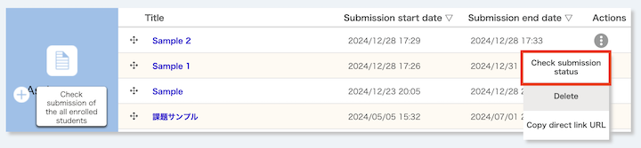

import DisplayLabel from '../_displaylabel/DisplayLabel.mdx';

## Overview

The assignment function allows you to provide assignments to enrolled students on UTOL and grade their submissions. You can set a specific deadline, and the submission date as well as the time can be recorded. In addition, you can configure whether or not late submissions are allowed and whether or not students can view each other's submissions.

There are two ways to submit assignments: "Text directly input" and "Upload File".

- Text directly input
  - Enrolled students submit assignments by entering text directly on UTOL.
  - It is suitable for assignments with short text, such as comments or reaction papers.
- Upload File
  - Enrolled students submit assignments by uploading deliverables (PDF files, etc.) from their terminals.
  - It is suitable for assignments with a certain amount of content and structure, such as presentation slides and reports, or assignments including contents other than text.
  - The file size limit is up to 100MB.

The following section covers three topics: "Managing Assignments", "Checking the Submission Status of Assignments", and "Evaluating Assignments". There are two ways about "Checking the Submission Status of Assignments": "Checking the Submission Status of All Assignments" and "Checking the Submission Status of Each Assignment".

In addition, course instructors, TAs and course designers can manage the assignments. However, only course instructors and TAs can grade the assignments.

## Managing Assignments

This section provides steps for managing assignments (registering, editing and deleting).

### Settings for Assignments
{:#setting-entries}

First, the following is a list of items that can be configured for the assignment. (The explanation will be divided into two images.)

{:.center}

- **Title** (Required)
  - e.g.: "Comment on the First Lecture", "Final Report"
- **Contents**
  - Enter the description of the assignment.
- **Attachments**
  - Attach any files that may be useful for the assignment, etc.
  - You can attach up to three files, each with a maximum size of 100MB.

{:.center}

- **Submission Period** (Required)
  - e.g.: From the start of the class to the start of the next class
  - If you are OK with allowing submission to start immediately, leave the start time as it is, and do not change it.
- **Submission method** (Required)
  - Select the submission method ("Upload File", "Text directly input").
- **Late submission** (Required)
  - Specify whether or not enrolled students can submit assignments after the end of the submission period.
  - It is safer to leave the setting as "Enable", as the load will be concentrated on UTOL near the end of the submission period, and there is a possibility of arising problems such as submission failure.
  - You can later check whether the assignments were submitted within the submission period. This allows you to accept late submissions while deducting points as necessary.
- **Reference of grade** (Required)
  - Specify whether or not enrolled students can access grades for assignments.
    - Reference:
      - [Evaluating Assignments](#evaluate)
- **Cross-Reference of submissions**
  - If you set this option as "Enable", the enrolled students will be able to access each other's submissions.
  - For example, when an enrolled student gives a presentation in class, it would be helpful if other enrolled students could access the submitted handout or slides, thus ensuring that the class proceeds smoothly.
- <DisplayLabel />
  - Reference:
    - [Configuring Course Settings in UTokyo LMS (UTOL, for Course Instructors/TAs) > Labels](../settings/#label)
- **Published target**
  - Select the published target for assignments. You can select one of the following three options.
    - "All Enrolled Students"
    - "Selected user group"
      - You can publish to specific user groups created in advance.
      - Reference:
        - [Using user group function in UTOL (for Course Instructors / TAs)](../settings/user_groups/)
      - You can check the enrolled students belonging to the user group by clicking on the group name.
    - "Select Students"
      - You can select specific enrolled students for publication.
      - After displaying a list of enrolled students, tick the enrolled students' names you wish to publish to.

### Registering Assignments
{:#register}

1. Open the course top screen, and click the {:.icon} button located beneath the left side of "Assignments".
   {:.center}
2. When the "Assignment Register a new assignment" screen opens, please enter the [items to set up assignments](#setting-entries) shown above.
3. Click on the "Confirm" button when you have finished.
4. When the "Assignment Confirm of registration" screen opens, please check the contents.
   - Please pay special attention to the settings for "Submission Period", "Submission method", and "Late submission".
   - If you click the "Submission Preview" button, you can see how the assignment will appear when the enrolled students view it.
     {:.center}
5. Click on the "Register" button once you have finished checking.

### Editing Assignments

1. Open the course top screen and click on an assignment title you wish to edit in the "assignment" field.
   {:.center}
2. When the "Edit Assignment" screen opens, please edit the contents in the same way as for the [registering assignments](#register) procedures.

### Deleting Assignment

1. Open the course top screen and click on the {:.icon} button on the "Actions" field on the right side of the assignment title you wish to delete.
   {:.center}
2. Click on the "Delete" button.
3. You will be asked "Are you sure you wish to delete the (assignment title)?", then, please click "Delete" again.

## Checking the Submission Status of All Assignments
{:#submission-status-all}

This section provides procedures for checking the submission status of all assignments throughout the whole class.

1. Open the course top screen and click on the "Check submission of the all enrolled students" button found at the bottom left of the "Assignment".
   {:.center}
2. When the "Assignment Confirmation of overall submission status" screen opens, please proceed according to the following two methods of checking.
   - [Checking for All Enrolled Students](#submission-status-all-user)
   - [Checking per Each Enrolled Student](#submission-status-per-user)

### Checking for All Enrolled Students
{:#submission-status-all-user}

In the "Assignment Confirmation of overall submission status" screen, a list displaying the submission status of all assignments by all enrolled students is shown (hereinafter referred to as "the list").

{:.center}

#### Displaying in Sorted Order

When you click on the column headers in the list (e.g., "Student ID/(User ID)", "Name"), each item will toggle between ascending and descending orders.

#### Downloading Submission Status

You can download the submission status in Excel file format (please note that the file requires a password setting).

1. Select the checkbox of the enrolled student in the list whose submission status you would like to know.
   - Select all enrolled students: Checkbox on the left side of the heading "Student ID/(User ID)"
   - Select individual enrolled students: Checkbox on the left side of the relevant enrolled student's ID
2. Click on the "Bulk download" button.
3. When you are asked to set up a password for the Excel file, enter any password, and click on the "Download" button again.
4. A file in ZIP format (`.zip` format) enclosing the file in Excel format (`.xlsx` format) will be downloaded.

#### Going to the Screen for Assignment Evaluation
{:#go-to-evaluate-1}

When you click on each assignment (in blue text) in the "Submission Status /Evaluation /Comment" field, the screen for [evaluating on UTOL](#evaluate-on-utol) will be displayed.

### Checking per Each Enrolled Student
{:#submission-status-per-user}

You can narrow down further to check the submission status of all assignments made by each enrolled student.

1. Click on the "Student ID/(User ID)" (in blue text) of the target enrolled student, in the "Assignment Confirmation of overall submission status" screen.
2. The "Assignment Submission Status Check" screen will open, and the submission status of all assignments by each enrolled student will be displayed.

{:.center}

#### Moving Between the Enrolled Students

When you click the "Prev" button located at the bottom left of the screen, or the "Next" button at the bottom right, you can move to the previous/next enrolled student.

#### Going to the Screen for Assignment Evaluation
{:#go-to-evaluate-2}

When you click on each assignment (in blue text) in the "Submission Status /Evaluation /Comment" field, the screen for [evaluating on UTOL](#evaluate-on-utol) will be displayed.

## Checking the Submission Status of Each Assignment
{:#submission-status-per-assignment}

This section provides procedures for checking the submission status of each assignment for all enrolled students.

1. Open the course top screen and click the {:.icon} button on the right side of the assignment title you wish to check.
2. Select "Check submission status".
   {:.center}
3. The "Assignment Check assignment submission status" screen opens and the list of submission statuses for all enrolled students is shown. 
   {:.center}

### Downloading Submission Status

You can download the submission status in Excel file format (setting a password is required for the file).

1. Select the checkbox of the enrolled student in the list whose submission status you would like to know.
   - Select all enrolled students: Checkbox on the left side of the heading "Student ID/(User ID)"
   - Select individual enrolled students: checkbox on the left side of the target enrolled student's Student ID
2. Click on the "Batch download" button of the "Batch action (Selected Item)" row in the "Submission Status" field.
3. When you are asked to set up a password for the Excel file, enter any password, and click on the "Download" button again.
4. A ZIP file (`.zip` format), enclosing the Excel file (`.xlsx` format), will be downloaded.

### Going to the Screen for Assignment Evaluation
{:#go-to-evaluate-3}

In the list, click on the {:.icon} button in the "Edit" field on the right of the column for the enrolled students you would like to evaluate. This will open the screen for [Evaluating on UTOL](#evaluate-on-utol).

## Evaluating Assignments
{:#evaluate}

This section provides procedures for evaluating assignments. There are two kinds of optional evaluating as follows.

- "Grade"
  - This is a simple evaluation of assignments.
  - In text format, and up to 255 characters can be entered.
- "Feedback Comments"
  - This consists of "Comment" and "Feedback file".
  - "Comment"
    - This is detailed feedback on an assignment.
    - In text format, and up to 1300 characters can be entered.
  - "Feedback file"
    - This is feedback in a format other than text.
      - Example: PDF file summarizing the issues

Please note that once an instructor has graded or added comments to an assignment file submitted by a student, the student will no longer be able to delete that submission. Therefore, when requesting a resubmission, please either instruct the student to rename the file before re-uploading it, or delete the existing file yourself to allow the student to resubmit it using the same filename.

There are two methods of evaluating, "Evaluating on UTOL", or "Evaluating by downloading the format". They have the following differences.

- [Evaluating on UTOL](#evaluate-on-utol)
  - Evaluating is done by operating UTOL.
  - All tasks are completed within the browser, making it simple. However, evaluating must be done individually for each enrolled student.
- [Evaluating by downloading the format](#evaluate-with-format)
  - Download a formatted Excel file (`.xlsx` format) or ZIP file (`.zip` format) and enter the evaluations there. After uploading the file, UTOL will read it and apply the evaluations.
  - This method is convenient if you have many enrolled students, as it allows for batch evaluation. However, it requires some getting used to working with it.
  - In addition, a password must be set for the formatted file after downloading.

### Evaluating on UTOL
{:#evaluate-on-utol}

1. Go to the screen for evaluating assignments using one of the following methods. 
   - From "[Checking the Submission Status of All Assignments](#submission-status-all)"
     - [Move from "Assignment Confirmation of overall submission status" screen (checking for all enrolled student)](#go-to-evaluate-1)
     - [Move from "Assignment Submission Status Check" screen (checking per each enrolled student)](#go-to-evaluate-2)
   - From "[Checking the Submission Status of Each Assignment](#submission-status-per-assignment)"
     - [Move from the "Assignment Check assignment submission status" screen](#go-to-evaluate-3)
2. After the "Register/Edit assignment feedback" screen opens, add "Grade", "Feedback comments" and upload the "Feedback file", followed by clicking the "Register" button.
   {:.center}
3. When you click the "Prev" button located at the bottom left of the screen, or the "Next" button at the bottom right, you can move on to evaluating the previous/next enrolled student.

### Evaluating by Downloading the Format
{:#evaluate-with-format}

1. Open the "[Checking the Submission Status of Each Assignment](#submission-status-per-assignment)" screen.
2. Download a format from the "Submission Status" field. The type of download file varies depending on whether a "Feedback file" is attached.

- If you don't need a "Feedback file" (both "Grade" and "Feedback comments" can be text only).
  1. Click on the "Download Format" button (in blue text) in the row of "Comment and Grade".
  2. When you are asked to set up a password for the Excel file, enter any password, and click on the "Download" button again.
  3. A file in Excel format (`.xlsx` format) will be downloaded.
- If you need to attach a "feedback file"
  1. Click on the "Download zip format" button (in blue text) in the row of "Comment, Grade and Feedback file (zip file)".
  2. When you are asked to set up a password for the ZIP file, enter any password, and click on the "Download" button again.
  3. A file in ZIP format (`zip` format) will be downloaded.

Enter and upload the evaluation according to the format of the downloaded file, following the steps below.

#### For Excel Files

1. Open the downloaded Excel file (`.xlsx` format).
2. Enter "Grade" and "Comment", then save the file.
   - Please do not change the file name at this time.
3. Move back to the "[Checking the Submission Status of Each Assignment](#submission-status-per-assignment)" screen.
4. Click on the "Reference" button in the row of "Comments and Grade" in the "Submission Status" field and select the Excel file you have just entered.
5. Click on the "Upload" button.
6. When you are asked to enter the read password for the file you are uploading, enter the password you set when downloading and press the "Upload" button again.

#### For ZIP Files

1. Unzip the downloaded ZIP file (`.zip` format) and open the Excel file (`.xlsx` format) located in the extracted folder.
2. Enter "Grade", "Comment" and save the file.
   - Please do not change the file name at this time.
3. Place the feedback file in the "Feedback" folder located in the extracted folder and enter the file name in the "File name" field of the Excel file.
   - e.g.: If the feedback file is for enrolled student A, it will be "`Feedback_A.pdf`". Place "`Feedback_A.pdf`" in the "Feedback" folder, and enter "`Feedback_A.pdf`" in the "File name" field in the row for enrolled student A.
4. Once you have finished all the entries, open the file manager of the OS you are using ("Explorer" for Windows, "Finder" for Mac), and select all files and folders in the unzipped folder before.
5. Compress the selected files again and create a ZIP file.
   - To avoid trouble, using the standard tool included with the OS file manager when extracting and compressing files is recommended.
6. Move back to the "[Checking the Submission Status of Each Assignment](#submission-status-per-assignment)" screen.
7. Click on the "Reference" button in the row of "Comments, Grade and Feedback file (zip file)" in the "Submission Status" field, and select the ZIP file you have just compressed.
8. Click on the "Upload" button.
9. When you are asked to enter the read password for the file you are uploading, enter the password you set when downloading and press the "Upload" button again.

## Reference Information

- [Configuring Course Settings in UTokyo LMS (UTOL, for Course Instructors/TAs) > Labels](../settings/#label)
- [Using user group function in UTOL (for Course Instructors / TAs)](../settings/user_groups/)
