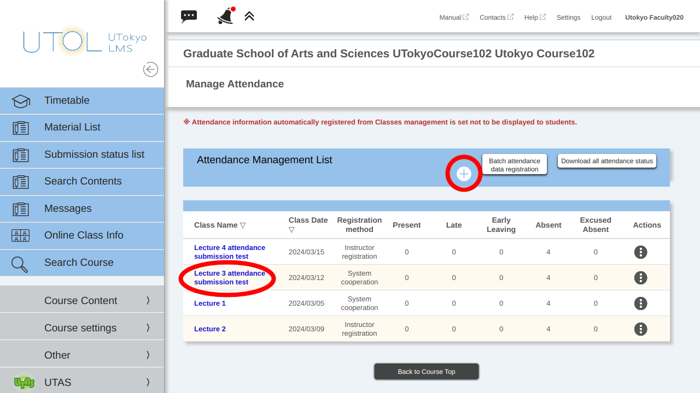
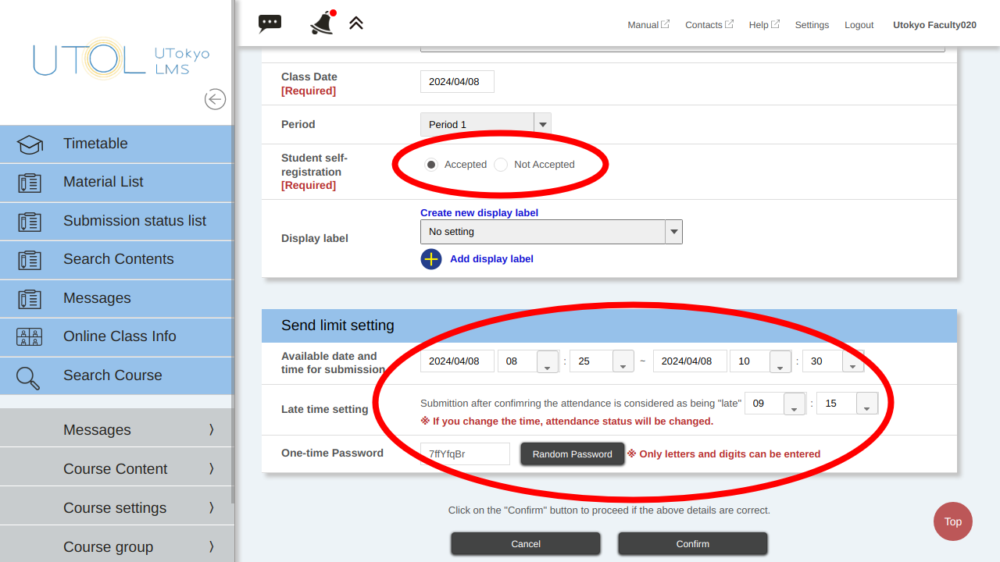

By following the procedure below, you can add attendance management, confirm settings, and change settings for each session.
    
1. On the Course Top screen, click on the {:.icon} icon located in the upper left corner to display the menu.

2. From the menu, expand the “Course Contents ∨” and click on “Manage Attendance”.

    

3. The “Manage Attendance” screen will be displayed. To add attendance management, click the “+” button. To change settings, click the link in the “Class Name” column.

    

4. Enter settings for attendance management.

    - “**Class Name**” is the name displayed when course instructors compile the data. If you enter a date or other details, it will be easier to distinguish.

    - The “**Description**” field can be left blank if there are no problems.

    - Enter the date the class is held in the “**Class Date**” field.

    - For “**Student self-registration**,” select “Accepted” to allow enrolled students to [register their attendance by entering the one-time password](#otp). Choose “Not Accepted” when course instructors use alternative methods, such as a card reader, to register attendance instead of UTOL’s attendance submission function.

    - Enter the available time period during which students can submit attendance on UTOL, including the period when they will be considered late, in the “**Available date and time for submission**” field. Once the “Available date and time for submission” has passed, students will no longer be able to submit their attendance, even as late. If you consider watching recordings as attendance, you may extend the submission deadline, such as by setting the end time to one week later or by using the assignment or quiz functions instead.

    - In the “**Late time setting**” field, enter the time within the “Available date and time for submission” period when students are considered late. The time of the boundary for being late will be displayed to enrolled students.

    - Please enter the password that students will use to attend that session in the “**One-time password**” field. Be sure to enter a different password for each session. When you click the “Random Password” button, the password will be generated randomly.

    ※ For the automatically registered attendance management, “Class Date” and “Period” may not be changed.

    

5. Lastly, click the “Confirm” button, then click the “Register” button on the confirmation screen.