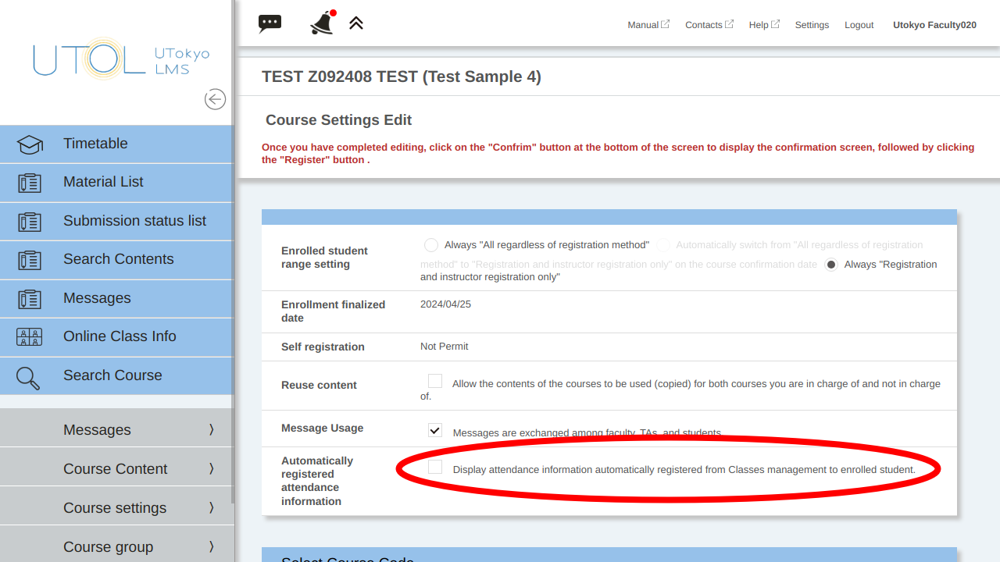

import AttendanceManagementSettings from './_attendance_management_settings.mdx'

## Introduction

UTOL has an attendance management function that allows course instructors to record enrolled students’ attendance to classes.

The attendance management function in UTOL can be used by setting up each class session and then either having enrolled students submit a one-time password or allowing course instructors to register attendance.

This page explains how to perform the following operations, which are required to use the attendance management function.

- [Prepare for attendance registration](#prepare-attendance)
- [Perform attendance registration](#register-attendance)
- [Confirm and change attendance status](#check-attendance)

### Important Notices and Supplementary Information

- If you wish to check enrolled students’ understanding of the course content, please consider using [the quiz function](../quizzes/).
- Some departments advise faculty members not to include quiz scores or attendance in the grades. Therefore, please check the department’s policy beforehand.
- There are specific important notices for having enrolled students submit attendance using a one-time password. For more details, please refer to “[Having enrolled students submit attendance using a one-time password> Important notices](#notes-otp)”.

## Prepare for Attendance Registration
{:#prepare-attendance}

To use the attendance function in UTOL, you must set up “Attendance Management” for each class session beforehand. The “Attendance Management” can be configured using one of the following methods.

- (a) Change the settings of automatically registered “attendance management” linked to the “class session”.
    1. [Display automatically registered attendance management on the enrolled students’ screens.](#set-auto-attendance)
    2. [Manually change the settings for each attendance management.](#set-each-attendance-a)
- (b) [Manually add or modify the attendance management for each session.](#set-each-attendance-b)
- (c) [Configure attendance management in batches.](#set-bulk-attendance)

In the case of a combined course (multiple signature courses), attendance management is automatically registered for each course. Therefore, please set up the attendance management using either method (b) or (c).

Each procedure is explained below.

### Edit the attendance management automatically registered through the class session function
#### Display automatically registered attendance management on the enrolled students’ screens
{:#set-auto-attendance}

In the default setting, the attendance management automatically registered is not displayed on the enrolled students’ screens.

By following the procedure below, the class date for submitting attendance, the time periods during which attendance can be submitted, and the points at which submission will be considered late will be displayed on the enrolled students’ screen.

1. On the Course Top screen, click on the {:.icon} icon located in the upper left corner to display the menu.

2. From the menu, expand the “Course settings ∨” and click on “Course settings”.

    

3. In the Course Settings screen, check the box for “Display attendance information automatically registered from Classes management to enrolled students.”

    

4. Click the “Confirm” button, then click the “Register” button on the confirmation screen.

In addition, manually registered attendance management (not registered through the class session function) will be displayed on enrolled students’ screens regardless of this setting.

#### Manually change the settings for each attendance management
{:#set-each-attendance-a}

The procedure in this section is the same as “[Manually configure the attendance management > Manually add or modify the attendance management for each session](#set-each-attendance-b)”.

<AttendanceManagementSettings />

### Manually configure the attendance management
#### Manually add or modify the attendance management for each session
{:#set-each-attendance-b}

The procedure in this section is the same as “[Edit the attendance management automatically registered through the class session function > Manually change the settings for each attendance management](#set-each-attendance-a)”.

<AttendanceManagementSettings />

#### Configure attendance management in batches
{:#set-bulk-attendance}

By using the “Batch attendance data registration” function, you can set up each attendance management at once by writing them into a single file by following the steps below.

1. On the Course Top screen, click on the {:.icon} icon located in the upper left corner to display the menu.

2. From the menu, expand the “Course Content ∨” and click on “Manage Attendance”.

    

3. Click “Batch attendance data registration” on the “Manage Attendance” screen.

    

4. Download the format from “Download Format”.

    

5. Open the downloaded file using software such as Excel or a text editor, and enter the attendance management settings. We recommend setting the cell format to “Text” when you enter data in spreadsheet software such as Excel. The content of each column is as follows (the same as “[Manually add or modify the attendance management for each session](#set-each-attendance-b)”).

    - “**Class**” is the name displayed when course instructors compile the data. If you enter a date or other details, it will be easier to distinguish.

    - Enter the date of the class in the YYYY/MM/DD format (e.g.,2024/04/02) in the “**Class Date**” field.

    - In the “**Period**” field, enter a number from 10 to 80 if your class is scheduled in periods 1 to 8. In all other cases, enter ZZ.

    - For “**Registration by Students**,” enter “1” to allow enrolled students to [register their attendance by entering the one-time password](#otp). Enter “0” when course instructors use alternative methods, such as a card reader, to register attendance instead of UTOL’s attendance submission function.

    - Enter the available period during which students can submit attendance on UTOL, including the period when they will be considered late, in the “**Registration Period**” fields. Once the “Registration Period” has passed, students will no longer be able to submit their attendance, even as late. If you consider watching recordings as attendance, you may extend the submission deadline, such as by setting the end time to one week later or by using the assignment or quiz functions instead.

        - In the start date and end date columns, enter the date in the YYYY/MM/DD format (e.g.,2024/04/01).

        - In the start time and end time columns, enter the time in the HH:MM format (e.g.,15:45).

    - In the “**Tardiness**” field, enter the time in the HH:MM format (e.g.,15:45) within the “Registration Period” when students are considered late. The time of the boundary for being late will be displayed to enrolled students.

    - Please enter the password that students will use to attend that session in the “**One-time password**” field (if left blank, it will be generated randomly). Be sure to enter a different password for each session.

    - There is no problem if you leave the “**Description**” field blank.

    

6. Click the “Reference” button to select the file with the entered settings, then click the “Confirm” button to upload the file.

    

## Perform Attendance Registration
{:#register-attendance}

### Having enrolled students submit attendance using one-time passwords
{:#otp}

If you set “Student self-registration” to “Accepted” in the attendance management settings, enrolled students will be able to register their attendance themselves.

#### Important Notices
{:#notes-otp}

Please be aware of the following points when having enrolled students submit attendance by using one-time passwords.

- Even if the one-time password is obtained by methods other than attending the class, the attendance can be submitted on UTOL.

- There may be cases where the one-time password cannot be submitted due to poor connections, or students forget to submit their attendance even though they attended the class. Please make sure to confirm verbally whether they have successfully submitted their attendance.

- Please inform enrolled students that they must report any issues that occur. If attendance is confirmed using methods other than a one-time password, [the attendance status can be changed later](#check-attendance).

- If your students experience difficulties with submitting attendance, please also refer to the “[Troubleshooting](#trouble-otp)” section.

#### Procedures

1. Open the attendance management setting screen by following the steps in the “[Manually add or modify the attendance management for each session](#set-each-attendance-b)” section and check the one-time password in advance.

2. During the class, present the one-time password to enrolled students. Some specific methods are listed below.

    - In face-to-face classes, writing the one-time password in large letters in an empty space on the blackboard allows enrolled students to submit attendance without rushing.

    - In online classes, prepare a slide with the password in large letters. Additionally, writing it in the corner of other slides allows students to check it again if they fail to submit it successfully.

    - If you share the one-time password via Zoom chat, students can easily copy and paste it. However, be aware that if they need to re-enter Zoom due to connection issues, they will not be able to check the previous chat history.

3. Instruct enrolled students to submit the one-time password. Additionally, confirm that they have submitted their attendance.

    - Please note that the procedure for submitting attendance from the students’ side is as follows.

    

    
Procedure for submitting attendance from the enrolled students’ side

    1. If enrolled students open or reload the Course Top screen after the “Available date and time for submission”, the “Submit attendance” button will be displayed.

        - This button is not displayed on the instructor’s screen.

        - If students open the Course Top screen before the “Available date and time for submission,” the button will not be displayed even when the time comes. In this case, please reload the Course Top screen.

        

    2. When enrolled students click the “Submit attendance” button, they are asked to enter a one-time password. If they enter the correct password and submit it, their attendance will be recorded on UTOL.

        

    

#### Troubleshooting
{:#trouble-otp}

“Submit attendance” button is not displayed

- The “Submit attendance” button is not displayed on the instructors’ or TAs’ “editing” screens, unlike on enrolled students’ screens.

- If you are using automatically registered attendance management, please configure the setting by following: “[Edit the attendance management automatically registered through the class session function > Display automatically registered attendance management on the enrolled students’ screens](#set-auto-attendance)”.

I don’t know the one-time password

- You can check the one-time password by opening the attendance confirmation screen through the following steps: “[Manually configure the attendance management > Manually add or modify the attendance management for each session](#set-each-attendance-b)”.

### Course instructors configure attendance management in batches

By using the “Batch attendance data registration” function, instructors can register attendance in batches.

This function is useful when managing attendance using a Zoom participant list, a student ID number written on paper, or attendance information obtained from a card reader.

Please note that attendance status other than “Present” (e.g. “Absent”, “Late”) cannot be registered in this function. If you wish to configure an attendance status other than “Present”, please follow the steps in “[Change attendance status](#check-attendance)”.

1. Prepare a participants’ list in a text file. Available formats are the following three methods: “Specify User ID”, “Specify Student ID”, and “Card reader format”.

    - “Specify User ID”: Write one Common ID (10-digit number) per line.

    - “Specify Student ID”: Write one Student ID number per line.

    - “Card reader format”: Write in “10-digit common id,2000/01/01” format per line. Files output by the loaned card reader follow this format.

    

2. On the Course Top screen, click on the {:.icon} icon located in the upper left corner to display the menu.

3. From the menu, expand the “Course Content >” and click on “Manage Attendance”.

    

4. The “Manage Attendance” screen will be displayed. Click the {:.icon} button next to the line of the course you want to check and click “Register Attendance.”

    

5. Upload the file from the “Batch attendance of registration” field.

    - Select a file format from one of the following options: “Specify User ID”, “Specify Student ID”, or “Card reader format”.

    - If you check the “Register unregistered enrolled students” box, registration for unregistered enrolled students will be performed instead of causing an error when their information is included in the file.

    - Click the “Reference” button to select the file, then click the “Upload” button.

    

6. After uploading the file, the updated attendance status will be displayed. Click the “Confirm” button.

7. Check the content, and if everything is correct, click the “Register” button.

## Confirm and change attendance status
{:#check-attendance}

### Confirm and change on the attendance registration page

You can confirm and change the attendance status for past courses on the attendance registration page.

1. On the Course Top screen, click on the {:.icon} icon located in the upper left corner to display the menu.

2. From the menu, expand the “Course Content >” and click on “Manage Attendance”.

    

3. The “Manage Attendance” screen will be displayed. Click the {:.icon} button next to the line of the course you want to check and click “Register Attendance”.

    

4. On the “Register Attendance” screen, you will see students’ attendance status for that session, along with the date and time, and any entered comments. Update the attendance status as needed.

    - The correspondence of attendance status abbreviations is as follows: “Present” (P), “Late” (L), “Early Leaving” (E), “Absent” (A), and “Excused Absent” (EA).

    

5. After entering the changes, click the “Confirm” button.

6. Check the content, and if everything is correct, click the “Register” button.

### Download attendance data in batches

You can download attendance status data in a password-protected Excel file by following the steps below.

1. On the Course Top screen, click on the {:.icon} icon located in the upper left corner to display the menu.

2. From the menu, expand the “Course Content >” and click on “Manage Attendance”.

    

3. The “Manage Attendance” screen will be displayed. Click the {:.icon} button next to the line of the course you want to check and click “Register Attendance”.

    

4. Click the “Download” button in the “Batch download” section in the middle of the “Manage Attendance” screen.

    

5. The “Password Setting” dialog will appear. Set a password and click the “Download” button.

    

6. A password-protected file that can be opened in Excel will be downloaded.

### Edit download data in batch

You can edit and upload attendance data in Excel in batches by following the steps below.

1. On the Course Top screen, click on the {:.icon} icon located in the upper left corner to display the menu.

2. From the menu, expand the “Course Content >” and click on “Manage Attendance”.

    

3. The “Manage Attendance” screen will be displayed. Click the {:.icon} button next to the line of the course you want to check and click “Register Attendance”.

    

4. Click the “Download format” displayed in blue in the “Batch attendance data upload” section in the middle of the “Manage Attendance” screen.

    

5. “Password Setting” dialog will appear. Set a password and click the “Download” button.

    

6. A password-protected file that can be opened in Excel will be downloaded. Edit downloaded file.

    - Column E (Attendance Status: Present) to Column I (Attendance Status: Excused Absent) correspond to the attendance status of each enrolled student. To set an attendance status, enter half-width “1” in the appropriate cell, and leave all other cells blank.

7. Click the “Reference” button in the “Batch attendance data upload” section in the middle of the “Manage Attendance” screen, select the edited file, and then click the “Upload” button.

    

8. Enter the password and click the “Upload” button.

9. After uploading, the updated attendance status will be displayed. Click the “Confirm” button.

    

10. Check the content, and if everything is correct, click the “Register” button.
