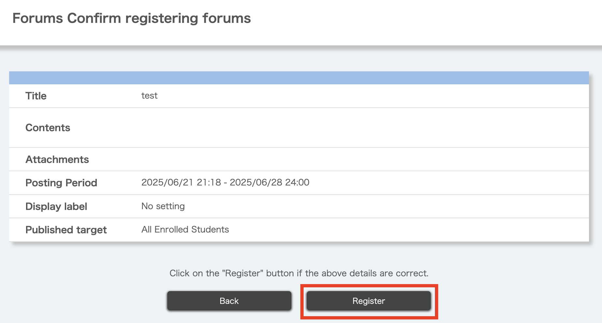

import DisplayLabel from '../_displaylabel/DisplayLabel.mdx';

## Overview
{:#overview}

The Forums function allows enrolled students in UTOL courses to communicate with each other and the instructors in a two-way manner. It is more similar to a chat than regular email, and can be used for exchanging questions about classes, doing group work discussions, and sharing opinions among students.

### Advantages of use

The following are some of the advantages of using UTOL's forum function.

- Since everything is done on UTOL, all students can use it without special settings.
  - There is no need to invite students to other tools (such as [UTokyo Slack](/en/slack/)) or for students to register for the tool.
- You can use the [markup function](../../markup/) to post messages containing mathematical formulas and links.
- When using the forum for group work discussions, it is also possible to set the forum to be visible only to certain students.

### Relationship between "topics", "threads", and "messages"

In UTOL's forums, "topics", "threads", and "messages" are structured hierarchically.

- **Topics**: This is the general outline of the topic to be discussed.
- **Threads**: This is the framework for each topic that can be created for a theme. Multiple threads can be registered for a single theme. A "default thread" is generated when a new theme is registered.
- **Messages**: This refers to each individual post within a thread. Messages can include titles, text, and attachments.

### Flow of use

The flow for posting messages using the Forums function is as follows.

1. [Registering topics](#register-theme)
2. [Registering threads](#register-thread)
3. [Posting messages](#post-messages)

For information on how to view posted messages, refer to "[Viewing Posts](#view-messages)".

In addition, instructors and TAs can also [check the forum viewing status](#check-view-status).

## How to operate topics
{:#theme}

### Registering topics
{:#register-theme}

Authorized users: instructors, course designers, and TAs

1. Open the Course Top screen and click on the {:.icon} icon at the bottom left of the blue frame of "Forums".
   
2. Enter the following information on the Topic Registration screen.
   
   - **Title** \[Required\]
   - **Contents**
     - You can use the [Markup function](../../markup/).
   - **Attachments**
   - **Posting Period** \[Required\]
      - The default is blank.  
      - After the end of the posting period, the students who are included in the published target will only be able to view the contents.
   - <DisplayLabel/>
   - **Published target** \[Required\]
     - You can select the target for the registered topic from "All Enrolled Students," "Select User groups," or "Select Enrollment".
     - If you target "User groups", you can publish the topic to [user groups](../settings/user_groups/) that have been created in advance.
     - If you target "Select Enrollment", you can publish the topic to a subset of students.
       - When you select "Select Enrollment", a list of students will be displayed below. Select the students you want to share with by checking the boxes on the left.
       - Even if you set "Select Enrollment", the instructors, TAs, and course designers will still be able to view all forums.
3. Click "Confirm" at the bottom of the screen.
   {:.medium}
4. After confirming the details, click "Confirm".
   

When you register a new topic, a thread with the title "Default Thread" is automatically generated. You can [edit the thread](#edit-delete-thread) as needed to clearly indicate its purpose by setting an appropriate title and description.

### Editing and deleting topics

Authorized users: instructors, course designers and TAs

To edit, open the Course Top screen and click on the "Topic Title" (blue link) on the Forums. This will take you to the Topic Editing screen.

To delete, click the {:.icon} icon on the right side of the "Forums" of the Course Top screen, then select "Delete".
{:.extra-small}

## How to operate threads
{:#thread}

### Registering threads
{:#register-thread}

Authorized users: instructors, course designers, TAs, and students

1. Open the Course Top screen and scroll down to the "Forums" section.
2. In the "Forums" section, click the {:.icon} icon to the right of the topic for which you want to register a thread.
   
3. Click "Join".
   {:.extra-small}
4. Click the "Create a new thread" button at the bottom of the screen.
   
5. Enter the following information on the "Forums Thread Registration" screen.
   
   - **Title** \[Required\]
   - **Description**
     - You can use the [Markup function](../../markup/).
6. Click the "Confirm" button at the bottom of the screen.
   {:.medium}
7. After confirming the details, click the "Confirm" button. If "Registration Complete" is displayed, the thread has been successfully registered.
   

### Editing and deleting threads
{:#edit-delete-thread}

Authorized users: instructors, course designers, TAs, and students   
\* However, students can only delete threads they have created and that have no messages posted.

1. Open the Course Top screen and scroll to the "Forums" section.
2. In the "Forums" section, click the {:.icon} icon on the right side of the topic to which the thread you want to edit or delete belongs.
   
3. Click "Join".
   {:.extra-small}
4. Click the {:.icon} icon on the right side of the thread list.
   
5. Select "Edit" or "Delete".
   {:.extra-small}

## Viewing posts
{:#view-messages}

Authorized users: instructors, course designers, TAs, and students

1. Open the Course Top screen and scroll to the "Forums" screen.
2. In the "Forums" section, click the {:.icon} icon on the right side of the topic to which the thread you want to edit or delete belongs
   
3. Click "Join".
   {:.extra-small}
4. Click on the "Title" (blue link) of the thread you want to view. The content of the post will be displayed in a chat-like format.
   

### Downloading posts

The Forums function allows you to download the posting status. There are two types of download functions.

- [**Batch downloading posts in a theme**](#download-all-messages): This function allows you to batch download all threads in a theme as an Excel file (`.xlsx`). Only instructors can use this function.
- [**Downloading posts by thread**](#download-thread-messages): This function allows you to download messages by thread as a zip file containing Excel files (`.xlsx`) and HTML files. It is available to instructors, TAs, and students only during the posting period.

Please note that the downloaded files do not include attached images or mathematical formulas.

#### Batch downloading posts in a theme
{:#download-all-messages}

Authorized users: instructors

1. Open the Course Top screen and scroll to the "Forums" section.
2. In the "Forums" section, click the {:.icon} icon to the right of the theme you want to register a thread for.
   
3. Select "Join".
   {:.extra-small}
4. Click the "Download posting status" button at the bottom center of the screen.
   
5. You will be taken to the Password Setting screen, where you must enter your password in the text field.
   - You will need the password you entered here to open the downloaded file.
6. Click the "Download" button. A new tab will open automatically, and the Excel file (`.xlsx`) will be downloaded.
   {:.medium}

#### Downloading posts by thread
{:#download-thread-messages}

Authorized users: instructors, TAs, and students

1. Open the Course Top screen and scroll to the "Forums" section.
2. In the "Forums" section, click the {:.icon} icon to the right of the theme you want to register a thread for.
   
3. Select "Join".
   {:.extra-small}
4. Click the thread title (blue link).
   
5. Click the "Download" button at the bottom left of the message posting field.
   
6. You will be taken to the Password Setting screen, where you must enter a password in the text field.
   - You will need the password you entered here to open the downloaded file.
7. Click the "Download" button. A new tab will open automatically, and the zip file will be downloaded.
   {:.medium}

## Posting
{:#post-messages}

### Posting a new message

Authorized users: instructors, TAs, and students

1. Open the Course Top screen and scroll to the "Forums" section.
2. In the "Forums" section, click the {:.icon} icon to the right of the theme you want to register a thread for.
   
3. Select "Join".
   {:.extra-small}
4. Click the thread title (blue link).
   
5. Scroll down to the posting screen at the bottom of the screen and enter your message.
   
   - The information to be entered is as follows.
     - **Title**
     - **Contents**
       - Enter the message text here.
       - You can use the [Markup function](../../markup/).
     - **Attachments**
   - You need to enter either the post contents, attachments, or both. You cannot post just a title.
6. Click the "Send" button at the bottom right.
   

### Editing and deleting posted messages

Authorized users: instructors, TAs, and students 
\* However, students can only edit or delete messages that they have posted themselves.

1. Open the Course Top screen and scroll to the "Forums" section.
2. In the "Forums" section, click the {:.icon} icon to the right of the theme for which you want to register a thread.
   
3. Select "Join".
   {:.extra-small}
4. Click the thread title (blue link).
   
5. Select "Edit" or "Delete" (blue link) at the bottom of the message you wish to edit.
   {:.small}
6. To edit, scroll down to the bottom of the page on the Forums Threads screen and click the "Send" button after editing the message. To delete, a Delete Confirmation screen will appear, so please click the "Delete" button.

## Checking viewing status
{:#check-view-status}

Authorized users: instructors and TAs

1. Open the Course Top screen and scroll to the "Forums" section.
2. In the "Forums" section, click the {:.icon} icon to the right of the theme you want to register a thread for.
   
3. Select "Join".
   {:.extra-small}
4. Click the{:.icon} icon on the right side of the Thread List.
   
5. Click the "Viewing status" button.
   {:.extra-small}
6. You will be taken to the Viewing Status page to check the viewing status.
   - You can also download the viewing status from the Viewing Status page. You will need to set a password to download it.
