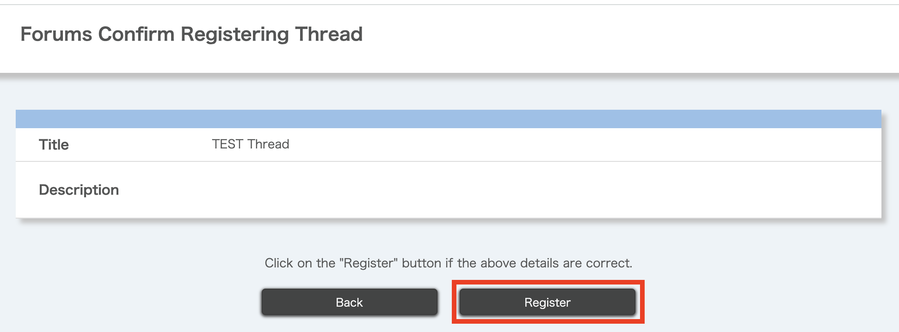

import DisplayLabel from '../_displaylabel/DisplayLabel.mdx';

## Overview
{:#overview}

The Forums function allows enrolled students in UTOL courses to communicate with each other and the course instructors in a two-way manner. It is more similar to a chat than a regular email, and can be used for exchanging questions about classes, doing group work discussions, and sharing opinions among students.

### Advantages of Use

The following are some of the advantages of using the UTOL Forums function:

- Since everything is handled within UTOL, all enrolled students can use it without any special setup.
  - There is no need to invite enrolled students to external tools (such as [UTokyo Slack](/en/slack/)) or for students to register for the tool.
- You can use the [markup function](../../markup/) to post messages containing mathematical formulas and links.
- It is also possible to create forums that are usable only by specific enrolled students, which is useful for group work discussions.

### Relationship between "Themes", "Threads", and "Messages"

+ In UTOL's forums, "Themes," "Threads," and "Messages" are structured hierarchically.

- **Themes**: This is the general outline of the topic to be discussed.
- **Threads**: This is used to organize discussions by topic within a theme. You can add multiple threads to a single theme. When a new theme is created, a "Default Thread" is automatically generated.
- **Messages**: This is each individual post within a thread. Messages can include titles, contents (text), and attachments.

### Workflow

The general workflow for using the Forums function is as follows:

1. [Registering Themes](#register-theme)
2. [Registering Threads](#register-thread)
3. [Posting Messages](#post-messages)

For information on how to view messages, refer to "[Viewing Posts](#view-messages)".

In addition, course instructors and TAs can also [check the forum viewing status](#check-view-status).

## Managing Themes
{:#theme}

### Registering Themes
{:#register-theme}

Permissions: Course Instructor, Course Designers, and TAs

1. Open the Course Top screen and click on the {:.icon} icon at the bottom left of the blue frame of "Forums".
   
2. Enter the following information on the Register theme screen.
   
   - **Title** \[Required\]
   - **Contents**
     - You can use the [Markup function](../../markup/).
   - **Attachments**
   - **Posting Period** \[Required\]
      - The default is blank.  
      - After the end of the posting period, the enrolled students who are included in the published target will only be able to view the contents.
   - <DisplayLabel/>
   - **Published target** \[Required\]
     - You can select the published target of the theme you are registering from "All Enrolled Students", Select User group", or "Select Enrollment".
     - If you select "Select User group", you can publish the theme to [user groups](../settings/user_groups/) that have been created in advance.
     - If you target "Select Enrollment", you can publish the theme to a subset of enrolled students.
       - When you select "Select Enrollment", the "List of students" will be displayed below. Select the enrolled students you want to share with by checking the boxes on the left.
       - Even if you set "Select Enrollment", the course instructors, TAs, and course designers will still be able to view all forums.
3. Click "Confirm" at the bottom of the screen.
   {:.medium}
4. After confirming the details, click "Register".
   

When you register a new theme, a thread titled "Default Thread" is automatically generated. You can [edit this thread](#edit-delete-thread) as needed, giving it a more specific title and description to clarify its purpose.

### Editing and Deleting Themes

Permissions: Course Instructor, Course Designers, and TAs

To edit a theme, open the Course Top screen and click on the theme's title (blue link) on the Forums. This will take you to the Editing Theme screen.

To delete a theme, click the {:.icon} icon on the right side of the "Forums" of the Course Top screen, then select "Delete".
{:.extra-small}

## Managing Threads
{:#thread}

### Registering Threads
{:#register-thread}

Permissions: Course Instructors, Course Designers, TAs, and Enrolled Students

1. Open the Course Top screen and scroll down to the "Forums" section.
2. In the "Forums" section, click the {:.icon} icon to the right of the theme where you want to register a thread.
   
3. Click "Join".
   {:.extra-small}
4. Click the "Create a new thread" button at the bottom of the screen.
   
5. Enter the following information on the "Forums Register Thread" screen.
   
   - **Title** \[Required\]
   - **Description**
     - You can use the [Markup function](../../markup/).
6. Click the "Confirm" button at the bottom of the screen.
   {:.medium}
7. After confirming the details, click the "Register" button. If "Registration is completed." is displayed, the thread has been successfully registered.
   

### Editing and Deleting Threads
{:#edit-delete-thread}

Permissions: Course Instructors, Course Designers, TAs, and Enrolled Students 
Note: Enrolled students can only delete threads they created, and only if no messages have been posted to them.

1. Open the Course Top screen and scroll to the "Forums" section.
2. In the "Forums" section, click the {:.icon} icon on the right side of the theme containing the thread you want to edit or delete.
   
3. Click "Join".
   {:.extra-small}
4. Click the {:.icon} icon on the right side of the thread list.
   
5. Select "Edit" or "Delete".
   {:.extra-small}

## Viewing Posts
{:#view-messages}

Permissions: Course Instructors, Course Designers, TAs, and Enrolled Students

1. Open the Course Top screen and scroll to the "Forums" screen.
2. In the "Forums" section, click the {:.icon} icon on the right side of the theme to which the thread you want to view posts belongs.
   
3. Click "Join".
   {:.extra-small}
4. Click on the "Title" (blue link) of the thread you want to view. The content of the post will be displayed in a chat-like format.
   

### Downloading Posts

The Forums function allows you to download the posting status. There are two types of download functions.

- [**Batch Downloading Posts in a Theme**](#download-all-messages): This function allows you to batch download all threads in a theme as an Excel file (`.xlsx`). Only course instructors can use this function.
- [**Downloading Posts by Thread**](#download-thread-messages): This function allows you to download messages by thread as a zip file containing an Excel file (`.xlsx`) and an HTML file. This is available to course instructors, TAs, and enrolled students, but only during the theme's posting period.

Please note that the downloaded files do not include attached images or mathematical formulas.

#### Batch Downloading Posts in a Theme
{:#download-all-messages}

Permissions: Course Instructors

1. Open the Course Top screen and scroll to the "Forums" section.
2. In the "Forums" section, click the {:.icon} icon to the right of the theme you want to download posts.
   
3. Select "Join".
   {:.extra-small}
4. Click the "Download posting status" button at the bottom center of the screen.
   
5. You will be taken to the Password Setting screen, where you must enter your password in the text field.
   - This password will be required to open the downloaded file.
6. Click the "Download" button. A new tab will open automatically, and the Excel file (`.xlsx`) will be downloaded.
   {:.medium}

#### Downloading Posts by Thread
{:#download-thread-messages}

Permissions: Course Instructors, TAs, and Enrolled Students

1. Open the Course Top screen and scroll to the "Forums" section.
2. In the "Forums" section, click the {:.icon} icon to the right of the theme containing the thread you want to download.
   
3. Select "Join".
   {:.extra-small}
4. Click the thread title (blue link).
   
5. Click the "Download" button at the bottom left of the message posting field.
   
6. You will be taken to the Password Setting screen, where you must enter a password in the text field.
   - This password will be required to open the downloaded file.
7. Click the "Download" button. A new tab will open automatically, and the zip file will be downloaded.
   {:.medium}

## Managing Messages
{:#manage-messages}

### Posting a New Message
{:#post-messages}

Permissions: Course Instructors, TAs, and Enrolled Students

1. Open the Course Top screen and scroll to the "Forums" section.
2. In the "Forums" section, click the {:.icon} icon to the right of the theme where you want to post a new message.
   
3. Select "Join".
   {:.extra-small}
4. Click the thread title (blue link).
   
5. Scroll down to the posting screen at the bottom of the screen and enter your message.
   
   - The information to be entered is as follows.
     - **Title**
     - **Contents**
       - Enter the message text here.
       - You can use the [Markup function](../../markup/).
     - **Attachments**
   - You need to enter either the post contents, attachments, or both. You cannot post just a title.
6. Click the "Send" button at the bottom right.
   

### Editing and Deleting Posted Messages

Permissions: Course Instructors, TAs, and Enrolled Students 
Note: Enrolled students can only edit or delete messages they have posted themselves.

1. Open the Course Top screen and scroll to the "Forums" section.
2. In the "Forums" section, click the {:.icon} icon to the right of the theme the theme containing the message you want to edit or delete.
   
3. Select "Join".
   {:.extra-small}
4. Click the thread title (blue link).
   
5. Select "Edit" or "Delete" (blue link) at the bottom of the message you wish to edit or delete.
   {:.small}
6. To edit, scroll down to the bottom of the page on the Forums Threads screen and click the "Send" button after editing the message. To delete, a Delete Confirmation screen will appear, so please click the "Delete" button.

## Checking Viewing Status
{:#check-view-status}

Permissions: Course Instructors, and TAs

1. Open the Course Top screen and scroll to the "Forums" section.
2. In the "Forums" section, click the {:.icon} icon to the right of the theme containing the thread whose viewing status you want to check.
   
3. Select "Join".
   {:.extra-small}
4. Click the {:.icon} icon on the right side of the Thread List.
   
5. Click the "Viewing status" button.
   {:.extra-small}
6. You will be taken to the Viewing Status page to check the viewing status.
   - You can also download the viewing status from the Viewing Status page. You will need to set a password to download it.
