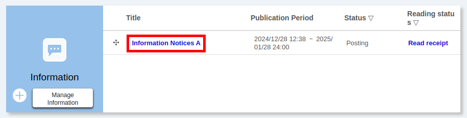

import DisplayLabel from '../_displaylabel/DisplayLabel.mdx';

## About Information Notices
{:#about}

This page provides detailed information on the usage of the information notices function in [UTOL](/en/utol/). This feature allows information to be sent as one-way text messages to all or some of the enrolled students. If you wish to contact specific enrolled students, please use the “[Message](/en/utol/lecturers/messages/)” function.

The features of the information notices are as follows.

* When you register the information notice, you can set up the automatic sending of notifications to enrolled students. 
  * Please note that **notifications will be sent only if the enrolled students have made changes to their settings to allow notifications to be received** (For more details on notification settings, please refer to “[Settings in UTOL to receive notifications](/en/utol/notification/)”).
  * The contents of the notification will be provided directly in the notification.

* You can confirm the list of enrolled students who have read the notifications on UTOL. For more details on the procedures, please refer to the “[Checking that an information notice has been opened](#check)” setting, discussed below.

### Reminder Notices
{:#reminder}

In addition to regular information notices, there are “reminder notices” in the information notices. The reminder notices are requests such as those reminding the submission of assignments, quizzes, surveys, etc.

* Reminder notices will be displayed for those who have not submitted certain required information.
* Email and LINE notifications are automatically enabled. However, **if enrolled students have not set up their notifications, they will not receive them.**
* Reminder notices are displayed in the same column as regular notices.

#### Template for the reminder notices
{:#templates}

There is a template function for the reminder notices because it is expected that texts in the reminder notices will often be the same and used repeatedly in many situations. This function allows you to use prepared texts for multiple reminder notices.

The template is independent for each user, even within the same course. For example, in case of a course with multiple course instructors, the templates created by some course instructors cannot be used directly by other course instructors. However, it is possible to duplicate a template created by another user, and then modify it to create your own template.

#### Conditions and periods for registering reminder notices
{:#condition}

To register reminder notices, the following conditions are required.

* It must be before or during the content submission period.
  * Please note that **assignments that are set as “late submission is enabled” can be registered in the Reminder Notices even after the submission period**.
* (For surveys) It must be an open survey.
  * If you change from an open survey to an anonymous survey, your registered Reminder Notices will be deleted.

### Operation authority for each course participant
{:#permissions}

Course instructors, TAs, and course designers can perform almost all operations. However, course designers cannot [check whether or not an information notice has been opened](#check).

## Register Information Notices
{:#register}

This section provides the steps for a new registration of the information notices and reminder notices.

### Register Information Notices
{:#register_information}

1. Click the “+” button of “Information” on the course top screen or select “Register New Information” after clicking the “Manage Information”.

    Course Top:
    

    “Manage Information”:
    

2. Enter the following items.
    * **Title**: Title of the information notices.
    * **Contents**: Plain text to be sent as information notices.
    * **Posting period**: Period for posting information notices. After the start date of the posting period, **once the information notices have been released, you cannot edit any items, including contents, except the end date of the posting period. Please register carefully.**
    * **Notify by Email and LINE**: When you register information notices, you can choose whether to notify enrolled students by sending an email or a LINE message.
    * <DisplayLabel />
    * **Published target**: You can select the target audience for information notices. (As for the User group function, please see “[Using User Group Function in UTOL (for course instructors / TAs)](/en/utol/settings/user_groups/)”).
3. Click “Confirm” to proceed.
4. Please ensure that the content of the information notices you entered is exactly as you intended. Also, you can use the “Preview” screen to reproduce the display on the page of enrolled students.
5. Click “Register”. When you see “Registration is completed.” on the screen, it means your procedure was successful.

### Register Reminder Notices
{:#register_reminder}

In this section, we will use an assignment as an example, but it is possible to set up notifications for quizzes and surveys using the same procedures.

1. For the assignment you wish to register as a reminder notice, click the {:.icon} mark in the “Actions” field in the “Assignment” section of the Course Top screen, and then click the “Register Reminder Information” from the menu displayed on the screen.

    

    

    
In case the “Reminder Information” and “Register Reminder Information” are not displayed.

    The content may not meet the [conditions and periods for registering reminder notices](#condition).
    

2. Enter the following items.
    * **Title**：Title of the reminder notices. Although “Deadline (deadline for the contents) 【 (Type of the contents)】(Title of the contents)” is shown as the default title, you can change it.
    * **Import from template**: This is used when you use the [reminder notices templates](#templates). If you wish to use it, [register the reminder notices template](#register_templates) first. To use the registered reminder notices templates, select the title of the preferred reminder notice templates from a pull-down menu, and then click “Apply”.
    * **Contents**: Text to be sent as reminder notices.
    * **Posting period**: Period for posting reminder notices.
        * After the start date of the posting period, **once the information notices have been released, you cannot edit any items, including contents, except the end date of the posting period. Please register carefully.**
        * The start date of the posting period can be set by entering it directly. Also, entering “the date before (pull-down menu) the end of the posting period” allows you to specify automatically the date corresponding to the number of posting days.

3. Click “Confirm” to proceed.
4. Please ensure that the content of the information notices you entered is exactly as you intended. Also, you can use the “Preview” screen to reproduce the display on the page of enrolled students.
5. Click “Register”. When you see “Registration is completed.” on the screen, it means your procedure was successful.

#### Register and Edit Reminder Notices Templates
{:#register_templates}

1. Click the “Manage Information” in the “Information” field on the Course Top screen.

    

2. Click the “Reminder information template list” in the “Manage Information”

    

3. Click “Register new template” to register a new template, or click the title of the corresponding template to edit the existing one. Click “Register” in the “My template” field of the relevant template to create a copy of another user’s template.

    

4. Enter the following items.
    * **Template title**: Title of the reminder notices template, which is used to distinguish templates.
    * **Contents**: Plain text to register as a template.
5. Click “Confirm” to proceed.
6. Please ensure that the content of the information (including the reminder notices) that you entered is exactly as you intended and click “Register” if there is no problem. When you see “Registration is completed.” on the screen, it means your procedure was successful.

### Confirm, Edit, or Delete Information Notices
{:#rud}

This section provides steps to confirm, edit, or delete Information notices (including the reminder notices).

1. Click on the “Manage Information” in the “Information” field on the Course Top screen.

    Course Top:
    

    Manage Information:
    

2. The same screen as the [registration screen](#register) appears. You can check the contents of the information notices.
3. Proceed according to what you would like to do.

    * When editing information notices

        1. Edit the contents of the information notices.
            

            
If some items cannot be edited

            After the start date of the posting period, i.e. after the notice is published, you cannot edit any items other than the end date of the post period, including the content.
            

        2. Click “Confirm” to proceed.
        3. Please ensure that the content of the information notices you entered is exactly as you intended. Also, you can use the “Preview” screen to reproduce the display on the page of enrolled students.
        4. Click “Register”. When you see “Registration is completed.” on the screen, it means your procedure was successful.
    * When deleting information notices
        1. Click “Delete Information”.
        2. When the confirmation dialog appears, click “Delete” if there is no problem.
        3. When it’s completed, you will be redirected to the Manage Information screen. Please check to ensure that the relevant information notice has been deleted.

## Checking that an Information Notice has been opened
{:#check}

This section provides steps to confirm the list of enrolled students who have been opened information notices on UTOL. However, please note that **if enrolled students check the content of information notices by [email and LINE notification](#about), those notices will not be shown as being opened.**

1. Click “Read receipt” in the relevant information notices of the “Information” section on the Course Top or “Manage information” screen.

    

    

    
If there is no “Read receipt” shown

    You may not have [the authority required to check whether the notice has been opened](#permissions).
    

2. Please check the table that shows correspondence between users and reading status.
