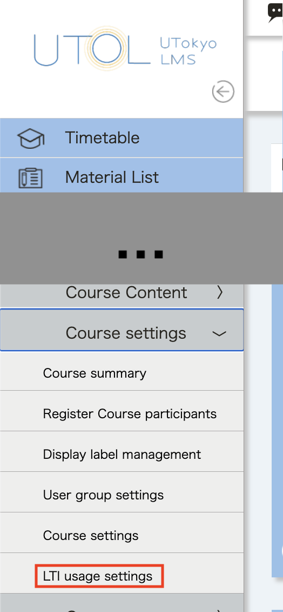
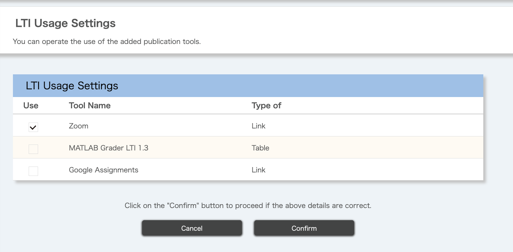

UTOL supports integration with external tools such as Slack and Zoom using the Learning Tools Interoperability (LTI) standard. By using these integration features, you can facilitate smoother course management and communication.
For notifications via LINE or Slack, please refer to "[Settings in UTOL to receive notifications](../../notification/)".

## Available External Tools
UTOL allows you to use the following external tool integrations:
- Zoom: You can integrate Zoom meetings with course participants. For more details, please refer to "[Using Zoom meetings from UTOL via LTI integration (for Course Instructors / TAs)](./zoom/)".

- Slack: You can create a Slack workspace for course participants. For more details, please refer to "[Using UTokyo Slack Workspace from UTOL via Slack Integration (for Course Instructors / TAs)](./slack/)".

- MATLAB Grader: You can assign quizzes created in MATLAB Grader to course participants. For more details, please refer to "[Using MATLAB Grader in UTOL (for Course Instructors / TAs)](./matlab_grader/)".

### How to Check Available External Tools
You can check the list of currently available external tools by following the steps below.
1. Open the course you wish to manage, then click the "{:.icon}" icon in the upper left corner.
2. Select "Course Settings", then choose "LTI usage settings".
    
3. A list of available tools will be displayed. Please review the list.
    

## Requesting Additional External Tools
If you have a license for an LTI v1.3-compatible external tool that is not currently available in UTOL, and are considering using it through integration with UTOL, please contact the UTOL Team (`lms-support@itc.u-tokyo.ac.jp`). When contacting the team, please provide information about the tool and its license, as well as the scope of use (e.g., limited to a specific faculty or course, or available for university-wide use).
