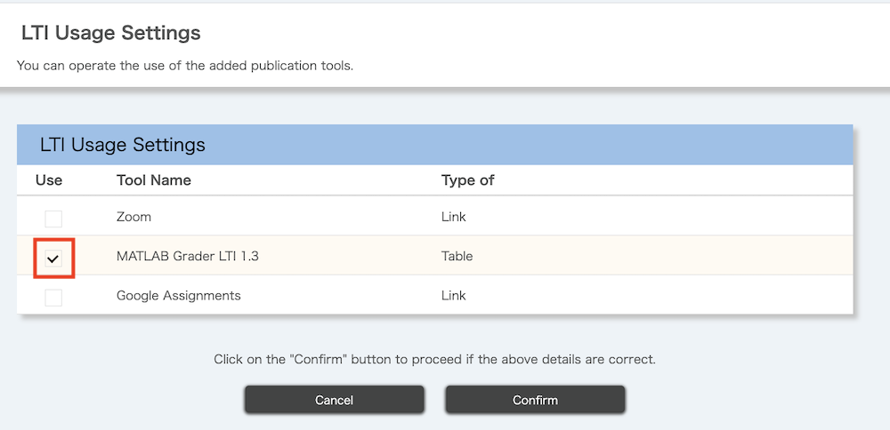
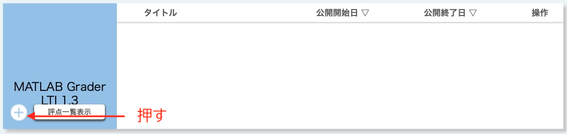
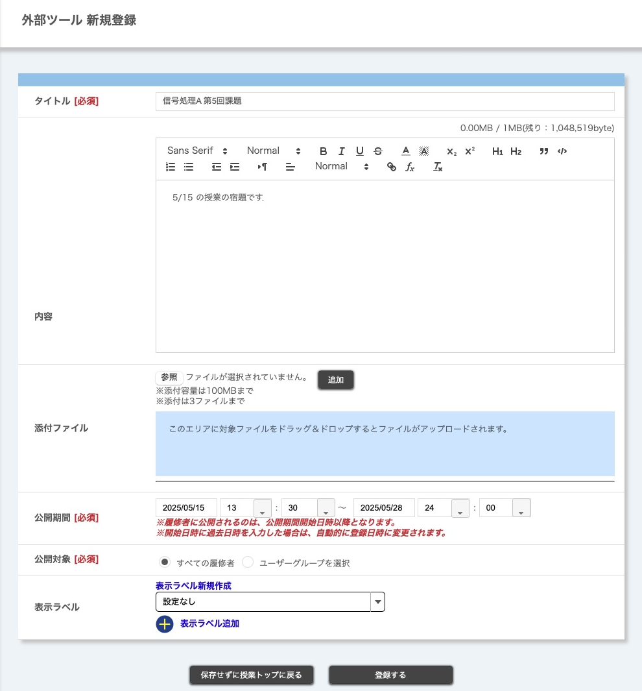
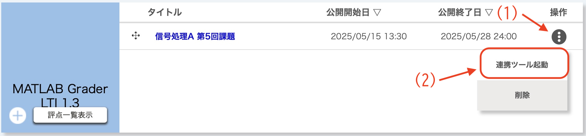
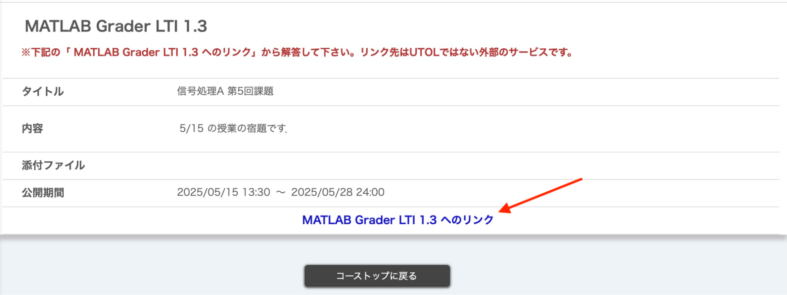
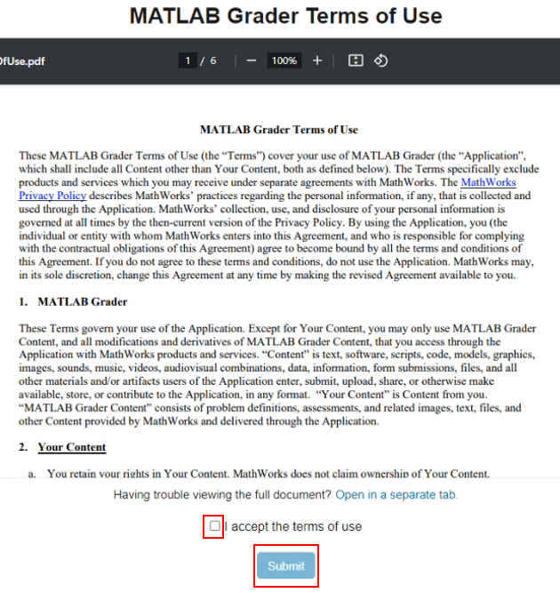
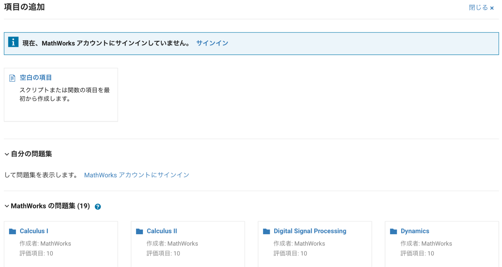
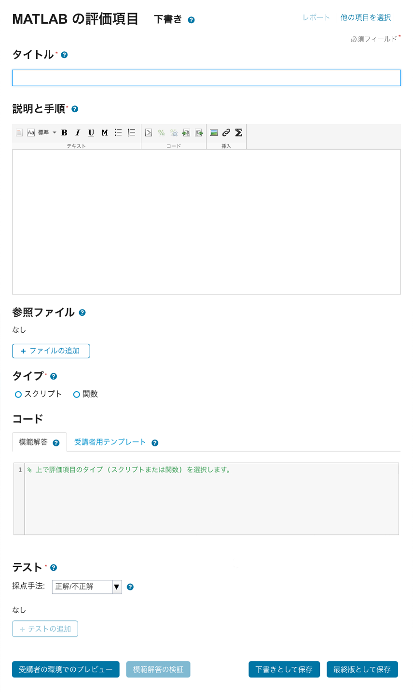
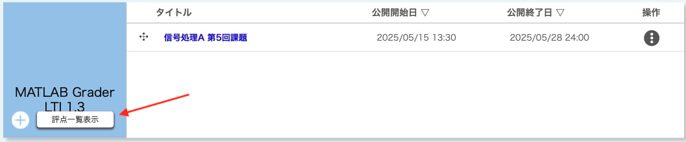

## Overview

This section explains how to use the MATLAB Grader function in UTOL.

## Preparation
{:#preparation}

Preparation is required to use MATLAB Grader. This preparation process should be performed only once for each course.

1. Click "LTI usage settings" under "Course settings" on the Course Top screen.

    

2. Check the "Use" checkbox for "MATLAB Grader LTI 1.3", click "Confirm", then click the "Register" button on the next screen.

    

3. "MATLAB Grader LTI 1.3" will appear on the Course Top screen.

## Create a Problem (Item)
{:#create}

Create a problem for students using MATLAB Grader.

### Operations on UTOL
{:#utol}

1. Open the Course Top screen, then click the {:.icon} button in the "MATLAB Grader LTI 1.3" column.

    

2. Set the title, publication period, and published target for the MATLAB Grader problem. Also, set the content, attachments, and display labels as needed.

    - When "enrolled students" included in the published target visit the Course Top screen during the publication period, they can access the created MATLAB Grader problem by clicking the link to it.

    - The "publication period" set here is the due date for students to submit. When the publication period ends, students will no longer be able to access the problems on MATLAB Grader. Please also check the "[Additional Notes](#appendix)".

    

3. Click the "Register" button, and the confirmation screen will appear. If no issues are found, click the "Register" button.

4. Returning to the Course Top screen, (1) click the {:.icon} button in the "Actions" column, and then (2) click "Launch External Tool".

    

5. When the screen shown below appears, click "Link to MATLAB Grader LTI 1.3". The MATLAB Grader screen will open in a separate tab (or window).

    

## Operations on MATLAB Grader
{:#grader}

1. The "MATLAB Grader Terms of Use" screen appears when you first use MATLAB Grader (and when the "MATLAB Grader Terms of Use" is updated). Please review the content, check "I accept the terms of use", and click "Submit".

    

2. When the screen shown below appears, click 「空白の項目」(Blank Problem).

    Note: In MATLAB Grader, tasks assigned to students are referred to as 「項目」(Item) or 「評価項目」(Assessment Item). (As of May 14, 2025)

    

3. A screen for creating a new 「項目」(Assessment Item) will appear as shown below. Please enter the required information, such as 「タイトル」(Title) and 「コード」(Code).

    - At this stage, you can also copy the registered 「MathWorksの問題集」(MathWorks Collections), or sign in to your MathWorks account to use a problem you created in the past.

    

4. If there are no issues with the 「受講者の環境でのプレビュー」(Learner Preview) or 「模範解答の検証」(Validate Reference Solution), click the 「最終版として保存」(Save as Final) button.

## Check Answer Status
{:#confirm}

Scores can be checked by clicking the "List of grade" button on the Course Top screen of UTOL.

For details other than scores, such as the submitted answers, please check them in MATLAB Grader. Click 「レポート」(Report) in the top-right corner of the MATLAB Grader screen to review the 「概要」(Overview) and individual 「受講者の解答」(Student Submissions).

## Additional Notes
{:#appendix}

- When the publication period set in "[Create a Problem (Item) > Operations on UTOL](#utol)" ends, **the "Link to MATLAB Grader LTI 1.3" will be deactivated in the students' view**, and the problems and detailed answers on MATLAB Grader will no longer be accessible. This means students will not be able to **review the problems**. This is because MATLAB Grader does not have a feature to set a due date for each problem (item) you create.

- To discontinue the use of MATLAB Grader in your course, uncheck the "MATLAB Grader LTI 1.3" box in the "LTI usage settings" under "Course settings", as described in "[Preparation](#preparation)".
