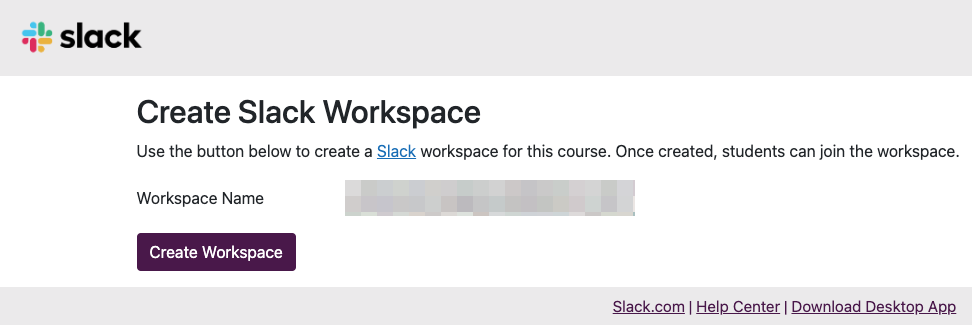
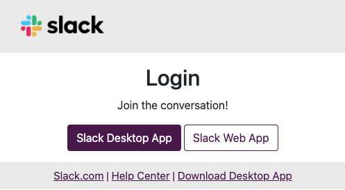

## Overview

By using the Slack integration feature in UTOL, you can create and manage a dedicated UTokyo Slack workspace for course members, such as course instructors or enrolled students. This workspace can be used to respond to student questions related to the course and facilitate communication among course instructors or TAs.

## Features

* Course participants (course instructors, TAs and enrolled students) registered for a course in UTOL are automatically added as members to the integrated workspace. Therefore, in courses with a large number of enrolled students, using Slack integration can reduce the effort required to manage workspace members.
* Once the course period ends, the integrated workspace is archived, and only the "workspace owner" can access it.
* The same workspace cannot be used for other courses. For example, even if the same course is offered in the following year, a new workspace must be created and linked to the new course for that year.

## How to Use

To use the Slack integration feature, you need to first [apply to use it and complete the setup](#start-slack-integration) for each course. Once the setup is completed, an "External Tool Link" icon will [appear on the course top page, and the feature will become available](#use-slack-integration).

### Start Using Slack Integration in a Course
{:#start-slack-integration}

1. If you have not yet completed the required steps for using [UTokyo Slack](/en/slack/), such as taking the "[Information Security Education](https://univtokyo.sharepoint.com/sites/Security/SitePages/en/Information_Security_Education.aspx)" training and enabling [Multi-Factor Authentication for a UTokyo Account](/en/utokyo_account/mfa/), please complete them in advance.
2. Please read the "[Creation and operation of workspaces in UTokyo Slack](/en/slack/workspace/)" page and review the workspace management procedures and important notes.
   * Workspaces for Slack integration are created via UTOL. There is no need to submit a separate request to create a new workspace in UTokyo Slack.
3. Please apply to use the Slack Integration feature by filling in the required information in the "[\[UTOL\] Application Form for Slack Integration](https://forms.office.com/pages/responsepage.aspx?id=T6978HAr10eaAgh1yvlMhAV1xFVIiWBKstSDeuZIIuFUQVNXSzlSUEk5VEpOU1dGV0pUNjA3RVBZVSQlQCN0PWcu&route=shorturl)".
   * A separate application is required for each course.
   * Once the setup is completed, the UTOL Support Team will contact you by email. Please note that it may take a few days depending on operational circumstances.
   * Only the course instructor(s) of the relevant courses can apply. Students, including TAs, are not allowed to apply.
4. Select "Course settings" \> "LTI usage settings" from the left menu on the course top page.
   * **From this point onwards, all steps must be performed by academic and administrative staff appointed as [representatives](/en/slack/workspace/#overview-and-preactions), who are responsible for the management and operation of the workspace.** The users who perform these steps will be granted owner privileges for their workspace and will be treated as representatives.
5. In the table, click "Slack" under the "Use" checkbox column on the left.
6. Click on the "Proceed" button, then click "Register". UTokyo Slack will become available for the course via LTI integration.
7. Return to the course top page and click "Slack" under the "External Tool Link".

    

8. When the "Create Slack Workspace" screen appears, click the "Create Workspace" button. A Slack workspace will be created and you will be registered as a member with owner privileges.

    

### Using the Slack Integration Feature
{:#use-slack-integration}

1. If you have not yet completed the "[Information Security Education](https://univtokyo.sharepoint.com/sites/Security/SitePages/en/Information_Security_Education.aspx)" training or enabled [Multi-Factor Authentication (MFA)](/en/utokyo_account/mfa/), both of which are required to use [UTokyo Slack](/en/slack/), please complete them first.
2. Click "Slack" under the "External Tool Link" on the course top page.
3. Once the following screen appears, access Slack via the Slack app or a web browser.

    

## Important Notes and Supplementary Information

* The user that created the workspace becomes the workspace "owner" and will be treated as a "[representative](/en/slack/workspace/#overview-and-preactions)" who is responsible for the management and operation of the workspace.
* Course participants other than the owner will be added to the workspace as members when the synchronization process runs automatically (once per hour) or when you click "Slack" in the "External Tool Link" menu.
* Course participants other than the owner will be registered as "members". If you would like other course instructors to be able to manage workspaces, please change their role to "Workspace Admins".
* If course participants have never used [UTokyo Slack](/en/slack/) before, please ask them to refer to the [UTokyo Slack](/en/slack/) page and complete any necessary actions.
* **30 days after the course period end date, members whose account type is not "owner" will be automatically removed from the workspace and will no longer be able to access it.**
  * The owner (who performed Step 4 in the "Start Using Slack Integration in a Course" section) will be able to access the workspace after the course period ends.
  * If course instructors other than the owner wish to refer to discussions with students later, please use the "Export Data" feature in Slack. For details, please refer to the "[Export your workspace data](https://slack.com/help/articles/201658943-Export-your-workspace-data)" page at the Slack help center.
* A special member - "UTokyo Slack Primary Owner" (account type: primary workspace owner) - is included in the workspace in addition to course participants. The UTokyo Slack Primary Owner cannot be removed.
