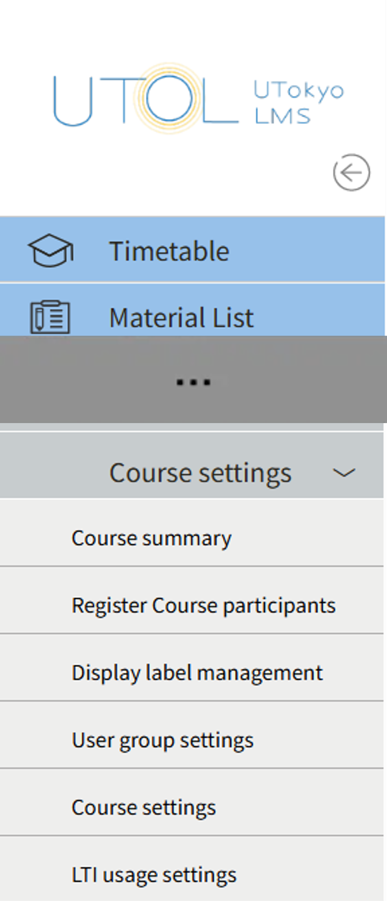
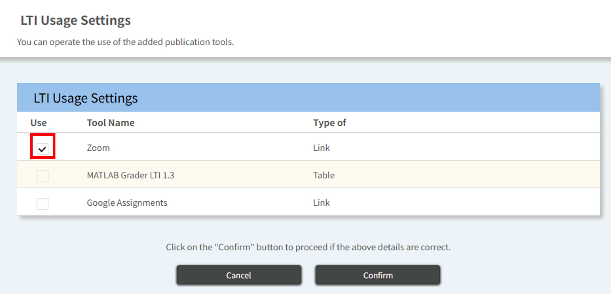
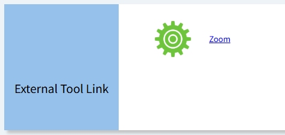
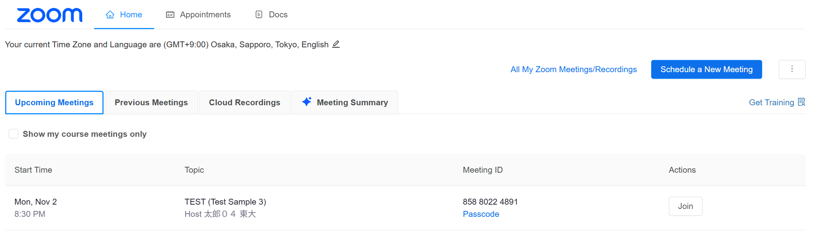
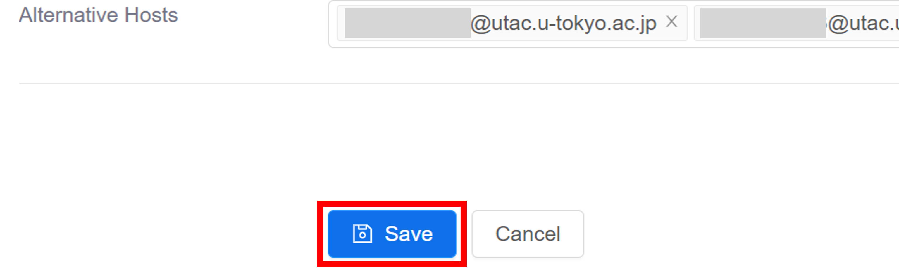
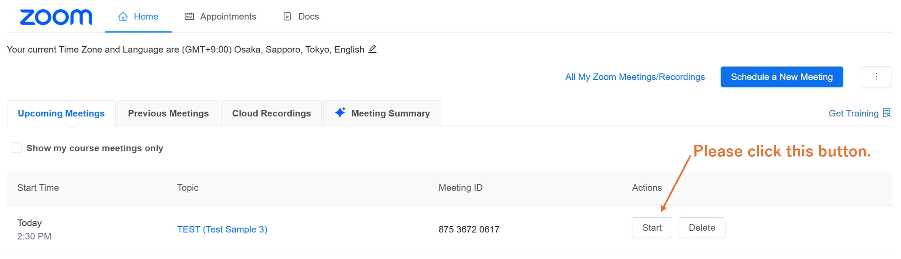
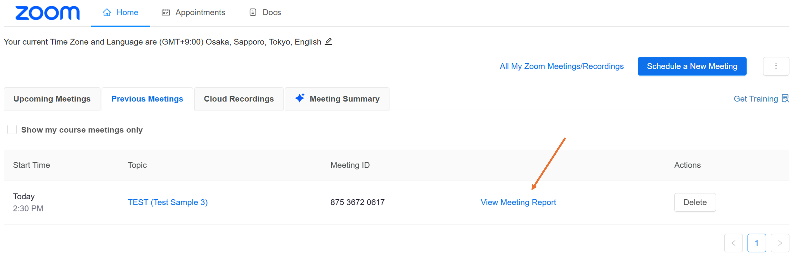
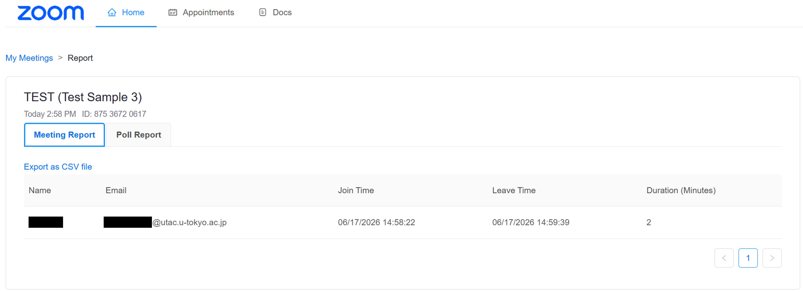
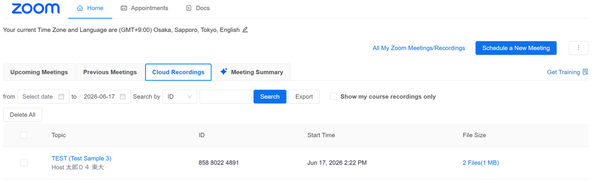
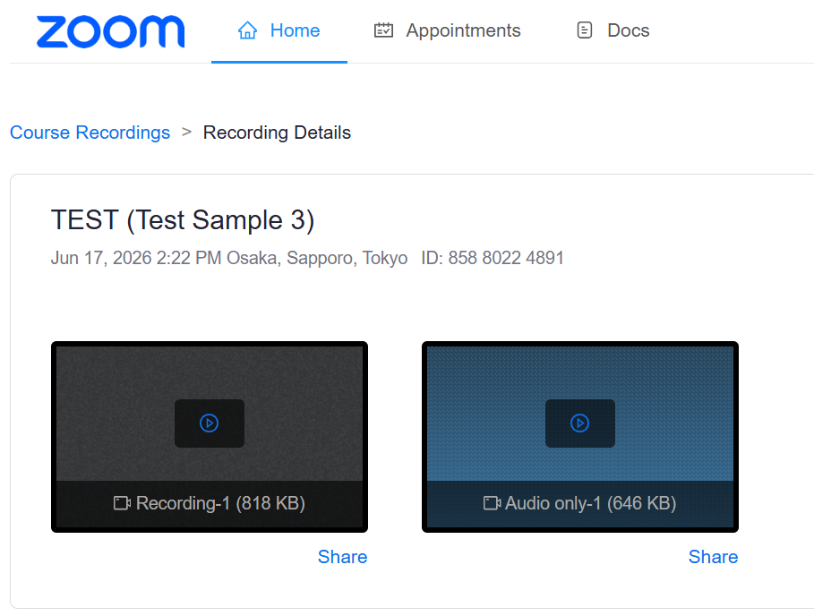

## Overview

With LTI integration, Zoom and UTOL can be used in conjunction. Using LTI integration offers the following advantages.

- Course participants will be able to join Zoom meetings directly through UTOL, without having to check online class URLs or other information.
- Other instructors and TAs registered in the course will automatically be added as “Alternative Hosts” for the Zoom meeting.
- If a meeting is cloud-recorded (Record to the Cloud), course participants will be able to view the recording without the recording URL being made public.

At the University of Tokyo, as a general rule, URLs for online classes should be provided through the “Online course information” section in UTOL. For details, please refer to the "[How to Announce Online Class URL (for Faculty Members)](/en/faculty_members/url/)" page.

## Prepare and conduct a meeting

### Preparation

1. Please apply to use LTI integration via the "[UTOL Zoom LTI Integration Application Form (in Japanese)](https://forms.gle/GY1GsxkoTDdUeSCKA)".
   - A separate application is required for each course.
   - Once the setup is complete, UTOL staff will contact you via email. Please understand that it may take several days due to other work commitments.
2. Select “Course settings” > “LTI usage settings” from the left-side menu on the Course Top screen of the relevant course.
   {:.small}
3. Check the “Zoom” checkbox in the “Use” column on the left side.
   
4. Click the “Confirm” > “Register” buttons. Zoom will be available for use with LTI integration in the course.

### Create a meeting

1. Return to the Course Top screen, click on “Zoom” in the “External Tool Link” section.
   {:.small}
2. Click the “Schedule a New Meeting” button in the upper right corner of the Zoom screen.
   
3.  The settings screen will appear. Configure the settings as needed. 
   - The settings are the same as for a [regular Zoom meeting](/en/zoom/create_room/#settings-general).
4. Click the “Save” button at the bottom of the page.
   

### Start the meeting

1. Click “Zoom” in the “External Tool Link” section on the Course Top screen.
   {:.small}
2. Click the “Start” button for the meeting on the screen, and the Zoom application will start.
   

## View Previous Meetings

### Review meeting reports

1. Selecting the “Previous Meetings” tab in a Zoom meeting displays previous meetings.
   
2. Click “View Meeting Report” for each meeting to view the participants.
   

### View Cloud Recordings

1. Open the Course Top screen.
2. Click “Zoom” in the “External Tool Link” section of the Course Top screen.
   {:.small}
3. Select the “Cloud Recordings” tab.
4. Click the title of the meeting you wish to view.
   
5. Click the button on the recording you wish to view.
   

## Supplementary Notes

- When using the LTI integration between Zoom and UTOL, course participants will be able to join Zoom meetings without instructors having to provide a Zoom meeting invitation link in advance. However, if the Zoom meeting invitation link is not provided, **participants will be unable to join the meeting if they cannot log in to UTOL at the time of the Zoom meeting**.
  - To ensure that students who are having trouble accessing UTOL can participate in classes without any issues, it is recommended to provide Zoom meeting invitation links and other relevant information in the “Online Class Information” section, and to instruct students to check the [UTokyo Online Class Search (UTAS Lite2) (in Japanese)](https://utelecon-directory.adm.u-tokyo.ac.jp/en/login/?next=/jp/) if they are unable to log in to UTOL.
- When a meeting is **cloud-recorded (Cloud Recordings), all course participants, including enrolled students, will automatically be able to view the recording**. If you prefer not to make the recording public to enrolled students or other course participants, please save it locally on your computer or conduct the meeting without using the LTI integration.
- If multiple instructors or TAs are registered in the course, they will automatically be registered as “Alternate Hosts” of the Zoom meeting.
  - However, when another instructor accesses the “Upcoming Meetings” tab for the first time after the meeting has been created, the “Join” button may appear just as it does for enrolled students.

## Reference Page

- [Using Zoom meeting with LTI integration in UTOL (for enrolled students)](../../../students/integrations/zoom/)
- [How to Announce Online Class URL (for Faculty Members)](/en/faculty_members/url/)
  - This is how instructors announce the online class URL (the URL of web conference rooms such as Zoom) to students.
- [Getting Ready for ICT Systems at UTokyo (for Faculty Members)](/en/faculty_members/)
  - This page explains how to use the information system, mainly used for educational activities.
  - Please also see "[Announcing Online Class URLs](/en/faculty_members/#course-url)" and "[Using Zoom](/en/faculty_members/#zoom)" in the middle of the page.
