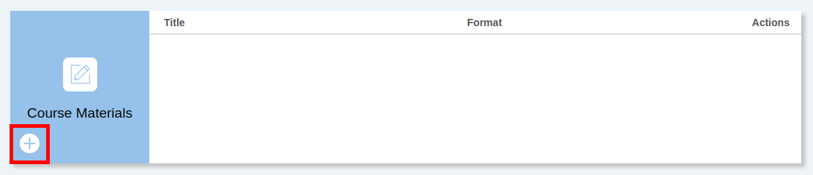
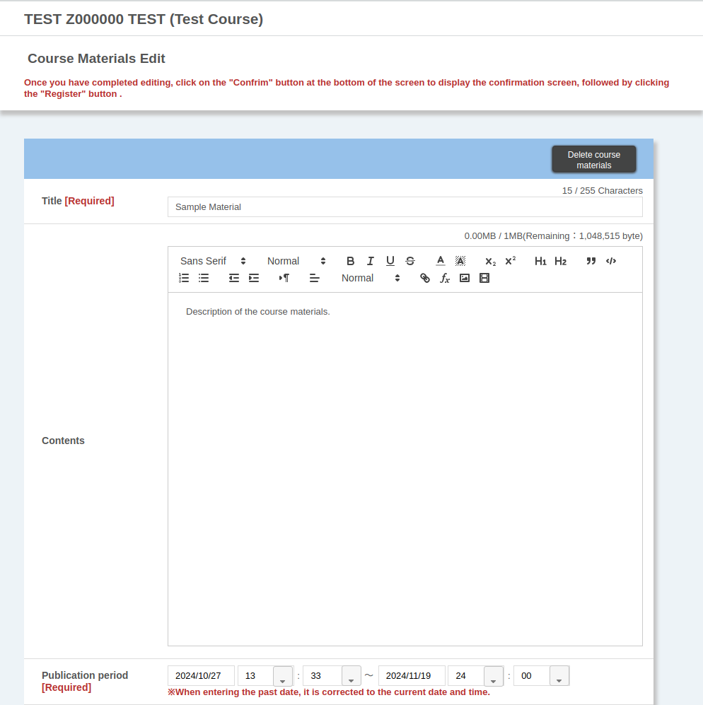
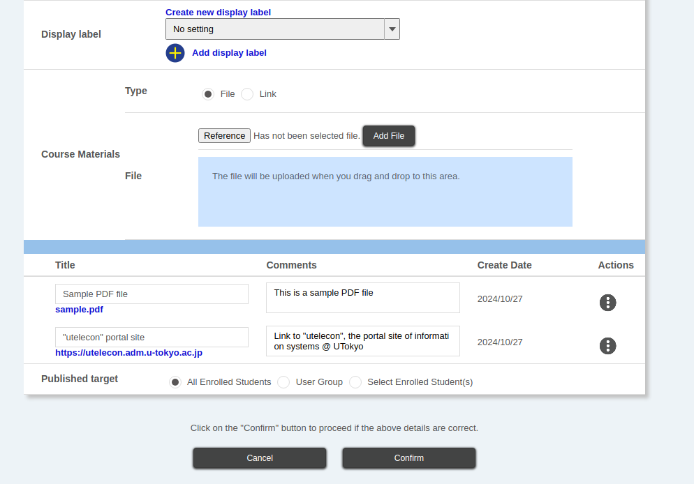
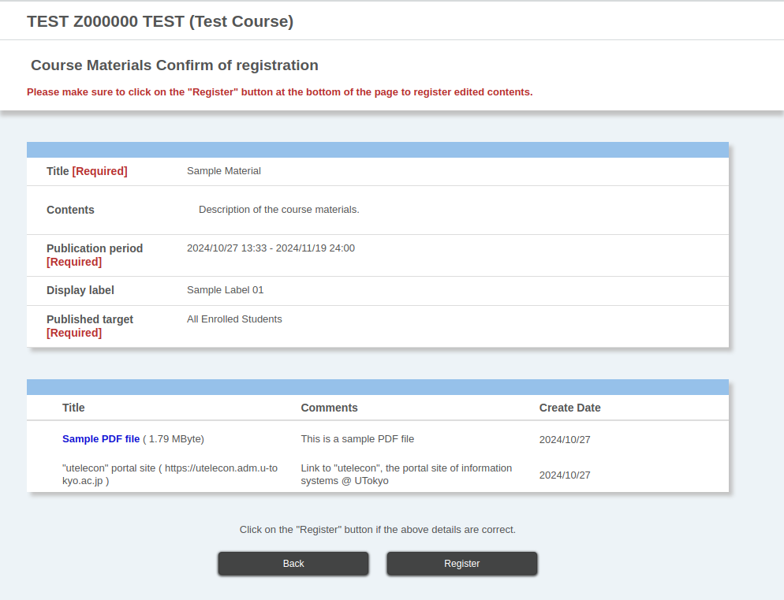
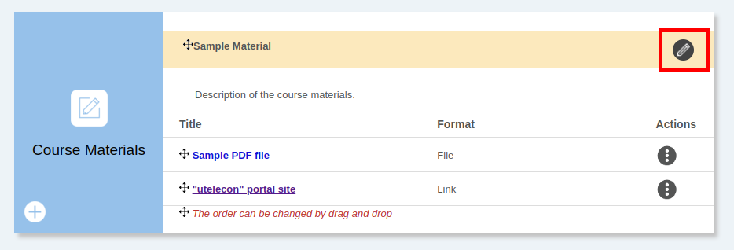
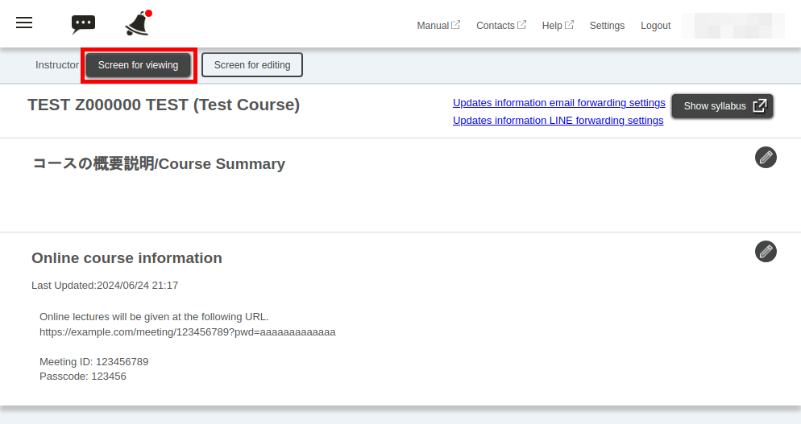
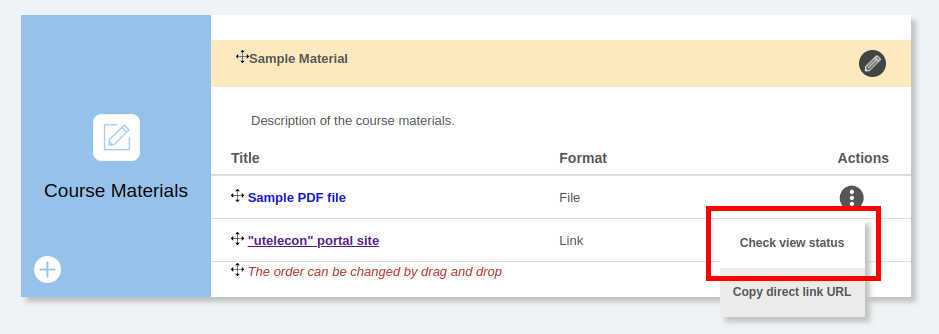
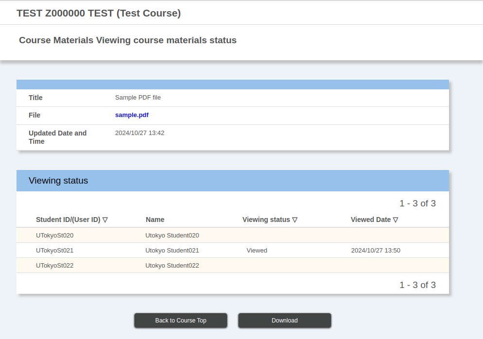

## Overview

The Course Materials function allows you to manage and publish the materials you need for your classes in UTOL. You can set the publication period and targets for the materials and check which students have viewed them and when.

The course materials can be managed and viewed by the course instructors, TAs and course designers. However, only the course instructors and TAs can check the viewing status of the course materials.

### “Course Materials” and “Supplementary Course Materials”

In UTOL, all materials are managed as “course materials”. Each individual material is called a “supplementary course materials”, and these are grouped together at regular intervals to form the “course materials”. Settings such as the publication period and publication targets can be set for each “course material”.

The “course materials” can be divided into sections for each class (e.g. “1st Lecture Materials (4/6)”) or for each group of content (e.g. “Criminal Procedure Law-related Materials”). Furthermore, using the “[label function](/en/utol/lecturers/settings/#label)”, you can also manage the “course materials” by attaching labels (e.g. “For 1st year students”) that are common for assignments and tests.

### “Files” and “Links”

There are two types of teaching materials in the “Course Materials”, “Files” and “Links”. “Files” are files uploaded directly to UTOL, while “Links” are links to external sites.

The main difference between these two types of teaching materials is the file size. Only files of **100MB or less** can be uploaded as “Files”. For this reason, you will need to upload larger files to an external site and then post the link to the upload destination as a “link”. For example, you could upload class slides directly as “files”, while uploading class recordings to Google Drive, YouTube, etc. and posting the links as “links”.

Even if the file size is small, you can also manage it using “Links”. This is the case when you manage the materials on an external site (e.g. Google Slides).

* Related:
  * [Google Drive](/google/drive/)
  * [Create and share videos](/articles/create_share_movie/)

## Managing course materials

This section explains the procedure for managing course materials (registering, updating, deleting).

### Procedure for registering course materials

To register new course materials, open the “Course Top” screen and click the  button at the bottom left of the “Course Materials” section.

The “Materials Editing” page will open. Please fill in or select the following information (explanation will be given over two images).

* “Title” (Required)

  * Example: Lecture materials for the first class (4/6)
* “Contents”
  * Enter a description of the course materials.
* “Publication period” (Required)
  * Example: From the day before the start of classes to the day of the final exam
  * Start date and time of publication: To avoid a sudden increase in the load on UTOL immediately before the start of classes, it is a good idea to make the course materials available at least a day before the start of classes, so that students can download them in advance.

  * End date of publication: It is a good idea that, when to setting this date, to add some extra days so that students can view the materials up to the exam date or the final assignment deadline.
    * The end date of the semester is set as the default day. However, the **exam date and assignment deadline for some subjects may be later than the end date of the semester (especially in the A semester and A2 term)**, so please check the schedule carefully and set the date accordingly.

* “Display Label”
  * To create a new label, click the “Create new display label” button.
  * To use a label that has already been created, select it from the drop-down menu and click “Add display label” to add it.
  * Related:
    * [Configuring Course Settings in UTokyo LMS (UTOL, for Course Instructors/TAs)](/en/utol/lecturers/settings/)

* “Course Materials”
  * “Type”

    * Select the type of course material (file or link).
  * File or link (depending on the type of course material)
    * Please add the course material according to the following procedure.
      * In the case of a file
        * Click the “Reference” button to select a file, or drag and drop it into the specified area, and **making sure to click the “Add File” button**.
      * In the case of a link
        * Enter the link and click the “Add” button.

    * The file name or link name of the course material you have just added will be displayed at the bottom of the screen, so enter the “Title” and “Comments” for that material.
  * You can add multiple course materials by repeating the two steps mentioned above.
    * Please note that you can only add up to 30 files at one time.

  * If you want to delete a course material that you have already added, click the button in the “Operations” section at the bottom of the screen and select “Delete”.

* “Target audience”
  * Select who you want to make the materials available to. You can choose from the following three types.
  * “All Enrolled Students”
  * “User Group”
    * User groups must be registered in advance.

    * Related:
      * [Using user group function in UTOL (for Course Instructors / TAs)](/en/utol/lecturers/settings/user_groups/)

    * Click the group name to see the enrolled students who belong to the group.
  * “Select Enrolled Students”

    * To make the content available to specific students, you can select them individually from the list of enrolled students.

    * A list of enrolled students will be displayed, so check the boxes of the students who you want to make the material available to.

When you have finished filling in, click the “Confirm” button to proceed.
The “Check Registration Information screen” page will open, so please check the details and click the “Register” button.

### Procedure for updating and deleting course materials

1. Open the “Course Top” screen and click the  button to the right of the course material name in the “Course Materials” section.

    

2. This will take you to the Course Materials Edit screen, where you can update or delete the contents.

    * To update: Edit the course material in the same way as you did when registering the course materials.
    * To delete: Click the “Delete course materials” button at the top right of the Course Materials Edit screen.

## Viewing Course Materials

This section explains how to view registered course materials. Not only enrolled students, but also instructors, TAs and course designers can view registered course materials.

This means that when you actually teach the class, you can display images, slides, resumes, etc. on UTOL without having to search for the files on your device. It is also useful for checking how registered course materials are viewed by enrolled students.

UTOL also has a function that allows you to preview some types of course materials. By previewing them on UTOL, you can check the contents of files with the following extensions without having to download them to your device.

* File extensions: `.docx` / `.xlsx` / `.pptx`
* File extensions: `.pdf`
* File extensions: `.png` / `.gif` / `.jpg` / `.jpeg` / `.svg`

### Steps

1. Open the course top screen and click the “Screen for viewing” button at the top of the screen.

    

2. This will take you to the “Screen for viewing”. There, select the file you want to view from the “course materials” column and click it.
3. A pop-up window will appear saying “Preview or download file”. Click the “View” button or the “Download” button.
4. When you have finished viewing, click the “Screen for editing” button at the top of the screen to return to the editing page.

## Checking the course materials access status

This section explains how to check the access status of the course materials.

The course instructors and TAs can check which enrolled students have viewed the course materials and when they did it. The view status can be checked on UTOL. It can also be downloaded as an Excel file format (a password must be set for the file).

### Procedure

1. Open the “Course Top” page, and in the “Course Materials” column, click the  button in the “Operations” column to the right of the file name for which you want to check the viewing status.

    

2. Click the “Check view status” link.
3. A table showing the viewing status will be displayed.
    

4. To download in Excel file format:

    1. Click the “Download” button.
    2. You will be asked to set a password for the Excel file. Enter a password and click the “Download” button again.

## Reference information

* List of related pages
  * [Google Drive](/google/drive/)
  * [Using user group function in UTOL (for Course Instructors / TAs)](/en/utol/lecturers/settings/user_groups/)
  * [Create and share videos](/articles/create_share_movie/)
