## Overview

UTOL course participants (course instructors, TAs, and enrolled students) can send messages to one another. The message function is useful for communication, both inside and outside of class, allowing students to ask instructors questions or exchange messages among students during group work.

The message function is enabled by default, but it can be disabled in the Course Settings. For instructions on how to enable or disable the message function, please refer to "[Enabling and disabling the message function](#enable_disable_function)".

Notifications for messages from students, as well as replies from other course instructors or TAs, can be received via email or LINE. For details, please refer to "[Settings in UTOL to receive notifications](../../notification/)".

## Sending a message

1. Click the {:.icon} button in the Message column on the Course Top screen.
    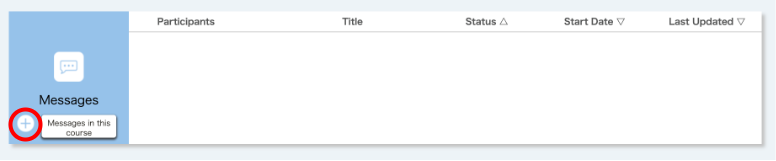
2. Enter the required information in the Send Message screen shown in the image below. Please note that clicking the "Update" button before sending may cause the entered information to be lost.
    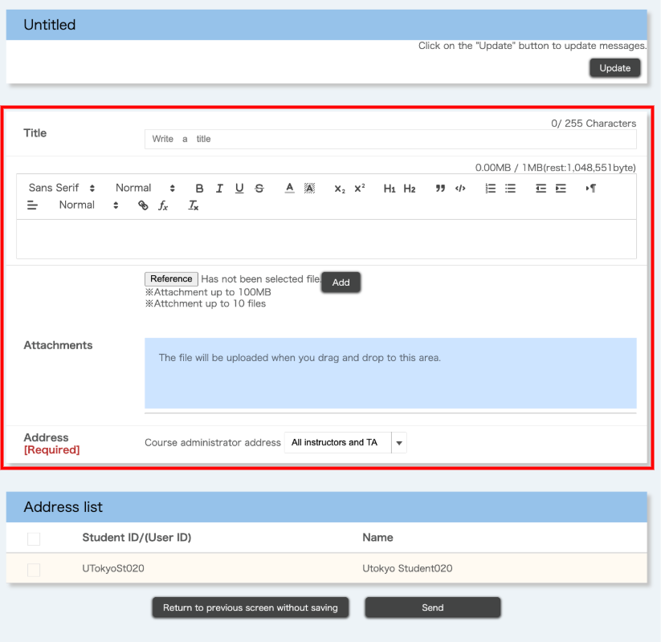
    * Title
    * Main text
      * The markup function is available. For details on how to use the markup function, please refer to "[Using markup function in UTOL](../../markup/)".
    * Attachments
      * To attach a file, click the "Reference" button, select a file, and click the "Add" button.
      * Please refrain from using attachments when in an emergency or when sending messages to a large number of recipients.
    * Address: Specify the addresses for course instructors / TAs (/ course administrators) and students separately, depending on to whom you intend to send the message.
      * Specify the addresses for course instructors / TAs (/ course administrators).
        * Select either "All instructors and TA" or "All instructors".
      * Specify the student addresses.
        * Select students by checking the checkbox on the left side of the Address list. You can select all students by checking the top checkbox.
3. Click the "Send" button at the bottom of the screen.
4. Once the message has been sent, the Send Message screen will appear.
    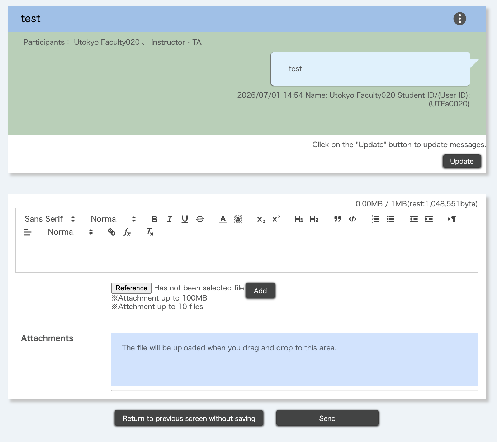

## Check and reply to received messages

1. Check the Message section on the Course Top screen.
    - When there are unread messages, "Unread" will appear in the Message Status column.
    - If the list of messages is not displayed in the Message section, please check whether the button at the top of the Course Top screen is set to "Screen for editing". (When it is set to "Screen for viewing", the Message section appears, but received messages are not shown, and the list of messages remains empty.)
      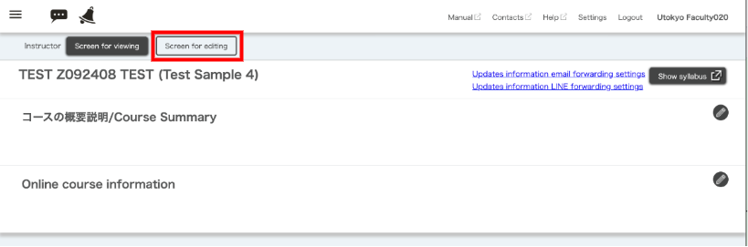
    - Clicking the "Messages in this course" button displays a list of messages that you have either sent or received.
2. Clicking a message title you want to view opens the Send Message screen.
    <figure class="gallery">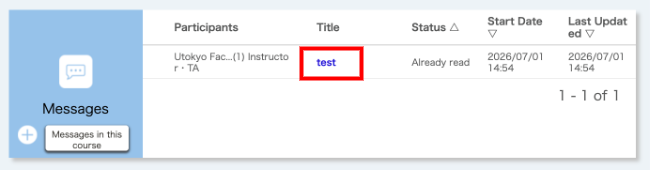 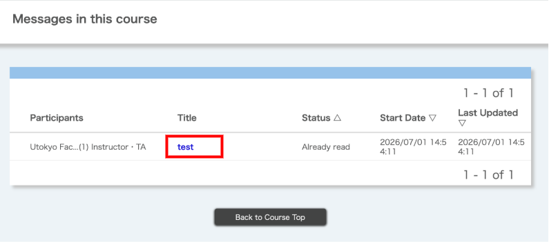</figure>
    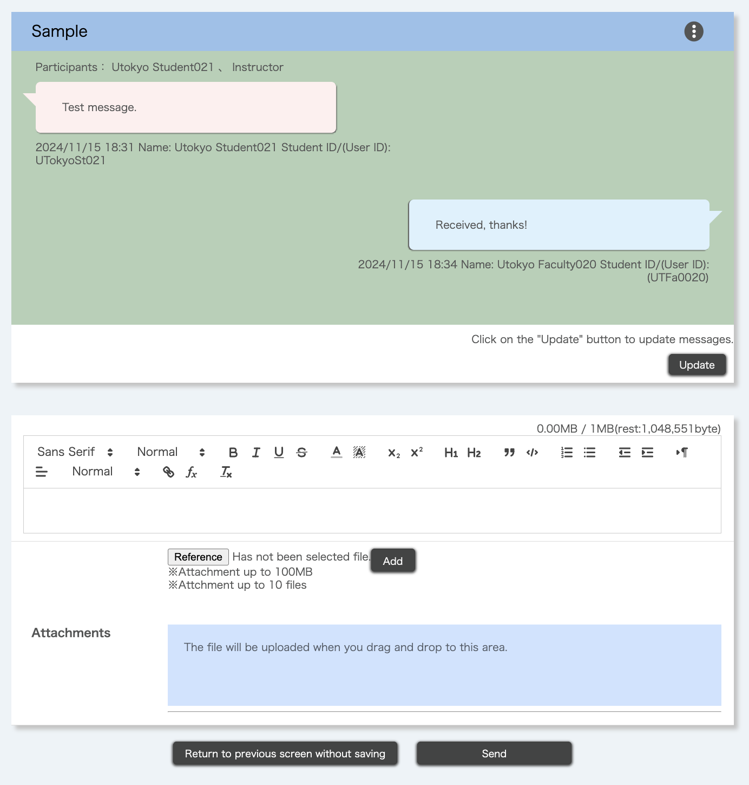
    - At this point, the status changes from "Unread" to "Already read".
    - Clicking the "Update" button on the "Send Message" screen refreshes the page. If other users have posted messages while the screen was open, those messages will appear after the refresh.

## Check message exchanges among enrolled students

Course instructors can view message exchanges among enrolled students. However, they cannot reply to or delete any messages. TAs cannot view them.

1. Click the three-line menu icon at the upper left of the Course Top screen and click "Other".
    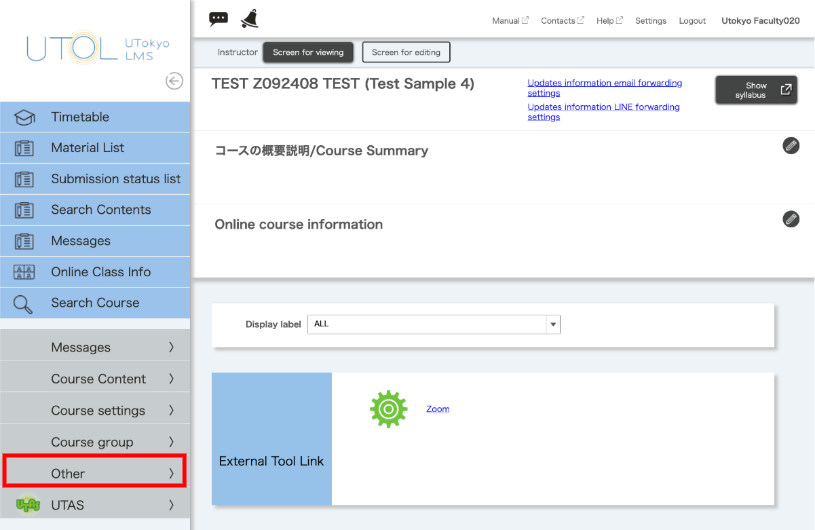
2. Click "List of messages between students" in the "Other" menu.
    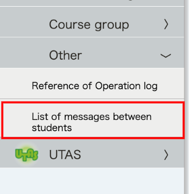{:.small}
3. The list of messages between students will be displayed. Clicking a message title you want to view opens the Message screen.
    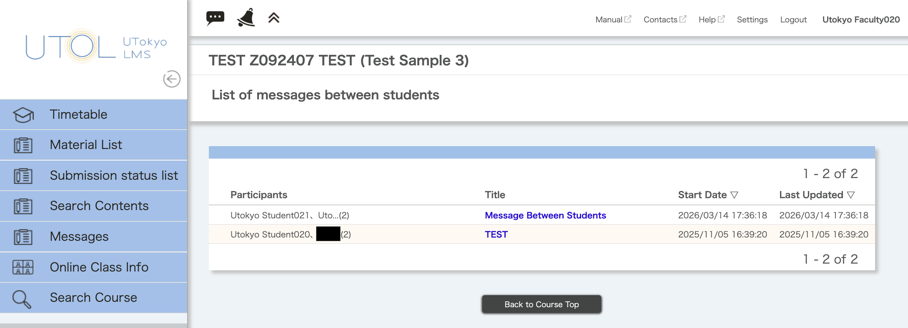

## Enabling and disabling the message function
{:#enable_disable_function}

Course instructors can enable or disable the message function for the course. However, TAs do not have this authority.

1. Click the three-line menu icon at the upper left of the Course Top screen and click "Course settings".
    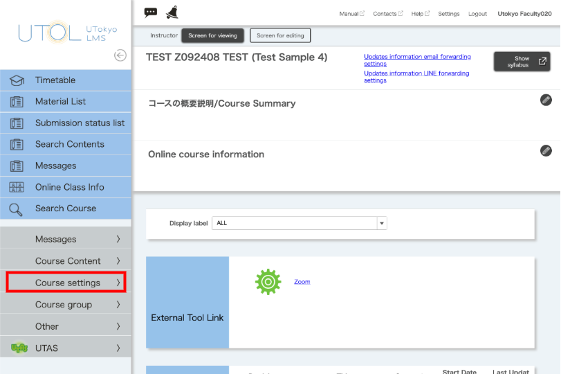
2. Click the "Course settings" in the "Course settings" menu.
    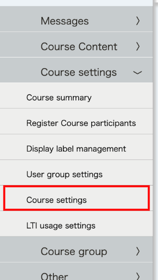
3. The course edit screen will appear. Check the "Message Usage" checkbox to enable it, or uncheck it to disable it, then click "Confirm" at the bottom of the page.
    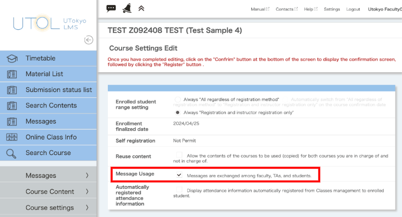
4. A confirmation screen will appear. Under "Message Usage", confirm that it shows "Messages are exchanged among faculty, TAs, and students." if you want to enable it, or "No message exchange among faculty, TAs, and students." if you want to disable it. Then click "Register" at the bottom of the page.
