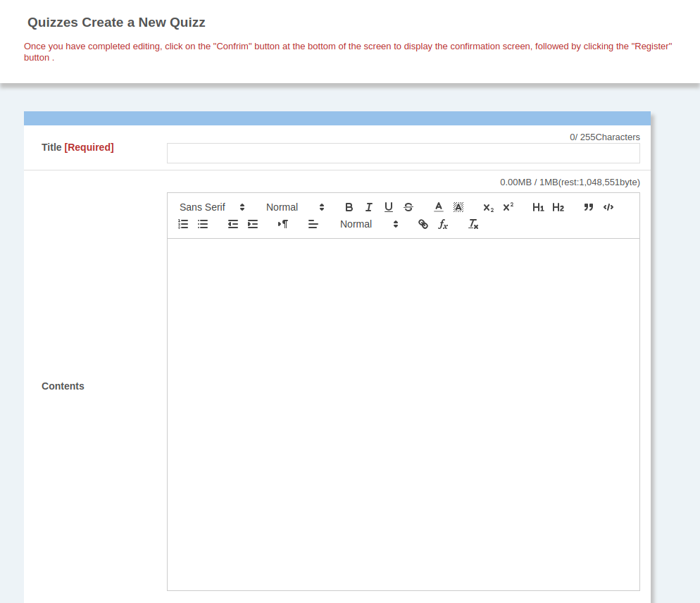
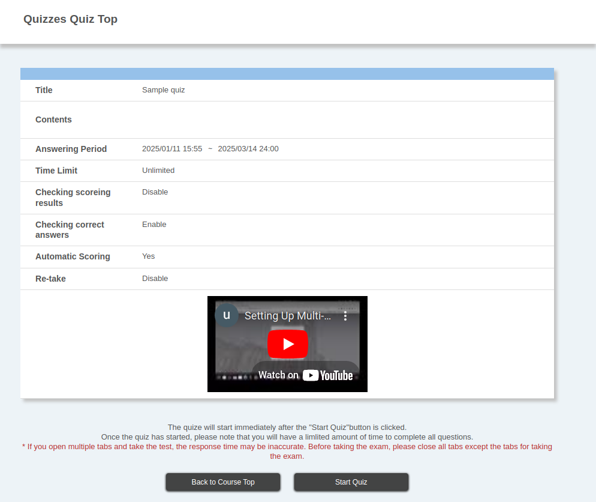

import DisplayLabel from '../_displaylabel/DisplayLabel.mdx';

This page explains how to create new and edit existing quizzes on UTOL.

Please refer to “**[Scoring quizzes and checking answer status](grade_and_evaluate)**” for information on scoring quizzes and checking submission status.

Please refer to “**[Using the Quiz function on UTOL](.)**” to obtain more information on the quiz function.

## Creating a new quiz
{:#create}

To create a new quiz, click on the “+” button in the “Quizzes” section of the “Course Top” screen. The “Create a New Quiz” screen will appear.

Please follow procedures 1 to 3 to set up the quiz.

### Procedure 1: Settings for the entire test
{:#general_settings}

First, please enter the setting items for the entire quiz. You can edit the settings even after they have been completed, but depending on the timing, the items that can be edited may be limited. For details, please refer to “[Editing a created quiz](#update)” at the bottom of this page.

The meanings and notes for each setting item are as follows. Note that the items marked with an asterisk (\*) are required.

-   **Title\*:** The title of the quiz
-   **Contents**: A quiz description (supports the [markup function](/en/utol/markup/))
-   **Video URL**: The URL of a video to be displayed on the screen before the quiz starts.
    {:.small}
    -   If the URL starts with `http://`, a link to the video, rather than the video itself, will be displayed.
-   **Answering period**\*: Using the start and end dates, specify the period during which students can access the test here.
-   **Time limit**: With this function, you can set a time limit.
    -   If you do, the answers will be sent automatically when the time limit is reached.
-   **Waiting time**\*: This is how long students will wait on the “Begin Answer” screen.
    -   When you set this, they cannot start the test until the time has elapsed.
    -   This function can be used to ensure that students watch the video specified in the video URL.
-   **Display the waiting time**: If you set a waiting time, it allows the option to display the waiting time or not.
    {:.small}
-   **Random Quizzes**\*: It allows you the option to randomly generate or not questions that differ depending on the student.
    -   If you use random questions, please also enter the number of questions you want to ask.
    -   If you want to ensure that a question is always included in the test, regardless of the students, you can make it a required question. For information on how to specify a required question, please refer to the end of [Procedure 2](#create_problem).
-   **Passing score**\*: Answers that exceed the specified score will be marked as “passing” on UTOL.
-   **Checking scoring results**\*: It allows students the option to refer to the scoring results themselves or not.
    -   Disable: The scoring result is not disclosed.
    -   After Submission/After scoring: The student can access the result at the time of submission or later.
    -   After Submission Period: The student can access the result after the end **of the** answering period.
        -   In cases other than “Disable”, the student can refer to the scoring results in order from the questions for which the scoring has been completed.
-   **Checking correct answers**\*: It allows the option to disclose the correct answers to the student or not.
    -   Disable: The correct answers are not disclosed to the student.
    -   At submission: The student can access the correct answers at the submission time or later.
    -   After scoring: The student can access the correct answers after completing the scoring.
    -   After Submission Period: The student can access the correct answers after the answering period ends.
        -   In the case of “At submission” or “After scoring”, please be careful as the correct answer may be revealed to other students who have not yet taken the test.
-   **Automatic scoring**\*: Set whether or not to score questions automatically.
    -   Questions that are not compatible with automatic scoring need to be scored by the instructor or TA.
-   **Re-take**\*: Set whether or not the student can re-take the test after submitting answers
    -   It is also possible to only allow re-takes if the student has not reached the passing score.
-   <DisplayLabel />
-   **Published target**\*: This function limits the students who can take the test.
    -   By default, “all enrolled students” can take the test.
    -   By specifying [user groups](../settings/user_groups/) or students, you can restrict the test to only specific students in the course.

### Procedure 2: Creating a New Question
{:#create_problem}

Click on “Create New” in the “Create a New Question” section at the bottom of the “Create a New Quiz” screen. The “Register for Questions” screen will then appear.

1. First, decide the format of the question you want to create. Please choose the appropriate one from the following four types according to the content you want to ask about.

    -   **Single-selection format**: A question where the student chooses one answer from the options. Automatic scoring is possible.
    -   **Multiple-selection format**: A question where the student chooses multiple answers from the options. Automatic scoring is possible.
    -   **Free-text format:** A question where the student writes the answer freely. Automatic scoring is not possible.
    -   **Fill-in-the-blank format**: This is a question where you ask the student to fill in the blanks in the question. It can be automatically scored, but you must be careful about variations in notation, as only answers that match exactly will be scored as correct.

2. Next, please enter the information for the question (the screenshot below is for a single-selection format).
    

    The meanings and notes for each setting item are as follows. Items marked with an asterisk are required.

    -   **Title**\*: The title of the question
    -   **Contents**\*: A question description (supports the [markup function](/en/utol/markup/))
        -   (only the Fill-in-the-blank format) Click on the “Add a fill-in-the-blank tag” at the top right for the blank spaces. The `[fb]`tags are added to the question.
    -   **Number of answer items**\*: (Except for the Free-text format) The number of answer choices or blanks
    -   **Answer item/Correct Answer**\*: (only the selection-formats) Answer choices.
        -   Please specify the correct answer using the radio buttons on the right.
    -   **Correct Answer**\*: (only the Fill-in-the-blank format and Free-text format) Correct answer
        -   This field is required even for the free-text format, which cannot be automatically scored.
    -   **Automatic scoring method**\*: (only the Fill-in-the-blank format) How should the scores be allocated when multiple blanks exist?
        -   There are three formats as follows.
            -   The score is allocated according to the number of correct answers (complete match).
            -   If there are any incorrect answers (incomplete match), the score is 0.
            -   The score is not allocated if there are any incorrect answers (incomplete match).
        -   You cannot give each blank a different point value.
    -   **Commentary**: Commentary text.
    -   **Point value**\*: Enter the number of points to be given to the correct answer by the automatic scoring.
    -   **Image**: You can upload images when you want to ask questions about images or use images as a supplement.

3. After entering the necessary information, click on “Register” at the bottom of the screen to register the question. Please note that although the question has been registered, the test has not yet been completed.

4. After you have finished setting up the entire test and creating the questions, click on “Confirm” at the bottom of the “Create a New Quiz” screen to check the contents, and then click on “Register” to register for the test.

You can also reorder the questions you have created and edit them again on the “Create a New Quiz” screen of the test.

If you set the test to use “Random Quizzes” in Procedure 1, you can specify the required questions on the “Create a New Quiz” screen. Please check the box at the upper right corner of the question you want to make required.

### Procedure 3: Simulating a test
{:#simulation}

After creating a test, you can use the “test simulation” function to check how it will look when students take it. We recommend that you use this function to check that the test can be appropriately answered from the test-takers’ perspective and that there are no questions that cannot be answered other than just from the perspective of the test creator.

1. Click on the “Simulation” button on either the “Create a New Quiz” screen or the “Edit Quizzes” screen.
    
2. The “Start Test Simulation” screen will be displayed. Please click on “Take Quizzes” to begin the exam.
    -   If the test has a waiting time, click on “Skip the waiting time” to eliminate the waiting time and display “Take Quizzes”.
3. Please answer each question.
4. After answering the questions, click on “Confirm” to move to the “Check your answer” screen.
5. Check your answers and click “Submit” to send them. The “Response result” screen will be displayed.
6. Finally, click “Back”. You will be taken back to the “Create a New Quiz” screen or the “Edit Quizzes” screen”.

If any problems are found in the test simulation, to fix the test, please refer to the section below on “[Editing the Test You Have Created](#update)”.

## Editing the test you have created
{:#update}

To edit a test you have already created, click on the title of the test title you want to edit in the “Quizzes” section of the “Course Top” screen. The “Edit Quizzes” screen will look the same as the screen you see when you first register for a test.

### Editing the settings for the entire test

You can edit the settings for the entire test. For an explanation of each setting item, please refer to “[Procedure 1: Settings for the entire test](#general_settings)” in “Creating a new quiz”.

Unlike when you first registered, the items you can edit are limited depending on the timing. The items you can edit are as follows.

-   **Before** the start of the answering period: All test items
-   **After** the start of the answering period: Only the seven items listed below
    -   Title
    -   Contents
    -   Video URL
    -   Answer period (extension or shortening)
    -   Checking scoring results
    -   Checking correct answers
    -   Questions answer items

### Editing questions

You can edit each question in the test. To edit a question, click on the pencil icon at the top right corner. To explain each question item, please refer to “[Procedure 2: Creating a New Question](#create_problem)” in “Creating a New Quiz”.

As with the overall test settings, the items you can edit are restricted depending on the timing. The items you can edit are as follows.

-   **Before** the start of the answering period: All test items
-   **After** the start of the answering period: Only the following items
    -   Answer items (only for the Multiple-selection format)
    -   Correct answers

In addition, after the start of the answer period, it is impossible to reorder, add or delete the questions.

If the questions that are automatically scored (multiple-selection, fill-in-the-blanks) are changed, the answers will be scored again, and a notification will be sent to the students concerned. Therefore, if the answer period has already started and some students have already answered the questions, you must be careful when scoring the answers.

## Using templates
{:#use_templates}

With the quiz function, you can reuse tests you have created by registering them as templates in other courses where you participate as a recipient (course instructor, TA, course designer). You can also use templates registered by other users, but only within the same course. Please use this function if you oversee multiple classes with the same content or if you want to reuse tests from previous years.

Please note that the only settings saved as templates are the test title (which is also saved as the template title) and each question.

### Registering quiz templates

To register a template, please follow the procedure below.

1. On the “Course Top” screen, click on the title of the test you want to register as a template in the “Quizzes” column.
2. When the “Edit Quizzes” screen appears, click “Register template” in the “︙” mark on the left of the “Create a New Question” column.
    
3. When the “Confirm Quizzes template” screen appears, check that the template details you are registering are correct, then click “Register”.

Please note that the template title will be registered with the same name as the test title. Although it is possible to have duplicate titles between templates, to prevent confusion, we recommend changing the title to something easy to distinguish, following the instructions in the next section, “Editing and deleting quiz templates” .

### Editing and deleting quiz templates

To edit and delete quiz templates, please follow the procedure below.

1. On the “Course Top” screen, click the “Edit template” in the “Quizzes” column. The “Quiz Template list” screen will appear.
    
2. Click on the title of the template that you wish to edit or delete.
    -   **To edit a template**: Please edit the displayed settings. You can only edit the template title and questions. Other items displayed on the “Create a New Quiz” and “Edit Quizzes” screens cannot be edited as they are not included in the template.
    -   **To delete a template**: Please click “Delete” in the top right of the screen.

### Taking over another user’s template

You can register templates created by other users as your own. To take over a template from another user, follow the procedure below.

1. On the “Course Top” screen, click on “Edit template” in the “Quizzes” column. The “Quiz Template list” screen will appear.
2. For templates created by other users, “Register” will be displayed. Click “Register” for the template you want to take over.
3. The “Create/Edit Template” screen will be displayed. Make any necessary changes, such as changing the title to something more descriptive, and then click “Confirm”.
4. Check the content, and if there are no errors, click “Register”.
