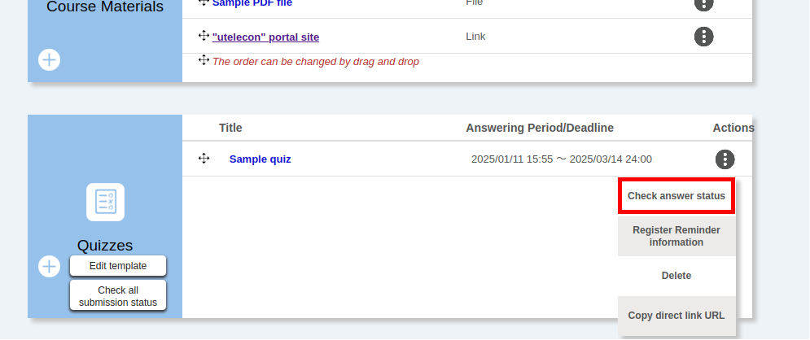
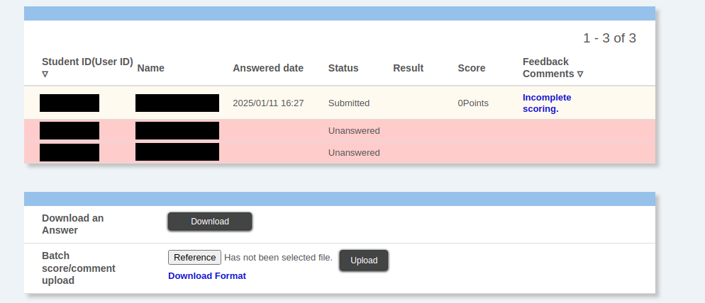
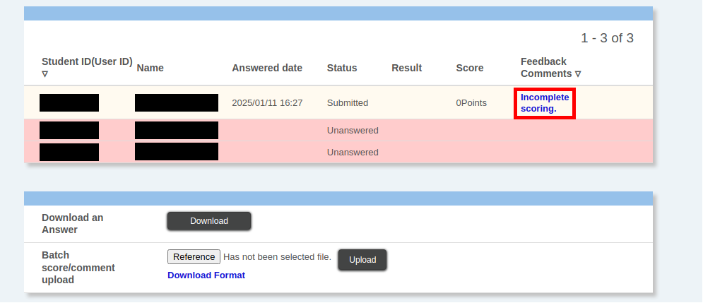
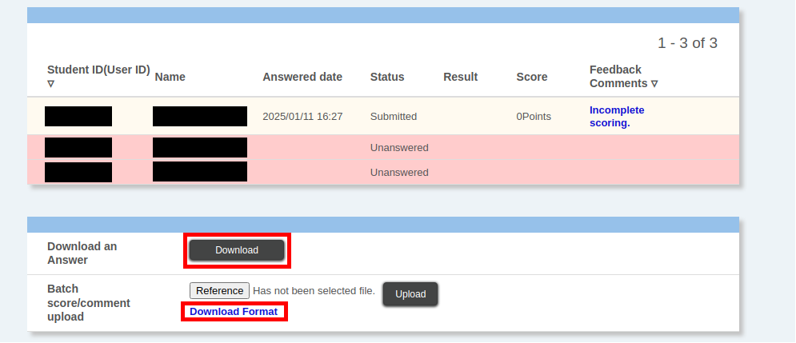
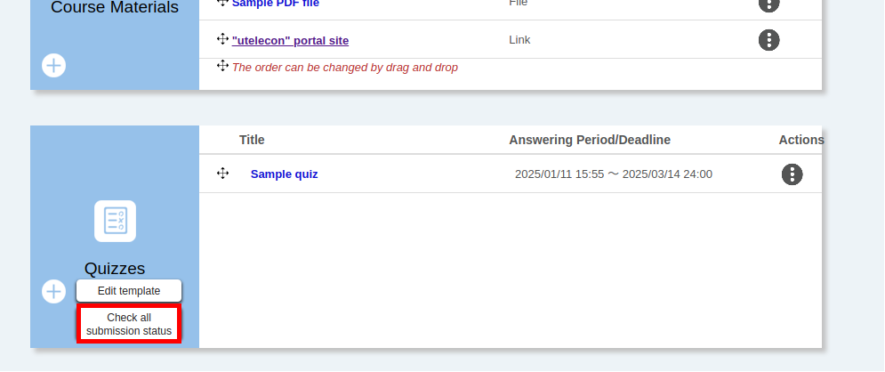
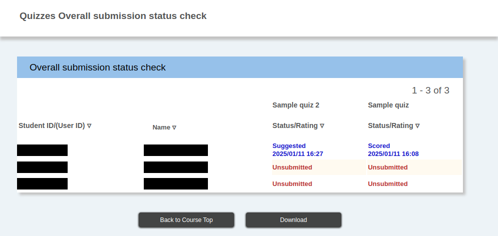
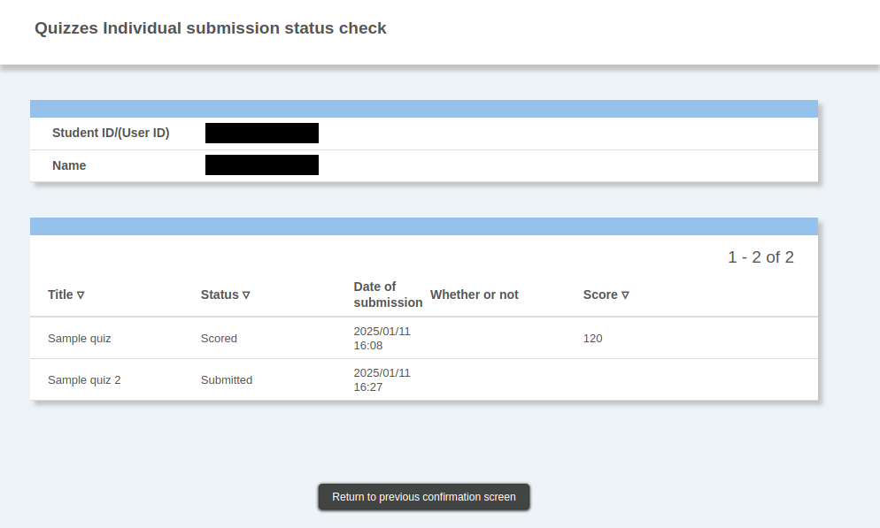

This page explains how to score quizzes created in UTOL and check the submission status for rating and other purposes.

For information on how to create and edit quizzes, please refer to “**[Creating and editing quizzes](../create/)**”, and for an explanation of the test function in general, please refer to “**[Using the quiz function](../)**”.

## Caution

When scoring, it is recommended that you do not simply accept the results of the automatic scoring function but check them instead. For example, for the fill-in-the-blank questions, there are cases where answers that should be correct are scored as incorrect for the following reasons, among others.

-   Half-width and full-width differences (e.g., 「トウキョウダイガク」and「ﾄｳｷｮｳﾀﾞｲｶﾞｸ」)
-   Variations in notation (e.g., “E-mail” and “Email”)
-   The presence of unintended spaces

Given that these cases exist, it is recommended that you screen for any incorrect answers to the “fill-in-the-blank” questions.

## Checking and scoring test answers of students

To check the enrolled students’ test answers, please follow the procedure below.

1. Click on “Check answer status” in the “{:.icon}” button on the right of the “Quizzes” column on the “Course Top” screen.
    

2. The answer status of each student will be displayed, so please check it.
    

    -   Students who have not answered the test will be displayed in red.

    -   For those who have already answered the questions, the total score for the questions automatically scored will be displayed. However, if there are questions that are not automatically scored, you need to be careful as the scoring has not been completed.

The procedure from here will differ depending on the scoring method. There are two ways to score the answers.

-   [Scoring on UTOL](#grade_on_utol)
-   [Downloading the Excel file for scoring and uploading it after scoring](#grade_on_excel)

### Scoring on UTOL
{:#grade_on_utol}

To score answers on UTOL, please follow the procedure below. However, you will need to be connected to the internet when scoring.

1. On the “Check answer status” screen, click on “Incomplete scoring.” for the answer you want to score.
    

    -   If the answer has already been scored, “Score / comment” will be displayed instead, but you can still score it again in the same way.

2. For each question, please set the following items and score the answers.

    -   Scores
        -   Questions that have been automatically scored: The score has been entered.
        -   Questions that have yet to be automatically scored: The score is 0, so please check the content and enter the appropriate score.

    -   Feedback Comments: You can enter comments on the answer.

3. After scoring the answers, click “Register” at the bottom of the screen. Even if you have not changed the score of all questions that are not automatically scored from zero, you can still complete scoring by clicking this button.

4. For tests that multiple students have answered, you can score the answers without returning to the “Test Answer Status” screen by clicking “Prev” or “Next” at the bottom of the screen.

### Downloading the Excel file for scoring and uploading it after scoring
{:#grade_on_excel}

You can enter the scoring results using Excel by downloading the Excel file for scoring (and the Excel file for the answers). You can also score offline if you download the Excel files in advance.

To score using this method, please follow the procedure below.

1. Download the necessary files from the “Check answer status” screen. There are two files you can download.

    -   **Excel file for scoring**: The file in which you enter the scoring results. It does not contain the answers. Upload it to UTOL in the later procedure.
    -   **Answer Excel file**: This file contains the students’ answers who took the test. Please be careful; you cannot upload this file to UTOL even if you enter the scoring results.

    The first can be downloaded from “Download Format”, and the second can be downloaded from “Download” in “Download an Answer”.

    

2. Open the Excel file for scoring and enter the “score” and “comments” as the scoring results. As this file does not contain the answers, please refer to the answers in the UTOL or the separately downloaded answer Excel file.

    -   You cannot enter anything other than “Score” and “Comments” in any of the columns.

    -   You can also set the scores for students who did not answer the test.

3. Once you have finished entering the scoring results, click “Reference” on the “Check answer status” screen, select the Excel file for scoring, and then click “Upload” to upload the file.

    -   It is okay if you have not entered scoring results for all the rows.

    -   An error will be displayed if there are any wrong inputs in the file content. Please fix the file according to the error message and upload it again.

4. If the file is uploaded successfully, the scores and feedback comments in the Excel file for scoring will be loaded, and the status column for the scored students in the “Answer Status” screen will change to “Marked” or “Entered by the instructor”.

## Checking the answer status of all quizzes

This function allows you to check the submission status of tests in the course as one unit for scoring purposes. To check the submission status of all tests, click on “Check all submission status” in the “Quizzes” section of the “Course Top” screen.

-   On the “Overall submission status check” screen, you can check the submission status of each test for all students.
    

-   To download the submission status as one unit, click “Download” at the bottom of the screen.
    -   You will need to set a password before downloading. Please set a password on the screen that appears.

-   You can check the submission status of only that student by clicking on the student number (or Common ID) on the “Overall submission status check” screen.
    -   You can view each test’s status, answered date and time, score, and pass/fail.

    
