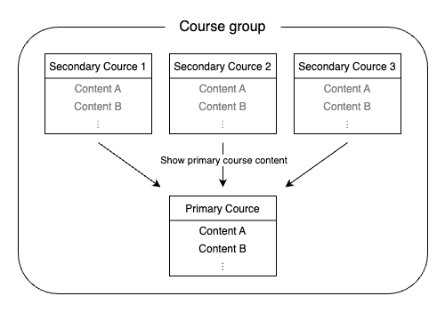

Courses created automatically on UTOL are registered based on the timetable codes on the Academic Affairs System (UTAS). Therefore, in cases where a single class is offered by multiple departments (offered as a combined course), multiple courses may be registered for the same class.

In these cases, you can use the course group function to manage your course materials, tests, notifications, all together. By using the course group function to set up a "course group" that links multiple courses to a single "primary course", you can display the contents of the primary course regardless of which course in the group you are registered to or viewing.

If you create a combined course (multiple sign-up course) on UTAS before creating a course on UTOL, a course group will be set up automatically.

## Registering a course group

Before setting up a course group, you must delete all the contents from the courses that will be registered as a secondary course. If you have not added any content to the secondary course, you do not need to follow the procedure for deleting course contents from a secondary course.

### Procedure 1: Deleting course contents from the course that will be the secondary course

1. From the timetable, click on the course that will be the secondary course and open the Course Top screen.
2. Click on {:.icon} at the top left of the screen.
3. Expand the "Course Content >" menu on the left and click on "Delete All Contents".
    
4. A dialog box will appear asking, "Are you sure you wish to delete all contens? Once you delete, they will not be able to be restored." Please click "Delete".

### Procedure 2: Registering a course group

1. From the timetable, click on the course that will be the primary course, and open the Course Top screen.
2. Click on  at the top left of the screen.
3. Expand the "Course group >" menu displayed on the left, and click on "Register Course group".
    
4. On the "Register Course group" screen, click the checkbox to the left of the row for the course you wish to set as a secondary course, and then click on the "Confirm" button to proceed.
    
5. The confirmation screen will appear. Please click "Register".

## Dissolving a course group

### Precautions

Please note the following when you dissolve a course group.
- All the contents in the course will be moved to the primary course, and they will no longer be viewable from the secondary courses.
- You can no longer view the data for assignments and tests submitted by students in courses other than the primary course.

### Procedures

1. From the timetable, click on the course which you want to dissolve as a course group to open the Course Top screen.
2. Click on  at the top left of the screen.
3. Expand the "Course group >" menu on the left and click on "Release course group".
    
4. On the "Release Course group" screen, select the course group you wish to dissolve and click on the "Confirm" button to proceed.
    
5. A dialog box will appear saying, "Is it correct that I will not be able to see the submitted data of users who are enrolled in the course to be deactivated?
*Once deactivated, it cannot be restored." Please click "Release".
6. A confirmation screen will appear.  Please click "Release".
