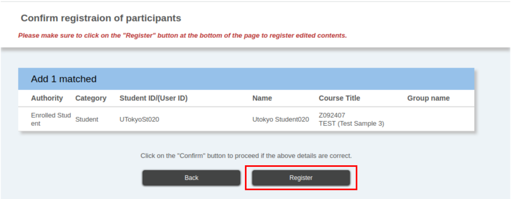

## Function Overview
{:#about}

The “Registering course participants” function allows you to manage course participants (users, such as instructors, TAs, enrolled students, etc. who participate in a course through UTOL).

Specifically, the following operations are available.

* [Confirm a list of course participants or registration method](#list)
* [Register course instructors who co-teach a course (who is not registered on UTAS) and TAs](#register)
* [Register students who have not registered through UTAS for a course](#register)
* [Update the registration method for course participants](#update)
* [Delete course participants](#delete)

### Authority
{:#role}

Course instructors and designers can perform all operations described on this page. TAs can only view the course participants list but cannot register or delete them.

## Confirming Information of the Course Participants
{:#list}

You can view the information of the course participants in a list format on the “Course participants list” of the “Course Participant Registration screen” page. In addition, this information can be downloaded as an Excel file.

### Information can be viewed in a list format
{:#information}

The following information can be viewed in the “Course participant list”.

* **Authority**: The user’s authority will be displayed as one of the following four types: “Course Instructor”, “TA”, “Course Designer”, or “Enrolled Student”. If the user has both TA and enrolled student authorities, it will be displayed as “TA and enrolled student”.
* **Category**: The user’s UTokyo Account indicates whether they are a student, a faculty member or a staff member. If the user’s UTokyo Account has both student, and faculty or staff member status, it will be displayed as “Student/Faculty and staff.” Please note that this display does not reflect whether the user participates in the course as a student, a faculty member or a staff member.
* **Student ID/(User ID)**: If the user has a student ID number, this number will be displayed. If the user does not have a student ID number, a Common ID (the first 10-digit numerical part of the UTokyo Account) will be displayed.
* **Course Title**: The course titles that enrolled students have registered for will be displayed. If the [course group function](../course_group/) is applied, you can confirm the course titles students have registered for.
* **Group Name**: When the user belongs to a [user group](../user_groups/), this group name will be displayed. If the user belongs to multiple groups, all group names will be displayed.
* **Registration Method**: The method by which the user registers for a course will be displayed.
  * Self registration: This indicates that the enrolled students have [registered for a course](../../../students/course_registration/#self-registration) in UTOL by themselves. This will depend on [the settings for self registration or the enrollee range settings](../#self-registration-and-content-use-scope) whether or not enrolled students can register by themselves.
  * Register instructor: This indicates that the user was registered for a course by the course instructor or the course designer.
  * Enrolled Registration: This indicates that the course the student registered for through the UTAS has been automatically linked, resulting in their enrollment. Please note that the course registration through the UTAS will be reflected in UTOL the next morning after the registration.
  * Manage Attendance: This indicates that enrolled students have been registered by a batch registration of attendance.
  * Favorite registration: This indicates that students have been registered in the corresponding UTOL course as a result of adding “Favorite” to the syllabus of the UTAS. Please note that adding the course to Favorite in the UTAS will be reflected in UTOL the next morning after the operation. In addition, if the student has clicked “Add to Favorites” on the syllabus of the UTAS, and has also registered for the course in the UTAS, it will be displayed as “Enrolled Registration”.
  * System registration: This indicates that the course instructor has registered the student as a course participant as a result of linking the registered information with the UTAS.

### How to check the list
{:#how-to-check}

“Course participants list” can be viewed by following the steps below.

1. Click the icon “{:.icon}” in the upper right corner while the course you would like to operate is being displayed.
2. Select “Register course participants” in the “Course settings”
    {:.medium}

## Registering Course Participants
{:#register}

There are two kinds of methods for registering course participants, as follows,

* **[Search and Register](#search)**: Search for users you wish to register using information such as the user’s name, student ID number, etc. and then complete the registration. This method is recommended when you wish to register a specific type of participants, such as adding a course instructor or a TA.
* **[Register Using an Excel File](#excel)**: Download an Excel file format for the course participant registration, enter the user’s information (student ID number, user ID, etc.) into the file, and then register the participants by uploading the file.

Please pay attention to the following points when registering course participants.

* When you wish to register users with “TA and Enrolled Student” authorities, you need to register the authority for the TA and the Enrolled Student separately.
* Newly registered course participants in a course with existing content will have access to all the course’s content.
  * However, enrolled students cannot view contents that are not “Published target” for them and in the “Publication Period”.
  * Update notices will not be sent to participants for existing contents that became accessible, even after being registered as course participants.
* Although it is possible for students to be registered with “Course Instructor” authority, it is recommended that you register them with “TA” authority whenever possible.
  * Most of the functions can be viewed and operated with “TA” authority, with the exception of enrolled student management and log checking.

### Search and Register
{:#search}

1. Click the icon “{:.icon}” in the upper left while keeping opened the course you would like to operate.
2. Select “Register Course participants” from the “Course settings”
    {:.small}
3. Click the button “Search Students” or “Search a faculty and staff” in the “Specify users” field.

    {:.medium}

    * When adding a user with a UTokyo Account categorized as a student, select “Search students”. When adding a faculty or a staff member, select “Search a faculty and staff”.
    * A user whose UTokyo Account has the status of both “Faculty staff” and “Student” can be searched with both “Search student” and “Search a faculty and staff”.
4. Enter the information of the user you wish to add, and search.
    * Search Students: You can search students by User ID, Student ID or Name.
    * Search faculty and staff: You can search faculty and staff by User ID and Name.
5. Select the users you would like to add, shown in the search result, by ticking the boxes in the checkbox on the left side of the list.

    {:.medium}

   * It is possible to select multiple users at once.
6. Click the “Select” button at the bottom center. The information of users newly registered for the course will be displayed in red on the “Course participants list” screen.

    {:.medium}

   * If you would like to add multiple users consecutively, please repeat steps 4 \~ 6\.
   * Please note that newly added course participants have not yet been registered at this point.
7. Click the “Confirm” button.

    {:.small}

8. After reviewing the changes, click the “Register” button to add the users (authority) that are displayed.

    {:.medium}

#### Notice

Please do not use the student or faculty staff search functions for purposes other than registering participants.

### Register Using an Excel File
{:#excel}

1. Click the icon “{:.icon}” in the upper left while keeping opened the course you would like to operate.
2. Select “Register Course participants” in the “Course settings”

    {:.small}

3. Download the Excel file format to register course participants by clicking the blue “Download Format” link on the “Batch registration” page.

    {:.medium}

4. Enter the course participants’ information in the format.
    * The format includes fields for the User ID, the Student ID, the Authority (Required), and the Timetable Code.
    * Either the User ID or the Student ID is required when registering students. The User ID is required when registering faculty and staff members.
    * Select either “Instructor”, “TA”, “Course Designer”, or “Enrolled Student” from the pull-down menu in the Authority field. If you would like to register as “TA and Enrolled Student”, please enter each authority in separate lines.
    * “Timetable Code” is an alphanumeric code displayed between the “course organization name” and the “course name” at the top page of the relevant course page.
    * If you try to register a user who is already registered for the course with the same authority, an error may occur depending on how the user was originally registered.
      When the user is currently registered as:
        * “Register instructor,” an error will occur.
        * “Self registration” or “Favorite registration,” the registration method will be [updated to “Register instructor.”](#update)
        * “Enrolled registration,” no error will occur. However, after the data is linked with the UTAS the following morning, the registration method will revert to “Enrolled registration.”

5. Select a file from “Reference” in the “Batch registration” field and upload it.

    {:.medium}

    * If the upload is successful, the information of newly registered users will be displayed in red on the “Course participants list” screen.
    * If an input error occurs, no data in the upload files will be processed. After fixing the error, you will need to re-upload all the data.
    * Please note that, at this point, no additional course participants have been registered yet.

6. Click “Confirm” button.

    {:.small}

7. The users (authority) to be added are displayed. Please review the changes and then click the “Register” button.

    {:.medium}

## Updating the method to register course participants
{:#update}

In addition to cancellation [due to deletion of course participants](#delete), course registration for “Enrolled Students” may be canceled due to the following events:

* When users who registered using “Self-registration” cancel their registration through UTOL, or when the registration period ends.
* When users who registered using “Course registration” cancel through UTAS.
* When users who registered using “Favorite registration” cancel through UTAS, or when the registration period ends.

To prevent the registration of course participants from being canceled for these reasons, you need to switch the registration method from “Self-registration”, “Course registration”, or “Favorite registration” to “Register instructor”, using the function “Switch.”

You can update the method of registration of course participants with the “Switch” button in the operation column at the right side of the “Course participants list” on the Course participant registration page.

Regardless of whether they are officially enrolled, please use this function if you wish to keep specific students registered as course participants after the registration period ends (e.g., students who wish to audit the course).

In addition, if you would like to allow students, wishing to audit a course without registering for it, to broadly access its content, please set up the [self-registration and the enrolled student range settings](../#self-registration-and-content-use-scope).

Moreover, if you change to “Course Instructor Registration”, even if a student has registered for a course through UTAS, the registration method will be switched back to “Course Registration” the following day.

## Deleting Course Participants
{:#delete}

Course participants can be deleted by either of the following methods.

* [Deleting individually](#delete-individually): This method deletes course participants one by one.
* [Deleting in batches](#delete-in-bulk): This method deletes multiple course participants at once.

### Deleting individually
{:#delete-individually}

1. Click the“{:.icon}” in the upper right while keeping opened the course you would like to operate.
2. Select “Register Course participants” in the “Course settings”.

    {:.small}

3. Click the “{:.icon}” icon in the “Action” column at the far right of the “Course participants list”.

    {:.medium}

4. Select “InstructorAuthorityDelete” or “EnrolledStudentAuthorityDelete”.

    {:.small}

    * Please note that course participants have not been yet deleted at this point.
5. Click “Proceed to confirmation screen”.

    {:.small}

6. The users (authority) to be deleted are displayed. Please review the changes and then click the “Register” button.

    {:.medium}

### Deleting in batches
{:#delete-in-bulk}

Select the users you would like to delete by ticking the boxes in the checkbox on the left side of the “Course participants list” in the “Course Participant Registration” screen. Then the selected users can be deleted all at once by clicking the “Batch Deletion” button.
