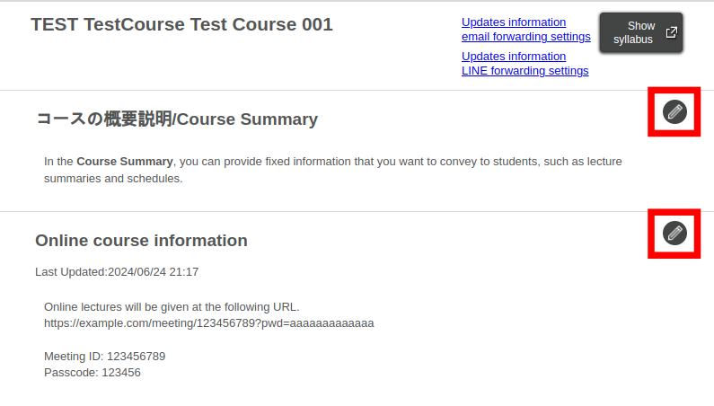
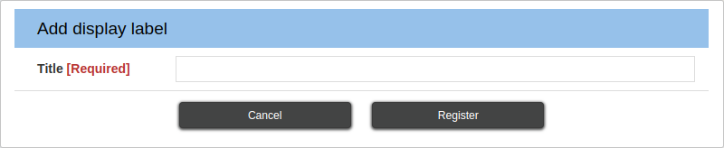
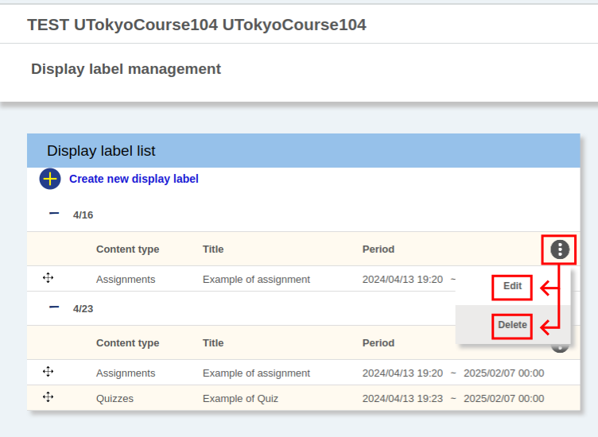
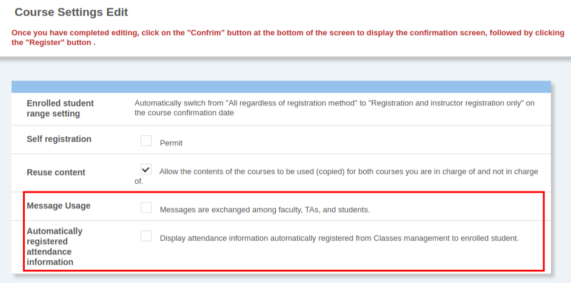

This page describes the settings related to the entire course in UTOL, including the course summary and participant management.

In addition, it covers the methods for integrating with other courses, such as course groups and content reuse.

Please note that TAs have limited access to the settings described on this page. For example, they can update the online class information and view label management and the **Register Course participants** screen. However, they cannot perform other functions, such as adding or removing
course participants.

[^1]:
    The term **Course Settings > Display label management**, for example, refers to the **Display label management** option within the **Course Settings** section, accessible via the left menu (displayed when clicking the three horizontal lines button at the upper left corner of the screen).

    {:.medium}

## Within-course settings
{:#in-course}

This section describes the settings within the course, including:

- [Course Summary and Online Class Information](#coursetop-headers)
- [Participant Management](#participant)
- [Labels](#label)
- [Message and Attendance Settings](#message-and-attendance)
- [LTI Integration](#lti)

### Course Summary and Online Class Information
{:#coursetop-headers}

The **Course Summary** and **Online Class Information** are displayed at the top of the course page (course details) for both the instructors and the students.

{:.small}

To edit these sections, click {:.icon} (the pencil icon) located at the right end of the course page. Note that you can also access the editing screen for **Course Summary** through **Course Settings > Course Summary**.

#### Course Summary
{:#course-description}

In the **Course Summary**, you can provide fixed information that you want to convey to students, such as lecture summaries and schedules.

You can also use markups in this setting. For details on how to use markups, please refer to [**Markup**](../../markup/).

#### Online Course Information
{:#online-lecture-info}

If you conduct online classes, use the **Online course information** section to provide details such as URLs for accessing online classes.

When notifying students about the URLs of online classes, always use the **Online course information field** and avoid including them in the **Course Summary**, information notices, or forums. For more information, see [**How to Announce Online Class URLs (for Faculty Members)**](/en/faculty_members/url).

When editing the **Online course information**, keep the following points in mind:

- When providing information of a course on Zoom, include not only the URL but also the meeting ID and the passcode, so that students can properly join when using the app.
- On the editing screen, URLs are not automatically hyperlinked. To create a hyperlink:
  1. Select the URL.
  1. Click {:.icon} (the chain icon) at the upper left corner.
     {:.medium}
  1. Enter the destination URL and click **Save**
     {:.small}

### Participant Management
{:#participant}

In UTOL, you can manage participants (instructors, course designers, TAs, and enrolled students) of each course using [**Course Participant Registration**](#course-participants). As mentioned above, TAs cannot add or remove course participants.

However, some participants may be registered without any further action by instructors or course designers:

- Instructors:
  - For courses linked to the academic affairs system (UTAS), instructors registered as such in UTAS will also be registered as instructors in UTOL.
  - For [**courses created through request**](/en/utol/lecturers/#course-application), the applicant’s name will be registered as the instructor.
- Enrolled students:
  - If students register or add the course to their favorites in UTAS, they will automatically be registered as enrolled students in UTOL.
  - In courses that allow [**self-registration**](#self-registration-and-content-use-scope), students can also register themselves on UTOL.

This section focuses on participant management ([**Course Participant Registration**](#course-participants)), grouping participants ([**User Groups**](#user-group)), setting conditions for students to access content ([**Self-Registration and Student Range Settings**](#self-registration-and-content-use-scope)), and limiting the display of instructors to students ([**Instructor List**](#lecturer-names)).

#### Course Participant Registration
{:#course-participants}

**Course Participant Registration** is a feature for managing participants (instructors, course designers, TAs, and students) in the course. Note that TAs can only view the participant list.

For details, please refer to [**Course Participant Registration**](course_participants/).

#### User Groups
{:#user-group}

**User Groups** allows you to group course participants and distribute assignments, announcements, etc., accordingly.

For further details, please refer to [**User Groups**](user_groups/).

#### Instructor List
{:#lecturer-names}

**Instructor List** limits the display of course instructors to the timetable and the course top. This feature is useful for courses involving multiple instructors, where only the representative instructor should be displayed to students.

{:.small}

{:.small}

By default, all users registered as instructors will be displayed in the timetable and the course top.

To customize the display:

1. Open **Course Settings > Course Settings**[^1].
1. At the bottom of the screen, find the **Instructor List** section.
   {:.medium}
1. Check the instructors you want to display and uncheck those you do not.
1. Click the **Confirm** button, review the details, and then click **Register**.

#### Self-Registration and Student Range Settings
{:#self-registration-and-content-use-scope}

This section describes the settings related to **Self-registration**, which allows users to use the course content without registering for the course on UTAS (so-called *auditing*), and **Enrolled student range setting**. Note that self-registration is also necessary if you want participants to register themselves for [**courses created through request**](#course-application).

First, in the **Self-registration** settings, you can choose whether or not to allow users to register themselves as *enrolled student*, by clicking the **Register for Enrollment** button on UTOL. The default setting is **Permit**.

Next, in the **Enrolled student range setting**, and among those who are registered as *enrolled students***,** you can choose the range of people who can use the content (such as those downloading course materials and/or submitting assignments).

The **Enrolled student range** settings automatically switch from **All regardless of registration method** to **Registration and instructor registration only on the course confirmation date**. However, in courses that the course instructor has applied for creation, the **Enrolled student range** setting is always fixed to **Always "All regardless of registration method"**.

The **Enrolled student range** settings have the following options, which also affect whether self-registration is allowed:

- **Always "Registration and instructor registration only"**: Only participants registered through methods such as enrollment registration or instructor registration[^2] can use the content. Specifically, those who have registered themselves through self-registration cannot access the content, therefore, self-registration is fixed to **Not Permit**.
  - To register a participant by instructor registration, please refer to [**Course Participant Registration > Update Registration Method**](course_participants/#renew-method), where instructors or course designers can re-register the user.
- **Always "All regardless of registration method"**: Anyone who has enrolled can use the content. You can choose whether to allow self-registration.
- Automatically switch from **All regardless of registration method to Registration and instructor registration only on the course confirmation date (Before Enrollment Registration Deadline Only)**: Before the enrollment registration deadline, this option behaves the same as **Always "All regardless of registration method"**. After the enrollment registration deadline, it behaves the same as **Always "Registration and instructor registration only"**. If self-registration is set to **Permit**, it will automatically switch to **Not Permit** after the enrollment registration deadline.

[^2]:
    When the **Enrolled student range setting** is set to **Registration and instructor registration only**, the following users have access to the content (assuming that the content users are already registered as *enrolled students* on UTOL):

    - Users with Access:
      - Students who have registered for the course through UTAS.
      - Participants registered by instructors or course designers.
        - Instructor registration: Users registered by instructors or course designers using [**Course participant registration**](#course-participants).
        - Attendance management: Users registered by instructors or course designers using **Bulk registration of attendees**.
    - Users without Access:
      - Users who self-registered.
      - Users who added the course to their favorites in UTAS.
      - Users who unregistered after initially registering for the course.

To configure these settings:

1. Open **Course Settings > Course Settings**[^1].
2. Set the **Enrolled student range** setting and **Self registration**.
    - If you want to allow free *auditing*:
      - Set the enrolled student range to **Always "All regardless of registration method"** and self-registration to **Permit**.
    - If you want to restrict *auditing* to specific participants or disallow it:
      - Set the enrolled student range to **Always "Registration and instructor registration only"**.
      - If there are participants you want to allow for *auditing*, please refer to [**Course Participant Registration > Update Registration Method**](course_participants/#renew-method), and re-register them as instructors.
3. Click the **Confirm** button, review the details, and then click **Register**.

### Labels
{:#label}

**Labels** are used to group contents within a course. They help narrow down the display when viewing the course overview.

It is important to be cautious when using labels, as they are visible to both instructors and students, including those who have no applicable content. Therefore, avoid including sensitive information in labels.

#### Creating Labels
{:#create-label}

1. Open **Course Settings > Display label management**[^1].
1. Click the **{:.icon} Create new display label** icon at the top left corner.
   {:.medium.border}
1. Enter a title for the label.
   {:.medium.border}
1. Click **Register** to save.

#### Editing and Deleting Labels
{:#edit-label}

{:.medium.border}

1. Open **Course Settings > Display label management**[^1].
1. Click the {:.icon} icon next to the label in the **Display label list** section.
1. Choose **Edit** to modify the label or **Delete** to remove it.

#### Editing Content Labels
{:#label-content}

There are two ways to set labels for content: during creation or afterward. In this section, we will explain how to do it afterward.

{:.medium}

1. Open **Course Settings > Display label management**[^1].
1. While holding down the {:.icon} icon located at the left side of the content name, drag and drop the content.
    - To link a new label, move the content from the **Registered content list** to the desired label in the **Display label list**.
    - To unlink a label, move the content from the **Display label list** to the **Registered content list**.

If you need to link a label other than the current one, first unlink the current label and then link the new label. A dragging and dropping operation by exchanging one label for another will not result in a change of labels.

### Message and Attendance Settings
{:#message-and-attendance}

You can configure the messaging function and the attendance display settings using **Course Settings > Course Settings**[^1].

{:.medium}

- **Message Usage**
  - Enabling **Messages are exchanged among faculty, TAs, and students** allows the message function.
  - For more details, please refer to [**Messages**](../messages/).
- **Automatically registered attendance information**
  - In UTOL, attendance is automatically set based on class information from UTAS or manually registered by instructors in UTOL.
  - Enabling **Display attendance information automatically registered from Classes management to enrolled student** shows the automatically set attendance information to students.
  - If you do not manage attendance in UTOL, it is recommended to keep this feature off to avoid confusion (e.g., displaying *absent* for attended sessions).
  - For detailed information on class sessions and attendance, please refer to [**Attendances**](../attendances/).

### LTI Integration
{:#lti}

LTI integration allows UTOL courses to connect with external tools[^3].

[^3]: UTOLはLearning Tool Interoperability (LTI) v1.3に対応しており，Learning Platformとしての動作ができます． 
      UTOL supports Learning Tool Interoperability (LTI) v1.3 and functions as a Learning Platform.

This section describes the procedures for using external tools in a course. For information on the functionality of the external tools, please refer to their respective websites.

#### Adding External Tools to the Course
{:#add-lti}

1. Open **Course Settings > LTI usage settings**[^1].
1. Check the **Use** column for the desired LTI tools.
   

   
When an external tool is not displayed

   If you have a license for an LTI v1.3-compliant external tool that is not shown in the **LTI Usage Settings** and wish to use it, please contact the UTOL team via email. Please inform us of the tool, its license, and the scope of use you wish to request (i.e., whether you wish to use the tool only for a specific department or course, or for the entire university).
   

1. Click the **Confirm** button, review the details, and then click **Register**.
1. When you access the course top, the icons for the added LTI tools will be displayed.

## Collaboration with Other Courses
{:#inter-course}

In UTOL, you can manage multiple courses together (course groups) and reuse the content of other courses (content reuse).

### Course Groups and Course Code
{:#course-group}

**Course Group** is a function to manage multiple courses together. The **Course Code** is used to select a representative course (parent course) within a course group.

For more details, please refer to [**Course Groups**](course_group/).

### Content Reuse
{:#contents-reuse}

**Content Reuse** enables you to copy the content of courses you previously taught or taught by other instructors.

Here are the steps:

#### Step 1: Actions in the Source Course
{:#contents-reuse-step1}

If you are registered as an instructor in both courses (source and destination course), skip this step and proceed to Step 2.

Otherwise, ask the instructor of the source course to perform the following steps:

1.  Open **Course Settings > Course Settings**[^1] in the source course.
2.  Check the option **Allow the contents of the courses to be used (copied) for both courses you are in charge of and not in charge of**. 
   {:.small}
3.  Click the **Confirm** button, review the details, and then click **Register**.

#### Step 2: Actions in the Destination Course
{:#contents-reuse-step2}

1. Open **Course Content > Import past contents** in the destination course.
2. Click the **Search Course** button in the **Search Original course** field and search for the source course.
3. Select the source course and click **Specify**.
4. The content of the source course will be displayed. Check the items you want to copy.
5. Click the **Confirm** button, review the details, and then click **Register**.
