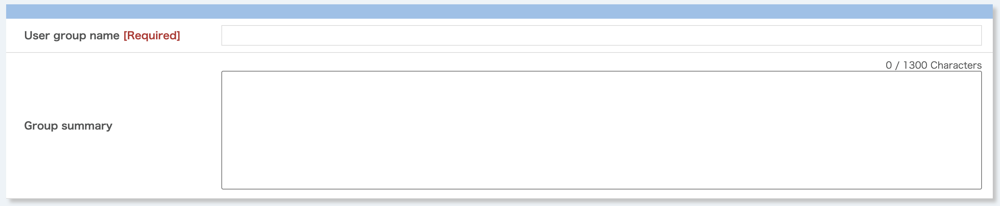
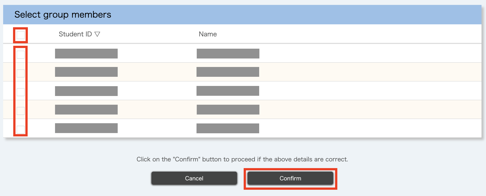
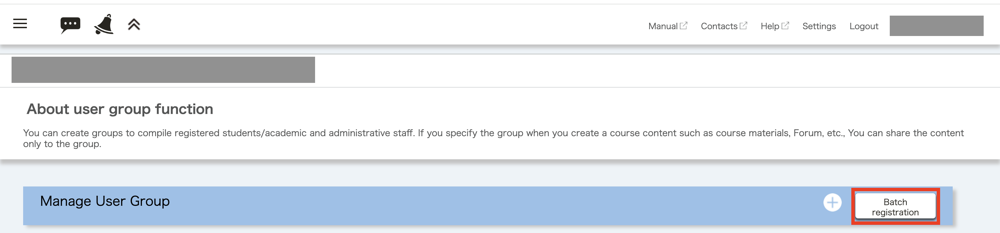
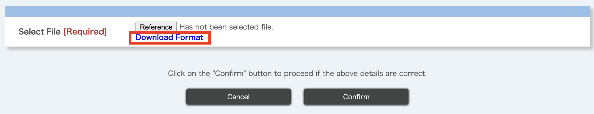
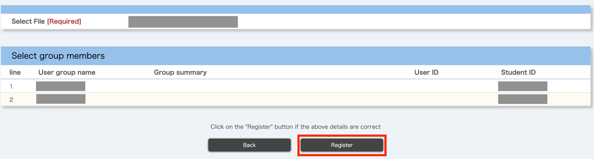
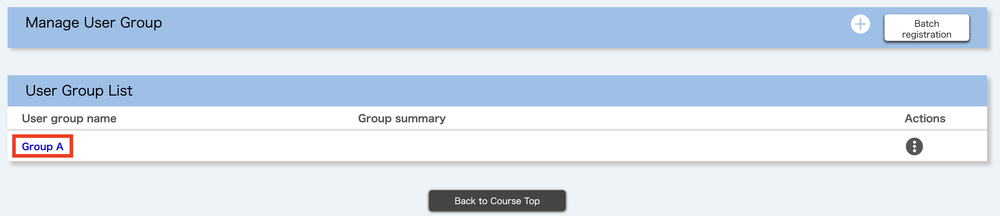
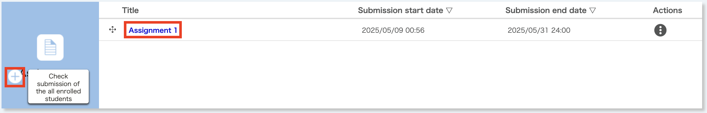
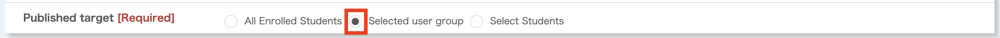

## What is the user group?
{:#about}
[UTOL](/utol/)のコースでは，任意の履修者から「ユーザグループ」とよばれる単位を構成することができます．これは，一部の履修者にのみコースのコンテンツ（[教材](/utol/lecturers/materials/)，[課題](/utol/lecturers/assignments/)など）を公開することを目的に使用するもので，コンテンツを公開する際は，特定のユーザグループのみを公開対象として選択することが可能です．

If you frequently restrict access to contents to certain students, you can avoid the trouble of specifying which students can access them each time by registering user groups in advance. One possible case of use is when you want to divide the students into several groups and make different contents available for each group in a group work project.

## Notes for using the user group function
{:#details}
- Only the course designer or instructor can manage user groups (register, change, delete). TAs cannot manage them.
- One student can be registered in multiple user groups.
- When publishing contents, you can select multiple user groups as the target for publication.

### Relation to the course group
{:#course_group}
[コースグループ](/utol/lecturers/settings/course_group/)を登録した場合，グルーピングされたそれぞれのコースの履修者をメンバーとしたユーザグループが「(開講年度)\_(開講組織コード)\_(時間割コード)-group」の名称で自動的に登録されます．これを「デフォルトユーザグループ」とよびます．登録後にUTAS上で履修者が変更された場合，システム連携により各デフォルトユーザグループのメンバーの一覧に反映されます．

## Managing user groups
{:#manage}
This section explains the procedures for managing (registering, changing, and deleting) user groups.

### Registering a user group
{:#register}
There are two ways to register a user group.

- Registration by selecting on the screen
{:.medium}
    - With this method you can select members on the UTOL screen and register them as a single user group.
    - This is suitable for cases where you are registering only one user group or where there are only a few members to register.

- Registration by uploading an Excel file
{:.border}{:.medium}
    - Use this method to register one or more user groups by uploading an Excel file containing information about the user groups and their members.
    - This is suitable for registering multiple user groups at once or when electronic data is available on the student's common IDs or student ID numbers.

#### Registration by selecting on the screen

{:#web}
1. Click on the icon with three lines in the top left corner while the course you want to use is open.
{:.border}
1. Click on "User group settings" under "Course settings".
    

    
If there are no “Course settings”

        あなたにはこの操作に必要な<a href=#details>権限</a>がありません．必要と思われる場合は，授業を担当する教員と<a href=/utol/lecturers/settings/course_participants/>権限の付与</a>についてご相談ください．
    

    {:.border}{:.medium}
1. 「Click on the “+” button on the right of "Manage User Group".
{:.border}{:.medium}
1. Enter the “User group name” and “Group summary” (optional). This information will be used to distinguish between user groups later.

1. Select all the checkboxes for the users you want to add to the user group and click on the "Confirm" button to proceed. (You can select all the displayed users at once by selecting the checkbox directly "Select group members".

1. Check the details, and if there are no problems, click on the “Register” button.

1. When the "Registration is completed" message appears, the registration process has been completed.

#### Registration by uploading an Excel file
{:#excel}
1. Click on the icon with three lines in the top left corner while the course you want to use is open.
{:.border}{:.medium}
1. Click "User group settings" under "Course settings".
    

    
If there are no "Course settings"

        あなたにはこの操作に必要な<a href=#details>権限</a>がありません．必要と思われる場合は，授業を担当する教員と<a href=/utol/lecturers/settings/course_participants/>権限の付与</a>についてご相談ください．
    

    {:.border}{:.medium}
1. Click on the "Batch registration" button on the right of "Manage User Group".

1. Click on “Download Format” to download the Excel file for data entry.

1. Open the downloaded Excel file.
{:.border}{:.medium}
1. Please follow the procedure below to enter the information for each user group you wish to register. Note that each user group corresponds to a single row in the Excel file.In other words,**you cannot use multiple rows to describe a single user group**.
    - First, enter the "User Group Name" and "Details" (optional). This information will be used to distinguish between user groups later.
    - Next, enter either the common ID or student ID number for all members. If it is a common ID, enter it in the "User ID" field, and if it is a student ID number, enter it in the "User Number" field. Please enter the common ID and student ID number in one field, separated by a semicolon.
  
    The following image is an example of how to enter the information.
{:.border}
1. Once you have finished entering the data, please save it.
1. After selecting the Excel file you entered by clicking on the "Reference" button on the UTOL screen, click the "Confirm" button to proceed.

1. Check the details, and if there are no problems, click on the “Register” button.

1. When the "Registration is completed" message appears, the registration process has been completed.

### Changing the user groups
{:#edit}
This section explains the procedure for changing registered user groups, such as adding and deleting members.
1. Click on the icon with three lines in the top left corner while the course you want to use is open.
{:.border}{:.medium}
1. Click "User group settings" under "Course settings".
    

    
If there are no "Course settings"

        あなたにはこの操作に必要な<a href=#details>権限</a>がありません．必要と思われる場合は，授業を担当する教員と<a href=/utol/lecturers/settings/course_participants/>権限の付与</a>についてご相談ください．
    

    {:.border}{:.medium}
1. Click on the user group name you want to change in the "User Group List".

1. [画面上で選択して登録する方法](#web)と同様の画面が表示されます．変更を加えたい項目について編集を加え，「確認画面に進む」を押してください．
1. Check the details, and if there are no problems, click on the "Register" button.

1. When the "Registration is completed" message appears, the registration process has been completed.

### Deleting user groups
{:#remove}
This section explains the procedure for deleting user groups.
1. Click on the icon with three lines in the top left corner while the course you want to use is open.
{:.border}{:.medium}
1. Click "User group settings" under "Course settings".
    

    
If there are no "Course settings"

        あなたにはこの操作に必要な<a href=#details>権限</a>がありません．必要と思われる場合は，授業を担当する教員と<a href=/utol/lecturers/settings/course_participants/>権限の付与</a>についてご相談ください．
    

    {:.border}{:.medium}
1. Open the "Actions" menu for the user group you want to delete in the "User Group List" and click on the" Delete" button.

1. The message "Are you sure you wish to delete (user group name)?" will be displayed. Please check that the target group is correct and click the" Delete" button.

1. If the target group has been deleted from the "User Group List",  the registration process has been completed.

## Publishing content only to selected user groups
{:#access_management}
選択したユーザグループにのみコンテンツ（教材，課題など）を公開する手順を説明します．ここでは[課題](/utol/lecturers/assignments/)を例にとって説明しますが，他の種類のコンテンツでも同様です．
1. Open the target course.
1. Click the "+" button in the "Assignments" box to register a new assignment. To edit an existing assignment, click the assignment name you want to edit in the "Assignments" box.

1. The new registration/edit assignment screen will appear. After entering and editing the other items, select the "Selected user group" in the "Published target" as shown below.

1. From the "User Group List", select all the checkboxes for the user groups of published targets. When finished, click the "Confirm" button. (Selecting the checkbox directly below the "user group list" will allow you to select all the displayed user groups simultaneously.)

1. Check the details, and if there are no problems, click on "Register" button.
{:.medium}
1. You are done if the message "Registration is completed." is displayed.

