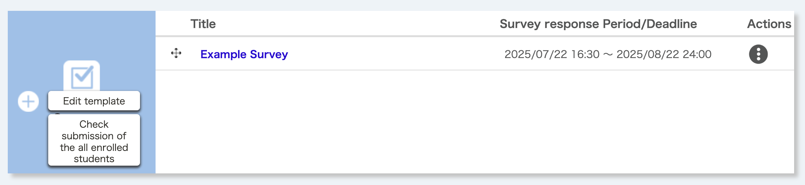
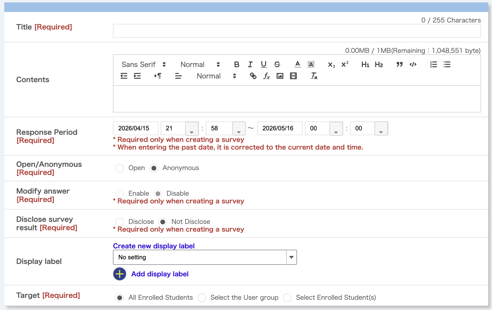
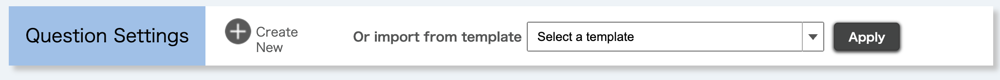
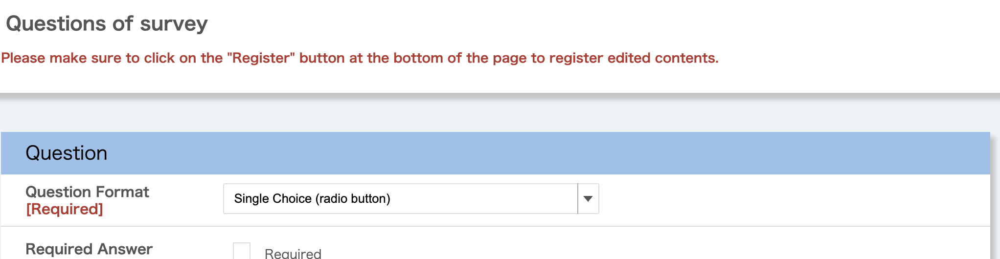
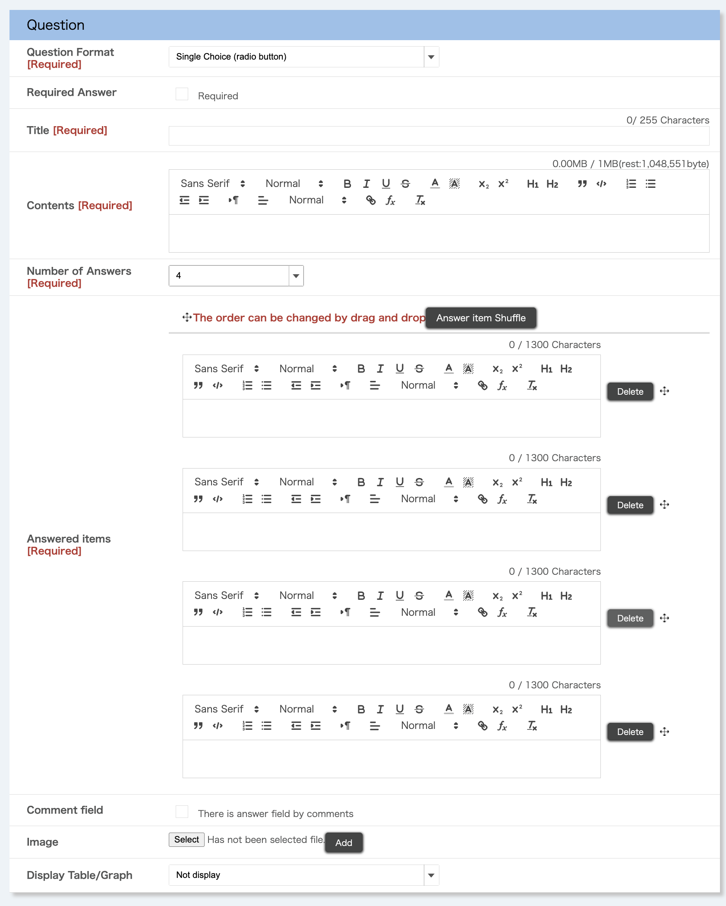

import DisplayLabel from '../_displaylabel/DisplayLabel.mdx';

This page explains how to create and edit surveys.

For information on how to view survey results, please refer to "[Viewing Aggregated Survey Results](../result/)".  

## Creating a new survey
{:#create}

Clicking on the {:.icon} button on the Course Top screen takes you to the "Surveys Registration" screen.

Follow steps 1 to 3 below to set up the survey.

### Step 1: Setting up the  entire survey
{:#general_settings}

First, enter the setting items for the entire survey. You can edit the settings after you have finished, but depending on the timing, some items may be restricted from editing. For details, please refer to "[Editing a created survey](#update)" at the bottom of this page.

- **Title**: The title of the survey.
- **Contents**: The description of the survey (the [Markup function](../../markup/) supported).
- **Response Period**: Set the survey response period here.
  - Set the start and end dates and times.
  - Once the dates and times of the start or end have passed, they cannot be changed.
- **Open/Anonymous**: If you select "Anonymous", you cannot see the individual responses or check whether or not responses have been submitted.
  - This setting cannot be changed once the start date and time has passed.
- **Modify answer**: If you select "Enable",  respondents can revise their answers after submitting the survey.
  - If the survey setting is "Anonymous", respondents cannot revise their answers.
  - This setting cannot be changed after the start date and time.
- **Disclose survey result**: If you select "Disclose",  students can view the aggregated results.
- **Publication period of result**: This is the period during which students can view the aggregated results when the survey results are set to "Disclose."
  - This setting can be changed at any time.
- <DisplayLabel />
- **Target**: You can restrict the persons who can view or respond to surveys.

### Step 2: Creating questions
{:#question_settings}

Next, click "Create New" in the "Question Settings" field at the bottom of the "Register a New Survey" screen. The new registration screen for questions will be displayed.

1. First, decide on the format of the questions you wish to create. Select the appropriate format from the following seven options according to the content you want to ask.
    - **Single Choice (radio buttons)**: Select one option from a list.
    - **Multiple Choice (check boxes)**: Select multiple options from a list.
    - **Text (text box)**: A single-line text box. Select free text if the text is long or spans multiple lines.
    - **Free Text (text area)**: A text area that allows multiple lines of text. Suitable for long texts.
    - **List Choice (pull-down menu)**: Similar to single selection, this format allows you to select one option from multiple options, but a pull-down menu is displayed instead of radio buttons.
    - **Single Choice Table (radio button)**: This format displays radio buttons in a table, allowing you to select one option per row.
    - **Multiple Choice Table (check box)**: This format displays checkboxes in a table, allowing you to select multiple options.

2. Enter the question information (the screenshot below shows a single-selection format).
    
    - **Question Format**: Select the question format you decided on in 1. just before.
    - **Required Answer**: If you select this option, respondents will be required to answer this question before submitting.
    - **Title**: The title of the question.
    - **Contents**: The explanation that appears above the question. Markup can be used.
    - **Number of Answers / Question items (columns)**: Settings for the question options, etc.
      - The input content varies depending on the question format as follows.
        - **Single Choice, Multiple Choice, List Choice**: Enter the number of the answer items (options) and the content of the answer items.
        - **Text, Free Text**: No additional input fields are available.
        - **Single Choice Table, Multiple Choice Table**: Enter the number and content of question items in the vertical columns, and the number and content of answer items in the horizontal rows.
      - Note
        - Reducing the number of answer items will delete the answer item columns from the bottom up. The input in those columns will be erased, so please be careful.
    - **Comment field**: When enabled, a free-text input field (text area) will appear. The content entered here can be reviewed by the instructors or TAs as individual responses. Note that this is only available for selection (choice) formats and cannot be used with text or free-text formats.
    - **Image**: You can register an image to attach to the question. The format must be gif, jpg, or png.
    - **Display Table/Graph**: Set the format for displaying the survey results. This cannot be used for text or free text formats.
      - **Not display**: The results of this question will not be displayed on the "Table/Graph" screen.
      - **Number of responses (Table Format)**: The number of respondents and the percentage will be displayed for each answer option.
      - **Proportion (Pie Graph)**: In addition to the "Number of answers" table, a circle graph showing the percentages will be displayed.
      - **Total (Bar Graph)**: In addition to the "Number of answers" table, a bar graph showing the number of respondents will be displayed.

3. Once you have entered the necessary information, click "Register" at the bottom of the screen to register the question. At this point, only the questions have been registered, and the survey itself has not yet been completed.
4. If necessary, set branching survey questions (the next question to be displayed).
    - In case of single choice and list choice formats, you can specify a different question to jump to for each answer choice.  This is useful when you wish to change the next question to be displayed depending on the respondent's answer.
    - For the destination, you can choose from "Next questions," "End of questions," or another question that is below the one currently being edited.
      - **Next questions**: Answering this question will take you to the next question.
      - **End questions**: This question will become the last question in the survey.
      - **Question n (n is the question number)**: Answering this question will display the selected question.

5. Once you have completed the overall survey settings and question creation, click "Confirm" at the bottom of the new registration screen to review the content, then click "Register" to register the survey.

### Step 3: Simulating survey responses

The Answer Simulation function enables you to check the operation of the survey after the survey has been registered.  You can check the operations in the responding process on the same screen that enrolled students will see when they respond to the survey.

1. Clicking on the "Answer simulation" button on either the Surveys Registration screen or the Surveys Editing screen takes you to the Surveys Answer Simulation screen.
2. Answer each question.
3. Click "Confirm" to proceed to the confirmation screen after answering.
4. Confirm your answers and click "Submit" to send your answers. You will be taken to the "Survey Registration" or the "Survey Editing" screen.

If you find any problems in the Answer Simulation, please refer to "[Editing created surveys](#update)" below to correct the survey.

## Editing created surveys
{:#update}

To edit the survey you have already created, click on the survey title link in the "Surveys" column of the "Course Top" screen. This will take you to the Survey Editing screen.

### Editing the settings for the entire survey

You can edit the settings for the entire survey. For an explanation of each setting item, please refer to "[Step 1: Setting up the entire survey](#general_settings)" in "Creating a new survey".

Unlike when registering a new survey, some items may be restricted from editing depending on the timing. The items that can be edited are as follows.

- **Before** the start of the response period: All items
- **After** the start of the response period and before it ends: The following 7 items only
  - Title
  - Contents
  - End of response period (extension or reduction)
  - Disclose survey result
  - Result disclosure period
  - Display label
  - Question settings
- **After** the response period ends: The following 3 items only
  - Disclose survey result
  - Result disclosure period
  - Display label

### Editing the question settings

You can edit each question in the survey. To edit a question, click the pencil icon in the upper right corner. For an explanation of each question item, please refer to "[Step 2: Creating Questions](#question_settings)" in "Creating a new survey".

As with the settings for the entire survey, the items that can be edited are limited depending on the timing. The items that can be edited are as follows.

- **Before** the response period starts: All items
- **After** the start of the response period and before it ends: The following 6 items only
  - Required Answer
  - Title
  - Contents
  - Answered items (selection type only)
  - Comment field
  - Display Table/Graph
- **After** the response period has ended: "Display Table/Graph" only.

After the response period has started, you cannot reorder questions, add or delete questions, or change branching (move) settings.

## Using survey templates
{:#use_templates}

With the survey function, you can register the surveys you have created as **templates** and reuse them in other courses in which you are participating as an instructor, TA, or course designer. Templates registered by different users can also be used within the same course. This is useful when teaching multiple classes with the same content or using surveys from previous years.

Please note that the setting items saved as templates include only the survey title (saved as the template title) and the individual questions.

### Registering survey templates

To register a template, follow the steps below:

1. Click on the survey title you wish to register as a template in the "Surveys" column of the "Course Top" screen.
2. When the "Surveys Editing" screen appears, click "Register as Template" at the bottom of the page.
3. The "Template Registration Confirmation" screen will appear. Confirm that the template details to be registered are correct, and click "Register".

Please note that the template title will be registered with the same name as the survey title. While it is possible to have duplicate titles across templates, we recommend changing the title to something more distinguishable by following the steps in "Editing and deleting survey templates".

### Editing and deleting survey templates

To edit or delete a template, follow the steps below:

1. Click "Edit template" in the "Surveys" section of the "Course Top" screen. The "Survey Templates" screen will be displayed.
2. Click the template title you wish to edit or delete.
  - **To edit a template: Edit the displayed settings**: Only the title and questions can be edited. Other items displayed on the "Survey Registration" or "Editing" screens cannot be edited because they are not included in the template.
  - **To delete a template**: Click "Delete" in the upper-right corner of the screen.

### Taking over templates from other users

You can register templates created by other users as your own templates. To take over templates from other users using this function, follow the steps below:

1. Click "Edit template" in the "Surveys" column of the "Course Top" screen. The "Surveys Templates" screen will be displayed.
2. Templates created by other users will be displayed with the "Register" button.  Click "Register" for the template you wish to take over.
3. The "Surveys Register/Edit template" screen will appear. Make any necessary changes, such as changing the title to something easier to understand, and then click "Confirm".
4. Confirm the details and click "Register" if there are no errors.
