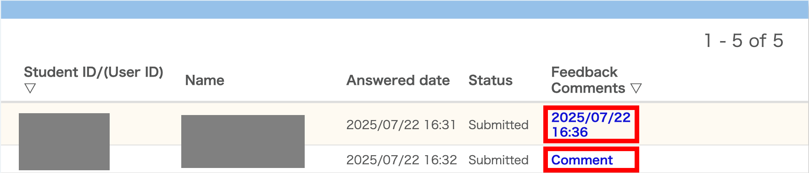
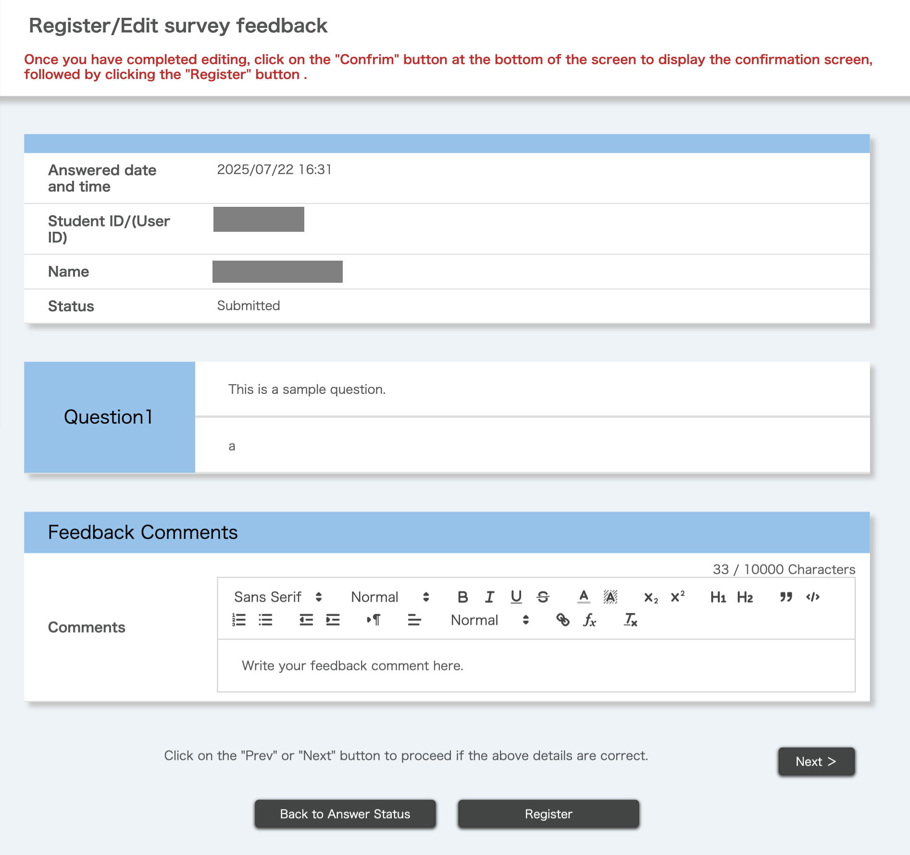
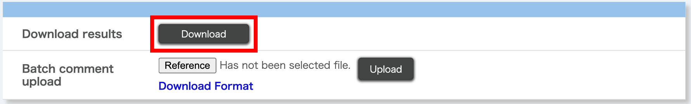
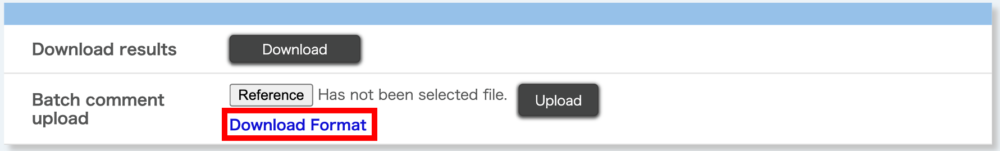
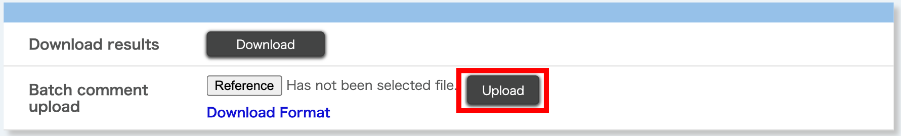
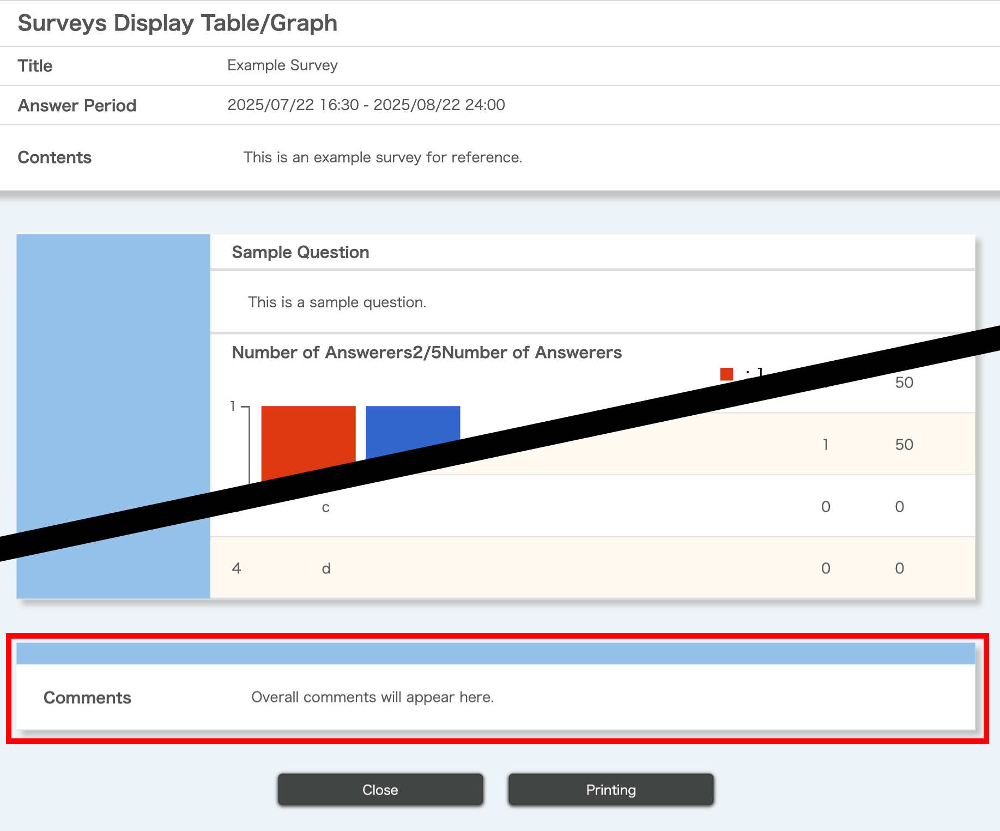

This page explains how to view aggregated survey results and add comments to survey responses. It also describes how to check the overall response status for all the surveys within a course.

Please note that for course surveys, instructors can only view aggregated results.

For instructions on how to create or edit surveys, please refer to "[Creating Surveys](../create/)".

## Checking responses and adding comments

The method for checking survey responses differs depending on whether the survey is anonymous or open (non-anonymous):

- Anonymous surveys: Responses can be checked [by batch downloading them](#answer-download).
- Open (non-anonymous) surveys: Responses can be checked [individually on UTOL](#answer-comment) or [by batch downloading them](#answer-download).

In addition, for open (non-anonymous) surveys, you can add comments to individual responses or to all responses at once.

### Viewing responses and adding comments on UTOL
{:#answer-comment}

You can view individual responses and add comments on UTOL for open (non-anonymous) surveys.

Please note that responses to anonymous surveys cannot be viewed individually. To check them, please follow the instructions in "[Download all answers](#answer-download)" and view them after downloading.

1. Click the {:.icon} next to the survey you want to view, then select "Check responses".

1. A table showing each response will appear. Click the link in the "Feedback Comments" column on the right.
    - If no comment has been added yet, it will say "Comment". If a comment has already been added, the date and time when the comment was posted will be shown.
    {:.medium}

1. Each response to the questions will be displayed.
    {:.small}

1. To register a feedback comment, enter your comment in the "Feedback Comments" field and click "Register".

### Downloading responses in batch
{:#answer-download}

Aggregated results can be downloaded in the following way (applies to both anonymous and open (non-anonymous) surveys).

1. Click the {:.icon} next to the survey you want to download responses from and click "Check responses".

1. Click "Download" in the "Download results" section.
    {:.medium}

1. On the password entry screen, enter any password to set for the Excel file containing the responses.

1. Click "Download" to download a zip file.
    - After unzipping the file, you will find an HTML file and an Excel file.
    - The HTML file contains only the question content.
    - The Excel file contains both the question content and individual responses. In addition, to open the Excel file, you will need the password you set in step 3.

### Adding comments to responses in batch

You can add comments in batch to responses from open (non-anonymous) surveys.

Please note that comments cannot be added to anonymous survey responses.

1. Click the {:.icon} next to the survey you want to comment on, then click "Check responses".

1. In the "Batch comment upload" section, click "Download Format".
    {:.medium}
    - You will need to set a password. Enter any password on the screen that appears.

1. Open the downloaded Excel file, enter your comments in the "Comments" column, then save the file.
    - The file can be opened using the password you set in step 2.
    - The file includes only the users who have responded. Since their actual responses are not shown in the file, please [check them on UTOL](#answer-comment) or [refer to the batch downloaded responses](#answer-download).

1. Return to UTOL, click "Reference" in the "Batch comment upload" section, and select the Excel file containing the comments.

1. Click "Upload" in the "Batch comment upload" section.
    {:.medium}

1. On the password entry screen, enter the password you set to the Excel file, then click "Upload".
    - If you haven't changed the password, enter the password you set in step 2.

1. If the upload is successful, the message "Upload is completed." will appear.

## Checking aggregated results and adding comments on aggregated results

Survey questions with a display format can be shown as aggregated results in a table or graph.
For details on how to set the display format, please refer to ["Creating and Editing Surveys" > "Creating questions"](../create/#question_settings) > "Display table/graph".

In addition, you can add comments to the aggregated results and display them to enrolled students along with the aggregated results.

Note: When the "Enrolled student range settings" is set to "Always ‘Registration and Instructor registration only’", enrolled students who have been added through self-registration or other methods are not able to access course contents, including surveys. In addition, for open (non-anonymous) surveys, even if such students were able to submit responses under previous student range settings, their responses will not be included in the aggregated results if they currently cannot access the content.

### Checking aggregated results
{:#view-result}

Aggregated results for survey questions with a display format can be checked by clicking the {:.icon} on the right side of the survey on the Course Top page and then selecting "Display table/graph".

You can change the display format at any time. For details on how to set it, please refer to ["Creating and Editing Surveys" > "Creating Questions"](../create/#question_settings) > "Display table/graph".

### Commenting on aggregated results
{:#comment-result}

You can display comments at the bottom of the "Table/Graph" screen for enrolled students.

{:.small}

Please note that by default, the "Disclose survey result" setting is set to "Not Disclose", meaning the aggregated results are not available to students. In this state, students cannot open the "Table/Graph" screen, and any comment you add will also not be available to them.
For details on how to change the "Disclose survey result" setting, please refer to ["Creating and Editing Surveys > Setting up the entire survey"](../create/#general_settings).

1. Click the {:.icon} next to the survey you want to comment on, then select "Overall comments".

1. Enter the comments, then click "Register".

## Viewing response status to a survey

You can view the overall response status of participants by clicking "Check submission of the all enrolled students" in the "Survey" section on the course top page.

In addition, by clicking on a student’s student ID (or Common ID) in the "Check all submission status" screen, you can view the response status of that individual student.

Please note that anonymous surveys are not shown in the "Check all submission status" screen and individual responses to such surveys cannot be viewed.
