## What is the Markup Feature?

The markup feature is a function that allows you to format text entered on UTOL. By using this feature, you can make the appearance of the text more readable and cleaner, as well as clarify the structure of the document. Specifically, it allows you to emphasize text, embed links, and insert mathematical formulas.

The following image shows formatted text with the markup feature.

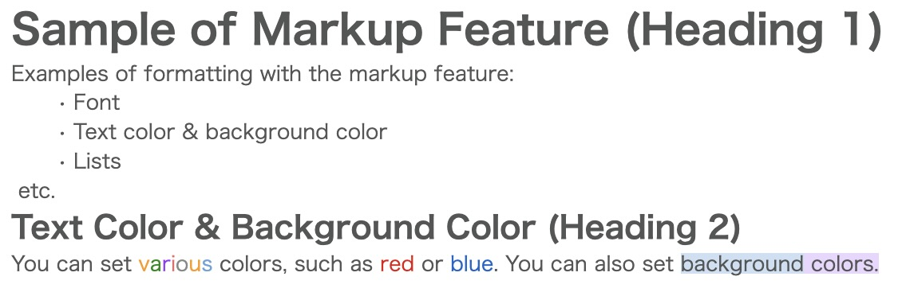{:.small.border}

### How to identify text areas that support the markup feature

Not all text areas (input fields for text) support the markup feature. Text areas that support the markup feature have a dedicated toolbar.
<div class="gallery">
  <figure class="center">
    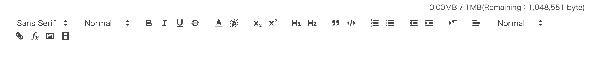
    <figcaption>A text area that supports the markup feature</figcaption>
  </figure>
  <figure class="center">
    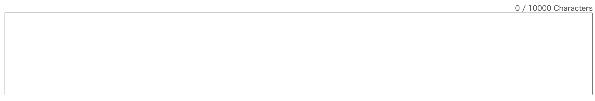
    <figcaption>A text area that does not support markup feature</figcaption>
  </figure>
</div>

## How to Use the Markup Feature

Here we explain the way to use the markup feature in two parts: how to format text and how to remove formatting.

### Formatting text

To format text, click the appropriate icon in the toolbar. Below are the descriptions and usage of each text format you can set.

- Font: You can choose from "Sans Serif", "Serif", or "Monospace". The default is "Sans Serif".
  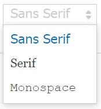
  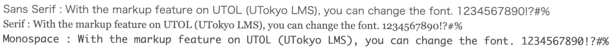{:.border}
- Font size: You can choose from "Small", "Normal", "Large", or "Huge". The default is "Normal".
  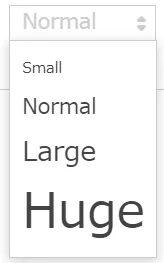
- Bold, Italic, Underline, Strikethrough: You can make the texts bold, italicized, underlined, or crossed out. {:.icon}is the bold, {:.icon}is the Italic，{:.icon}is the underline，{:.icon}is the strikethrough．
- Text and background color: {:.icon}is the text color icon and {:.icon}is the text background color icon. 35 colors are available with black being the default color.
  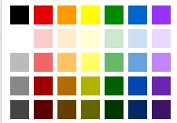
- Subscript, Superscript: You can display text smaller and below or above the baseline of the preceding text. 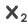{:.icon}is the subscript and 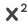{:.icon}is the superscript．
- Headings: You can display text as headings. The proper use of headings clarifies the structure of the document. There are six levels of headings, with formatting such as bold and font size applied according to the level.   
    - There are six levels from Heading 1 to Heading 6.     
      <div class="gallery">
        <figure class="center">
          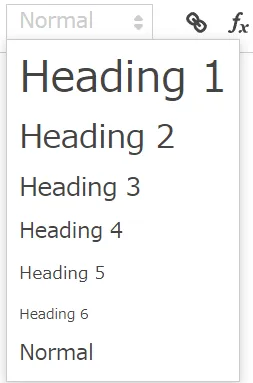
          <figcaption>Dropdoen List</figcaption>
        </figure>
        <figure class="center">
          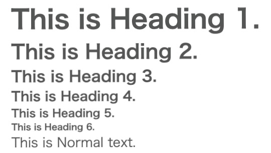
          <figcaption>Examples of how it is displayed</figcaption>
        </figure>
      </div>
    - Heading 1 and Heading 2 can also be set from the icon{:.icon}.
- Blockquote{:.icon}: You can clarify that the text has been quoted or republished. It will be displayed as shown in the example below.
  {:.border}
- Code Block{:.icon}: You can display source code or similar content of programming languages in white text on black background for better readability. Coloring (syntax highlighting: coloring the source code corresponding to its meaning) is not supported.
  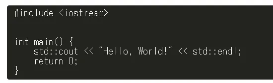
- Numbering and Bullet Lists: You can display specified lines as lists. {:.icon}is the numbering list, and {:.icon}is the bullet list．Lines are displayed as follows:
  <div class="gallery">
    <figure class="center">
      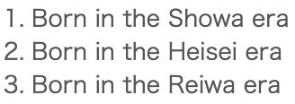
      <figcaption>Example of a numbering list</figcaption>
    </figure>
    <figure class="center">
      
      <figcaption>Example of a bullet list</figcaption>
    </figure>
  </div>
- Text Indentation: You can set the indentation (margin at the beginning of the line) of the text. {:.icon}is the icon to increase indentation and {:.icon}is the icon to decrease indentation．
- Text Alignment: You can set the text alignment. Choose from "Left Align", "Right Align", "Center Align", or "Justify". “Left Align" and "Right Align" can also be set with the icon{:.icon}found on the left side of the drop-down list.
  
- Links{:.icon}：You can add links to text. To create a link, while keeping the text selected, click the link icon, and enter the URL in the input field that is displayed.
- Insert Formulas{:.icon}：You can display formulas. Enter formulas using the TeX notation in the input field that is displayed when you click the icon.
  - TeX is a notation used for displaying complex formulas, particularly in mathematics. For the symbols that can be displayed, refer to [the KaTeX official documentation](https://katex.org/docs/supported)．
  <div class="gallery">
    <figure class="center">
      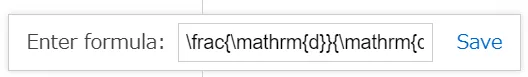
      <figcaption>A formula in Tex notation```\frac{\mathrm{d}}{\mathrm{d}x} \int_a^x f(t) \, \mathrm{d}t = f(x)```</figcaption>
    </figure>
    <figure class="center">
      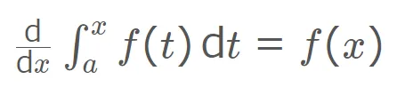
      <figcaption>The formula displayed after input</figcaption>
    </figure>
  </div>

### Removing the set formatting

To remove the set formatting, select the portion of text you want to delete the format from, and press {:.icon}．The formatting will be removed, and the text will return to its default display.
