## Overview

UTOL has a feature that allows you to send (forward) notifications to external services such as email, LINE, UTokyo Slack, etc. By setting up notifications to services you use regularly, you will be able to stay informed immediately when assignments or announcements are added.

There are two types of notifications that can be sent: “Updates notification” and “Information notices and Messages”.

### Updates notification

- This notifies you **when there are updates** to courses you are registered for.
- **Only the title** of the update will be sent. You can view details by accessing UTOL through the link attached to the notification.
- Notifications can be received via Email, LINE, and Slack.
- The following are considered as "Updates".
  - Enrolled students: when instructors add assignments, information notices, and messages.
  - **Instructors: when enrolled students submit assignments. **
- Notifications include the following information:
  - **Day and period**
  - **Course title**
  - **Course instructor name **
  - **Update details**
  - **URL of the updates**（Slack only）

A sample text of an update notification is shown below

```txt
Day,Period: Mon 1
Course: (Course)
Faculty: (Faculty)
Updated Contents:
The notifications (Title of Notification) was added.(2025/10/22 20:01)
https://utol.ecc.u-tokyo.ac.jp/lms/course?idnumber=XXXX
```

### Information/Message Notifications

- This notifies you of **information notices and messages** sent from courses you are registered for.
- These notifications can be received via email and LINE（**Slack is not supported**）．
- Notices include the following information.
  - **URL of the course**
  - **Day and period**
  - **Course title**
  - **Sender**
  - **Message content**

A sample text of an information notice and message is shown below

```txt
https://utol.ecc.u-tokyo.ac.jp/lms/course?idnumber=XXXX
Course Name：(Course Name)
Sender Name: (Sender Name)
Description ：It is description.
Attachment：No
```

### Comparison of notification destinations

You can select multiple destinations for notifications and configure different settings for each service.

- Example: "Redirecting all information once a day for email.  Instant transfer for Slack."

A brief comparison of the available destinations is shown below.

| Destination       | Updates notification | Information/Message Notifications | Details of destination        |                                          |
| :----------- | :------- | :----------------------- | :-------------------------------------------------------------- |
| Email       | ◯        | ◯                        | Any email addresses                                            |
| LINE         | △ (※1)        | ◯                        | Individual chat room with "東京大学UTOL" (Slack App)               |
| UTokyo Slack | ◯        | ×                        | Direct messages with UTOL通知" (Slack App)              |

※1. When forwarding to LINE, the "Instant transfer" of update information for assignments, course materials, quizzes, surveys, and forums are not available. Only the "Redirecting all information once a day" option is available (you can also select "Do not forward").


## Enabling notification settings (initial setting)

This section explains the initial setup procedures to enable notifications to be sent for each destination.

### To receive via email

1. Open the "Settings" screen from the menu at the top of the screen.
  <figure class="gallery">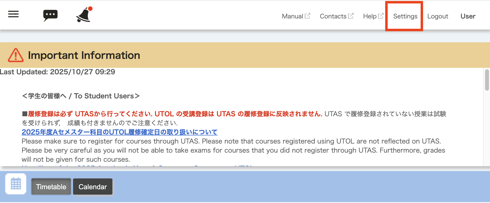{:.center}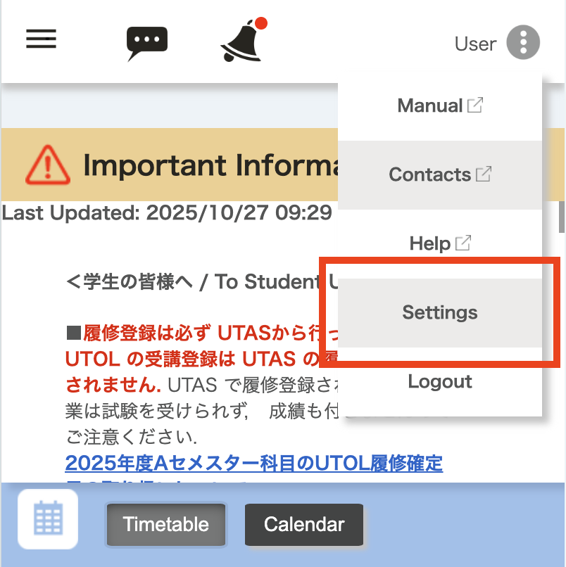{:.center}</figure>
2. In the "Email" section, select an email address or enter the email address where you would like to receive notifications.
    - "Linked e-mail address"
      - For students: The email address registered as "E-MAIL1" in UTAS will be displayed.
        - You can confirm this email address in UTAS by accessing "Student Information" > "View University Registry Information" > "Student Personal Information" > "Current Address Information".
      - For faculty: The email address registered in the Personnel Information System will be displayed.    

    - "Manually registered e-mail address" 
      - You can register any email address manually.
3. Scroll down to the bottom of the screen, then click the "Confirm" button.
  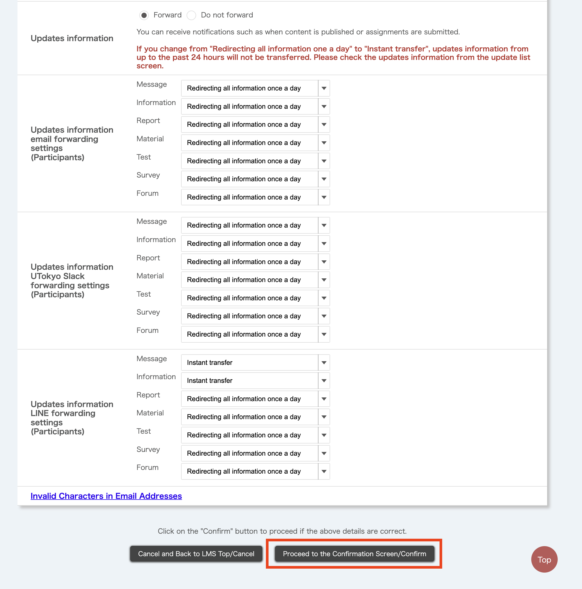{:.center}
4. When the "Confirm Personal Setting" screen opens, review the settings and click the 
"Submit/Register" button
  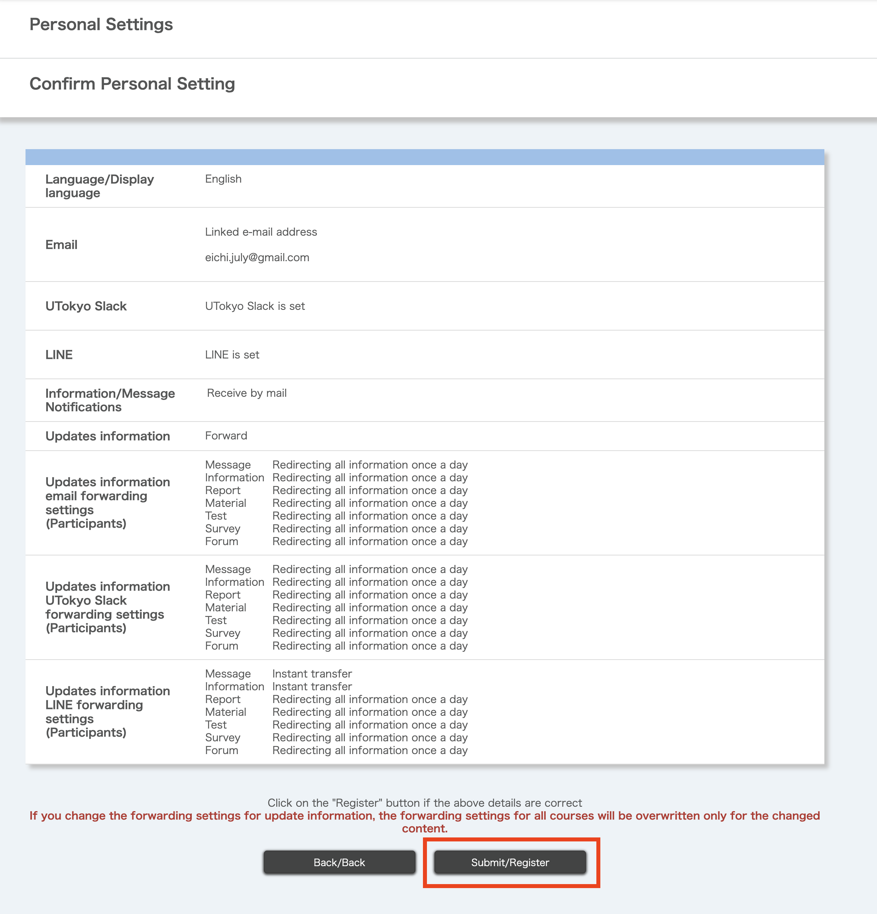{:.center}
5. 
The "Complete personal setting" screen will appear. If you received a message stating "Settings have been completed. A confirmation Email has been sent to the email address you set. Please check whether or not the e-mail addresses you set is correct if the emails are not received even after a while.", your setup was successful.
6. Please make sure that the confirmation email has been received by the email address you specified.
    <details>
    <summary>If you do not receive the confirmation email</summary>

    - Please check that the email address you entered is correct.
    - **Please check your spam mail folder as the email may have been filtered as spam.
      - In addition, if you are using an email filter, please also check that the sender's email address of no-reply@utol-mail.ecc.u-tokyo.ac.jp is not being blocked.
    </details>
7. Follow the steps under "[Set notification scope](#notification-range)" to set the notification destinations and content.
    - If you do not complete this setting, **no notification will be sent by default**.

### To receive via LINE
{:#receive-via-line}

<p class="box">Please note that when you use LINE notification, various information related to the notification may be collected and used by LY Corporation. For more details, please refer to <a href="/notice/2024/0522-utol-notification-line/">Commencement of the provision of the LINE notification function on UTOL and precautions for when using the function (from the Information Technology Center)</a></p>

If you set LINE as a notification destination, the notification will be sent to a chat room linked with the "東京大学UTOL" account.

To complete the following steps, a mobile device with the LINE App installed is required.

1. Open the "Settings" screen from the menu at the top of the screen.
    <figure class="gallery">{:.center}{:.center}</figure>
2. In the "LINE" section, either scan the QR code using the LINE App or tap the "Add Friend" button.
    - If you tap the "Add Friend" button on the mobile device with the LINE App installed, the LINE App will open automatically.
    - If you are using a PC or other devices, please scan the QR code on the screen with the LINE App on your device.
    <figure class="gallery">{:.center}{:.center}</figure>
3. "Add Friend" screen will open. Tap the "Add as friend" button.
    {:.center.small.border}
4. Once the friend has been added, a "Chat" button will appear. Tap the button.
    {:.center.small.border}
5. A message from "東京大学UTOL" will be sent. When you open the link in the message, log in to UTOL as instructed.
    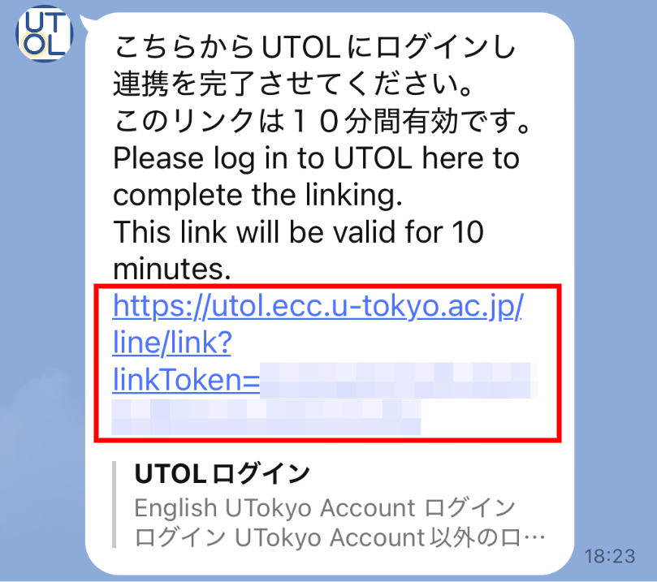{:.center.small}
    <details>
    <summary>If you see the message "Unable to link with LINE"</summary>
    
    Tap the message that says "If your link has expired, please click here to request a new one" to obtain a new link.

    {:.small}
    </details>
6. Please make sure the message "LINE is now linked with 東京大学UTOL" has been displayed.
  {:.center.small.border}
7. Follow the steps under "[Set notification scope](#notification-range)" to set the notification destinations and content.
    - If you do not complete this setting, **no notification will be sent by default**.

### To receive via UTokyo Slack

- You must meet the requirements for using UTokyo Slack in advance.
  -  For more details, please refer to the[UTokyo Slack page](/slack/).
- If you use Slack, you will not be able to receive the contents of the "Notification" and "Message" (Information notices and messages).
- Notification will be sent via direct message from "UTOL通知" (Slack App). You can view these direct messages by opening the "UTOL通知" in the Apps menu.
  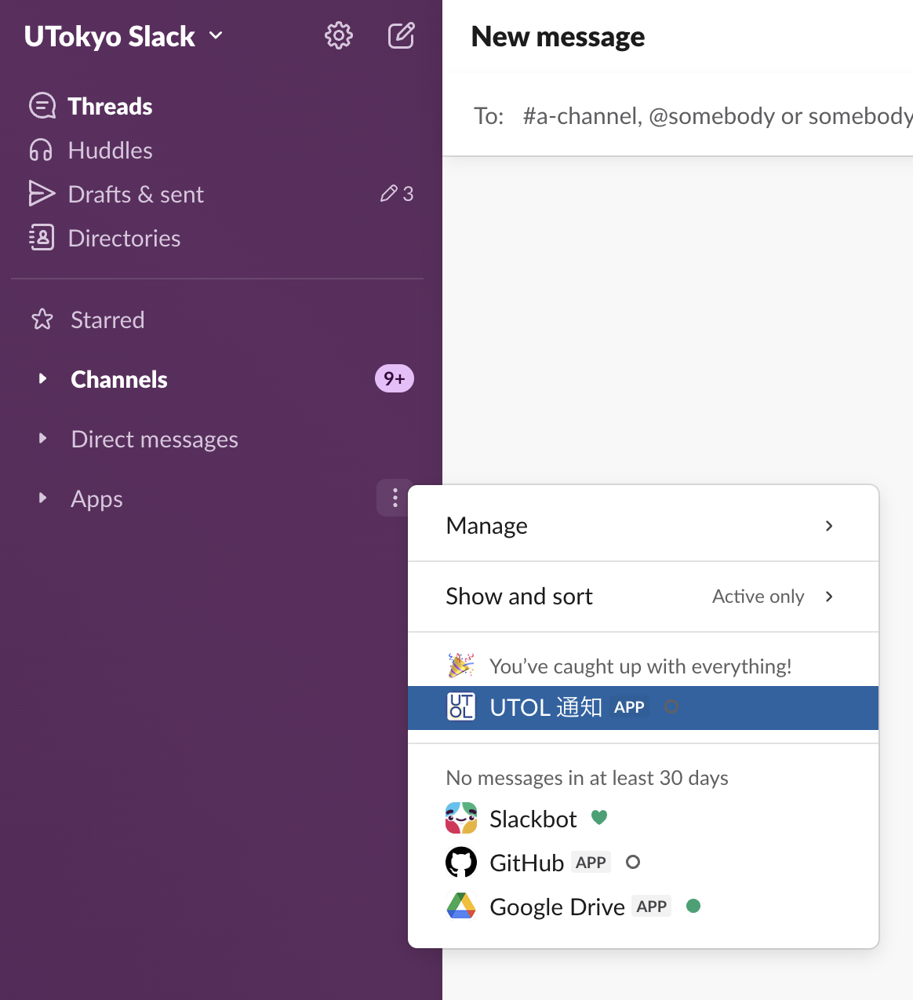{:.center}

#### Step1: Join the "UTOL通知" workspace

1. Open the "Workspaces at UTokyo Slack" and follow Procedures 1 to 5 in [Joining an open workspace in UTokyo Slack](/slack/join/#procedure)".
2. Type "UTOL" or "UTOL<mark> </mark>通知" (Note: include a half-width space) in the search box at the top, and select "UTOL通知" from the search results.
  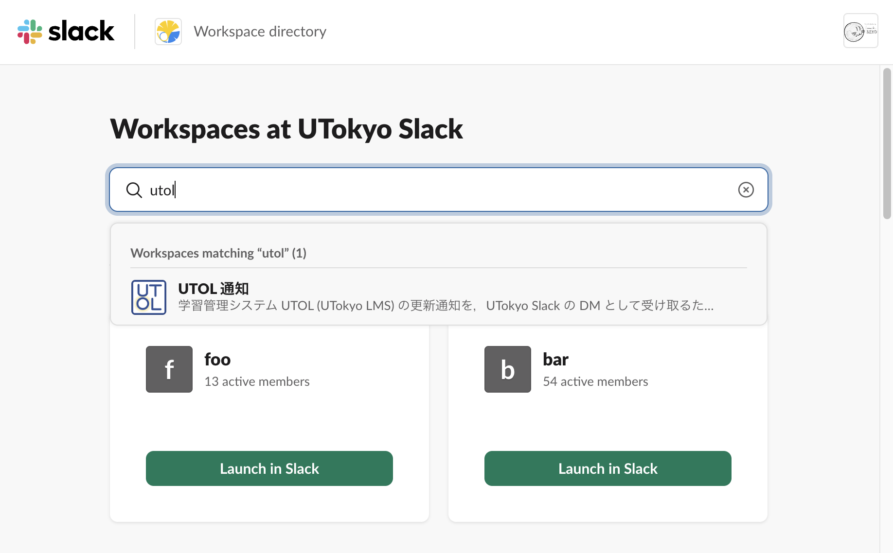
3. Once the list is narrowed down to "UTOL通知", then click the "View Details"
  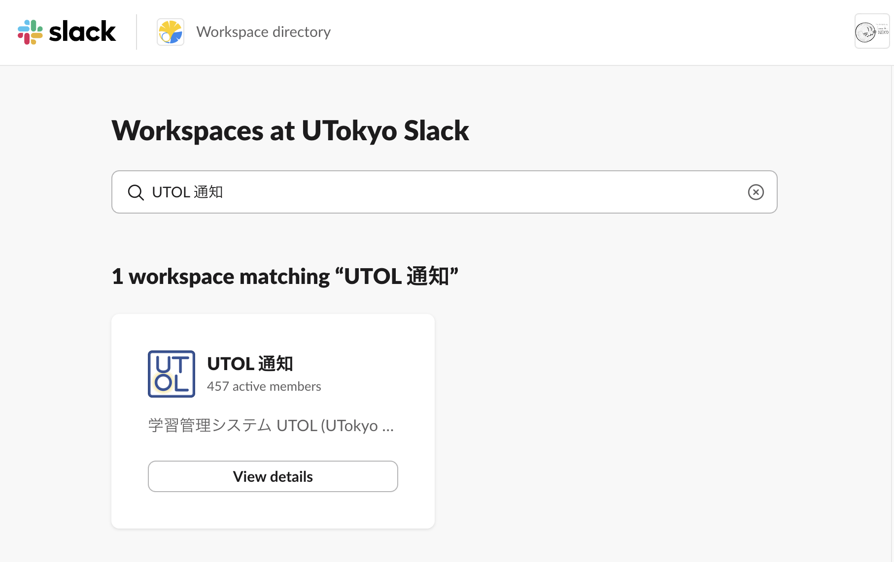
4. Review the workspace description, and click "Join and lLaunch Slack"
  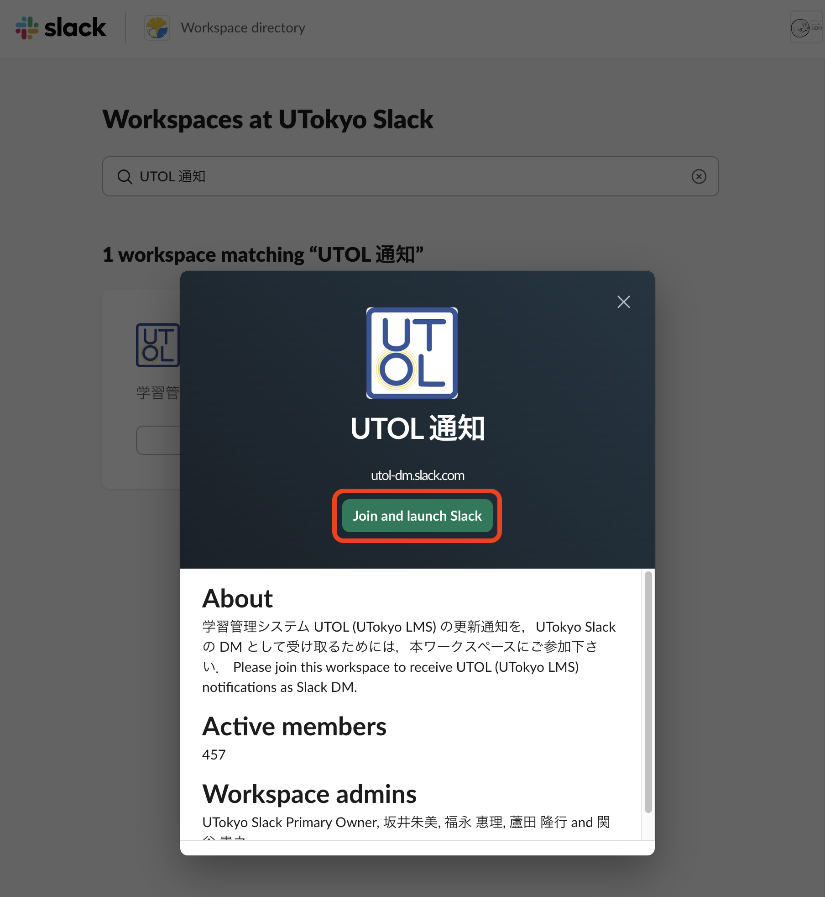{:.center}
6. 参加が完了すると，ワークスペースの画面が表示されます．「UTokyo Slack」タイトルの直下にあるワークスペース一覧を開き，「UTOL 通知」が含まれていることを確認してください．
  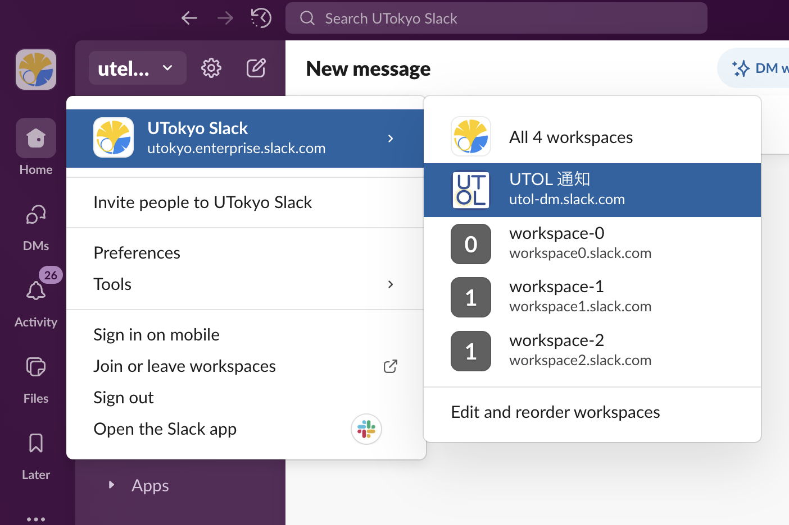{:.center}

#### Step2: Enable Slack notification in UTOL

1. Open UTOL and then click to open the "Settings" in the top menu.
  <figure class="gallery">{:.center}{:.center}</figure>
2. Click the "Connect UTokyo Slack" (in blue) button in the "UTokyo Slack" section.
  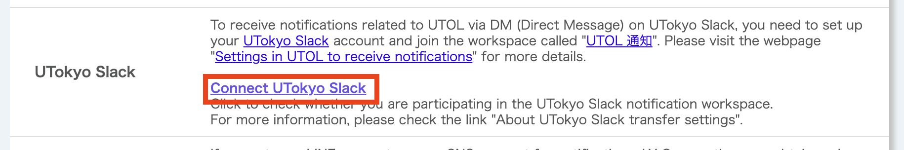{:.center}
3. Confirm that it has changed to "Disconnect UTokyo Slack" (in blue).
  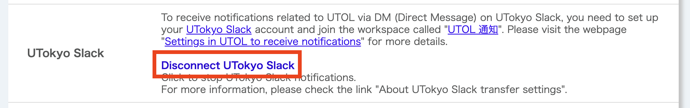{:.center}
4. Follow the steps under "[Set notification scope](#notification-range)" to set the notification destinations and content.
    - If you do not complete this setting, **no notification will be sent by default**.

## Set notification scope
{:#notification-range}

This section explains how to configure the notification scope (specifying which destination to send to, what type of notifications to send, and how frequently to send them) for each destination.

Settings can be configured separately for [Updates notification](#update-notification-range) (**title only**), and [Information/Message Notifications](#message-notification-range) (information notice and message **content**). However, setup options available differ between the two.

- Updates notification: destination, type, and frequency
- Information/Message Notifications: **destination only**

### Update information
{:#update-notification-range}

This section explains how to configure the destinations, type, and frequency of the update notifications. The available settings are as follows.

- **Destination**
  - You can configure settings individually for "Email", "LINE", and "UTokyo Slack".
- **Type**
  - You can select from seven types of notifications: "Message", "Information notices", "Report", "Material", "Test", "Survey", and "Forum"
- **Frequency**
  - You can choose one from the following options: "Do not forward", "Instant transfer", and "Redirecting all information once a day".
    - However, if LINE is selected as the destination, "Instant transfer" is not available for sending update information related to "Report", "Material", "Test", "Survey", and "Forum"

In addition to [the overall UTOL common updates notification settings](#update-notification-range-all), you can also [configure updates notification individually for each course](#update-notification-range-per-course). This is useful if you "prefer to receive updates notification via Slack for specific important courses only".

The following explains both [the common (overall UTOL) settings](#update-notification-range-all) and [per-course notification settings](#update-notification-range-per-course).

#### Overall UTOL settings
{:#update-notification-range-all}

1. Open the "Settings" screen from the menu at the top of the screen.
  <figure class="gallery">{:.center}{:.center}</figure>
2. Move to the "Updates information" > "Update information email/UTokyo Slack/LINE forwarding settings"
  {:.center}
    - "Updates notification"
      - Select whether or not to send updates notification.
    - "Updates information Email/LINE/Slack Forwarding settings"
      - Select the frequency for each destination and type of updates notification from the dropdown list.
3. After making your selection, click "Proceed to the Confirmation Screen/Confirm".
4. When the "Personal Settings" confirmation screen appears, review your settings, and click "Submit/Register".
  {:.center}
5. The "Personal Settings Completed" screen will appear. If you have received a message "Settings have been completed. Confirmation Email is sent to Email address you set. Please check whether e-mail adresses you set is coreect if mails are not sent even after a while.", your setup was successful.


#### Settings for each course
{:#update-notification-range-per-course}

Warning: If you modify [the overall UTOL settings](#update-notification-range-all) after configuring individual course settings, the change will **overwrite** your course-specific preferences for the affected items.

1. Open the "Course Top" screen for the desired course.
2. Click the relevant link under the "Updates information email/LINE/UTokyo Slack forwarding settings" (in blue) at the top right of the screen.
  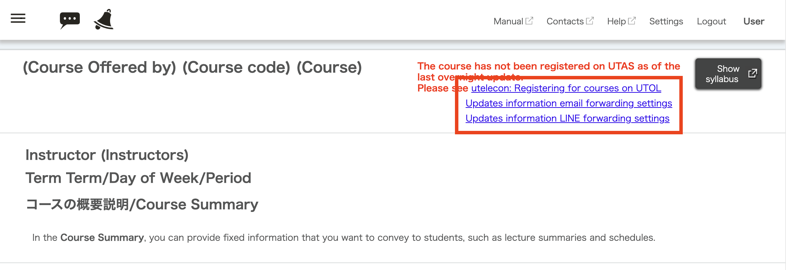{:.center}
3. Select your preferred sending frequency for each type of updates notification and destination from the dropdown list.
  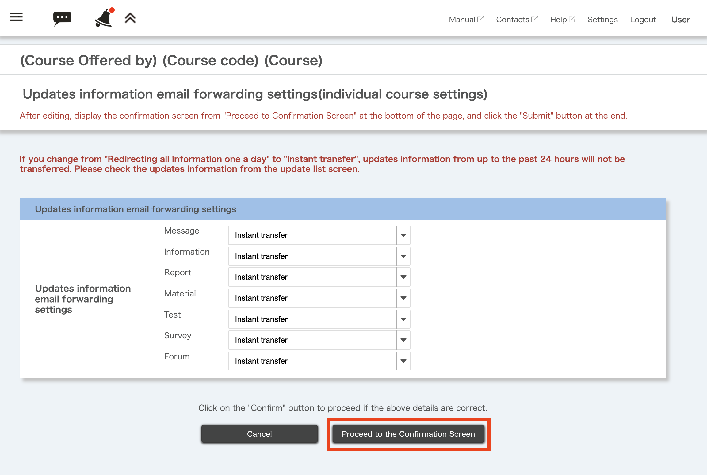{:.center}
4. Once you have made your selection, click "Proceed to the Confirmation Screen".
Review your settings, click "Submit".

5. The "Complete personal setting" will appear. If you see the "Settings have been completed" message, your setup was successful.
  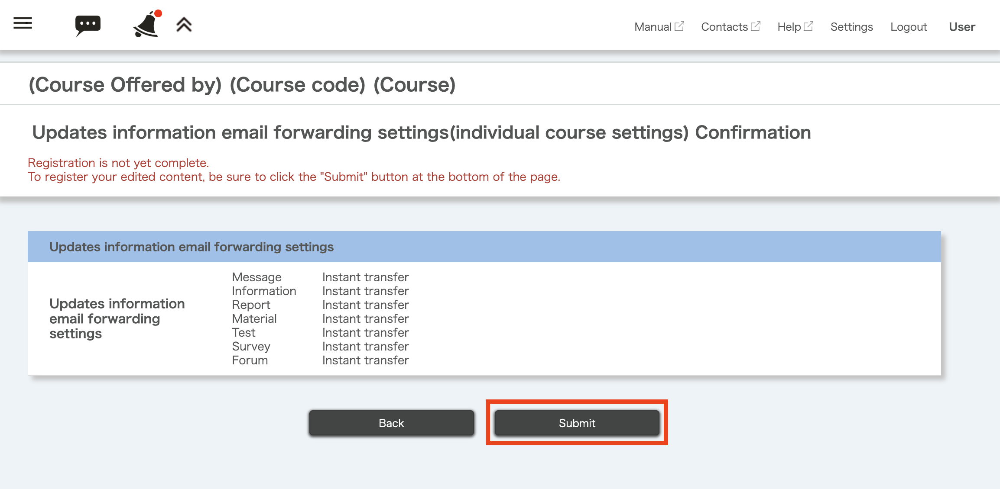{:.center}
6. 「個人設定完了」画面が開きます．「設定が完了しました」と表示されていれば問題ありません．

### Information/Message Notifications
{:#message-notification-range}

This section explains how to set where "Information notices and messages" are sent.

1. Open the "Settings" screen from the menu at the top of the screen.
  <figure class="gallery">{:.center}{:.center}</figure>
2. In the "Information/Message Notification" section, select your preferred receiving method from the dropdown list.
  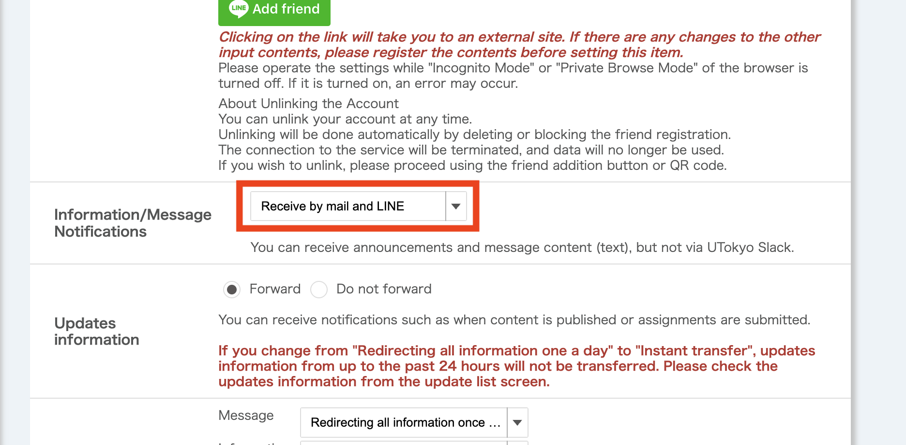{:.center}
3. Scroll down to the bottom of the screen, click "Proceed to the Confirmation Screen/Confirm".
4. When the "Personal Settings" confirmation screen appears, review your settings, and click "Submit/Register".
  {:.center}
5. The "Personal Settings Completed" screen will appear. If you have received a message "Settings have been completed
Confirmation Email is sent to Email address you set.
Please check whether e-mail adresses you set is coreect if mails are not sent even after a while.", your setup was successful.


## Stop receiving notifications

This section explains how to cancel (stop) receiving notifications from UTOL.

(For all cases) Open the "Settings" screen from the menu at the top of the screen.

<figure class="gallery">{:.center}{:.center}</figure>

### Email

1. Select "Do not forward" in the "Email" section.
2. Scroll down to the bottom of the screen, click "Proceed to the Confirmation Screen/Confirm".
3. When the "Personal Settings" confirmation screen appears, review your settings, and click "Submit".
  {:.center}
4. The "Personal Settings Completed" screen will appear. If you have received a message "Settings have been completed
Confirmation Email is sent to Email address you set.
Please check whether e-mail adresses you set is coreect if mails are not sent even after a while.", your setup was successful.

### LINE

If you block "東京大学UTOL" or remove it from your friends list, notifications will automatically be disabled.

#### Blocking

1. Open the LINE App, and go to the chat room with "東京大学UTOL".
2. Tap the icon in the upper right corner and select "Block".

{:.center}

#### Removing from your friends list

1. Open the LINE App and go to your "Friends list".
2. Look for "東京大学UTOL" under the "official account" tab, or search for it in the search window, then press and hold the "東京大学UTOL".
3. Select "Delete" from the menu.

{:.center}

### UTokyo Slack

1. Click "Disconnect UTokyo Slack" (in blue) under the "UTokyo Slack"
  {:.center}
2. Confirm that it has changed to "Connect UTokyo Slack" (in blue).
  {:.center}

