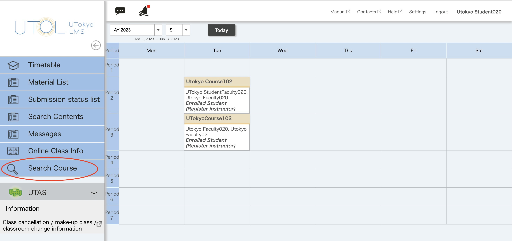
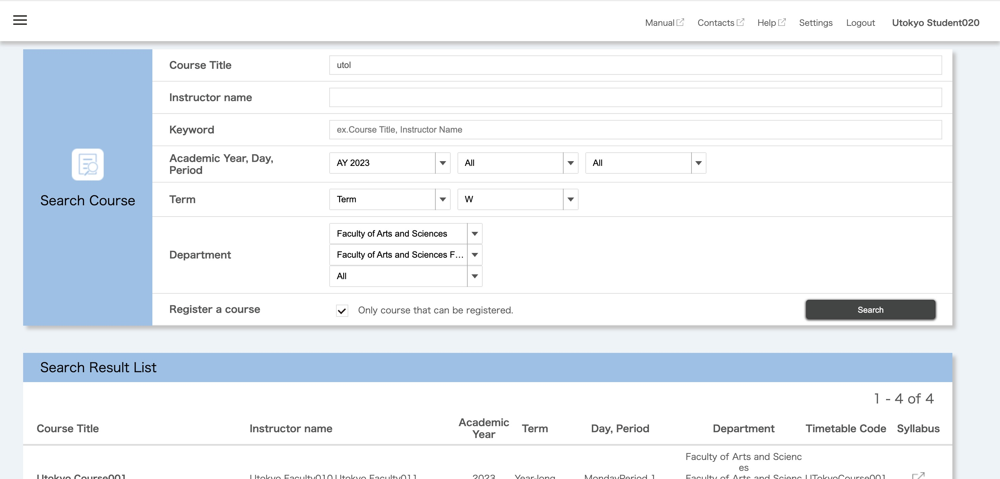
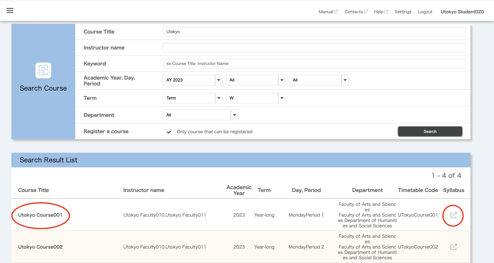

On UTOL, subjects offered on a term or semester basis are referred to as “courses”.

By using the Search Course function, you can filter and search for courses registered on UTOL based on conditions you set such as course title, day and period and department.

## Procedures to Search for Courses on UTOL
1. click{:.icon}at the upper left corner of the page.
2. Please click “Search Course” in the menu displayed on the left.

    
3. The course search page will be displayed. Please enter the conditions and perform the search. The conditions you can enter are as follows:
    * Course Title
    * Instructor name
    * Keywords
      * You can search by the course name, the instructor name, or keywords included in the "Course Summary".
    * Academic Year
    * Day
      * For Intensive Courses, select "Other".
    * Period
      * For Intensive Courses, select "Outside".
    * Term
      * If you select "Term", you can specify terms such as "S1" or "A2" to search for courses offered in a specific term.
        * For example, specifying "S1" as “Term” will include courses offered in the S1 term, the S semester, and the full year.      
      * If you select "Classification", you can specify search categories such as "S1", "A1A2", or "Intensive".
        * For example, specifying "A1A2" as the "Classification" will include courses offered throughout the A semester, but it will not include courses that are only offered in the A1 term.   
    * Department
      * Selecting a higher-level organization (e.g., "College of Arts and Sciences") will display a pull-down menu for selecting a lower-level organization (e.g., "Department of Humanities and Social Sciences").
    * Register a course
      * Checking "Only a course that can be registered", will search for courses where you [register for courses on UTOL (for enrolled students)](../course_registration/) by yourself, even if you have not registered yet.

    
4. When you click on the course title in the Search Result List, you will be redirected to the course top page. In addition, you can access the corresponding syllabus page on UTAS by clicking the button in the “Syllabus” column. 

    
