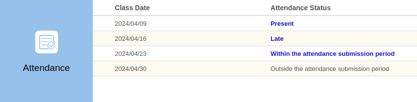
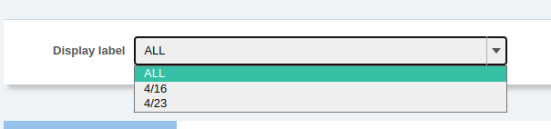
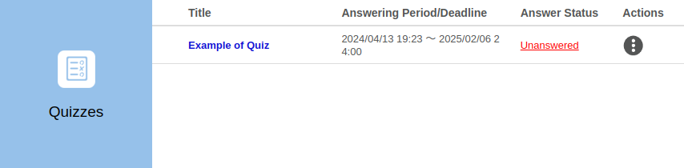
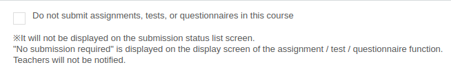
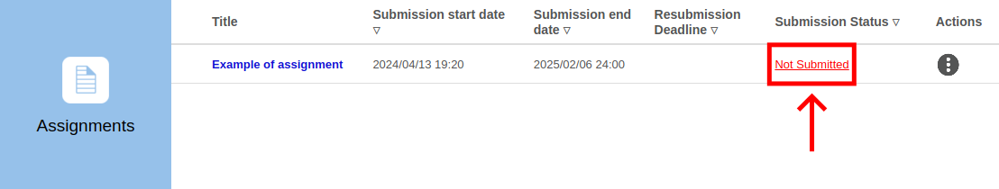
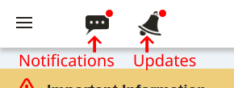
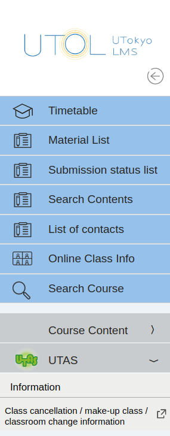
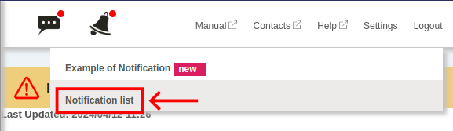
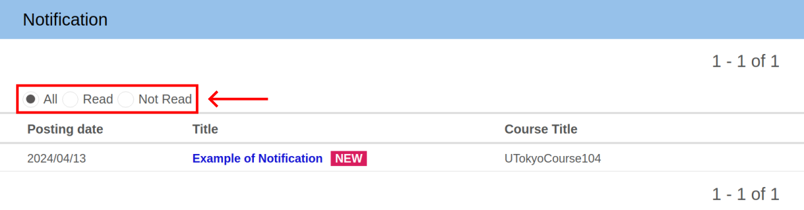
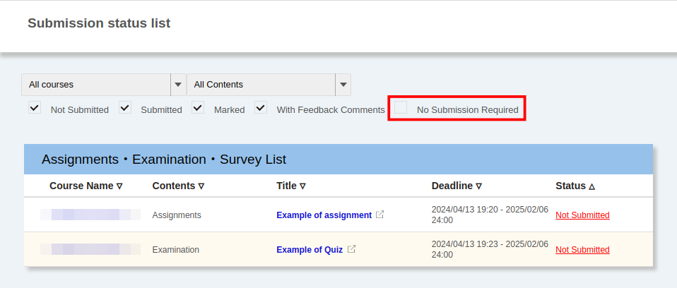

import Timetable from "../_timetable/Timetable.mdx";

This page explains how to use UTOL as a student enrolled at UTokyo. For instructions on how to use UTOL as a course instructor or TA, please refer to the “[Using UTOL as a Course Instructor or TA](../lecturers/)”.

First, we will describe how to check your courses in the timetable and calendar format, and then how to view the course information as well as how to use the functions for assignments, handouts, and other materials (contents). Finally, this will explain how to list or search the contents of the courses you are taking and how to search for them.

## Checking Registered Courses
{:#courses}

<Timetable variant="student" />

## Viewing course information
{:#course}

When clicking the course name in the Timetable or Calendar, the course top page will open (for more information, please refer to “[Checking which courses you are registered for](#courses)”). 

The Course Top screen displays an overview of course information, such as assignments and course materials.

### Course Registration
{:#registration}

Usually, courses registered through UTAS[^1] are automatically registered, but some courses require manual registration.

[^1]: If you register for a course before the deadline, courses you have registered as favorites will also be automatically registered for you.

For more information, please refer to “[Registering for courses in UTOL (for enrolled students)](course_registration/)”.

### Notifications and Updates
{:#course-notification}

The UTOL’s notification function includes “Updates”, which automatically notifies you when there are updates to course materials, and “Notifications”, which are registered by your course instructor.

You can set whether or not to receive these notifications for each course. For more information, please refer to “[Settings to receive notifications in the UTOL](../notification/)”.

### Attendance
{:#attendance}

For classes for which attendance is taken on UTOL, please register your attendance according to “[Registering attendance](#register-attendance)” below.

Please note that the method of taking attendance and managing attendance differs from class to class, so if you have any concerns about this, please consult your course instructor.

#### Registering attendance
{:#register-attendance}

1. Click the “Submit Attendance” button at the upper part of the course top screen.
1. Enter the attendance password instructed in the class and click the “Send” button.

If the time designated by your course instructor passes, you will be registered as “Late”.

#### Checking past attendance status
{:#view-attendance}

Status of past attendance is displayed in the “Attendance” column at the bottom of the Course Top screen in the form of “Present”, “Late”, “Absent” and so on.

### Labels
{:#label}

The label is a function that filters the contents displayed on the Course Top screen by the relevant groups. Labels must be assigned in advance by your course instructor (enrolled students cannot create or edit labels).

If you select the label you want to display from the pull-down menu at the upper part of the Course Top, only the contents with that label will be displayed. If you select “ALL”, all contents will be displayed.

### Course materials
{:#material}

Materials, such as course materials, are displayed in the “Course Materials” section on the Course Top screen.

The publication period is set for course materials and will sometimes end before the examination. Therefore, please check the publication periods carefully.

### Messages and Forums
{:#communication}

The functions for messages and forums allow you to communicate with your course instructor, TA, or other students taking the course. Messages can only be viewed by the person you specify as a recipient or your course instructor. However, posts on the forum can be viewed by all participants in the course.

For more details on the function for messages, please refer to “[Using the message function in UTOL (for enrolled students)](messages/)”.

### Assignments, Quizzes, and Surveys
{:#submission}

Assignments, quizzes, and surveys are all created by your course instructor (except for class surveys) and are displayed in the respective columns on the Course Top screen. Clicking the respective title will take you to the submission • response screen, where you can submit or answer it.

If you press {:.icon} on the right-hand side, you can view the results of the quizzes or surveys. Please note that some items may not be displayed as they are set to be displayed or hidden by your course instructor.

#### Class Surveys
{:#lecture-survey}

The class surveys conducted by some departments are anonymous and have unique features.

- They are not displayed in the “[Submission status list](#list-submission)”.
- You cannot view or correct your answers.
- Your course instructor can view the total results but not your comments or the names of the enrollees who have answered the survey.

### Function for No Submission Required
{:#no-submission}

The function for No Submission Required prevents assignments, quizzes or surveys that do not need to be submitted from being displayed on the “Submission status list”.

You can set everything to be all “No Submission Required” within the course or individually.

#### Setting an entire course to no submission required in batch
{:#no-submission-course}

To set an entire course to “No submission required”, check the box “Do not submit assignments, tests, or questionnaires in this course” at the upper Course Top screen.

If you uncheck the box, the items will reappear in the submission status list. Items that have been made submission-free individually will continue to be not displayed.

#### Setting individual Assignments, Quizzes and Surveys to no submission required
{:#no-submission-individually}

You can set individual assignments, quizzes and surveys to “No submission required” or cancel it.

Please note that you cannot cancel assignments that have already been submitted. Also, if you have set the entire course to no submission required, you cannot then individually change them back.

1. Click the “Not Submitted” (or “No Submission Required”) button in the “Submission status” column.
1. When the dialog box opens, click “Not Submitted” (or “No Submission Required”) button.

## Listing or searching for courses
{:#list-and-search}

This section explains how to list and search for information provided by the course you are taking.

The list of notifications and updates can be viewed from the bar displayed on the above screen.

The list and search of other items can be found in the left menu (the menu that appears on the left side of the screen when you press {:.icon} at the top left corner).

### List of Notifications & List of Updates
{:#notification}

In the list of Notifications or Updates, you can display a list of notifications and updates for the courses you are taking.

When there are unread information or unread updates, the icon on the bar on the upper screen will have a red circled attached. When the icon is pressed, a box will open, and the unread notifications will appear.

To view notifications you have already read, click the “Notification list” or the “Updates list” in this box and select “All” or “Read”.

### Material List
{:#list-materials}

The current course materials for the course you are taking are displayed.

### Submission status list
{:#list-submission}

Assignments, quizzes and surveys that are currently required for the course you are taking are displayed.

The items that are set to “No Submission Required” are not displayed by default, however, they will be displayed if you tick the “No Submission Required” checkbox on the “Submission status list” screen.

Please note that class surveys are not displayed.

### List of contacts
{:#list-messages}

Messages addressed to you are displayed.

### Online Class Info
{:#list-online-lectures}

The “Online course information” for the course you are taking are displayed all together.

### Search Contents
{:#content-search}

You can search contents for course materials, assignments, quizzes, and surveys for your course.

## Searching for Courses
{:#course-search}

Course Search is a function that allows you to search for courses on UTOL and can be used to find courses to register for. You can also search for past courses from 2019 onwards.

For details, please refer to “[Searching for courses in UTOL (for enrolled students)](course_search/)”.

## Details on functions for enrolled students

For more detailed information on individual functions, please refer to the following pages.

- [Registering for courses in UTOL (for enrolled students)](course_registration/)
- [Searching for courses in UTOL (for enrolled students)](course_search/)
- [Using the message function in UTOL (for enrolled students)](messages/)
