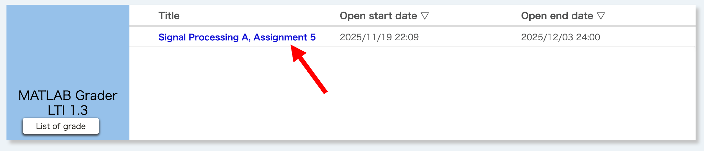
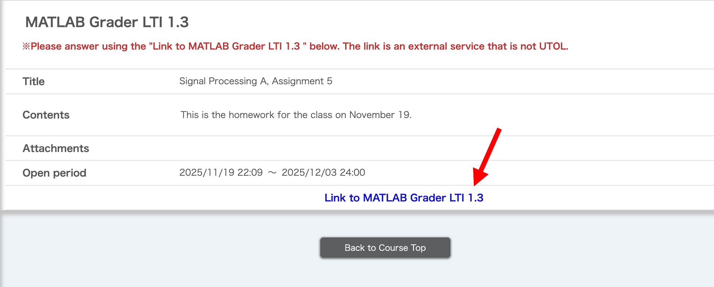
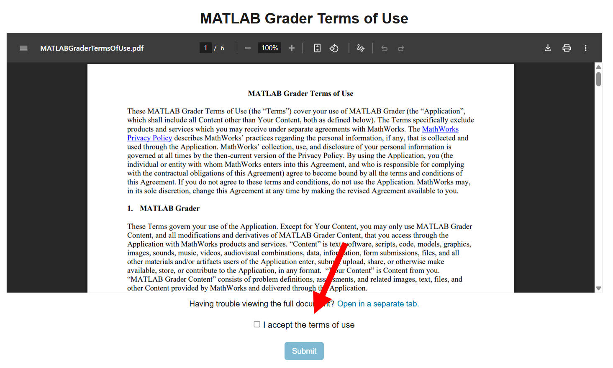
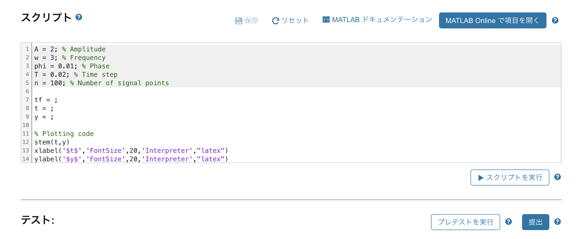

## Overview

This section explains how to use MATLAB Grader in UTOL.

## Solve a Problem

1. If an instructor has published problems created with MATLAB Grader, they will appear as follows in "MATLAB Grader LTI 1.3" on the Course Top screen.

    

2. When you click on the title (in the above screen, "Signal Processing A, Assignment 5"), it transitions to the following screen, displaying details such as the content and the publication period. Check the "Content", etc., and click on "Link to MATLAB Grader LTI 1.3". The MATLAB Grader screen will open in a separate tab (or window).

    **When the publication period ends, the "Link to MATLAB Grader LTI 1.3" will be deactivated, and the problems on MATLAB Grader will no longer be accessible.**

    

3. If the following "MATLAB Grader Terms of Use" screen appears, please review the content, check "I accept the terms of use", and click "Submit".

    

4. The following screen will appear. Follow the problem instructions to create a 「スクリプト」(Script), then click 「プレテストを実行」(Run Pretest). If no issues are found, click 「提出」(Submit).

    

## Check Answer Status

Scores can be checked by clicking the "List of grade" button on the Course Top screen of UTOL.

For details other than scores, such as the submitted answers, please check them in the MATLAB Grader. Click on「自分の解答履歴を確認する」(View Submission History) on the top-right of the MATLAB Grader screen to review submission times, answer contents, and more.

When the publication period ends, **the "Link to MATLAB Grader LTI 1.3" will be deactivated**, and the problems and detailed answers on MATLAB Grader will no longer be accessible.

