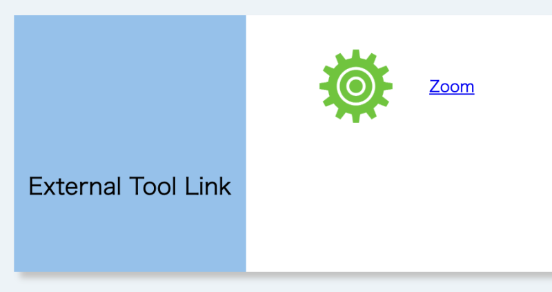
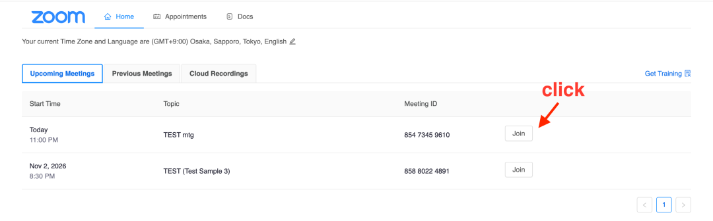
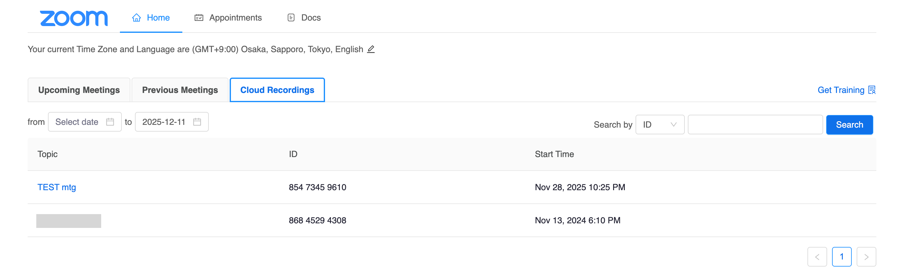
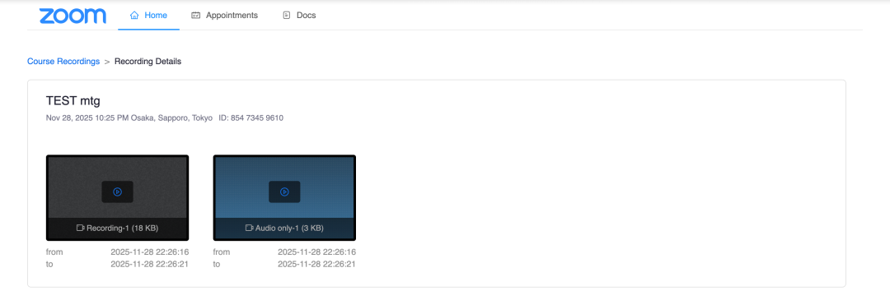

## Overview

When using Zoom meetings with the LTI integration in UTOL, enrolled students attending the course can join Zoom meetings with a simple screen operation by clicking the Zoom button in the “External Tool Link” section of the UTOL, or view meetings recorded on the cloud (cloud recording).

This page explains how enrolled students can use the Zoom meetings through the LTI integration in UTOL.

## Join a Meeting

Course participants can join Zoom meetings that have been configured using an LTI integration, with a simple screen operation.

### Steps

1. Open the course top screen.
2. Click “Zoom” in the “External Tool Link” section.
  {:.small}
3. Click the “Join” button for the meeting on the screen and the Zoom application will start.
   - If the language setting is “English”, click the “Join” button.

   

## View Cloud Recordings

When the course instructors or TAs have record Zoom meetings configured using an LTI integration onto the cloud, enrolled students can view the recordings through a web browser.

### Steps

1. Open the course top screen.
2. Click “Zoom” in the “External Tool Link” section.
  {:.small}
3. Select the “Cloud Recordings” tab.
4. Click the title of the meeting you wish to view.
  
5. Click the button on the recording you wish to view.
  
