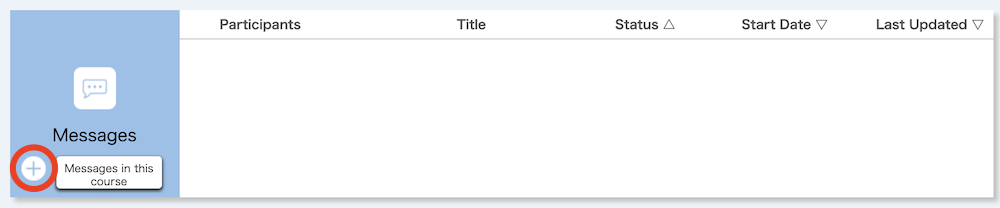
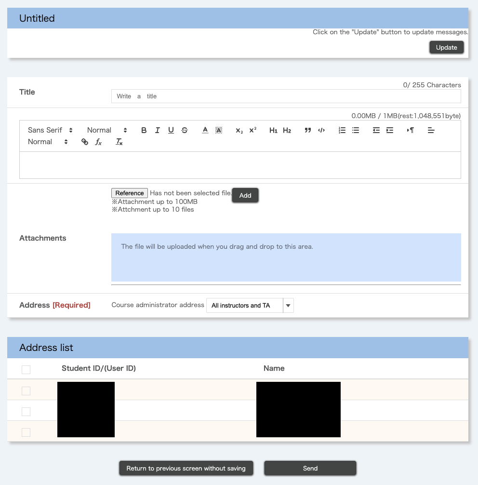
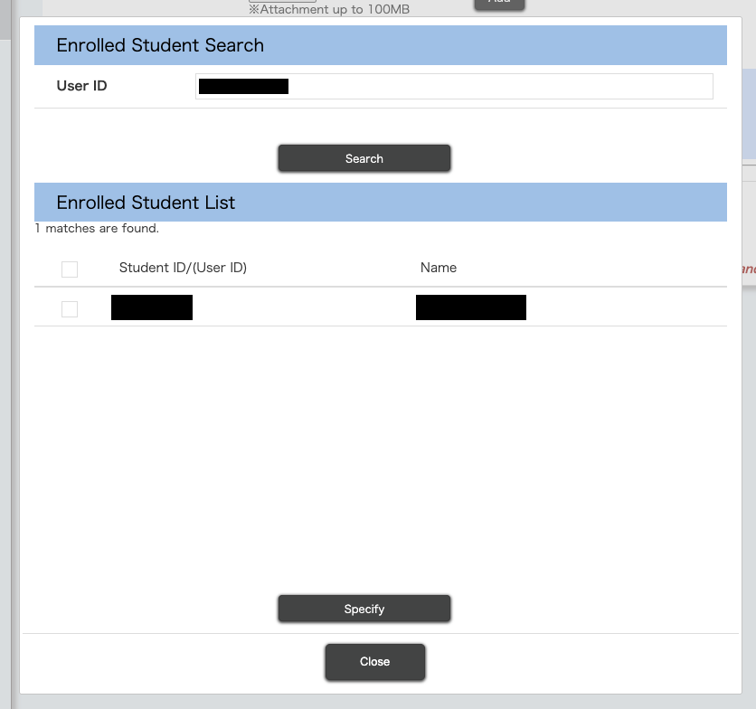
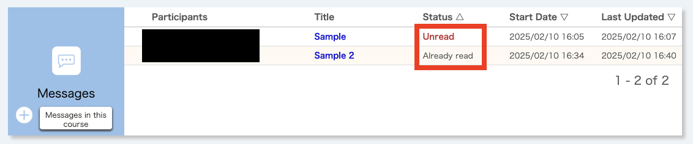
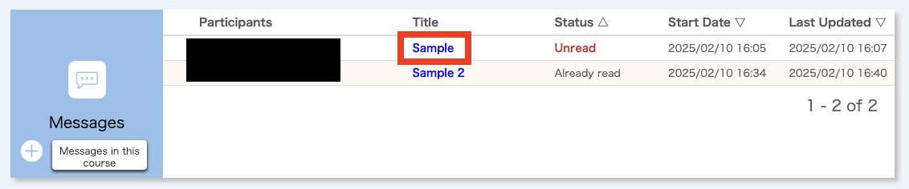
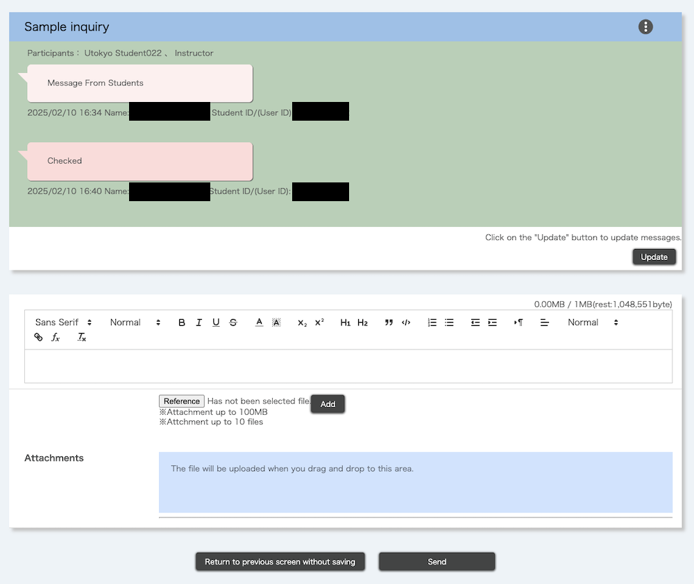

## What is the message function

Enrolled students in a course on UTOL can send messages to course instructors, TAs, and other enrolled students. Please note that this feature is unavailable unless the course instructor has enabled it.

## How to use

This section provides an explanation of how to use the message function.

### Start a new conversation

1. Click the "+" button of the "Messages" section on the course top screen to go to the "Messages" screen. You will now be able to create a new message. 
   
2. Enter the following information.
   
    * Title
    * Message body
      * You can use the markup function in UTOL. For more information about the markup function, please refer to "[Using the markup function in UTOL](../../markup/)".
    * Attachments
      * To attach a file, click the "Reference" button, select a file, and click the "Add".
      * Please refrain from using attachments when in an emergency or mass sending.
    * Address: You can set course instructors, TAs and enrolled students in the course, or both as recipients.
      * Specify the course instructors / TAs (course administrators) address
        * The course administrator's destination can be selected from "All instructors and TA", "All instructors", or "No Specify".
        * You cannot send messages to specific course instructors or TAs in courses with multiple instructors and TAs.
        * Select "All instructors and TA" or "All instructors" depending on your message.    
        * If you select "No Specify" for the course administrator recipient, messages will be exchanged only among students. Please note that in this case, course instructors and TAs cannot join the conversation, but course instructors can view the messages. Also, when selecting "No Specify", you must add at least one enrolled student as a recipient.
      * Specify enrolled students
        * You can add the enrolled students address by following the steps below.
          1. Click the "Search and add students" button to display the enrolled student search pop-up screen.
          2. Enter the user ID for an enrollee (if the user is logged in with their UTokyo Account, enter their 10-digit common ID) in the "User ID" field and click "Search".  The user will be displayed in the search result list. 
          3. Select the checkbox to add the user.
          4. Click the "Specify" button.
       
3. Click the "Send" button to send the message.
   

### Check and reply to received messages

#### Check the received message

You can find new messages from the "Messages" section of the "Course Top" as follows:
* When you receive a reply to an existing conversation:
  * The "Status" column for that conversation will show "Unread".
* When the course instructors, TAs, or other enrolled students start a new conversation that includes you:
  * A new conversation will appear, and its "Status" column will show "Unread".

You can also check this information in the update notifications or receive replies via email or LINE. For details on the settings, please refer to "[Settings in UTOL to receive notifications](../../notification/)".

#### Reply to the conversation

You can reply to the message by following the steps below.
1. Click the message title on the course top screen. This will open the post messages screen where you can view the conversation.
   {:.border}
   {:.border}
   To check new messages received while on this screen, click the "Update" button at the top of the screen.
2. To reply, compose your message, add attachments if needed, and click "Send".
