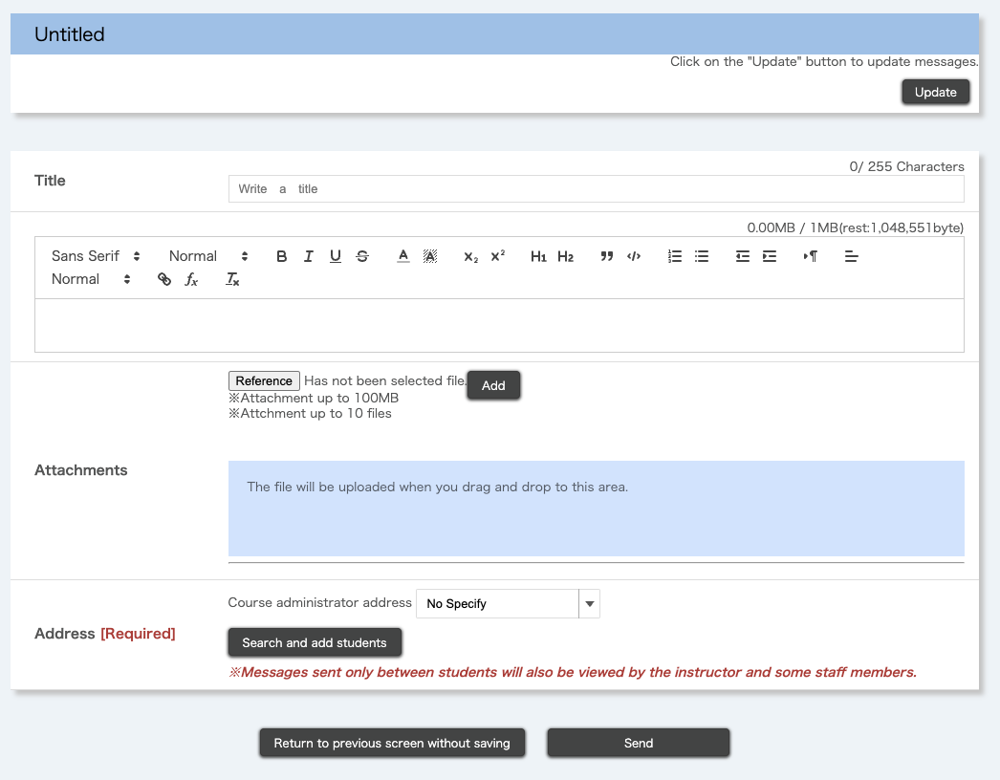
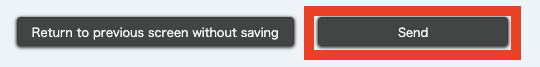

## What is the message function

Enrolled students in a course on UTOL can send messages to course instructors, TAs, and other enrolled students. Please note that this feature is unavailable unless the course instructor has enabled it.

## How to use

This section provides an explanation of how to use the message function.

### Start a new conversation

1. Click the "+" button of the "Messages" section on the course top screen to go to the "Messages" screen. You will now be able to create a new message. 
   
2. Enter the following information.
   
    * Title
    * Message body
      * You can use the markup function in UTOL. For more information about the markup function, please refer to "[Using the markup function in UTOL](../../markup/)".
    * Attachments
      * To attach a file, click the "Reference" button, select a file, and click the "Add".
      * Please refrain from using attachments when in an emergency or mass sending.
    * 宛先：教員・TAや履修者，あるいはその両者を宛先として設定できます．
      * 宛先に教員・TA（コース管理者）を指定する
        * コース管理者の宛先は「すべての担当教員及びTA」「すべての担当教員」「指定なし」から選択できます．    
        * 複数の教員・TAが参加するコースで特定の教員・TAに対してのみメッセージを送ることはできません．
        * 教員にのみ伝えたい内容かどうかで「すべての担当教員およびTA」か「すべての担当教員」かを使い分けてください．      
        * コース管理者の宛先に「指定なし」を選択すると，履修者同士のメッセージのやりとりとなります．なおこの時，担当教員やTAはメッセージに参加できませんが，担当教員はメッセージを閲覧することができます．また，「指定なし」を選択した場合は1人以上の履修者を宛先に指定してください．
      * 宛先に履修者を指定する
        * 以下の手順に従って追加できます．
          1. 「履修者を検索して追加」ボタンを押すと，履修者検索画面がポップアップで表示されます
          2. 追加したい履修者のID（UTokyo Accountでログインしているユーザの場合は，10桁の共通ID）を「ユーザID」欄に入力し，「検索」を押してください．検索結果一覧にユーザが表示されます．
          3. 追加したいユーザのチェックボックスにチェックを入れてください．
          4. 「指定」ボタンを押してください．
       
3. Click the "Send" button to send the message.
   

### Check and reply to received messages

#### Check the received message

You can find new messages from the "Messages" section of the "Course Top" as follows:
* When you receive a reply to an existing conversation:
  * The "Status" column for that conversation will show "Unread".
* When the course instructors, TAs, or other enrolled students start a new conversation that includes you:
  * A new conversation will appear, and its "Status" column will show "Unread".

You can also check this information in the update notifications or receive replies via email or LINE. For details on the settings, please refer to "[Settings in UTOL to receive notifications](../../notification/)".

#### Reply to the conversation

You can reply to the message by following the steps below.
1. Click the message title on the course top screen. This will open the post messages screen where you can view the conversation.
   
   
   To check new messages received while on this screen, click the "Update" button at the top of the screen.
2. To reply, compose your message, add attachments if needed, and click "Send".
