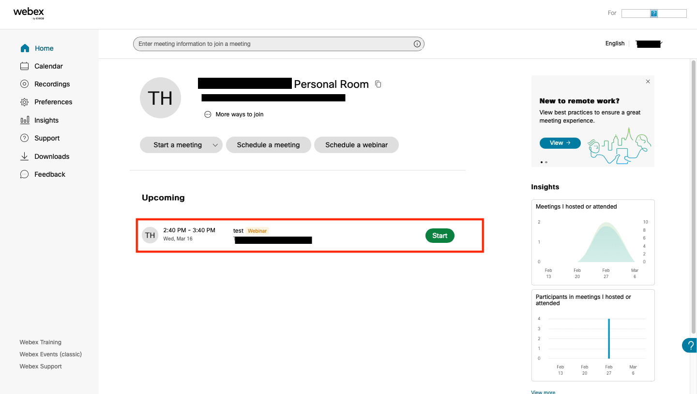
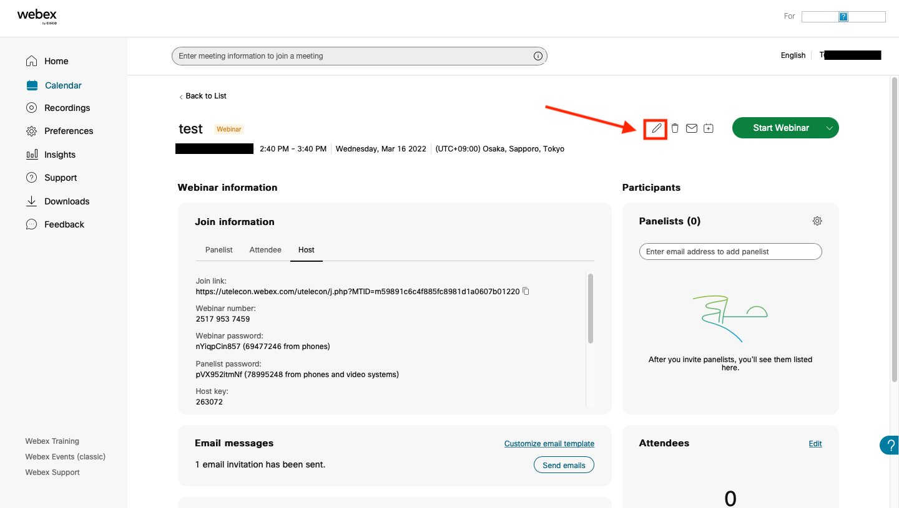
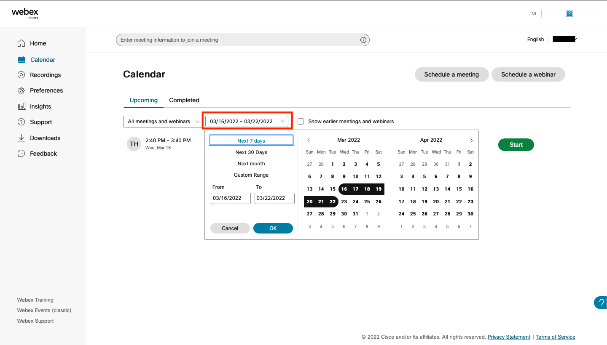
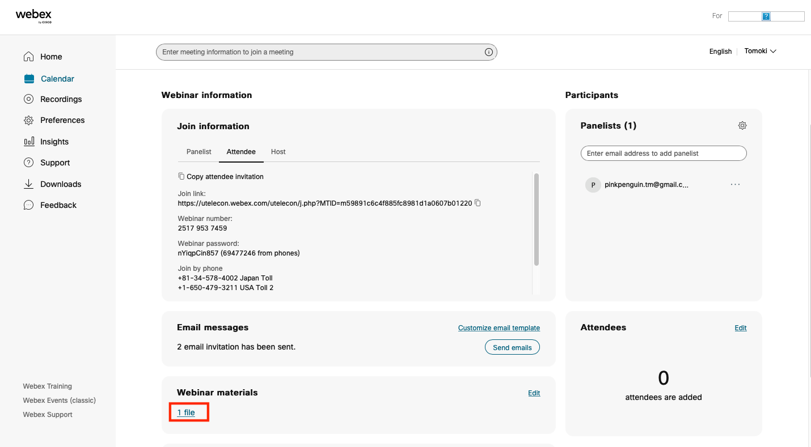

<strong class="box">

**Webex Webinars, the topic of this article, should not be confused with Webex Events (classic), which you can set up by clicking “Webex Events (classic)” on the bottom-left corner of the home screen. They are configured differently, have different available functions, etc.**
{:.border.medium}

</strong>

## Setting up a Webex Webinar

* To schedule a Webex Webinar, click “Schedule a webinar” on the home screen to configure the settings.
	* On the “Schedule a webinar” page, you can set the topic, password, date, panelists, etc., for your meeting. Details for each item are as follows.
	* **Topic**: Type the name of the webinar. This item is required.
	* **Webinar password**: This is the password required for participants to enter the webinar. A random string of letters is displayed by default, but this can be changed.
	* **Date**: By default, this is set as the date you last accessed this page, but you can change it by clicking the symbol on the right-hand side. You can also set the meeting to recur. Put a check in the box next to “recurrence” and a panel will appear where you can configure the rules for recurring meetings.
	* **Panelists**: Type the e-mail addresses of the individuals you want to assign as panelists for the webinar. Once you complete these settings, an e-mail containing the URL of the meeting and other information will automatically be sent to the panelists.
	* **Panelist password**: This is the password required for panelists to enter the webinar. A random string of letters is displayed by default, but this can be changed.
	* **Show advanced options**: You can use these options to configure your audio connection and scheduling options, as well as to set an agenda for your meeting. For example, you can set up the webinar to start recording automatically, allow participants to enter the meeting before the host, register participants, and turn on email reminders.

	{:.border}

* Once you complete configuring the options, you can press the “Schedule” button to generate the meeting number.
	* An invitation e-mail will be sent to the addresses of the individuals who are registered as participants.
	* You can also notify individuals who are not registered as participants by sending them an email with the requisite information, including the meeting link, meeting number, and password. Only the hosts should know the host key, so be careful not to share this number with other participants.

	{:.border}

## Editing a Webex Webinar

To edit the contents of a webinar that has already been set up, select the webinar in question from the home screen and click on the Edit icon.
{:.border.medium}
{:.border.medium}
* Any meetings/webinars scheduled within a week will be shown on the home screen. If you wish to select a webinar scheduled more than a week away, you can search for it by clicking “Calendar” on the left of the home screen and entering the desired date.
{:.border.medium}
{:.border.medium}

### Sharing Materials

You can attach materials to the webinar and share them with participants.
* You cannot share materials with participants who are joining via smarthphones and other similar devices.
* To upload your files, go to the edit Webinar page and click on “edit” under the “Webinar materials” section.
{:.border}
{:.medium.border}
* Participants can download the files from the page displayed when they click on the invitation URL through their browser.
{:.border.medium}
{:.medium.border}

 
 
<a href="index" target="_blank">Back to How to use Webex</a>
