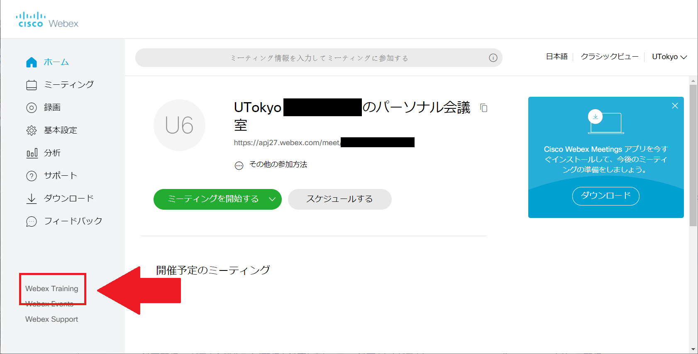
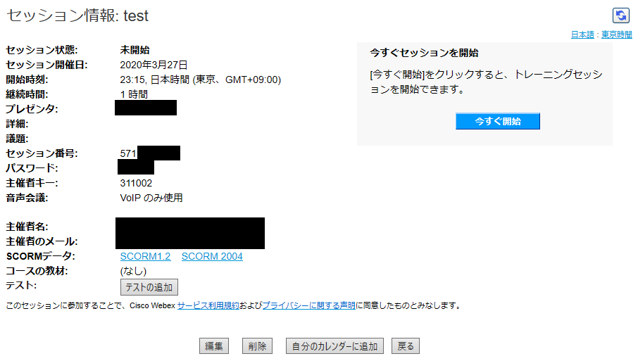
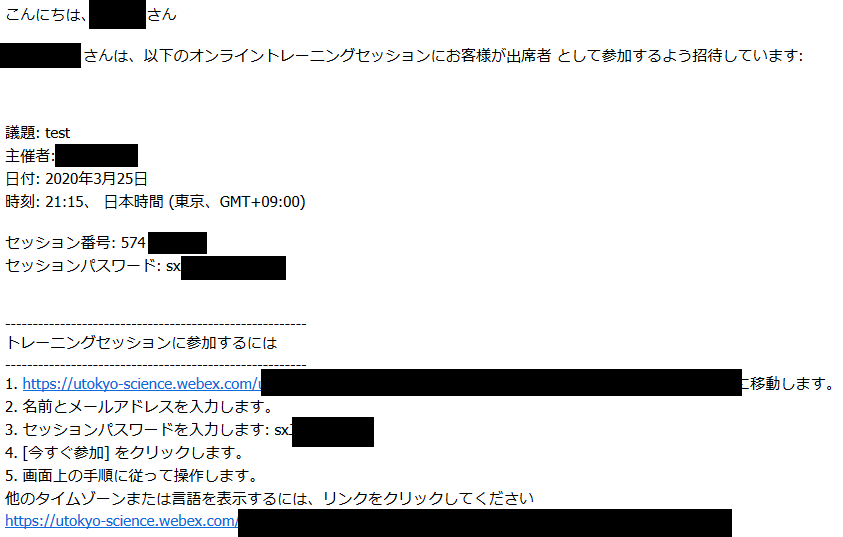

## How to Create Webex Training
1. To display the Training Menu, click on "Webex Training" on Home menu.

	{:width="700px"}

2. Click on "Training Schedule"

	{:width="500px"}

3. Set up
	* **Agenda**：fill in the title of meeting. **(required field)**
	* **Session Password**： Optional, but **you can change it as necessary.**
	* **Mute when joining**： Turn participants mute when joining a meeting  (recommended).
	* **Date**： The date is displayed on the screen when opening the browser, and you can change it when necessary. If you want to set repeated training sessions, select other than "single session class", then  you can fix the meeting schedule regularly like a classroom. 
	* **Require participants to register in advance**： You can ask participants to register for the training. However, you do not have to use this when using Webex Training at school.
	* After you get used to manipulate Webex Training, try and adjust .other settings
	* When you finish all settings, press "Schedule".

	{:width="700px"}

	* After you finish scheduling the Webex Training, you can confirm Training information by clicking the given home screen (See below).

	{:width="500px"}

	{:width="700px"}

	* Organizers  notify session number and password to your participants.

* Participants obtain the email after organizers schedule the training session. 

	{:width="700px"}

* If organizers designate a presenter, the presenter obtains the following email.

	{:width="700px"}

 
 
<a href="index" target="_blank">Back to How to Use Webex</a>
