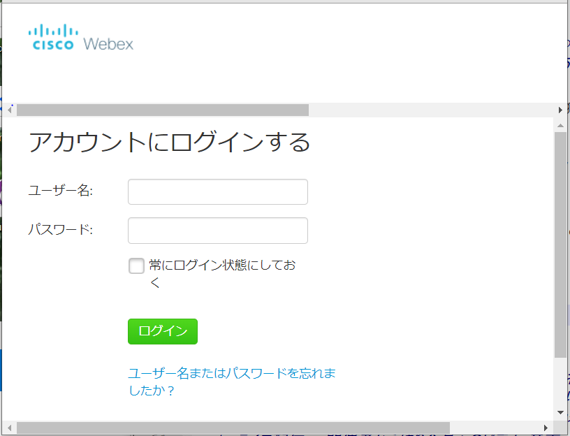
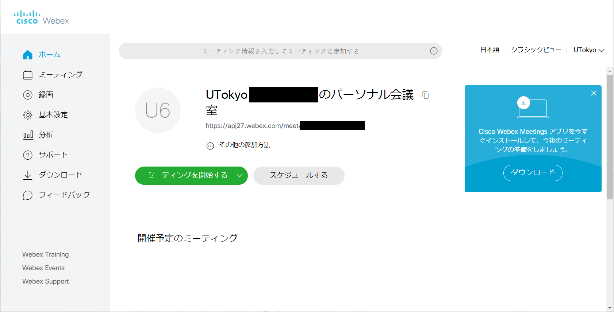

## Create a Webex Account	
* <a href="https://hwb.ecc.u-tokyo.ac.jp/wp/literacy/email/initialize/" target="_blank">Once you create ECCS Cloud Mail account </a>, go to the <a href="https://apj27.webex.com/mw3300/mywebex/forgotpwd.do?siteurl=apj27-jp" target="_blank">password setting screen</a>（See below）. Fill the box with 10-digit common `ID@g.ecc.u-tokyo.ac.jp` of ECCS Cloud Mail. For example, If your ID is 1234567890, fill in `1234567890@g.ecc.u-tokyo.ac.jp` . （Continue with the process, even though the screen shows "forgot your password / username").Press "submit (送信)", and then you obtain  the email from Webex to reset your password to your ECCS Cloud Mail address. 
	* **Caution：Webex will not recognize your changed address when you change your address of ECCS Cloud Mail. Please use your original 10-digit common ID.**

	{:.medium}

 

* You will receive an email with the subject **"Request for Webex account"** to ECCS Cloud Mail. Please click the link in this email. The link shows the screen below. Here you set your password.
	* Even if you register 10-digit common ID, you obtain the message from the changed email address of ECCS Cloud Mail.

	{:.medium}

 

* Please set your password. If your password is valid, the screen shows  "Success. you have changed your password.

	{:.medium}

* **Do not press "Log in" on this screen**.Please go back to <a href="https://apj27.webex.com/mw3300/mywebex/default.do?siteurl=apj27&viewFrom=modern&login_return_url=https%3A%2F%2Fapj27.webex.com%2Fwebappng%2Fsites%2Fapj27%2Fdashboard%3Fsiteurl%3Dapj27" target="_blank">Log in screen</a>.

## Log in to WebEx
* In the Log in screen, please add your Username and Password. Username is described in your obtained mail from Webex (UTokyoxxxx - your 10-digit Common ID). Password is set by you on the process of creating an account.

	{:.medium}

 

* You can see this home screen when you succeed to log in.

	{:.medium}

 

## How to change your Username
* When you log in the first time, your Username is "UTokyo + your 10-digit Common ID." You can change your Username.  Please press the button next to "UTokyo" on the upper right and select "My profile"　on the pull-down menu.
* Press "Edit the profile" and then you can change your Username and images.

 
 
<a href="index" target="_blank">Back to How to Use WeBex</a>
