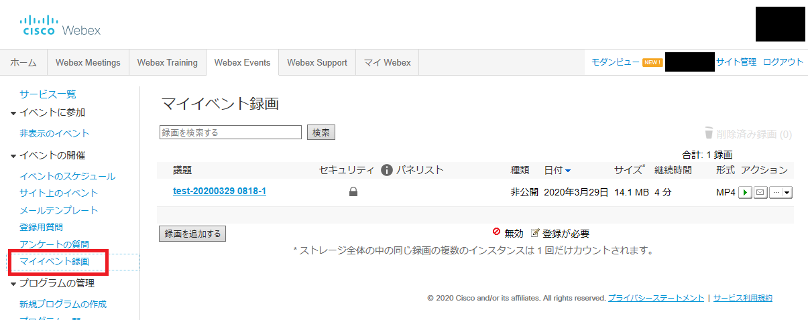
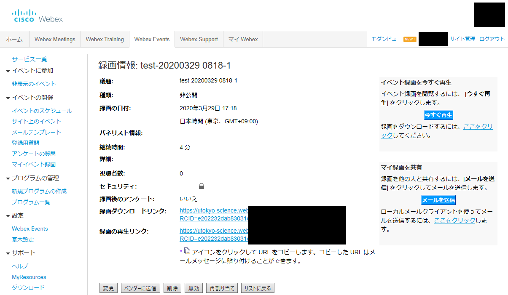
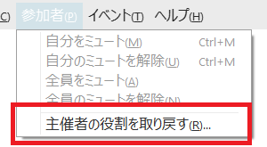
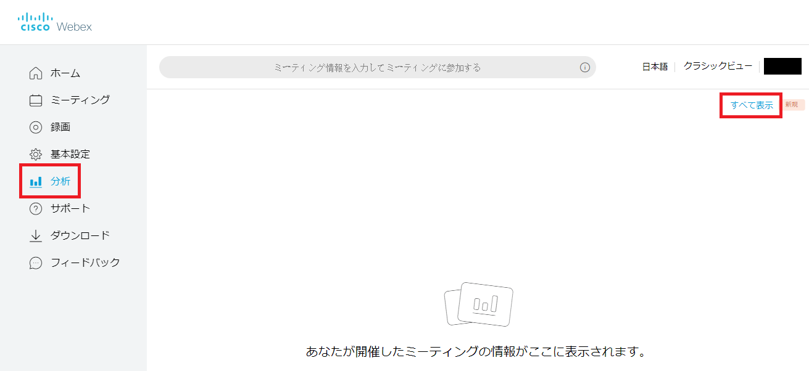
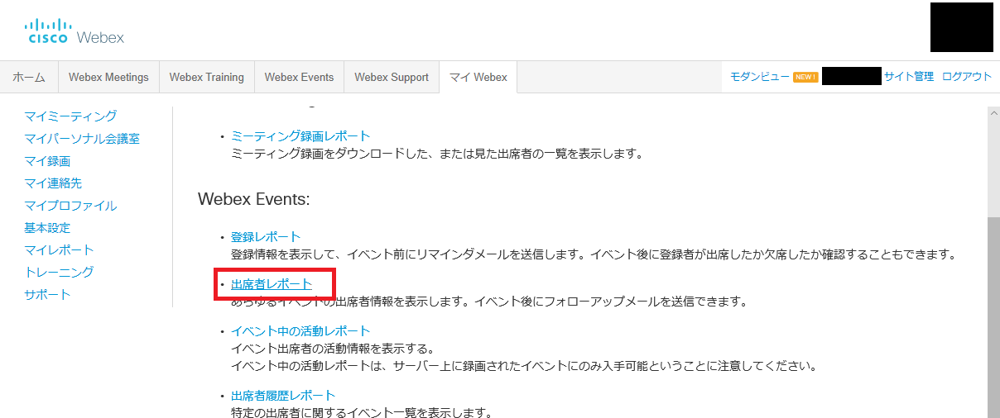

* This section describes the Webex Events functions only available to the host.	
* Click <a href="do_events" target="_blank">here</a> for basic usage instructions.

## Functions only available to the host

### Mute all participants

* To mute everyone as they join, select "Mute on Entry" from the Participant menu.
* If the host selects "Mute on Entry", participants cannot unmute themselves during the event.

		

* To mute all attendees, go to the Participant tab and select "Mute All".

	

### Participants’ Roles and Privileges

* To assign roles to other participants, select "Assign Privileges" from the Participant tab.

	
	{:.medium}
	{:.medium}

<!-- ### 参加者の入退室時のサウンド

* 参加者が入退室する時にサウンドを鳴らすことができます．気づかないうちに予期せぬ参加者が紛れ込むことを防ぐことができますが，参加者の多い会議では煩わしくなります．
* 「参加者」メニューの「入退室のサウンド」で設定します．

	 -->

### Recording

* If you record the entire event and upload it on an online platform like UTOL (How to publish: TODO), you can use the recording as a learning material for students with poor communication conditions or as a material to review the class.
* You can start recording anytime during the event by clicking the recorder icon.
* Recorded video files are automatically saved in ARF format and saved in "My Training Recordings". You can also get a link (URL) with a password to share.

	{:.medium}
	{:.medium}

### How to Become a Host Again

* When the host gets disconnected due to network trouble, etc., other participants will automatically be assigned as a new host.
* In such case, join in the meeting as a participant, press "Change Role To" from the "Participant" menu, and select the “Host.”

	{:.small}

* If you enable “Attendees can join at least n minutes before the start time” when scheduling the event time, participants can enter the training before the host. If a participant changes his/her own role to the host before the original host joins, he/she will be able to proceed the event as a host.

	{:.medium}

### Participants

* You can download a record of who participated in the event and how long they have participated.
* It will take some time to generate participants’ reports.

1. From "Analysis" on the home screen, click "Show All" in the upper right corner.
{:.medium}
1. Click on "Attendance Report".
{:.medium}
1. Search for the event you have held. Enter the date and agenda, and click "Display Report".
{:.medium}
1. A list of training will be displayed. If the report is shown in the "Attendance Report (provisional version)" section, the proper report has not yet been generated. Please wait for it to move to the "Attendance Report (final version)" section. Then click on the event name.
{:.medium}
1. A list of participants' attendance will be displayed. Click "Export" to download the displayed content as a CSV file.
{:.medium}

 
 
<a href="index" target="_blank">Back to How to Use Webex</a>

